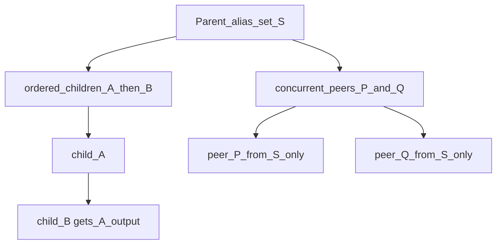

# Extraction-rule aliasing hierarchy (revised)

## Non-goals (explicit)

- **No backward compatibility:** Do not preserve legacy behavior as a fallback. Remove honoring `scope_filters.entity_type` / `conditions.entity_type` for aliasing rules, and do not require “if new field missing, use old global `rules` / `pathways`” unless you intentionally delete those code paths entirely in favor of one model.
- Configs and examples must be **migrated forward** to the new shape.

## Hierarchy semantics (required behavior)

Aliasing pipelines use the **same YAML structuring vocabulary** as match validation (`confidence_match_rules`): lists, `hierarchy: { mode: ordered | concurrent, children: [...] }`, definition refs, sequences, shorthand `{ id: [ tail... ] }`.

**Interpretation for transforms** (distinct from confidence scoring):

1. **`hierarchy.mode: ordered`**  
   Children form a **chain**. The first child receives the **current alias set** entering this group (from the parent step). Each **subsequent** sibling receives the **output** of the **previous** sibling in that ordered list — i.e. continued aliasing along one branch.  
   Nested `hierarchy` nodes recurse the same way.

2. **`hierarchy.mode: concurrent`** (parallel peers)  
   Children are **peers**: they **do not share results with each other**. Each peer branch receives **only** the **parent’s** alias set at the fork (the input to this `concurrent` group). Outputs from peer A are **not** fed into peer B.  
   Implementation matches **independent branches from a fork** (same idea as today’s `ParallelPathwayStep`: fork = parent output; each branch runs its own subtree; merge branch outputs at the end of the group).

3. **Root / top-level list**  
   Top-level `aliasing_pipeline` items are composed the same way: ordered segments chain; where the tree specifies concurrent groups, apply the fork semantics above.

4. **Validation**  
   Post-transform `validation` / `confidence_match_rules` on alias **strings** remains a separate phase (global + per-rule overlays as today), applied after the transform tree produces the alias set unless you specify otherwise in implementation.

## Schema (unchanged from prior plan, semantics above)

- `key_extraction.config.data.extraction_rules[].aliasing_pipeline`
- Top-level `aliasing_rule_definitions`, `aliasing_rule_sequences` (resolved in scope materialization, then stripped like confidence-match defs)

## Engine responsibilities

- Replace flat “filter by entity_type then global priority list” with **tree execution**:
  - Implement a **walker** over normalized pipeline nodes that maintains “current alias set” and, at concurrent forks, runs subtrees **without** cross-peer contamination.
- **`generate_aliases`**: select pipeline by `context["extraction_rule_name"]` (or `rule_id`) from the extraction rule that produced the key.
- **Remove** entity-type filtering from aliasing `_check_conditions` (or delete that path entirely).

## Pipeline / RAW

- Include `rule_name` on `tag_to_entity_map` entries when building from `entities_keys_extracted`.
- **Duplicate tags** from different extraction rules: run aliasing **per** `(tag, extraction_rule_name)` if needed, or define deterministic merge — document in implementation; hierarchy semantics apply per run.

## UI

- Canvas edges from extraction → aliasing should eventually encode **per-extraction** `aliasing_pipeline` (and nested structure), not `scope_filters.entity_type` on aliasing rules.
- Seed/layout should reflect **tree** structure (ordered vs parallel), not only a single global aliasing chain.

## Operational continuity (functions, local runner, workflows)

Implementation must leave these **end-to-end paths working** after config migration to `aliasing_pipeline` (no dead handlers or broken imports).

### Cognite Functions (`functions/`)

- **`fn_dm_key_extraction`**: Handler still loads scope / `configuration` from workflow task data; `materialize_scope_confidence_refs_on_task_data` (or combined materialize) runs before config parse; key extraction succeeds with migrated `extraction_rules` (including `aliasing_pipeline` keys where required).
- **`fn_dm_aliasing`**: Handler resolves aliasing engine config from the same v1 scope document pattern (`data["config"]` / nested `config.config`); `ensure_aliasing_config_from_scope_dm` and pipeline entrypoints remain callable; no regression on JSON-serializable return shape.
- **`fn_dm_reference_index`** / **`fn_dm_incremental_state_update`** (if present in module): Any shared config expectations (e.g. aliasing block shape) updated in lockstep so optional workflow steps do not fail at import or first request.

### Local runner

- **`local_runner/run.py`** and **`local_runner/config_loading.py`**: Loading `workflow.local.config.yaml` (or `--config-path`) produces valid extraction + aliasing configs; combined run (extract → alias → optional reference index) completes or fails with **clear validation errors**, not silent empty pipelines.
- **`run_fn_dm_*_local.py` scripts**: Still runnable for smoke testing after path/config updates.

### Workflows (Toolkit / CDF)

- **`workflow_template/*.yaml`** and any **`fusion.yaml`** / module workflow definitions: `workflow.input.configuration` (or equivalent) still matches what handlers expect; template config snippets include **`aliasing_rule_definitions`** / **`aliasing_pipeline`** as needed so deploy does not reference removed-only fields.
- **`workflow.local.config.yaml`** / **`workflow.local.canvas.yaml`**: Kept consistent with resolver + engine so local dev and UI export round-trip.

### Verification checklist (do before merge)

- Unit tests: `pytest` for `cdf_key_extraction_aliasing` (at least `tests/unit` for resolver, engine, pipeline).
- Smoke: local runner with module default scope (or documented example path) — key extraction + aliasing stages execute without exception.
- Grep-driven audit: no remaining references that assume **only** `aliasing_rules[]` + `entity_type` for routing without the new extraction-rule pipeline (update call sites).

## Files (indicative)

- New or extended resolver: [`cdf_fn_common`](modules/accelerators/contextualization/cdf_key_extraction_aliasing/functions/cdf_fn_common/) (aliasing pipeline expand + flatten for **tree** execution, not a naive flat list that breaks concurrent peers).
- [`tag_aliasing_engine.py`](modules/accelerators/contextualization/cdf_key_extraction_aliasing/functions/fn_dm_aliasing/engine/tag_aliasing_engine.py) — tree interpreter; align `ParallelPathwayStep` / new types with peer-vs-chain semantics.
- [`pipeline.py`](modules/accelerators/contextualization/cdf_key_extraction_aliasing/functions/fn_dm_aliasing/pipeline.py) — context + optional per-rule runs.
- [`scope_document_dm.py`](modules/accelerators/contextualization/cdf_key_extraction_aliasing/functions/cdf_fn_common/scope_document_dm.py) — call resolver alongside confidence ref materialization.
- UI: [`canvasScopeSync.ts`](modules/accelerators/contextualization/cdf_key_extraction_aliasing/ui/src/components/flow/canvasScopeSync.ts), [`seedCanvasFromScope.ts`](modules/accelerators/contextualization/cdf_key_extraction_aliasing/ui/src/components/flow/seedCanvasFromScope.ts), [`workflowScopePatch.ts`](modules/accelerators/contextualization/cdf_key_extraction_aliasing/ui/src/components/flow/workflowScopePatch.ts).

## Clarification locked in

- **Peers (concurrent)** = same parent input only; **no** peer-to-peer result sharing.
- **Ordered** = sequential continuation; **child after parent in the list** receives the **previous sibling’s** output (chain), which matches “continued aliasing” along one path; the **fork input** for a concurrent group is always the alias set produced by the **parent step** that owns that `hierarchy` node.
