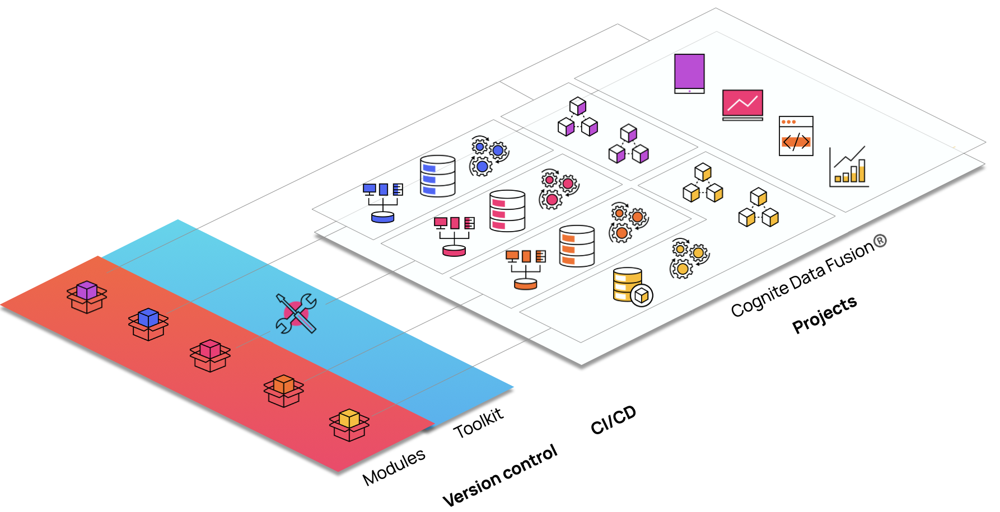

# Template library

This repository contains Cognite Templates as downloadable and extensible
configuration that can be downloaded and adapted, then deployed with the
[Cognite Toolkit](https://docs.cognite.com/cdf/deploy/cdf_toolkit/).

> The Cognite Template is a reusable blueprint that guides users through
> deploying, customizing, and building Cognite solutions. The template can be
> part of a specific business use case for data processing, contextualization
> pipelines for enriching and managing data, and front-end user screens for
> seamless interaction with the system.



## Current Release


```toml
[library.cognite]
url = "{{placeholder_url}}"
checksum = "{{placeholder_checksum}}"
```

## Usage

**Note:** The checksum below is a placeholder. For the current checksum, check the [latest release](https://github.com/cognitedata/library/releases/latest) or click the release badge above.

Add this to cdf.toml:

(if on version 0.5)
```
[alpha_flags] 
external-libraries = true
```

```
[library.cognite]
url = "https://github.com/cognitedata/library/releases/download/latest/packages.zip"
checksum = "sha256:..."
```
## Disclaimer

The open-source Github repository ("Repository") is provided "as is", without
warranty of any kind, express or implied, including but not limited to the
warranties of merchantability, fitness for a particular purpose, and
non-infringement. Usage of the Repository is voluntary and in no event shall
Cognite be liable for any claim, damages, or other liability, whether in an
action of contract, tort, or otherwise, arising from, out of, or in connection
with the use of the Repository.