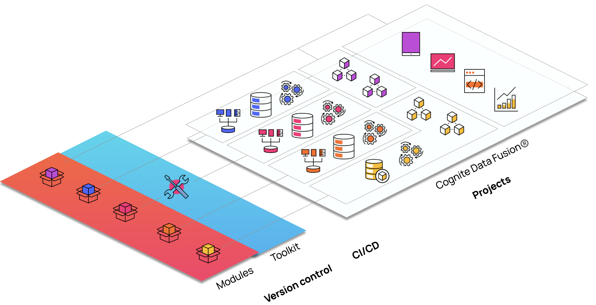

# Cognite Library (deployment packs)

This repository contains **Cognite deployment packs** — downloadable, extensible Toolkit modules that you configure and deploy with the [Cognite Toolkit](https://docs.cognite.com/cdf/deploy/cdf_toolkit/).

> Templates guide users through deploying, customizing, and building Cognite solutions: data processing, contextualization pipelines, and application configuration.



## Repository layout

All deployable content lives under [`modules/`](modules/). The registry of packs is [`modules/packages.toml`](modules/packages.toml).

| Folder | Purpose |
|--------|---------|
| [`common/`](modules/common/) | Shared CDF platform modules (`cdf_common`, `cdf_ingestion`, `cdf_search`) |
| [`contextualization/`](modules/contextualization/) | File annotation, entity matching, P&ID, connection SQL |
| [`datamodels/`](modules/datamodels/) | Industry and extension data models (`rmdm`, ISA, CFIHOS, …) |
| [`solutions/`](modules/solutions/) | Product verticals (`cdm_maintain`, `cdf_infield`, `cdf_ai_extractor`) |
| [`sourcesystem/`](modules/sourcesystem/) | Source connectors (PI, SAP, SharePoint, OID sync) |
| [`dashboards/`](modules/dashboards/) | Streamlit dashboards and reporting |
| [`atlas_ai/`](modules/atlas_ai/) | Atlas AI agents |
| [`tools/`](modules/tools/) | Qualitizer, performance notebooks |
| [`custom/`](modules/custom/) | Empty module template |

### Naming conventions

| Prefix | Use for | Examples |
|--------|---------|----------|
| `cdf_` | Cognite-built platform capabilities | `cdf_common`, `cdf_pi`, `cdf_file_annotation` |
| `cdm_` / `cdf_` | Solutions on Cognite Data Model | `cdm_maintain`, `cdf_infield` |
| *(none)* | Industry models, dashboards, tools | `rmdm`, `context_quality`, `report_quality` |

Apply the prefix on **module folder names** where it helps discovery. Top-level folders (`common/`, `datamodels/`, …) are not prefixed.

Contributors: see [ADDING_PACKAGES_AND_MODULES.md](ADDING_PACKAGES_AND_MODULES.md). Validation and module layout details are in [modules/README.md](modules/README.md).

## Usage

The Cognite Toolkit ships with `[library.cognite]` already pointing at this
repository's `latest` release, so a new project is wired up out of the box.

### 1. Enable alpha flag (Toolkit &lt; 0.7.0 only)

```toml
[alpha_flags]
external-libraries = true
```

### 2. Initialize or add modules

- New project: `cdf modules init`
- Existing project: `cdf modules add`

The Toolkit shows deployment packs defined in [`modules/packages.toml`](modules/packages.toml).

## Disclaimer

The open-source Github repository ("Repository") is provided "as is", without warranty of any kind, express or implied, including but not limited to the warranties of merchantability, fitness for a particular purpose, and non-infringement. Usage of the Repository is voluntary and in no event shall Cognite be liable for any claim, damages, or other liability, whether in an action of contract, tort, or otherwise, arising from, out of, or in connection with the use of the Repository.
