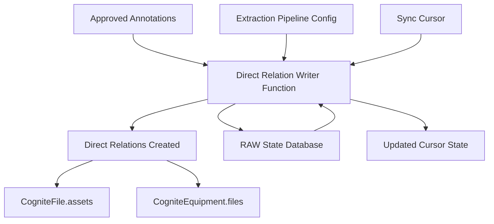

# CDF Common Module

This module provides foundational resources for Cognite Data Fusion (CDF) projects, provisioning shared infrastructure including data spaces, datasets, RAW databases, and the annotation-to-direct-relation writer function.

## Why Use This Module?

**Establish Your CDF Foundation with Production-Ready Infrastructure**

Setting up the base infrastructure for CDF projects requires careful planning and consistent configuration. This module delivers **production-ready, reusable foundation components** that ensure consistency across your CDF deployments.

**Key Benefits:**

- ⚡ **Quick Setup**: Deploy essential infrastructure in minutes instead of hours of manual configuration
- 🏗️ **Consistent Foundation**: Standardized spaces, datasets, and databases that follow best practices
- 🔄 **Annotation Processing**: Automated conversion of approved annotations into direct relations
- 📊 **State Management**: Built-in RAW databases for tracking contextualization state
- 🛡️ **Incremental Processing**: Cursor-based sync for efficient, resumable annotation processing
- 🎯 **CDM Compatible**: Pre-configured mappings for CogniteFile → CogniteAsset/CogniteEquipment relations

**Time & Cost Savings:**

- **Setup Time**: Save hours of manual infrastructure configuration
- **Consistency**: Eliminate configuration drift across environments
- **Maintenance**: Centralized foundation reduces ongoing management overhead

## 🎯 Overview

The CDF Common module is designed to:
- **Provision data spaces** for instances and functions
- **Create datasets** for organizing transformations, functions, and workflows
- **Set up RAW databases** for source data and contextualization state
- **Deploy extraction pipelines** for annotation-based relation writing
- **Provide functions** for converting annotations to direct relations

## 🏗️ Module Architecture

```
cdf_common/
├── 📁 data_modeling/                    # Space definitions
│   ├── 📄 demo.Space.yaml                      # Instance space for data
│   └── 📄 functions.Space.yaml                 # Space for function instances
├── 📁 data_sets/                        # Dataset definitions
│   └── 📄 demo.DataSet.yaml                    # Ingestion dataset
├── 📁 raw/                              # RAW database definitions
│   ├── 📄 source.DataBase.yaml                 # Source ingestion database
│   └── 📄 contextualization_state.DataBase.yaml # State storage
├── 📁 extraction_pipelines/             # Pipeline configurations
│   ├── 📄 ctx_files_direct_relation_write.ExtractionPipeline.yaml
│   └── 📄 ctx_files_direct_relation_write.config.yaml
├── 📁 functions/                        # CDF Functions
│   ├── 📁 contextualization_connection_writer/ # Annotation processor
│   │   ├── 📄 handler.py
│   │   ├── 📁 core/
│   │   └── 📄 requirements.txt
│   └── 📄 write.Function.yaml
├── 📄 default.config.yaml               # Module configuration
└── 📄 module.toml                       # Module metadata
```

## 🚀 Core Components

### 1. Data Spaces

| Resource | Description |
|----------|-------------|
| `demo.Space` | Instance space for storing data nodes and edges |
| `functions.Space` | Dedicated space for function instances |

### 2. Datasets

| Resource | Description |
|----------|-------------|
| `demo.DataSet` | Dataset for Transformations, Functions, and Workflows |

### 3. RAW Databases

| Resource | Description |
|----------|-------------|
| `source.DataBase` | Source ingestion database for raw data |
| `contextualization_state.DataBase` | State storage for contextualization processes |

### 4. Direct Relation Writer Function

**Purpose**: Converts approved annotations into direct relations in the data model

**Key Features**:
- 🔄 **Incremental Processing**: Uses sync cursors for efficient updates
- 📊 **Configurable Mappings**: Flexible view-to-property mappings
- 🛡️ **State Persistence**: Stores cursor state in RAW for resumability
- ⚡ **Batch Operations**: Processes annotations in efficient batches

**How It Works**:
1. Fetches new approved annotations from the configured `annotationSpace`
2. Matches annotations against configured view mappings
3. Creates direct relations between start and end nodes
4. Stores sync cursor state in RAW for incremental processing

## 🔧 Configuration

### Module Configuration (`default.config.yaml`)

```yaml
# Dataset Configuration
dataset: ingestion                          # Dataset external ID

# Space Configuration
instanceSpace: springfield_instances        # Space for data instances
functionSpace: springfield_functions        # Space for function instances
annotationSpace: springfield_instances      # Space for annotation edges
schemaSpace: cdf_cdm                        # Schema space (CDM)

# Extraction Pipeline
directRelationJob: ctx_files_direct_relation_write

# RAW Database Configuration
rawSourceDatabase: ingestion                # Source RAW database
rawStateDatabase: contextualizationState    # State RAW database
rawStateTable: diagramParsing               # State table name
```

### Direct Relation Mappings

The extraction pipeline config supports flexible mappings:

```yaml
directRelationMappings:
  - startNodeView:
      space: cdf_cdm
      externalId: CogniteFile
      version: v1
      directRelationProperty: assets        # Property on start node
    endNodeView:
      space: cdf_cdm
      externalId: CogniteAsset
      version: v1
  - startNodeView:
      space: cdf_cdm
      externalId: CogniteFile
      version: v1
    endNodeView:
      space: cdf_cdm
      externalId: CogniteEquipment
      version: v1
      directRelationProperty: files         # Property on end node
```

### Annotation Requirements

Annotations must:
- Implement the `(cdf_cdm, CogniteAnnotation, v1)` view
- Be stored in the configured `annotationSpace`
- Include `sourceContext` with start/end node view references:

```json
{
  "start": {"space": "cdf_cdm", "externalId": "CogniteFile", "version": "v1"},
  "end": {"space": "cdf_cdm", "externalId": "CogniteAsset", "version": "v1"}
}
```

## 🏃‍♂️ Getting Started

### 1. Prerequisites

- CDF project with appropriate permissions
- CDF Toolkit installed and configured
- Authentication credentials configured

### 2. Configure the Module

Update your `config.<env>.yaml` under the module variables section:

```yaml
variables:
  modules:
    cdf_common:
      dataset: ingestion
      instanceSpace: your_instances
      functionSpace: your_functions
      annotationSpace: your_instances
      schemaSpace: cdf_cdm
      directRelationJob: ctx_files_direct_relation_write
      rawSourceDatabase: ingestion
      rawStateDatabase: contextualizationState
      rawStateTable: diagramParsing
```

### 3. Deploy the Module

```bash
# Deploy using CDF Toolkit
cdf deploy --env your-environment

# Or deploy individual components
cdf spaces deploy
cdf datasets deploy
cdf raw deploy
cdf functions deploy
```

### 4. Verify Deployment

```bash
# Check spaces
cdf spaces list

# Check datasets
cdf datasets list

# Check function deployment
cdf functions list
```

## 📊 Data Flow



## 🎯 Use Cases

### Foundation Infrastructure
- **Project Setup**: Quickly establish consistent CDF infrastructure
- **Multi-Environment**: Deploy identical foundation across dev/staging/prod
- **Team Onboarding**: Standardized starting point for new projects

### Annotation Processing
- **P&ID Contextualization**: Convert diagram annotations to asset-file relations
- **Document Linking**: Automatically link files to referenced assets
- **Equipment Association**: Connect equipment to related documentation

## 🔧 Troubleshooting

### Common Issues

1. **Function Not Processing Annotations**
   - Verify annotations are in the configured `annotationSpace`
   - Check that annotations implement `CogniteAnnotation` view
   - Ensure `sourceContext` contains valid view references

2. **State Not Persisting**
   - Verify RAW database and table exist
   - Check function has write permissions to RAW

3. **Direct Relations Not Created**
   - Verify view mappings match your data model
   - Check that start/end nodes exist in the instance space

### Debug Mode

Check function logs for detailed processing information:

```bash
cdf functions logs contextualization_connection_writer
```

## 📚 Dependencies

This module should be deployed **before** other modules that depend on:
- Instance/function spaces
- Ingestion dataset
- Contextualization state database

## 📄 License

This module is part of the Cognite Templates repository and follows the same licensing terms.
