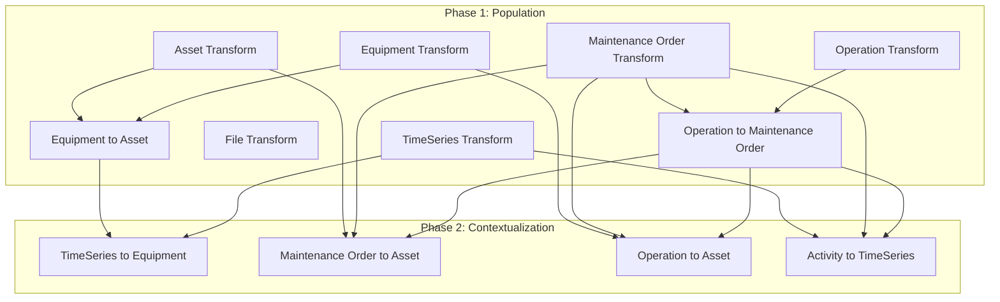

# CDF Ingestion Module

This module orchestrates data ingestion and contextualization through a workflow that runs multiple transformations in the correct dependency order, enabling end-to-end data population and relationship creation.

## Why Use This Module?

**Automate Your Data Ingestion Pipeline with Production-Ready Orchestration**

Building a robust ingestion workflow requires careful dependency management and proper error handling. This module delivers **production-ready workflow orchestration** that ensures transformations run in the correct order with proper authorization.

**Key Benefits:**

- ⚡ **Automated Orchestration**: Run complex multi-transformation pipelines with a single trigger
- 🔄 **Dependency Management**: Automatic ordering ensures population before contextualization
- 🛡️ **Error Handling**: `abortWorkflow` on failure prevents cascading errors
- 📊 **Parallel Execution**: Independent transformations run concurrently for faster completion
- 🔐 **Secure Authentication**: Service account credentials for scheduled automated runs
- 📅 **Flexible Scheduling**: Cron-based triggers for automated daily/weekly/custom schedules

**Time & Cost Savings:**

- **Manual Effort**: Eliminate manual transformation orchestration
- **Error Prevention**: Dependency-aware execution prevents data consistency issues
- **Operational Efficiency**: Scheduled runs reduce operational overhead

## 🎯 Overview

The CDF Ingestion module is designed to:
- **Orchestrate transformations** in the correct dependency order
- **Populate data models** with assets, equipment, timeseries, and maintenance data
- **Create relationships** between entities through contextualization transformations
- **Automate execution** via scheduled triggers
- **Manage permissions** through dedicated auth groups

## 🏗️ Module Architecture

```
cdf_ingestion/
├── 📁 auth/                             # Authentication groups
│   ├── 📄 user.Group.yaml                      # User permissions for manual runs
│   └── 📄 workflow.Group.yaml                  # Service account permissions
├── 📁 workflows/                        # Workflow definitions
│   ├── 📄 ingest.Workflow.yaml                 # Main workflow definition
│   ├── 📄 v1.WorkflowVersion.yaml              # Workflow version with tasks
│   └── 📄 trigger.WorkflowTrigger.yaml         # Scheduled trigger
├── 📄 default.config.yaml               # Module configuration
└── 📄 module.toml                       # Module metadata
```

## 🚀 Core Components

### 1. Auth Groups

| Resource | Description |
|----------|-------------|
| `user.Group` | Permissions for users to run the workflow manually |
| `workflow.Group` | Service account permissions for automated workflow execution |

**Capabilities Included:**
- 📊 Transformations (read/write)
- 🔧 Functions (read/write)
- 📁 RAW databases (read)
- 🗄️ Data model instances (read/write)
- 🔄 Workflow orchestration (read/write)
- 📈 Extraction pipelines (read)

### 2. Workflow Definition

**Purpose**: Orchestrates data ingestion and contextualization transformations

**Key Features**:
- 🔄 **Two-Phase Execution**: Population first, then contextualization
- ⚡ **Parallel Processing**: Independent tasks run concurrently
- 🛡️ **Failure Handling**: `onFailure: abortWorkflow` prevents partial updates
- 📊 **Dependency Chains**: Proper ordering ensures data consistency

## 📊 Workflow Tasks

### Phase 1: Population

Runs in parallel where possible:

| Task | Description |
|------|-------------|
| `timeseriesTransformationExternalId` | TimeSeries from PI/historian |
| `assetTransformationExternalId` | Assets from SAP |
| `equipmentTransformationExternalId` | Equipment from SAP |
| `maintenanceOrderTransformationExternalId` | Maintenance orders from SAP |
| `operationTransformationExternalId` | Operations from SAP |
| `fileTransformationExternalId` | File metadata |

Then with dependencies:

| Task | Depends On |
|------|------------|
| `equipmentToAssetTransformationExternalId` | assets, equipment |
| `operationToMaintenanceOrderTransformationExternalId` | maintenance orders, operations |

### Phase 2: Contextualization

Runs after population with appropriate dependencies:

| Task | Depends On |
|------|------------|
| `maintenanceOrderToAssetTransformationExternalId` | assets, maintenance orders, operations |
| `operationToAssetTransformationExternalId` | equipment, maintenance orders, operations |
| `activityToTimeSeriesTransformationExternalId` | timeseries, maintenance orders, operations |
| `timeSeriesToEquipmentTransformationExternalId` | timeseries, equipment |

## 🔧 Configuration

### Module Configuration (`default.config.yaml`)

```yaml
# Workflow Identity
workflow: ingestion
dataset: ingestion

# Authentication (UPDATE REQUIRED)
groupSourceId: <GROUP_SOURCE_ID>              # Your IdP group source ID

# Service Account Credentials for Scheduled Runs
ingestionClientId: ${INGESTION_CLIENT_ID}
ingestionClientSecret: ${INGESTION_CLIENT_SECRET}

# Data Sources
rawSourceDatabase: ingestion
rawStateDatabase: contextualizationState

# Schema Spaces
schemaSpace: sp_enterprise_process_industry
schemaSpace2: cdf_cdm
schemaSpace3: cdf_idm
instanceSpaces:
  - springfield_instances
  - cdf_cdm_units

# Schedule (default: never runs - Feb 29 at midnight)
runWorkflowSchedule: "0 0 29 2 *"

# Transformation External IDs (customize to your environment)
timeseriesTransformationExternalId: pi_timeseries_springfield_aveva_pi
assetTransformationExternalId: sap_assets_springfield_s4hana
equipmentTransformationExternalId: sap_equipment_springfield_s4hana
equipmentToAssetTransformationExternalId: sap_equipment_to_asset_springfield_s4hana
maintenanceOrderTransformationExternalId: sap_maintenance_orders_springfield_s4hana
operationTransformationExternalId: sap_operations_springfield_s4hana
operationToMaintenanceOrderTransformationExternalId: sap_operation_to_maintenance_order_springfield_s4hana
fileTransformationExternalId: files_metadata_springfield
maintenanceOrderToAssetTransformationExternalId: maintenance_order_to_asset
operationToAssetTransformationExternalId: operation_to_asset
activityToTimeSeriesTransformationExternalId: activity_to_timeseries
timeSeriesToEquipmentTransformationExternalId: timeseries_to_equipment
```

### Environment Variables

```bash
# Service Account Credentials
INGESTION_CLIENT_ID=your-service-account-client-id
INGESTION_CLIENT_SECRET=your-service-account-client-secret
```

## 🏃‍♂️ Getting Started

### 1. Prerequisites

- CDF project with appropriate permissions
- Transformations deployed from source system modules
- Service account with workflow execution permissions
- IdP group source ID for authentication

### 2. Configure the Module

Update your `config.<env>.yaml` under the module variables section:

```yaml
variables:
  modules:
    cdf_ingestion:
      workflow: ingestion
      dataset: ingestion
      groupSourceId: your-azure-ad-group-source-id  # UPDATE REQUIRED
      ingestionClientId: ${INGESTION_CLIENT_ID}
      ingestionClientSecret: ${INGESTION_CLIENT_SECRET}
      rawSourceDatabase: ingestion
      rawStateDatabase: contextualizationState
      schemaSpace: sp_enterprise_process_industry
      schemaSpace2: cdf_cdm
      schemaSpace3: cdf_idm
      instanceSpaces:
        - your_instances
        - cdf_cdm_units
      runWorkflowSchedule: "0 0 * * *"  # Daily at midnight
      # Update transformation external IDs to match your deployed transformations
      timeseriesTransformationExternalId: pi_timeseries_your_site
      assetTransformationExternalId: sap_assets_your_site
      # ... (see default.config.yaml for full list)
```

### 3. Deploy the Module

```bash
# Deploy using CDF Toolkit
cdf deploy --env your-environment

# Or deploy individual components
cdf auth deploy
cdf workflows deploy
```

### 4. Test the Workflow

```bash
# Trigger workflow manually
cdf workflows trigger ingestion

# Monitor execution
cdf workflows status ingestion

# View logs
cdf workflows logs ingestion
```

## 📊 Data Flow



## 🎯 Use Cases

### Automated Data Ingestion
- **Daily Sync**: Schedule nightly runs to sync latest source system data
- **On-Demand Refresh**: Trigger manual runs for immediate data updates
- **Multi-Source Integration**: Combine data from PI, SAP, and file systems

### Data Consistency
- **Ordered Execution**: Ensure base entities exist before creating relationships
- **Atomic Operations**: All-or-nothing execution prevents partial updates
- **Retry Capability**: Re-run failed workflows after fixing issues

### Operational Efficiency
- **Reduced Manual Work**: Automate complex multi-step ingestion processes
- **Centralized Monitoring**: Track all transformations through workflow status
- **Audit Trail**: Workflow execution history for compliance

## 🔧 Troubleshooting

### Common Issues

1. **Workflow Fails on Transformation**
   - Check that all referenced transformations exist
   - Verify transformation has required permissions
   - Review transformation logs for specific errors

2. **Authentication Errors**
   - Verify `groupSourceId` matches your IdP configuration
   - Ensure service account credentials are correct
   - Check that auth groups have required capabilities

3. **Dependency Failures**
   - Verify dependent transformations completed successfully
   - Check data model compatibility between transformations
   - Review RAW source data availability

### Debug Mode

Monitor workflow execution in real-time:

```bash
# Check workflow status
cdf workflows status ingestion

# View detailed task status
cdf workflows executions list ingestion

# Check specific transformation logs
cdf transformations logs <transformation-external-id>
```

## 📚 Dependencies

Requires transformations from other modules to be deployed first:
- Source system transformations (SAP, PI, etc.)
- Contextualization transformations (`cdf_connection_sql` module)

The workflow references transformations by external ID - ensure they exist before running.

## 📄 License

This module is part of the Cognite Templates repository and follows the same licensing terms.
