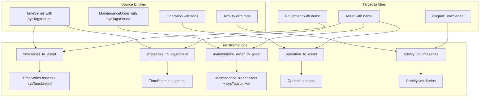

# CDF Connection SQL Module

This module provides SQL-based transformations that create direct relations between entities by matching tags found in source data with asset/equipment names, enabling automated contextualization through declarative SQL logic.

## Why Use This Module?

**Contextualize Your Data with Production-Ready SQL Transformations**

Building entity relationships manually is time-consuming and error-prone. This module delivers **production-ready SQL transformations** that automatically create connections between timeseries, maintenance data, and assets based on tag matching.

**Key Benefits:**

- ⚡ **Declarative Logic**: SQL-based matching is easy to understand and customize
- 🎯 **Tag-Based Matching**: Leverages `sysTagsFound` arrays populated during ingestion
- 🔄 **Batch Processing**: Efficient bulk relationship creation via transformations
- 📊 **Audit Trail**: `sysTagsLinked` tracks which tags were successfully matched
- 🛡️ **Null Safety**: Built-in filtering excludes null/empty values
- 📈 **Scalable**: Handles large datasets with array limits and grouping

**Time & Cost Savings:**

- **Development Time**: Save days of custom matching logic development
- **Maintenance**: Declarative SQL is easier to maintain than procedural code
- **Accuracy**: Consistent matching logic across all entity types

## 🎯 Overview

The CDF Connection SQL module is designed to:
- **Link timeseries to assets** via tag name matching
- **Connect timeseries to equipment** through tag associations
- **Associate maintenance orders with assets** using `sysTagsFound`
- **Link operations to assets** via tag-based matching
- **Connect activities to timeseries** through tag patterns
- **Track matched tags** in `sysTagsLinked` property for audit

## 🏗️ Module Architecture

```
cdf_connection_sql/
├── 📁 transformations/                  # SQL Transformations
│   ├── 📄 activity_to_timeseries.Transformation.yaml
│   ├── 📄 activity_to_timeseries.Transformation.sql
│   ├── 📄 maintenance_order_to_asset.Transformation.yaml
│   ├── 📄 maintenance_order_to_asset.Transformation.sql
│   ├── 📄 operation_to_asset.Transformation.yaml
│   ├── 📄 operation_to_asset.Transformation.sql
│   ├── 📄 timeseries_to_asset.Transformation.yaml
│   ├── 📄 timeseries_to_asset.Transformation.sql
│   ├── 📄 timeseries_to_equipment.Transformation.yaml
│   └── 📄 timeseries_to_equipment.Transformation.sql
├── 📄 default.config.yaml               # Module configuration
└── 📄 module.toml                       # Module metadata
```

## 🚀 Core Transformations

### Transformation Overview

| Transformation | Source | Target | Matching Logic |
|----------------|--------|--------|----------------|
| `activity_to_timeseries` | CogniteActivity | CogniteTimeSeries | First tag → timeseries name pattern |
| `maintenance_order_to_asset` | MaintenanceOrder | Asset | `sysTagsFound` → asset name |
| `operation_to_asset` | Operation | Asset | Tag matching |
| `timeseries_to_asset` | TimeSeries | Asset | `sysTagsFound` → asset name |
| `timeseries_to_equipment` | TimeSeries | Equipment | Tag matching |

### 1. TimeSeries to Asset

**Purpose**: Links timeseries to assets based on `sysTagsFound` matching asset names

**Key Features**:
- 🔄 **Array Aggregation**: Creates `assets` property with matched asset references
- 📊 **Tag Tracking**: Populates `sysTagsLinked` with matched tag names
- 🛡️ **Limit Protection**: Caps at 1200 relations per timeseries
- ⚡ **Sorted Output**: Arrays are sorted for consistent results

**SQL Logic**:
```sql
SELECT
  dm_timeseries.externalId,
  slice(array_agg(node_reference('{{ instanceSpace }}', asset.externalId)), 1, 1200) AS assets,
  ARRAY_SORT(dm_timeseries.sysTagsFound) AS sysTagsFound,
  ARRAY_SORT(COLLECT_SET(asset.name)) AS sysTagsLinked
FROM timeseries dm_timeseries
LEFT JOIN assets asset
  ON array_contains(dm_timeseries.sysTagsFound, asset.name)
GROUP BY dm_timeseries.externalId, ...
```

### 2. Maintenance Order to Asset

**Purpose**: Links maintenance orders to assets using `sysTagsFound`

**Key Features**:
- 🎯 **Multi-Asset Support**: Single order can link to multiple assets
- 📈 **Tag Audit**: Tracks which tags resulted in asset matches
- 🔧 **Organization-Aware**: Uses configurable data model prefixes

### 3. Activity to TimeSeries

**Purpose**: Connects activities to related timeseries via tag patterns

**Key Features**:
- 🔄 **Pattern Matching**: Extracts tag from activity and matches to timeseries name
- 📊 **Array Collection**: Creates `timeSeries` property with matched references
- ⚡ **CDM Compatible**: Works with `CogniteActivity` and `CogniteTimeSeries` views

## 🔧 Configuration

### Module Configuration (`default.config.yaml`)

```yaml
# Data Model Configuration
schemaSpace: sp_enterprise_process_industry
organization: ORG                              # Prefix for data model types
datamodelVersion: v1.0

# Dataset
dataset: ingestion

# Instance Space
instanceSpace: springfield_instances

# Transformation External IDs
activityToTimeSeriesTransformationExternalId: activity_to_timeseries
maintenanceOrderToAssetTransformationExternalId: maintenance_order_to_asset
operationToAssetTransformationExternalId: operation_to_asset
timeSeriesToAssetTransformationExternalId: timeseries_to_asset
timeSeriesToEquipmentTransformationExternalId: timeseries_to_equipment
```

### Data Model Requirements

The transformations target the following views:

| View | Space | Version |
|------|-------|---------|
| `{organization}TimeSeries` | `sp_enterprise_process_industry` | Configurable |
| `{organization}Asset` | `sp_enterprise_process_industry` | Configurable |
| `{organization}Equipment` | `sp_enterprise_process_industry` | Configurable |
| `{organization}MaintenanceOrder` | `sp_enterprise_process_industry` | Configurable |
| `CogniteActivity` | `cdf_cdm` | v1 |
| `CogniteTimeSeries` | `cdf_cdm` | v1 |

## 🏃‍♂️ Getting Started

### 1. Prerequisites

- CDF project with appropriate permissions
- Data models deployed (`sp_enterprise_process_industry`)
- Entities populated with `sysTagsFound` property
- Assets/equipment with matching `name` values

### 2. Configure the Module

Update your `config.<env>.yaml` under the module variables section:

```yaml
variables:
  modules:
    cdf_connection_sql:
      schemaSpace: sp_enterprise_process_industry
      organization: YOUR_ORG                # Prefix for data model types
      datamodelVersion: v1.0
      dataset: ingestion
      instanceSpace: your_instances
      activityToTimeSeriesTransformationExternalId: activity_to_timeseries
      maintenanceOrderToAssetTransformationExternalId: maintenance_order_to_asset
      operationToAssetTransformationExternalId: operation_to_asset
      timeSeriesToAssetTransformationExternalId: timeseries_to_asset
      timeSeriesToEquipmentTransformationExternalId: timeseries_to_equipment
```

### 3. Deploy the Module

```bash
# Deploy using CDF Toolkit
cdf deploy --env your-environment

# Or deploy transformations only
cdf transformations deploy
```

### 4. Run Transformations

```bash
# Run individual transformation
cdf transformations run timeseries_to_asset

# Check transformation status
cdf transformations status timeseries_to_asset

# View transformation logs
cdf transformations logs timeseries_to_asset
```

## 📊 Data Flow



## 🎯 Use Cases

### Industrial Contextualization
- **Sensor Mapping**: Automatically link PI/OPC tags to physical assets
- **Maintenance Tracking**: Connect work orders to affected equipment
- **Process Monitoring**: Associate timeseries with process units

### Data Quality
- **Tag Audit**: Use `sysTagsLinked` to track which tags matched
- **Gap Analysis**: Compare `sysTagsFound` vs `sysTagsLinked` to find unmatched tags
- **Data Validation**: Verify expected relationships were created

### Scalable Processing
- **Bulk Operations**: Process thousands of entities in single transformation runs
- **Incremental Updates**: Re-run transformations to pick up new entities
- **Consistent Logic**: Same matching rules applied across all entity types

## 🔧 Customization

### Modifying Matching Logic

The SQL files contain matching logic that may need adjustment for your data:

**Tag Extraction Patterns** - Modify string parsing in `ON` clauses:
```sql
-- Current: Exact match
ON array_contains(dm_timeseries.sysTagsFound, asset.name)

-- Custom: Partial match
ON EXISTS (SELECT 1 FROM EXPLODE(dm_timeseries.sysTagsFound) AS tag 
           WHERE asset.name LIKE CONCAT('%', tag, '%'))
```

**Array Limits** - Adjust maximum relations per entity:
```sql
-- Current: 1200 limit
slice(array_agg(...), 1, 1200) AS assets

-- Custom: 500 limit
slice(array_agg(...), 1, 500) AS assets
```

**Null Handling** - Modify filtering conditions:
```sql
WHERE asset.name IS NOT NULL AND asset.name != ''
```

## 🔧 Troubleshooting

### Common Issues

1. **No Relationships Created**
   - Verify `sysTagsFound` is populated on source entities
   - Check that target entity `name` values match tags
   - Ensure both entities are in the configured `instanceSpace`

2. **Partial Matches**
   - Review `sysTagsLinked` vs `sysTagsFound` to identify gaps
   - Check for case sensitivity issues in tag names
   - Verify data model views match configuration

3. **Transformation Errors**
   - Confirm data model exists in `schemaSpace`
   - Verify `organization` prefix matches deployed model
   - Check transformation has read/write permissions

### Debug Mode

Test transformation SQL before running:

```bash
# Preview transformation results
cdf transformations preview timeseries_to_asset --limit 10

# Check transformation configuration
cdf transformations inspect timeseries_to_asset
```

## 📚 Dependencies

- **Entities populated first**: Assets, equipment, timeseries, maintenance orders
- **`sysTagsFound` property**: Populated during source system ingestion
- **Data model deployed**: `{organization}ProcessIndustries` in `sp_enterprise_process_industry`

## 📄 License

This module is part of the Cognite Templates repository and follows the same licensing terms.
