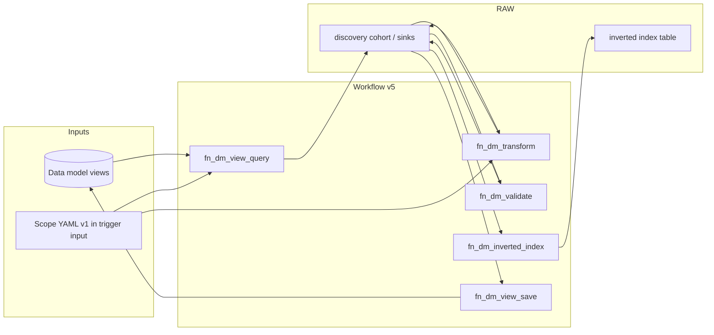

# Module functional document — `cdf_discovery_aliasing`

This document describes **what the module does** in operational terms: scope, behaviors, components, data flows, and interfaces. Detailed rule semantics live in the [key extraction](specifications/1.%20key_extraction.md) and [aliasing](specifications/2.%20aliasing.md) specifications; step-by-step authoring is in the [configuration guide](guides/configuration_guide.md) and [workflows README](../workflows/README.md). **Authoring entry points:** [How to build configuration with YAML](guides/howto_config_yaml.md), [How to build configuration with the UI](guides/howto_config_ui.md). **Run locally:** [Quickstart — `module.py`](guides/howto_quickstart.md). **Multi-scope Toolkit deploy:** [Scoped deployment](guides/howto_scoped_deployment.md).

---

## 1. Purpose and scope

### 1.1 Business intent

Industrial and engineering data in Cognite Data Fusion (CDF) often encodes equipment tags, document names, and cross-references inside **text metadata** (names, descriptions, external IDs). Different systems use different spellings and separators for the “same” tag. This module:

1. **Extracts** structured identifiers from configured data-model views: **candidate keys** (an entity’s own tags), **foreign key references** (mentions of other entities’ tags), and **document references**.
2. **Generates alias sets** for candidate keys so search, matching, and contextualization can recognize variant forms.
3. **Persists** aliases (and optionally foreign-key reference strings) back onto **`cdf_cdm:CogniteDescribable:v1`** (or equivalent views that expose the configured properties).
4. **Optionally maintains** a **RAW inverted index** from extracted FK and document references for lookup-style use cases.

### 1.2 Technical boundaries

| In scope | Out of scope (by design) |
| -------- | ------------------------ |
| Rule-driven key discovery and aliasing from YAML config | Automatic DM relationship edges or graph sync (see module README roadmap) |
| CDF Functions + Workflow orchestration (**v5**) | Drifting trigger **`configuration`** from **WorkflowVersion** task **`data`** without **`module.py build --force`** |
| RAW as inter-task buffer and incremental state | Removing values already written to DM instances (`--clean-state` clears RAW only) |
| Local runner (`module.py`) for dev / parity testing | General-purpose ETL outside contextualization |

---

## 2. Actors and consumers

| Actor | Role |
| ----- | ---- |
| **Config author** | Maintains v1 scope YAML at module root / trigger template (`workflow_template/workflow.template.config.yaml`) and runs `build_scopes` for multi-site triggers (via editor, git, or the [local operator UI](guides/howto_config_ui.md)). |
| **CDF operator** | Deploys Toolkit manifests, monitors workflow runs and RAW/DM outcomes. |
| **Application / search** | Consumes **`aliases`** (and optional FK list properties) on describable instances. |
| **Downstream jobs** | May read **inverted index** RAW for “who references tag X” style queries. |

---

## 3. Functional capabilities (summary)

For **adding new transform or validation behaviour in Python**, see [How to add a custom handler](guides/howto_custom_handlers.md).

### 3.1 Key extraction (authoring + runtime)

**Authoring:** `key_extraction.config.data` holds **`extraction_rules`**, **`validation`**, and related libraries referenced from the UI **`canvas`**.

**Runtime:** rules execute inside the discovery pipeline (**`fn_dm_transform`** / **`fn_dm_validate`**) after merge from the v1 scope; the standalone **`KeyExtractionEngine`** package was removed. Semantics (handlers, `extraction_type`, RAW column naming) remain in the [key extraction specification](specifications/1.%20key_extraction.md).

**Source field paths:** `fields[].field_name` may be a single view property name or a **dot path** through nested object properties returned for that view. If an intermediate value is a **JSON string**, it is parsed so inner keys remain addressable. Limitations (no array indices, no escaped dots in names) are documented in the spec. **RAW:** candidate-key list columns are named with the **`source_field` uppercased**, so dotted paths yield column names that still contain dots (e.g. `METADATA.CODE`).

### 3.2 Aliasing (authoring + runtime)

**Authoring:** `aliasing.config.data` holds **`pathways`**, **`aliasing_rule_definitions`**, and validation knobs referenced from **`canvas`**.

**Runtime:** transforms run in **`fn_dm_transform`** using the rule **`type`** values documented in the [aliasing specification](specifications/2.%20aliasing.md). The historical **`AliasingEngine`** package was removed.

### 3.3 Persistence

- **Aliases**: applied via **`fn_dm_view_save`** to a configurable describable property (default **`aliases`**).
- **Foreign keys**: optional list property when enabled and present on the target view.

### 3.4 Incremental processing

When **`incremental_change_processing`** is enabled in scope parameters:

- **Discovery query** (`fn_dm_view_query`) advances the **listing watermark** (Key Discovery **`KeyDiscoveryScopeCheckpoint`** in FDM when **`key_discovery_instance_space`** is set **and** the Key Discovery views exist in the project; otherwise legacy RAW **`scope_wm_*`** rows). If FDM reads or checkpoint writes fail at runtime, handlers fall back to RAW for that pass.
- **Skip unchanged** (`incremental_skip_unchanged_source_inputs`): digest of source inputs + rules can suppress redundant cohort rows while watermarks still advance; latest digest is read from **`KeyDiscoveryProcessingState`** in FDM when that path is active, otherwise from RAW **`EXTRACTION_INPUTS_HASH`** on completed rows.
- **`workflow_scope`**: set per leaf by scope build (same as **`scope.id`**) for FDM grouping; required when **`key_discovery_instance_space`** is set **and** Key Discovery FDM is available (after the view-existence check). If the views are not deployed, the pipeline uses RAW state and does not require **`workflow_scope`** for that fallback path.
- **`run_all`**: overrides incremental narrowing (workflow input or scope); local runner mirrors this via `module.py --all`.
- **Deployable artifacts:** Key Discovery view/container YAML is under [`data_modeling/`](../data_modeling/) (`KeyDiscoveryProcessingState`, `KeyDiscoveryScopeCheckpoint`); deploy with Cognite Toolkit alongside functions. **FDM** = listing cursor + per-record hash state; **RAW** = high-volume cohort queue.

### 3.5 Inverted index

When enabled (`enable_inverted_index` in scope), **`fn_dm_inverted_index`** consumes predecessor discovery payloads (IR) and/or FK/document JSON on RAW and writes an **inverted index** table (key from `inverted_index_raw_table_key` or naming convention derived from `raw_table_key`). Candidate keys are **not** indexed here unless a transform stage materializes them into FK/doc reference columns consumed by the index task.

---

## 4. Architecture overview

The diagram shows the **default** view-query and view-save path. The compiled **`canvas`** may instead use **`fn_dm_raw_query`** / **`fn_dm_classic_query`**, **`fn_dm_join`**, **`fn_dm_raw_save`** / **`fn_dm_classic_save`**, **`fn_dm_discovery_raw_cleanup`**, and different `dependsOn` — see [`functions/README.md`](../functions/README.md).

### 4.1 Core implementation (library code)

| Component | Location (conceptual) | Responsibility |
| --------- | -------------------- | --------------- |
| **Canvas compile + IR** | `functions/cdf_fn_common/workflow_compile/` | `canvas` → `compiled_workflow` for **`module.py build`**. |
| **Discovery handlers** | `functions/fn_dm_*/` (index: [`functions/README.md`](../functions/README.md)) | DAG execution against CDF. |

### 4.2 CDF Functions (deployable units)

| Function | Primary function |
| -------- | ----------------- |
| `fn_dm_view_query` | DM list → discovery RAW cohort (`RUN_ID`). |
| `fn_dm_raw_query` | RAW-backed cohort query → sink RAW. |
| `fn_dm_classic_query` | Classic resource cohort query → sink RAW. |
| `fn_dm_transform` | Transform / alias expansion on RAW payloads. |
| `fn_dm_validate` | Validation + confidence on RAW payloads. |
| `fn_dm_join` | Merge two predecessor cohort RAW streams. |
| `fn_dm_inverted_index` | Inverted FK/document index RAW (optional branch). |
| `fn_dm_view_save` | `instances.apply` patch to describables (+ optional FK strings). |
| `fn_dm_raw_save` | RAW upsert from predecessor payloads. |
| `fn_dm_classic_save` | Classic write path from predecessor payloads. |
| `fn_dm_discovery_raw_cleanup` | Post-run RAW cleanup (optional). |

Shared helpers live under `functions/cdf_fn_common/` (logging, scope document loading, workflow compile, naming).

### 4.3 Local runner

**`module.py`** loads scope YAML from disk, optionally filters `source_views` by **`--instance-space`**, can **`--clean-state`**, then executes the compiled discovery DAG against live CDF data. Results are written under **`local_run_results/`** as JSON. **`--dry-run`** skips DM writes from save stages. See [Quickstart — `module.py`](guides/howto_quickstart.md).

---

## 5. Configuration model

### 5.1 V1 scope document

Single YAML document shape (local file or embedded in each schedule trigger) combining:

- **`key_extraction`**: `config` (`parameters`, `data` with rules and validation). Top-level **`source_views`** on the scope document lists DM views; handlers receive them under `config.data.source_views` after merge.
- **`aliasing`**: `config` (rules, validation, parameters such as `raw_table_aliases`, `alias_writeback_property`).
- **`canvas`**: workflow graph (nodes/edges); authored inside the same YAML. **`build_scopes`** reads the unified template only.
- Optional top-level keys consumed by tooling (e.g. `scope` block injected by `build_scopes`).

Validation: Pydantic models in discovery `fn_dm_*` `config.py` modules where used, plus cdf_adapter layers when present.

### 5.2 Workflow v5 runtime config

**Triggers** embed a **trimmed** v1 scope on **`workflow.input.configuration`** (same keys as authoring, but subgraphs flattened, canvas positions stripped, and **`extraction_rules`** / **`aliasing_rules`** lists reduced to rules referenced by executable canvas nodes). There is **no** **`workflow.input.compiled_workflow`**.

**WorkflowVersion** YAML is generated at **`module.py build`**: the canvas is compiled to an in-memory IR; each function task’s **`parameters.function.data`** includes **`${workflow.input.configuration}`** plus **inlined** IR fields (`task_id`, `pipeline_node_id`, optional `canvas_node_id`, step payloads, persistence overrides, and per-step rule name lists where applicable). **`instance_space`** for DM handlers is taken from **`configuration`** (`source_views`) when not set on task **`data`**. Functions resolve **`config`** from **`configuration`** in memory (handlers may further filter definitions using inlined rule name lists).

Authoring: **`workflow.local.config.yaml`** (local default v1 scope with embedded **`canvas`**), **`workflow_template/workflow.template.config.yaml`** (template merged into triggers by **`build_scopes`**).

### 5.3 Multi-site generation

**`default.config.yaml`** defines **`aliasing_scope_hierarchy`** (`levels` + root **`locations`**) (multi-site tree) and **`scripts/build_scopes.py`** (or **`module.py build`**) **creates** missing scoped **Workflow** / **WorkflowVersion** / **WorkflowTrigger** per leaf under **`workflows/<suffix>/`** (**`input.configuration`** from the scope template), refreshes **`workflow_template/workflow.execution.graph.yaml`** from IR on every run, and **`--force`** overwrites **existing** scoped flow artifacts when templates change. **`module.py build`** does not remove trigger files for scopes no longer in the tree; **`module.py build --clean`** deletes generated workflow YAML under **`workflows/`** (scoped by hierarchy **`workflow`** id) with confirmation, without running a rebuild. **`--check-workflow-triggers`** verifies only that required files exist and match (extra files are ignored). **Operator walkthrough:** [Scoped deployment](guides/howto_scoped_deployment.md).

### 5.4 Macro workflow vs aliasing pathways

The **CDF workflow graph** (see §4.2) is fixed: Cognite does not pass arbitrary payloads between function tasks; stages hand off via RAW tables, **`RUN_ID`**, and **`workflow.input.configuration`**.

**Aliasing pathways** (`aliasing.config.data.pathways`) describe *in-function* execution order inside **`fn_dm_transform`**: sequential steps and parallel branches over transformation rules. When **`pathways`** is present, the **transform** engine runs that graph and does not use the legacy flat **`aliasing_rules`** list for execution.

Shared **`aliasing_rule_definitions`** / **`aliasing_rule_sequences`** at the top of the scope document apply to both **`extraction_rules[].aliasing_pipeline`** and **`pathways`** rule lists. **`materialize_scope_confidence_refs_on_task_data`** (via **`cdf_fn_common.aliasing_rule_refs.resolve_aliasing_pipeline_refs_in_scope_document`**) builds the ref lookup from **`aliasing_rule_definitions`** plus any **inline** transform rules named under **`aliasing.config.data.pathways`** (and legacy **`aliasing_rules`**), so extraction pipelines can reference a rule id that exists only as a pathway step body. It expands string refs, **`ref:`**, **`sequence:`**, and nested **`hierarchy.children`**, then removes the definition / sequence keys so the deployed document matches what the engines consume.

**Associations:** optional top-level **`associations`** list (`kind: source_view_to_extraction`, `source_view_index`, `extraction_rule_name`) is the explicit view→rule binding. When present, the UI seeds canvas edges from it; Python **`cdf_fn_common.workflow_associations`** reconciles **`extraction_rules[].scope_filters.entity_type`** after ref materialization (same semantics as the UI). See [Workflow associations](guides/workflow_associations.md).

---

## 6. Data and state

### 6.1 RAW databases and tables

| Database | Typical content | Driven by |
| -------- | ----------------- | --------- |
| **`db_key_extraction`** | Entity rows, run summaries, watermarks, cohort keys | `raw_table_key`, `raw_table_state` (and related parameters) in scope |
| **`db_discovery_aliasing`** | Rows keyed by **`original_tag`** with `aliases`, metadata, entity map | `raw_table_aliases` |
| **`db_key_extraction`** (index) | Inverted index rows | `inverted_index_raw_table_key` or derived suffix |

Exact column semantics: per-function `handler.py` / `pipeline.py` under `functions/fn_dm_*/` and [`functions/README.md`](../functions/README.md).

### 6.2 Workflow status lifecycle (incremental entity rows)

Typical progression on cohort entities:

**`detected`** → **`extracted`** / **`failed`** → **`aliased`** → **`persisted`**

Failures remain visible in RAW for operator review; persistence aggregates aliases **per entity** (union when multiple tag rows reference the same node).

### 6.3 DM write-back

- **Target**: nodes implementing **`cdf_cdm:CogniteDescribable:v1`** (configurable view in practice must expose alias property).
- **Properties**: default **`aliases`**; optional FK list per **`foreign_key_writeback_property`** when enabled.

**`--clean-state`** / **`--clean-state-only`**: deletes configured RAW tables for the scope; **does not** strip existing DM property values.

---

## 7. External interfaces

### 7.1 Workflow input (`key_extraction_aliasing` v5)

| Field | Role |
| ----- | ---- |
| `configuration` | **Trimmed** v1 scope (`key_extraction`, `aliasing`, embedded **`canvas`**, optional `scope`, …) as described in §5.2. |
| `run_all` | Bool override for incremental behavior. |
| `run_id` | Optional operator/run correlation; auto-discovery paths exist for single-run setups. |

Per-step compiled DAG and full rule payloads are **not** on **`workflow.input`**; they are **inlined** on each **WorkflowVersion** task’s **`data`** at build time.

### 7.2 CLI (`module.py`)

**`module.py run`** carries the pipeline (limits, verbosity, dry-run, FK write-back flags, scope vs `--config-path`, clean-state, `--all` (run all), skip inverted index for incremental parity). **`module.py build`** runs the scope builder; bare **`module.py`** prints help. Documented in the [module README](../README.md). **Short path:** [Quickstart](guides/howto_quickstart.md); **scope build and deploy:** [Scoped deployment](guides/howto_scoped_deployment.md).

### 7.3 Python API (minimal)

Discovery handlers load v1 scope dicts; RAW-backed **`alias_mapping_table`** rules require a Cognite client at runtime. See [module README — Python API](../README.md#python-api).

### 7.4 Operator UI (local)

A **React + Vite** frontend under **`ui/`** talks to a **FastAPI** app in **`ui/server/`** on **localhost**. It reads and writes YAML under the module root ( **`default.config.yaml`**, **`workflow.local.config.yaml`**, **`workflow_template/workflow.template.config.yaml`**, **`workflows/**/*.yaml`** ), invokes **`module.py build`**, and runs **`module.py run`** with optional **`run_all`** (CLI **`--all`**). There is **no authentication**; it is intended for trusted developer workstations only. Setup and behavior: [How to build configuration with the UI](guides/howto_config_ui.md).

---

## 8. Non-functional considerations

| Topic | Notes |
| ----- | ----- |
| **Idempotency** | Re-runs rewrite RAW rows for the same keys; DM alias lists reflect latest aggregated persistence behavior. |
| **Performance** | Rule count, view filters, `raw_read_limit` on functions, and batch sizes affect runtime; tune per deployment. |
| **Observability** | Structured logging; **`logLevel: DEBUG`** in workflow task `data` for verbose traces. See [logging guide](guides/logging_cdf_functions.md). |
| **Security** | Standard CDF credentials; scope files may contain patterns but not secrets—keep secrets in env / OIDC. The operator UI has no auth; do not expose its API on untrusted networks. |

---

## 9. Related documents

| Need | Document |
| ---- | -------- |
| Documentation index | [docs/README.md](README.md) |
| Operator / developer entry | [Module README](../README.md) |
| Workflow task graph and v5 behavior | [workflows/README.md](../workflows/README.md) |
| YAML authoring (how-tos) | [guides/howto_config_yaml.md](guides/howto_config_yaml.md), [guides/howto_config_ui.md](guides/howto_config_ui.md) |
| YAML reference | [guides/configuration_guide.md](guides/configuration_guide.md), [config/README.md](../config/README.md) |
| Extraction rules reference | [specifications/1. key_extraction.md](specifications/1.%20key_extraction.md) |
| Aliasing rules reference | [specifications/2. aliasing.md](specifications/2.%20aliasing.md) |
| Default scope narrative | [key_extraction_aliasing_report.md](key_extraction_aliasing_report.md) |
| Incident-style fixes | [troubleshooting/common_issues.md](troubleshooting/common_issues.md) |

---

## 10. Document control

| Item | Value |
| ---- | ----- |
| Module | `modules/accelerators/contextualization/cdf_discovery_aliasing` |
| Workflow version referenced | **v5** (`key_extraction_aliasing`) |
| Audience | Product/engineering readers who need an end-to-end functional picture without reading all specs |

When workflow semantics or default scope behavior change, update this document in the same change set as the workflow YAML or default scope so the functional story stays accurate.
