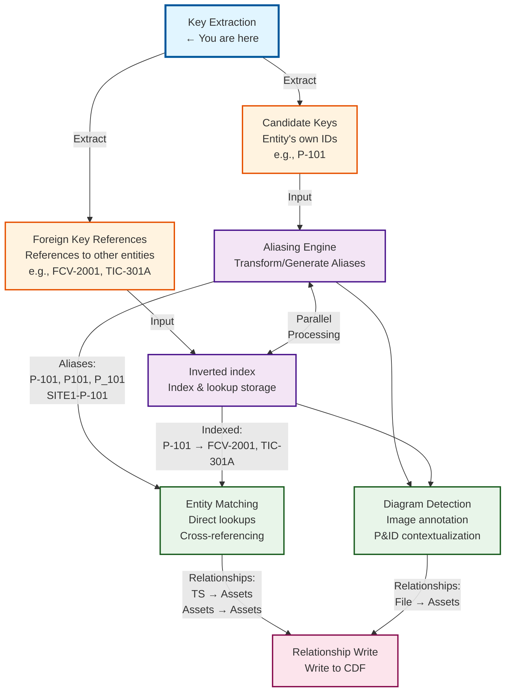

# Key Extraction

Key extraction is the foundational process of identifying and extracting asset tags, equipment identifiers, and document file names from metadata attributes within Cognite Data Fusion (CDF). This process transforms unstructured or semi-structured text data into structured, queryable identifiers that enable downstream contextualization and aliasing workflows.

## TLDR

**What it does**: Extracts structured identifiers (asset tags, document names, equipment IDs) from unstructured metadata fields like descriptions, names, and comments.

**Key outputs**:
- ✅ **Candidate keys** - Entity's own identifiers (`P-101`, `FCV-2001A`)
- ✅ **Foreign key references** - References to other entities (`FCV-2001` → `P-101`)
- ✅ **Document references** - Engineering drawing names (`P&ID-2001-Rev-C`)

**Downstream (optional):** FK and document reference strings are written to RAW JSON columns consumed by **`fn_dm_inverted_index`** to maintain a **RAW inverted index** (token → postings). Candidate keys are **not** sent through that function—see [Inverted index (downstream RAW)](#inverted-index-downstream-raw).

**Key Definitions**:
- **Candidate Key**: A field or combination of fields that can uniquely identify a record within a dataset. In asset management, these are natural identifiers like equipment tags (`P-101`) or instrument tags (`FIC-2001`) that uniquely identify specific equipment or instruments.
- **Foreign Key Reference**: A reference to another entity's candidate key found within metadata. For example, a time series might reference `FCV-2001` (a valve) in its description, creating a foreign key reference from the time series to the valve entity.

**1 extraction handler** (per rule, YAML `handler:`):
1. **`regex_handler`** - Declarative **`fields`** with optional per-field **`regex`**, trim-only when `regex` is omitted, optional **`result_template`** (all field specs are merged). Strategy-based extraction (`handler: heuristic`) is **not** implemented; use the **transform** stage **`heuristic_sampler`** for sample-driven substring selection on the working string built from fields.

**Quick start**:
```yaml
extraction_rules:
  - name: "asset_tags"
    handler: regex_handler
    fields:
      - field_name: name
        regex: '[A-Z]+-\d+[A-Z]?'
    extraction_type: candidate_key
```

**Common patterns**:
- Asset tags: `P-101`, `FCV-2001A`, `TIC-301`
- Document names: `P&ID-2001-Rev-C`, `DWG-123-Sheet-1`
- Time series: `P-101-FLOW`, `T-50-TEMP`

**When to use**: First step in any CDF contextualization pipeline - extracts the identifiers needed for entity matching and relationship building.

**Repository default (CDM):** `workflow.local.config.yaml` at module root defines **regex-only** rules on CogniteAsset / CogniteFile / CogniteTimeSeries with a shared **`alphanumeric_tag`** anchor (mirrored in `config/tag_patterns.yaml`). Names like `VAL_45-TT-92506:…` require the opening **`(?:\b|(?<=_))`** fragment so the match can start after `_` (Python `\b` does not separate `_` from digits). Narrative summary: [configuration guide — Default CDM scope](../guides/configuration_guide.md#default-cdm-scope). Examples under `config/examples/` often add extra rules and richer aliasing stacks.

**Incremental pipelines:** When **`incremental_change_processing`** is enabled, detection and extraction use **`workflow_scope`**, optional **Key Discovery** FDM state ([`data_modeling/`](../../data_modeling/)), and **RAW** cohort handoff — see [configuration guide](../guides/configuration_guide.md#incremental-mode-key-discovery-fdm-and-raw-cohort) and [module README](../../README.md#incremental-cohort-processing-raw-cohort-cdm-state).

## Table of Contents

- [Purpose](#purpose)
- [Key Extraction Workflow](#key-extraction-workflow)
- [Inverted index (downstream RAW)](#inverted-index-downstream-raw)
- [Configuration](#configuration)
  - [Core Configuration Properties](#core-configuration-properties)
  - [Source View](#source-view)
  - [Source Field(s)](#source-fields)
  - [Handler](#method)
    - [regex_handler](#regex_handler)
- [Confidence score calculation by method](#confidence-score-calculation-by-method)
- [Best Practices](#best-practices)
  - [Rule Priority and Ordering](#rule-priority-and-ordering)
  - [Performance Optimization](#performance-optimization)
  - [Error Handling](#error-handling)
  - [Testing and Validation](#testing-and-validation)
- [Troubleshooting](#troubleshooting)
  - [Common Issues](#common-issues)
  - [Debugging](#debugging)
- [Additional Resources](#additional-resources)

## Purpose

The key extraction process serves several critical functions:

- **Asset Tag Identification**: Extract equipment tags (e.g., P-101, FCV-2001A) from asset metadata fields
- **Document Reference Extraction**: Identify engineering document names (e.g., P&ID-2001-Rev-C) from file metadata
- **Time Series Tag Mapping**: Parse time series external IDs to extract asset references and measurement types
- **Foreign Key Discovery**: Feed an inverted index of cross-entity references derived from extracted keys
- **Contextualization Foundation**: Provide clean, standardized identifiers for downstream entity matching and linking

### Key Concepts

#### Candidate Keys
A **candidate key** is a field or combination of fields that can uniquely identify a record within a dataset. In the context of industrial asset management:

- **Equipment Tags**: Primary identifiers for physical equipment (e.g., `P-101` for Pump 101, `V-201` for Valve 201)
- **Instrument Tags**: Identifiers for measurement and control instruments (e.g., `FIC-2001` for Flow Indicator Controller 2001, `TIC-301` for Temperature Indicator Controller 301)
- **Document Names**: Unique identifiers for engineering documents (e.g., `P&ID-2001-Rev-C` for Piping and Instrumentation Diagram 2001 Revision C)

**Characteristics of Candidate Keys**:
- **Uniqueness**: Each candidate key must uniquely identify one and only one entity
- **Natural Identifiers**: These are meaningful identifiers used in the real world, not artificial database keys
- **Industry Standards**: Often follow industry naming conventions (ISA-5.1 for instrumentation, company-specific for equipment)

#### Foreign Key References
A **foreign key reference** is a reference to another entity's candidate key found within metadata. These references establish relationships between entities:

- **Time Series → Equipment**: A flow measurement time series might reference `P-101` in its description, indicating it measures flow from Pump 101
- **Document → Equipment**: A maintenance work order might reference `FCV-2001` in its description, indicating work on Flow Control Valve 2001
- **Equipment → Equipment**: A pump's metadata might reference `T-301` (Tank 301) indicating it pumps from that tank

**Characteristics of Foreign Key References**:
- **Relationship Building**: Enable creation of relationships between different entity types
- **Contextual Information**: Provide context about how entities relate to each other
- **Cross-Entity Linking**: Allow linking of assets, documents, time series, and other entity types

**Self-reference filter:** After validation, the discovery **validate** stage may remove foreign key references whose string `value` **exactly equals** a candidate key `value` on the **same** instance (`_exclude_self_referencing_keys`). Precedence: optional **`exclude_self_referencing_keys`** on each **`source_views`** entry (passed into `extract_keys` for that view’s entities), else **`parameters.exclude_self_referencing_keys`** (boolean default `true`, or a legacy dict with `default` and per-`entity_type` keys). The default CDM scope uses **`parameters: true`** and sets **`exclude_self_referencing_keys: false`** on the **CogniteTimeSeries** source view only.

#### Example: Candidate Key vs Foreign Key Reference

```python
# Asset Entity (Pump P-101)
asset = {
    "name": "P-101",
    "description": "Main feed pump for Tank T-301",
    "type": "pump"
}
# Candidate Key: "P-101" (uniquely identifies this pump)
# Foreign Key Reference: "T-301" (references Tank T-301)

# Time Series Entity (Flow measurement)
timeseries = {
    "externalId": "P-101-FLOW",
    "description": "Flow measurement for pump P-101",
    "unit": "m³/h"
}
# Candidate Key: "P-101-FLOW" (uniquely identifies this time series)
# Foreign Key Reference: "P-101" (references Pump P-101)

# Document Entity (P&ID)
document = {
    "name": "P&ID-2001-Rev-C",
    "description": "Piping diagram showing pumps P-101, P-102 and valves FCV-2001, FCV-2002",
    "type": "P&ID"
}
# Candidate Key: "P&ID-2001-Rev-C" (uniquely identifies this document)
# Foreign Key References: "P-101", "P-102", "FCV-2001", "FCV-2002" (references multiple equipment)
```

## Key Extraction Workflow

Key extraction is the first step in a larger contextualization pipeline (diagram below is Mermaid; no separate image file is committed):



*Note: If the diagram above does not render in your viewer, open the maintained workflow diagram: [`workflow_template/workflow_diagram.md`](../../workflow_template/workflow_diagram.md).*

## Inverted index (downstream RAW)

Key extraction persists **foreign key** and **document reference** payloads on the same RAW table as candidate keys: columns **`FOREIGN_KEY_REFERENCES_JSON`** and **`DOCUMENT_REFERENCES_JSON`** (when rules with types `foreign_key_reference` / `document_reference` produce matches). A separate CDF function, **`fn_dm_inverted_index`**, reads **only** those JSON columns and updates a dedicated RAW table that stores a **lookup token → postings** inverted index for “who references this tag string?” style queries.

**Important distinctions**

| Topic | Behavior |
|-------|----------|
| **What is indexed** | Values extracted as **foreign key** and **document** references—not **candidate_key** list columns consumed by downstream **transform** stages unless promoted into FK/doc payloads. |
| **Aliasing rules** | The inverted-index function loads a copy of **`aliasing.config`** from the v1 scope so each referenced string can be expanded with the same rule/validation **shape** as the aliasing spec; it does **not** read alias rows from the aliasing RAW table. |
| **Enablement** | Scope flag **`key_extraction.config.parameters.enable_inverted_index`** (boolean). Table name: **`inverted_index_raw_table_key`** or automatic derivation from **`raw_table_key`** (`*_key_extraction_state` → `*_inverted_index`). |

**Operational references:** [Configuration guide — Inverted index parameters](../guides/configuration_guide.md#inverted-index-parameters), [`functions/fn_dm_inverted_index/handler.py`](../../functions/fn_dm_inverted_index/handler.py), [Workflows README](../../workflows/README.md), [Module specification](../MODULE_SPECIFICATION.md#35-inverted-index).

## Configuration

The key extraction process is defined through extraction rules that specify what to extract, where to look, and how to extract it. Each extraction rule is configured through a YAML configuration file or programmatically using the `ExtractionRule` data class.

### Core Configuration Properties

```yaml
extraction_rules:
  - name: "standard_pump_tag"
    description: "Extracts standard pump tags from equipment descriptions"
    extraction_type: "asset_tag"
    method: "regex"
    pattern: '\bP[-_]?\d{2,4}[A-Z]?\b'
    priority: 50
    enabled: true
    scope_filters:
      site: ["Plant_A", "Plant_B"]
      unit: ["Unit_100", "Unit_200"]
    min_confidence: 0.7
    case_sensitive: false
    aliasing_rules:
      - type: "character_substitution"
        substitutions:
          "_": "-"
      - type: "prefix_suffix"
        prefix: "SITE1-"
```

#### Configuration Parameters

| Parameter | Type | Description | Example |
|-----------|------|-------------|---------|
| `name` | String | Unique identifier for the rule | `"flow_instrument_tag"` |
| `description` | String | Human-readable explanation of what the rule extracts | `"Extracts ISA flow instruments"` |
| `extraction_type` | Enum | Type of key being extracted: `asset_tag`, `file_name`, `measurement_id` | `"asset_tag"` |
| `method` | String | Extraction method to use | `"regex"` (legacy docs); shipped rules use `handler: regex_handler` |
| `pattern` | String | Pattern definition (format depends on method) | `'\bFIC[-_]?\d{4}\b'` |
| `priority` | Integer | Rule priority (lower = higher priority) | `50` |
| `enabled` | Boolean | Whether the rule is active | `true` |
| `scope_filters` | Dict | Context filters to apply the rule selectively | `{"site": ["Plant_A"]}` |
| `min_confidence` | Float | Minimum confidence score (0.0-1.0) | `0.7` |
| `case_sensitive` | Boolean | Whether pattern matching is case-sensitive | `false` |
| `aliasing_rules` | List | Transformation rules applied to extracted values | See Aliasing section |

### Source View

The source view defines which CDF data model view(s) to query for entities whose metadata will be processed. This determines the scope of the extraction pipeline.

#### Asset Metadata Extraction

```yaml
source_views:
  - view_external_id: "CogniteEquipment"
    view_space: "sp_enterprise_process_industry"
    view_version: "v1"
    entity_type: "asset"
    batch_size: 100
    filter:
      equals:
        property: ["node", "type"]
        value: "Equipment"
    include_properties:
      - "name"
      - "description"
      - "tagIds"
      - "equipmentType"
      - "specifications"
```

#### File Metadata Extraction

```yaml
source_views:
  - view_external_id: "txFile"
    view_space: "sp_enterprise_process_industry"
    view_version: "v1"
    entity_type: "file"
    batch_size: 50
    filter:
      in:
        property: ["node", "tags"]
        values: ["ToProcess", "EngineeringDrawing"]
    include_properties:
      - "name"
      - "description"
      - "documentType"
      - "drawingNumber"
```

#### Time Series Metadata Extraction

```yaml
source_views:
  - view_external_id: "txTimeSeries"
    view_space: "sp_enterprise_process_industry"
    view_version: "v1"
    entity_type: "timeseries"
    batch_size: 200
    include_properties:
      - "externalId"
      - "name"
      - "description"
      - "unit"
```

#### Source View Parameters

| Parameter | Description | Example |
|-----------|-------------|---------|
| `view_external_id` | External ID of the data model view | `"CogniteEquipment"` |
| `view_space` | Space where the view is defined | `"sp_enterprise_process_industry"` |
| `view_version` | Version of the view schema | `"v1"` |
| `instance_space` | Optional. Passed to `instances.list(space=...)`. If omitted, `space=None` (list across spaces); narrow with `filters` using `property_scope: node` / `target_property: space`. | `"sp_enterprise_schema"` or omitted |
| `entity_type` | Type of entity for processing context | `"asset"`, `"file"`, `"timeseries"` |
| `batch_size` | Page size for **`fn_dm_view_query`** `instances.list` pagination (`min` with 1000); not a total instance cap | `1000` (default) |
| `filters` | List of filter entries (`operator`, `target_property`, `values`, optional `property_scope`: `view` \| `node`) | See [Configuration guide](../guides/configuration_guide.md#source-views-configuration) |
| `filter` | Legacy / conceptual single filter in some docs (v1 scope YAML uses **`filters`** list) | — |
| `include_properties` | List of properties to retrieve | `["name", "description"]` |

**Node-scoped filters:** With `property_scope: node`, `target_property` refers to node metadata (e.g. `space`, `externalId`), corresponding to Cognite filter tuples `("node", "space")`, etc. Per-entity `instance_space` in pipeline output is taken from the node when `instance_space` is not set on the view.

### Source Field(s)

Source fields specify which metadata attributes to analyze for key extraction. Each extraction rule can target one or multiple source fields, and fields can be processed individually or in combination.

#### Single Field Extraction

Extract from a single metadata attribute:

```yaml
extraction_rules:
  - name: "tag_from_name"
    source_fields:
      - field_name: "name"
        field_type: "string"
        required: true
        max_length: 500
```

#### Multi-Field Extraction

Extract from multiple attributes (logical OR - if found in any field):

```yaml
extraction_rules:
  - name: "tag_from_multiple_sources"
    source_fields:
      - field_name: "name"
        field_type: "string"
        required: false
        priority: 1
      - field_name: "description"
        field_type: "string"
        required: false
        priority: 2
      - field_name: "tagIds"
        field_type: "string"
        required: false
        priority: 1
        separator: ","  # For delimited list fields
```

#### Composite Field Extraction

Combine multiple fields to create extraction context:

```yaml
extraction_rules:
  - name: "tag_with_context"
    source_fields:
      - field_name: "siteCode"
        field_type: "string"
        role: "context"
      - field_name: "description"
        field_type: "string"
        role: "target"
    composite_strategy: "context_aware"
    # Will use siteCode to inform pattern matching in description
```

#### Nested property paths (dot-separated field_name)

For CDF pipeline runs, each `field_name` is resolved against the **view property bag** for the instance (the object under `properties[<view_space>][<viewExternalId>/<version>]`). Use **dot-separated segments** to walk nested **objects** (dict-shaped properties).

**Behavior:**

- Segments follow **object keys** in order (`metadata.equipmentDetails.primaryTag` → `root["metadata"]["equipmentDetails"]["primaryTag"]`).
- If the current value is a **string** and more segments remain, the pipeline attempts **`json.loads`** on the trimmed string and continues on the parsed value. Use this when a single view property stores JSON text and you need an inner key (e.g. `payload.tag` when `payload` is `'{"tag":"P-1"}'`).
- **Not supported:** array indexing (`items.0`), JSONPath, or escaping a literal `.` inside a single property external ID (every `.` starts a new segment).
- Values are ultimately passed to the engine as strings (non-strings are stringified).

```yaml
extraction_rules:
  - name: "tag_from_nested_metadata"
    source_fields:
      - field_name: "metadata.equipmentDetails.primaryTag"
        field_type: "string"
        required: false
      - field_name: "payload.identifier"   # works if payload is JSON string or object
        field_type: "string"
        required: false
```

**RAW joins (`source_tables`):** `join_fields.view_field` may also use the same dot-path rules when matching the view side of the join.

**RAW entity rows (candidate key columns):** For each distinct `source_field` on extracted keys, the pipeline writes a column whose name is **`source_field` uppercased** (Python `str.upper()`). Dotted paths therefore produce column names that **still contain dots** (e.g. `metadata.code` → `METADATA.CODE`). System columns (`EXTRACTION_STATUS`, `RULES_USED_JSON`, …) are unchanged. Downstream tools that read these columns should use the exact uppercased `field_name` string.

#### Source Field Parameters

| Parameter | Type | Description | Example |
|-----------|------|-------------|---------|
| `field_name` | String | Top-level view property name, or dot path through nested objects / JSON string properties | `"description"`, `"metadata.primaryTag"`, `"payload.id"` |
| `field_type` | String | Data type of the field | `"string"`, `"array"`, `"object"` |
| `required` | Boolean | Whether field must exist (skip entity if missing) | `false` |
| `priority` | Integer | Order of precedence when multiple fields match | `1` |
| `separator` | String | Delimiter for list-type fields | `","`, `";"`, `"\|"` |
| `role` | String | Role in extraction: `"target"`, `"context"`, `"validation"` | `"target"` |
| `max_length` | Integer | Maximum field length to process (performance) | `1000` |
| `preprocessing` | List | Preprocessing steps before extraction | `["trim", "lowercase", "remove_special_chars"]` |

#### Field results mode

When a rule lists multiple **`fields`** entries, contributions are **always merged** (`merge_all`). Legacy YAML may still set **`field_results_mode: first_match`**; it is coerced to **`merge_all`**. Optional **`result_template`** formats combined variable lists (see handler code for Cartesian / merge semantics).

### Handler

The rule **`handler`** must be **`regex_handler`**. Regex-based extraction lives **on each field** as optional **`regex`** (omit `regex` for trim-only / “passthrough” behavior). Legacy `handler: heuristic` authoring was removed from the product surface; sample-driven matching belongs on the **transform** stage (`heuristic_sampler`).

#### regex_handler
Declarative per-field extraction: optional **`regex`** on each `fields[]` entry, optional **`result_template`**, and shared **`validation`** (including **`validation_rules`**, same shape as aliasing).

**When to Use**:
- Asset tags follow consistent patterns (e.g., P-101, FCV-2001A)
- Document names have standard formats (e.g., P&ID-2001-Rev-C)
- Clear boundaries between identifiers and surrounding text
- Patterns can be expressed with regular expressions

**Configuration**:

```yaml
extraction_rules:
  - name: "flow_control_valve"
    method: "regex"
    pattern: '\b[A-Z]{2,3}V[-_]?\d{2,4}[A-Z]?\b'
    regex_options:
      multiline: false
      dotall: false
      ignore_case: false
      unicode: true
    validation_pattern: '^[A-Z]{2,3}V\d{2,4}[A-Z]?$'  # Post-extraction validation
```

**Pattern Examples**:

```yaml
# Pump tags: P-101, P101A, FWP-201
pattern: '\bP[-_]?\d{2,4}[A-Z]?\b|\b[A-Z]{2,4}P[-_]?\d{2,4}[A-Z]?\b'

# ISA instruments: FIC-2001, TIT-301A, LCV-401
pattern: '\b[FPTLA][A-Z]{1,3}[-_]?\d{2,4}[A-Z]?\b'

# P&ID documents: P&ID-2001, PID_2001_Rev_A
pattern: '\bP&?ID[-_]?\d{4,6}(?:[-_]?Rev[-_]?[A-Z0-9]+)?\b'

# Complex multi-segment tags: SITE1-UNIT200-P101A
pattern: '\b[A-Z0-9]+[-_/][A-Z0-9]+[-_/][A-Z0-9]+\b'

# Pipe identifiers: 6"-P-2001-A1, 8IN-P-3001
pattern: '\b\d{1,2}(?:IN|")?[-_][A-Z][-_]\d{3,4}[-_]?[A-Z0-9]*\b'
```

**Advanced Regex Features**:

```yaml
# Named capture groups for component extraction
extraction_rules:
  - name: "tag_with_components"
    method: "regex"
    pattern: '\b(?P<prefix>[A-Z]{1,4})[-_]?(?P<number>\d{2,4})(?P<suffix>[A-Z])?\b'
    capture_groups:
      - name: "prefix"
        component_type: "equipment_type"
      - name: "number"
        component_type: "sequence_id"
      - name: "suffix"
        component_type: "variant"
    reassemble_format: "{prefix}-{number}{suffix}"
```

**Performance Optimization**:

```yaml
# Compiled pattern caching
regex_options:
  cache_compiled: true
  cache_ttl: 3600  # seconds

# Limit search scope to improve performance
  max_matches_per_field: 50
  early_termination: true  # Stop after first match

# Negative lookahead/lookbehind to exclude false positives
pattern: '\b(?<!Rev[-_])P[-_]?\d{2,4}[A-Z]?\b(?![-_]Rev)'
```

**Regex Method Parameters**:

| Parameter | Type | Description | Example |
|-----------|------|-------------|---------|
| `pattern` | String | Regular expression pattern | `'\bP[-_]?\d{2,4}[A-Z]?\b'` |
| `validation_pattern` | String | Additional pattern for post-extraction validation | `'^P\d{2,4}[A-Z]?$'` |
| `regex_options.multiline` | Boolean | Enable multiline mode | `false` |
| `regex_options.dotall` | Boolean | Make `.` match newlines | `false` |
| `regex_options.ignore_case` | Boolean | Case-insensitive matching | `false` |
| `regex_options.unicode` | Boolean | Enable Unicode support | `true` |
| `capture_groups` | List | Named capture group definitions | See example above |
| `reassemble_format` | String | Template for reassembling captured components | `"{prefix}-{number}{suffix}"` |
| `max_matches_per_field` | Integer | Limit number of matches | `50` |
| `early_termination` | Boolean | Stop after first match | `false` |

#### Hierarchical-style tags (no token reassembly)

The engine does **not** include a token-reassembly extraction method. Model composite or hierarchical identifiers with **regex** (including capture groups and `reassemble_format` where supported); use **aliasing** or the **transform** stage when multiple fields must be merged or further parsed.

#### Heuristic extraction (removed)

The legacy extraction path **`handler: heuristic`** / **`method: heuristic`** with **`heuristic_strategies`** is **not** implemented in shipped Python engines. Do not author strategy blocks on extraction rules.

For **sample-driven substring selection** on strings built from **`fields`** (including comma-joined multi-field inputs when **`output_template`** is omitted), configure the **transform** stage **`heuristic_sampler`** (see transform / ELT documentation).

#### Trim-only field (former “passthrough”)

Omit **`regex`** on a field spec: the **trimmed** whole field value is emitted as one candidate. Use when the property already holds the identifier (`name`, `externalId`, etc.).

```yaml
extraction_rules:
  - name: name_as_candidate_key
    handler: regex_handler
    extraction_type: candidate_key
    field_results_mode: merge_all
    fields:
      - field_name: name
        required: true
        preprocessing:
          - trim
```

Initial confidence still flows through the same **`validation`** / **`validation_rules`** path as regex-derived keys.

## Confidence score calculation by handler

Each rule computes a **confidence score** (0.0–1.0) for every extracted key. Keys are only emitted if their score is ≥ the rule’s `min_confidence`, and the global `validation.min_confidence` is applied to the final result. **`validation_rules`** (same idea as aliasing) run afterward.

**Calibration for parity:** Scores are calibrated so that **like extraction strength** yields **similar confidence** across methods. Rough tiers: **Strong** (exact or unambiguous position) → 0.88–1.0; **Good** (contains or clear context) → 0.75–0.88; **Moderate** (inferred, token overlap, frequency/context) → 0.55–0.75; **Weak** → &lt;0.55.

### Regex handler (regex matches)

When a field spec sets **`regex`**, extraction uses a **shared confidence function** (`compute_confidence`) that compares the extracted substring to the full source field value. The implementation uses a **single substring search** to classify the match, then applies a **configurable score table** (exact → start/end → contains); order is first-match-wins.

| Condition | Score |
|-----------|-------|
| **Exact match** — source equals extracted value | `1.0` |
| **Start/end match** — source starts with or ends with extracted value | `0.90` |
| **Contains** — source contains extracted value (substring) | `0.80` |
| **Otherwise** — token overlap: (extracted tokens found in source) / (total extracted tokens), capped at `0.70` | `0.0`–`0.70` |

- Tokenization is alphanumeric (e.g. `P-101` → tokens `P`, `101`). Matching respects the rule’s `case_sensitive` setting.
- If the extracted value (or the key) is blacklisted, confidence is set to **0.0** (handled in the engine).

### Heuristic (removed)

Legacy **extraction** heuristic confidence weighting is not applicable: **`handler: heuristic`** is not supported. Confidence for **`regex_handler`** follows the **Regex handler** section above; downstream **`heuristic_sampler`** uses transform-stage rules, not extraction confidence tables.

### Regex handler (trim-only)

When **`regex`** is omitted, the engine assigns a **high default confidence** to the trimmed full-field value (then **`validation`** / **`validation_rules`** apply as usual).

## Best Practices

### Rule Priority and Ordering

1. **Specific before Generic**: Assign lower priority numbers to more specific patterns
   ```yaml
   # Priority 30: Very specific pattern
   - name: "safety_relief_valve"
     pattern: '\bPSV[-_]\d{4}[A-Z]\b'
     priority: 30

   # Priority 50: General valve pattern
   - name: "control_valve"
     pattern: '\b[A-Z]{2,3}V[-_]\d{4}[A-Z]?\b'
     priority: 50

   # Priority 100: Very generic pattern
   - name: "generic_equipment"
     pattern: '\b[A-Z]{1,4}[-_]\d{2,6}[A-Z]?\b'
     priority: 100
   ```

2. **Industry Standards First**: Prioritize well-established standards (ISA, ANSI)

3. **Test with Real Data**: Validate patterns against actual metadata samples

### Performance Optimization

1. **Batch Processing**: Process entities in batches (50-100 entities)
2. **Pattern Compilation Caching**: Enable regex pattern caching
3. **Scope Filtering**: Use context filters to limit rule application
4. **Early Termination**: Stop processing when high-confidence match found

### Error Handling

1. **Graceful Degradation**: Continue processing even if some rules fail
2. **Logging**: Maintain detailed logs of extraction failures
3. **Fallback Rules**: Define generic fallback patterns for edge cases
4. **Validation**: Always validate extracted values before using downstream

### Testing and Validation

```yaml
testing:
  test_data_sources:
    - type: "sample_metadata"
      source: "test_assets.json"
      expected_results: "expected_extractions.json"

  validation_metrics:
    - precision: 0.95  # % of extracted values that are correct
    - recall: 0.90     # % of actual tags that were found
    - f1_score: 0.92   # Harmonic mean of precision and recall

  regression_testing:
    enable: true
    baseline_results: "baseline_extractions.json"
    alert_on_degradation: true
```

## Troubleshooting

### Common Issues

**Issue**: Pattern matches too many false positives
- **Solution**: Add word boundaries `\b`, negative lookahead/lookbehind, increase specificity

**Issue**: Pattern misses valid tags
- **Solution**: Review actual data, broaden pattern, check case sensitivity

**Issue**: Poor performance with complex patterns
- **Solution**: Simplify patterns, enable caching, reduce batch size

**Issue**: Inconsistent results across similar entities
- **Solution**: Check scope filters, review priority ordering, validate preprocessing

### Debugging

```yaml
debugging:
  enable_detailed_logging: true
  log_level: "DEBUG"
  log_matched_patterns: true
  log_rejected_candidates: true
  export_intermediate_results: true
  output_directory: "debug_output/"
```

## Additional Resources

- **Aliasing / shared tag regex**: [Aliasing specification](2.%20aliasing.md), [`config/tag_patterns.yaml`](../../config/tag_patterns.yaml)
- **Configuration examples**: [`config/examples/`](../../config/examples/README.md), [`reference_key_extraction_aliasing.yaml`](../../config/examples/reference/reference_key_extraction_aliasing.yaml)
- **Module entry points**: [Module README](../../README.md), [Configuration guide](../guides/configuration_guide.md)
- **Workflows**: [workflows README](../../workflows/README.md)
