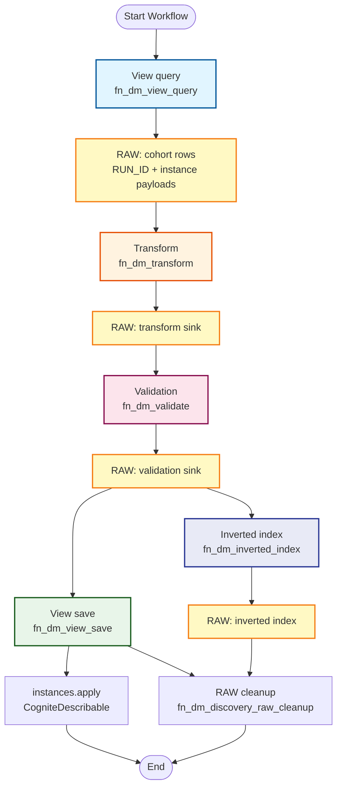

# Key Discovery and Aliasing Workflow

## Workflow Diagram

The diagram below is the maintained source (no committed PNG). Render it in any Mermaid-capable viewer or GitHub preview.

### Mermaid Source Code



**Macro execution graph (Kahn network, `dependsOn` SSOT):** [`workflow.execution.graph.yaml`](workflow.execution.graph.yaml) and [`workflow_channel_contracts.md`](workflow_channel_contracts.md).

## Detailed flow (short)

1. **Query** — `fn_dm_view_query` lists DM instances (with incremental watermarks when enabled) and writes cohort rows to discovery RAW.
2. **Transform** — `fn_dm_transform` applies YAML-driven rules from each canvas node’s `data.config`.
3. **Validate** — `fn_dm_validate` scores / filters payloads and writes validation sink RAW.
4. **Inverted index (optional)** — `fn_dm_inverted_index` consumes predecessor task snapshots (IR) and/or configured RAW columns.
5. **Save** — `fn_dm_view_save` applies predecessor payloads to `cdf_cdm:CogniteDescribable` (aliases, optional FK strings).
6. **Cleanup (optional)** — `fn_dm_discovery_raw_cleanup` truncates or deletes cohort keys post-run.

## Data flow (logical)

```
DM list → fn_dm_view_query → RAW cohort
         → fn_dm_transform → RAW transform
         → fn_dm_validate → RAW validation
         → fn_dm_inverted_index → RAW index (branch)
         → fn_dm_view_save → DM apply
         → fn_dm_discovery_raw_cleanup (optional)
```

Authoring still uses the v1 scope document (`key_extraction`, `aliasing`, `canvas`); the **compiled canvas** selects which `fn_dm_*` executors run and in what order. Besides **`fn_dm_view_query`** / **`fn_dm_view_save`**, the graph may use **`fn_dm_raw_query`**, **`fn_dm_classic_query`**, **`fn_dm_raw_save`**, **`fn_dm_classic_save`**, **`fn_dm_join`**, and **`fn_dm_discovery_raw_cleanup`** — see [`functions/README.md`](../functions/README.md).
