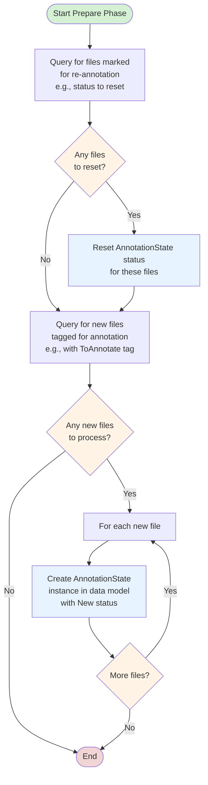
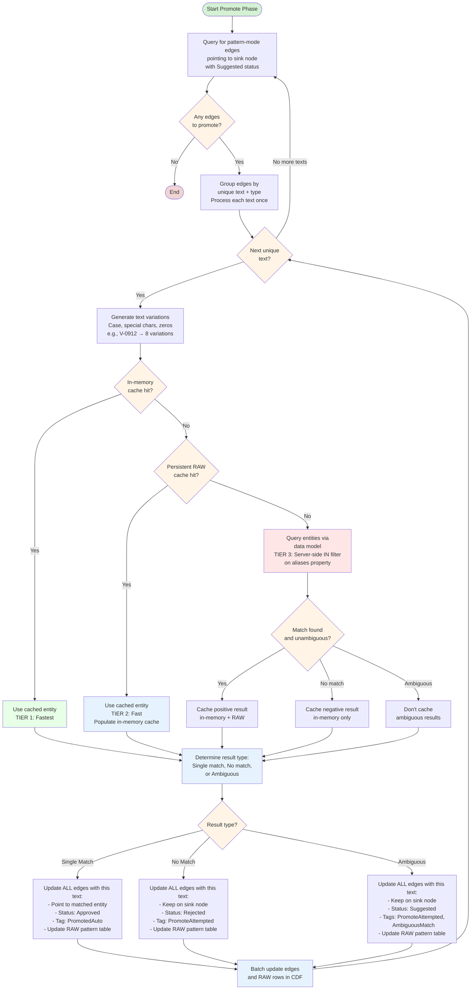
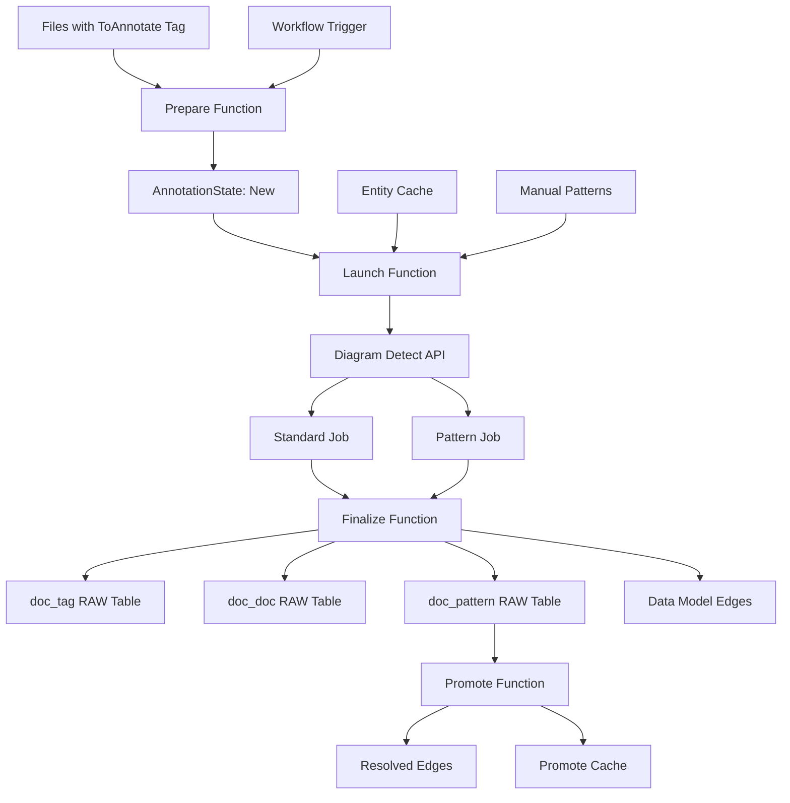

# CDF File Annotation Module

This module provides a comprehensive framework for automating the process of annotating files within Cognite Data Fusion (CDF), using a data model-centric approach to manage the annotation lifecycle from file selection to result processing and reporting.

## Why Use This Module?

**Automate Your Document Contextualization with Production-Ready Code**

Building a file annotation solution from scratch is complex and time-consuming. This module delivers **production-ready, battle-tested code** that handles the complete annotation lifecycle, from identifying files to processing results and generating reports.

**Key Benefits:**

- ⚡ **Configuration-Driven**: Entire workflow controlled by a single config file—adapt to different data models without code changes
- 🎯 **Dual Annotation Modes**: Simultaneously runs standard entity matching and pattern-based detection for comprehensive coverage
- 🤖 **Automatic Pattern Promotion**: Intelligent text matching with multi-tier caching automatically resolves pattern annotations
- 📄 **Large Document Support**: Handles files >50 pages by chunking, processing iteratively, and tracking progress
- 🔄 **Parallel Execution Ready**: Robust optimistic locking prevents race conditions in concurrent processing
- 📊 **Comprehensive Reporting**: Results stored in dedicated RAW tables plus extraction pipeline logs for full traceability
- 🛡️ **Enterprise Scale**: Designed for tens of thousands of complex files with optimized batch processing and caching
- 🔧 **Local Development**: All handlers run locally with VSCode debug support

**Time & Cost Savings:**

- **Development Time**: Save weeks of development by leveraging production-ready annotation logic
- **Manual Review Reduction**: Automatic pattern promotion dramatically reduces manual review burden
- **Scalability Built-In**: Optimized caching and batching avoid months of performance tuning
- **Maintenance**: Interface-based design enables customization without modifying core code

**Real-World Performance:**

- **Batch Processing**: Configurable batch sizes (1-50 files per diagram detect call)
- **Cache Efficiency**: Scope-based caching reuses entity context across files in same site/unit
- **Entity Search**: 50-500x better performance by querying smaller entity dataset vs. annotation edges
- **Self-Improving**: Persistent cache accumulates successful mappings over time

## 🎯 Overview

The CDF File Annotation module is designed to:
- **Automate file annotation** using Cognite's Diagram Detect API
- **Support dual annotation modes** for standard matching and pattern-based detection
- **Handle large documents** with automatic chunking and progress tracking
- **Enable parallel processing** with optimistic locking for concurrency safety
- **Provide automatic pattern promotion** to resolve annotations without manual review
- **Generate comprehensive reports** in RAW tables for analysis and auditing
- **Support workflow automation** through CDF Workflows integration

## 🏗️ Module Architecture

```
cdf_file_annotation/
├── 📁 functions/                           # CDF Functions
│   ├── 📁 fn_file_annotation_prepare/             # Identify files for annotation
│   │   ├── 📄 handler.py
│   │   └── 📁 services/
│   ├── 📁 fn_file_annotation_launch/              # Launch annotation jobs
│   │   ├── 📄 handler.py
│   │   └── 📁 services/
│   ├── 📁 fn_file_annotation_finalize/            # Process annotation results
│   │   ├── 📄 handler.py
│   │   └── 📁 services/
│   ├── 📁 fn_file_annotation_promote/             # Auto-resolve pattern annotations
│   │   ├── 📄 handler.py
│   │   └── 📁 services/
│   └── 📄 functions.Function.yaml                 # Function definitions
├── 📁 workflows/                           # CDF Workflows
│   ├── 📄 wf_file_annotation.Workflow.yaml        # Main workflow definition
│   ├── 📄 wf_file_annotation.WorkflowVersion.yaml # Workflow version config
│   └── 📄 wf_file_annotation.WorkflowTrigger.yaml # Workflow triggers
├── 📁 data_modeling/                       # Data model definitions
│   ├── 📁 containers/                             # Container definitions
│   ├── 📁 views/                                  # View definitions
│   ├── 📁 nodes/                                  # Node definitions
│   └── 📄 hdm.datamodel.yaml                      # Data model definition
├── 📁 raw/                                 # RAW table definitions
│   ├── 📄 rawTableDocDoc.Table.yaml               # Doc-to-doc link results
│   ├── 📄 rawTableDocTag.Table.yaml               # Doc-to-tag link results
│   ├── 📄 rawTableDocPattern.Table.yaml           # Pattern detection results
│   ├── 📄 rawTableCache.Table.yaml                # Entity cache
│   ├── 📄 rawTablePromoteCache.Table.yaml         # Promote cache
│   └── 📄 rawManualPatternsCatalog.Table.yaml     # Manual pattern overrides
├── 📁 extraction_pipelines/                # Pipeline configurations
│   ├── 📄 ep_file_annotation.ExtractionPipeline.yaml
│   └── 📄 ep_file_annotation.config.yaml          # Main configuration file
├── 📁 data_sets/                           # Data set definitions
├── 📁 auth/                                # Authentication and permissions
├── 📁 streamlit/                           # Dashboard application
│   └── 📁 file_annotation_dashboard/              # Annotation quality dashboard
├── 📁 upload_data/                         # Sample data for patterns
├── 📄 default.config.yaml                  # Module configuration
├── 📄 CONFIG.md                            # Configuration guide
├── 📄 CONFIG_PATTERNS.md                   # Operational recipes
└── 📄 DEVELOPING.md                        # Developer extension guide
```

## 🚀 Core Functions

### 1. Prepare Function

**Purpose**: Identify files that need annotation and initialize their state

**Key Features**:
- 🔍 **File Discovery**: Queries for files tagged for annotation (e.g., "ToAnnotate")
- 🔄 **Reset Support**: Identifies and resets files marked for re-annotation
- 📊 **State Initialization**: Creates `AnnotationState` instances with "New" status

<details>
<summary>Click to view Prepare Phase flowchart</summary>



</details>

### 2. Launch Function

**Purpose**: Launch annotation jobs for files that are ready

**Key Features**:
- 📦 **Scope-Based Batching**: Groups files by site/unit for efficient processing
- 🧠 **Intelligent Caching**: Checks RAW cache before querying data model
- 🎯 **Pattern Generation**: Auto-generates regex patterns from entity aliases
- 📋 **Manual Override Support**: Merges manual patterns from RAW catalog
- 🔄 **Dual Job Submission**: Launches standard + pattern mode jobs

```mermaid
flowchart TD
    Start([Start Launch Phase]) --> QueryFiles[Query AnnotationState<br/>for New or Retry status]
    QueryFiles --> CheckFiles{Any files<br/>to process?}
    CheckFiles -->|No| End([End])
    CheckFiles -->|Yes| GroupFiles[Group files by<br/>primary scope<br/>e.g., site, unit]

    GroupFiles --> NextScope{Next scope<br/>group?}
    NextScope -->|Yes| CheckCache{Valid cache<br/>exists in RAW?}

    CheckCache -->|No - Stale/Missing| QueryEntities[Query data model for<br/>entities within scope]
    QueryEntities --> GenPatterns[Auto-generate pattern samples<br/>from entity aliases<br/>e.g., FT-101A → &#91;FT&#93;-000&#91;A&#93;]
    GenPatterns --> GetManual[Retrieve manual pattern<br/>overrides from RAW catalog<br/>GLOBAL, site, or unit level]
    GetManual --> MergePatterns[Merge and deduplicate<br/>auto-generated and<br/>manual patterns]
    MergePatterns --> StoreCache[Store entity list and<br/>pattern samples in<br/>RAW cache]
    StoreCache --> UseCache[Use entities and patterns]

    CheckCache -->|Yes - Valid| LoadCache[Load entities and<br/>patterns from RAW cache]
    LoadCache --> UseCache

    UseCache --> ProcessBatch[Process files in batches<br/>up to max batch size]
    ProcessBatch --> SubmitJobs[Submit Diagram Detect jobs:<br/>1 Standard annotation<br/>2 Pattern mode if enabled]
    SubmitJobs --> UpdateState[Update AnnotationState:<br/>- Set status to Processing<br/>- Store both job IDs]
    UpdateState --> NextScope
    NextScope -->|No more groups| QueryFiles

    style Start fill:#d4f1d4
    style End fill:#f1d4d4
    style CheckFiles fill:#fff4e6
    style CheckCache fill:#fff4e6
    style NextScope fill:#fff4e6
    style UseCache fill:#e6f3ff
    style UpdateState fill:#e6f3ff
```

<details>
<summary>Click to view Launch Phase flowchart</summary>



</details>

### 3. Finalize Function

**Purpose**: Retrieve, process, and store annotation job results

**Key Features**:
- 🔒 **Optimistic Locking**: Claims jobs to prevent race conditions
- 🔀 **Result Merging**: Combines standard and pattern results with deduplication
- 📊 **Confidence Filtering**: Auto-approve vs. suggest based on thresholds
- 📁 **RAW Reporting**: Writes to `doc_tag`, `doc_doc`, and `doc_pattern` tables
- 📄 **Multi-Page Tracking**: Handles progress for large documents

```mermaid
flowchart TD
    Start([Start Finalize Phase]) --> QueryState[Query for ONE AnnotationState<br/>with Processing status<br/>Use optimistic locking to claim it]
    QueryState --> CheckState{Found annotation<br/>state instance?}
    CheckState -->|No| End([End])
    CheckState -->|Yes| GetJobId[Extract job ID and<br/>pattern mode job ID]

    GetJobId --> FindFiles[Find ALL files with<br/>the same job ID]
    FindFiles --> CheckJobs{Both standard<br/>and pattern jobs<br/>complete?}
    CheckJobs -->|No| ResetStatus[Update AnnotationStates<br/>back to Processing<br/>Wait 30 seconds]
    ResetStatus --> QueryState

    CheckJobs -->|Yes| RetrieveResults[Retrieve results from<br/>both completed jobs]
    RetrieveResults --> MergeResults[Merge regular and pattern<br/>results by file ID<br/>Creates unified result per file]
    MergeResults --> LoopFiles[For each file in merged results]

    LoopFiles --> ProcessResults[Process file results:<br/>- Filter standard by confidence threshold<br/>- Capture regular annotations bounding box and page in a set<br/>- Skip pattern duplicates by checking if bounding box exist in set]

    ProcessResults --> CheckClean{First run for<br/>multi-page file?}
    CheckClean -->|Yes| CleanOld[Clean old annotations]
    CheckClean -->|No| CreateEdges
    CleanOld --> CreateEdges[Create edges in data model]

    CreateEdges --> StandardEdges[Standard annotations:<br/>Link file to entities<br/>Write to doc_tag and doc_doc RAW tables]
    StandardEdges --> PatternEdges[Pattern annotations:<br/>Link file to sink node<br/>Write to doc_pattern RAW table]

    PatternEdges --> UpdateTag[Update file tag:<br/>AnnotationInProcess → Annotated]
    UpdateTag --> PrepareUpdate[Prepare AnnotationState update:<br/>- Annotated if complete<br/>- Failed if error<br/>- New if more pages remain<br/>Track page progress]

    PrepareUpdate --> MoreFiles{More files in<br/>merged results?}
    MoreFiles -->|Yes| LoopFiles
    MoreFiles -->|No| BatchUpdate[Batch update ALL<br/>AnnotationState instances<br/>for this job]

    BatchUpdate --> QueryState

    style Start fill:#d4f1d4
    style End fill:#f1d4d4
    style CheckState fill:#fff4e6
    style CheckJobs fill:#fff4e6
    style CheckClean fill:#fff4e6
    style MoreFiles fill:#fff4e6
    style MergeResults fill:#e6f3ff
    style ProcessResults fill:#e6f3ff
    style CreateEdges fill:#e6f3ff
    style BatchUpdate fill:#e6f3ff
```

<details>
<summary>Click to view Finalize Phase flowchart</summary>



</details>

### 4. Promote Function

**Purpose**: Automatically resolve pattern-mode annotations by finding matching entities

**Key Features**:
- 🔍 **Text Variation Generation**: Handles case, special characters, leading zeros
- 🧠 **Multi-Tier Caching**: In-memory → RAW → Entity search strategy
- ✅ **Automatic Resolution**: Single match → Approved, No match → Rejected, Multiple → Manual review
- 🏷️ **Tagging**: Adds `PromotedAuto`, `PromoteAttempted`, `AmbiguousMatch` tags
- 📈 **Self-Improving**: Cache grows over time with successful mappings

<details>
<summary>Click to view Promote Phase flowchart</summary>



</details>

## 🔧 Configuration

### Module Configuration (`default.config.yaml`)

```yaml
# Dataset
annotationDatasetExternalId: ds_file_annotation

# Annotation State Data Model
annotationStateExternalId: FileAnnotationState
annotationStateSchemaSpace: sp_hdm              # Helper data model space
annotationStateVersion: v1.0.0
patternModeInstanceSpace: sp_dat_pattern_mode_results
patternDetectSink: pattern_detection_sink_node

# File View Configuration (UPDATE REQUIRED)
fileSchemaSpace: <insert>
fileInstanceSpace: <insert>
fileExternalId: <insert>
fileVersion: <insert>

# RAW Tables
rawDb: db_file_annotation
rawTableDocTag: annotation_documents_tags       # Doc-to-tag results
rawTableDocDoc: annotation_documents_docs       # Doc-to-doc results
rawTableDocPattern: annotation_documents_patterns
rawTableCache: annotation_entities_cache
rawManualPatternsCatalog: manual_patterns_catalog
rawTablePromoteCache: annotation_tags_cache

# Extraction Pipeline
extractionPipelineExternalId: ep_file_annotation

# Target Entity View Configuration (UPDATE REQUIRED)
targetEntitySchemaSpace: <insert>
targetEntityInstanceSpace: <insert>
targetEntityExternalId: <insert>
targetEntityVersion: <insert>

# Authentication
functionClientId: ${IDP_CLIENT_ID}
functionClientSecret: ${IDP_CLIENT_SECRET}
functionSpace: <insert>                         # Space for function code files

# Function External IDs
prepareFunctionExternalId: fn_file_annotation_prepare
launchFunctionExternalId: fn_file_annotation_launch
finalizeFunctionExternalId: fn_file_annotation_finalize
promoteFunctionExternalId: fn_file_annotation_promote

# Workflow Settings
workflowExternalId: wf_file_annotation
workflowSchedule: "3-59/15 * * * *"             # Every 15 min with 3 min offset

# Auth Group (UPDATE REQUIRED)
groupSourceId: <GROUP_SOURCE_ID>
```

### Pipeline Configuration (`ep_file_annotation.config.yaml`)

The extraction pipeline config controls runtime behavior, parsed by Pydantic models for strong typing and validation.

**Key Configuration Sections:**

```yaml
# Data Model Views
dataModelViews:
  fileView: ...           # View for files to annotate
  annotationStateView: ... # View for tracking annotation state
  coreAnnotationView: ...  # View for core annotation data
  targetEntityView: ...    # View for target entities

# Prepare Function
prepareFunction:
  findFilesQuery: ...      # Query to find files for annotation
  resetQuery: ...          # Optional query for files to reset

# Launch Function
launchFunction:
  batchSize: 50            # Files per diagram detect call (1-50)
  patternMode: true        # Enable pattern-based detection
  primaryScopeProperty: site    # Property for batching
  secondaryScopeProperty: unit  # Optional secondary scope
  cacheService:
    timeLimitMinutes: 1440     # Cache validity period
  annotationService:
    pageRange: 50              # Pages per processing chunk

# Finalize Function
finalizeFunction:
  autoApprovalThreshold: 0.9   # Auto-approve above this confidence
  autoSuggestThreshold: 0.5    # Suggest above this threshold
  cleanOldAnnotations: true    # Remove existing annotations first
  maxRetryAttempts: 3          # Retry limit for failed files
  sinkNode:                    # Target for pattern annotations
    space: ...
    externalId: ...

# Promote Function
promoteFunction:
  getCandidatesQuery: ...      # Query for edges to promote
  entitySearchService:
    normalizeCase: true        # Handle case variations
    normalizeSpecialChars: true
    normalizeLeadingZeros: true
  cacheService:
    rawDb: ...                 # Persistent cache location
    rawTable: ...
```

### Environment Variables

```bash
# CDF Connection
CDF_PROJECT=your-cdf-project
CDF_CLUSTER=your-cdf-cluster
IDP_CLIENT_ID=your-client-id
IDP_CLIENT_SECRET=your-client-secret
IDP_TOKEN_URL=https://your-idp-url/oauth2/token

# Optional Settings
LOG_LEVEL=INFO
DEBUG_MODE=false
```

## 🏃‍♂️ Getting Started

### 1. Prerequisites

- CDF project with appropriate permissions
- Data models deployed with file and entity views
- Files tagged for annotation (e.g., "ToAnnotate")
- Authentication credentials configured

### 2. Configure the Module

Update your `config.<env>.yaml` under the module variables section:

```yaml
variables:
  modules:
    cdf_file_annotation:
      annotationDatasetExternalId: ds_file_annotation
      annotationStateExternalId: FileAnnotationState
      annotationStateSchemaSpace: sp_hdm
      annotationStateVersion: v1.0.0
      patternModeInstanceSpace: sp_dat_pattern_mode_results
      patternDetectSink: pattern_detection_sink_node
      fileSchemaSpace: your_schema_space        # UPDATE REQUIRED
      fileInstanceSpace: your_instances         # UPDATE REQUIRED
      fileExternalId: YourFile                  # UPDATE REQUIRED
      fileVersion: v1.0                         # UPDATE REQUIRED
      rawDb: db_file_annotation
      targetEntitySchemaSpace: your_schema_space
      targetEntityInstanceSpace: your_instances
      targetEntityExternalId: YourAsset
      targetEntityVersion: v1.0
      functionClientId: ${IDP_CLIENT_ID}
      functionClientSecret: ${IDP_CLIENT_SECRET}
      functionSpace: your_functions_space       # UPDATE REQUIRED
      workflowExternalId: wf_file_annotation
      workflowSchedule: "3-59/15 * * * *"
      groupSourceId: your-azure-ad-group-source-id  # UPDATE REQUIRED
```

### 3. Deploy the Module

> **Note**: To upload sample pattern data, enable the data plugin in your `cdf.toml` file:
> ```toml
> [plugins]
> data = true
> ```

```bash
# Deploy module
cdf deploy --env your-environment

# Upload sample data to RAW
cdf data upload dir modules/contextualization/cdf_file_annotation/upload_data

# Or deploy individual components
cdf data-models deploy
cdf functions deploy
cdf workflows deploy
```

### 4. Configure Runtime Behavior

Update `ep_file_annotation.config.yaml` with:
1. Data model view references for your file and entity types
2. Scope properties for your organizational structure
3. Confidence thresholds based on your quality requirements
4. Pattern mode settings for comprehensive detection

### 5. Monitor Execution

```bash
# Check function logs
cdf functions logs fn_file_annotation_prepare
cdf functions logs fn_file_annotation_launch
cdf functions logs fn_file_annotation_finalize
cdf functions logs fn_file_annotation_promote

# Monitor workflow execution
cdf workflows status wf_file_annotation

# View annotation results in RAW
cdf raw rows list <db> rawTableDocTag
cdf raw rows list <db> rawTableDocPattern
```

## 📊 Data Flow



## 🎯 Use Cases

### P&ID and Document Annotation
- **Tag Detection**: Automatically identify equipment tags in P&IDs
- **Cross-Reference**: Link documents to referenced assets and equipment
- **Pattern Discovery**: Find all potential entity mentions for comprehensive tagging

### Large Document Processing
- **Multi-Page Files**: Handle >50 page documents with automatic chunking
- **Progress Tracking**: Resume processing after interruptions
- **Batch Optimization**: Process file chunks efficiently

### Quality and Compliance
- **Comprehensive Reporting**: Full audit trail in RAW tables
- **Confidence Thresholds**: Separate auto-approve from manual review
- **Pattern Validation**: Review pattern detections before promotion

### Operational Efficiency
- **Automatic Resolution**: Pattern promotion reduces manual review burden
- **Cache Reuse**: Scope-based caching minimizes API calls
- **Parallel Processing**: Multiple workers with safe concurrent execution

## 📈 Performance Metrics

### Batch Processing Optimization
- **Batch Size**: 1-50 files per diagram detect call
- **Scope Caching**: Reuse entity context across files in same site/unit
- **Page Chunking**: Process large documents in 50-page increments

### Entity Search Performance
- **Query Strategy**: 50-500x faster by querying entities vs. annotation edges
- **Multi-Tier Cache**: In-memory → RAW → Data model search hierarchy
- **Self-Improving**: Cache accumulates successful text→entity mappings

### Scalability
- **Optimistic Locking**: Safe parallel execution without deadlocks
- **Incremental Processing**: State management enables resume after failures
- **Memory Efficiency**: Streaming results for large result sets

## 🧪 Testing

### Local Development

All function handlers support local execution with VSCode debugging:

```bash
# Set up environment
cp .env.example .env
# Edit .env with your credentials

# Run individual functions locally
cd functions/fn_file_annotation_prepare
python handler.py

cd functions/fn_file_annotation_launch
python handler.py
```

### Integration Testing

```bash
# Test complete workflow
cdf workflows trigger wf_file_annotation

# Monitor test execution
cdf workflows logs wf_file_annotation

# Verify results
cdf raw rows list <db> rawTableDocTag --limit 10
```

## 🔧 Troubleshooting

### Common Issues

1. **Files Not Being Picked Up**
   - Verify files have the correct tag (e.g., "ToAnnotate")
   - Check `findFilesQuery` in configuration matches your data model
   - Ensure `AnnotationState` view is deployed

2. **Annotation Jobs Failing**
   - Check Diagram Detect API quotas and limits
   - Verify entity data is available in configured views
   - Review `maxRetryAttempts` setting

3. **Pattern Promotion Not Working**
   - Verify `sinkNode` configuration points to valid node
   - Check `entitySearchService` normalization settings
   - Review RAW cache table for existing mappings

4. **Parallel Execution Conflicts**
   - Optimistic locking should handle conflicts automatically
   - Check for version conflict errors in logs
   - Verify `AnnotationState` view supports versioning

### Debug Mode

Enable detailed logging for troubleshooting:

```yaml
# In extraction pipeline config or function call
parameters:
  debug: true
  log_level: DEBUG
```

## 🏛️ Architecture & Design Philosophy

### Stateful Processing with Data Models

Instead of using RAW tables for state tracking, this module uses a dedicated `AnnotationState` Data Model:

- **Concurrency**: Built-in optimistic locking via `existing_version` field prevents race conditions
- **Query Performance**: Fast indexed queries vs. filtering millions of RAW rows
- **Schema Enforcement**: Strict schema ensures data consistency
- **Discoverability**: State exposed as first-class entity in CDF catalog

### Optimized Batch Processing & Caching

For projects with tens of thousands of files:

- **Scope-Based Grouping**: Files grouped by site/unit before processing
- **Entity Cache**: Query once per scope, reuse for all files in batch
- **Pattern Merging**: Auto-generated + manual patterns combined and deduplicated

### Efficient Entity Search for Pattern Promotion

The promote function's search strategy optimizes for scale:

- **Dataset Analysis**: Entities (thousands) vs. annotation edges (potentially millions)
- **Growth Patterns**: Edges grow O(Files × Entities), entities grow linearly
- **Design Choice**: Query entities directly via server-side IN filters

### Interface-Based Extensibility

The module is built around abstract interfaces for customization:

- **Contract vs. Implementation**: Interfaces define what services do, not how
- **Default Implementations**: `General...Service` classes driven by configuration
- **Custom Extensions**: Implement interfaces for specialized requirements

## 📚 Documentation

- [**CONFIG.md**](./CONFIG.md) - Comprehensive guide to configuration options
- [**CONFIG_PATTERNS.md**](./CONFIG_PATTERNS.md) - Recipes for common operational tasks
- [**DEVELOPING.md**](./DEVELOPING.md) - Guide for extending the template

## 🤝 Contributing

1. Follow the established module structure
2. Implement required interfaces for new functionality
3. Add comprehensive tests for new features
4. Update documentation for any changes
5. Test with realistic file volumes

## 📄 License

This module is part of the Cognite Templates repository and follows the same licensing terms.
