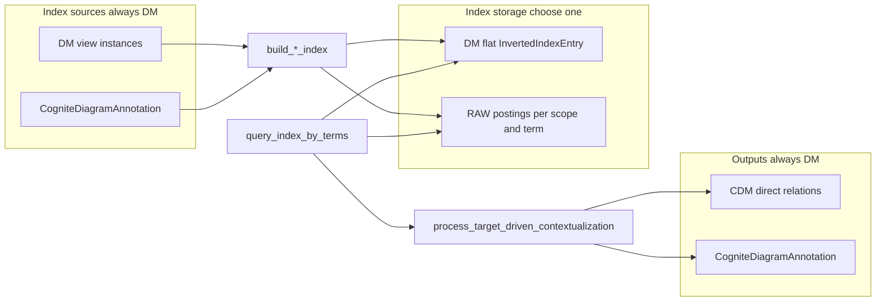
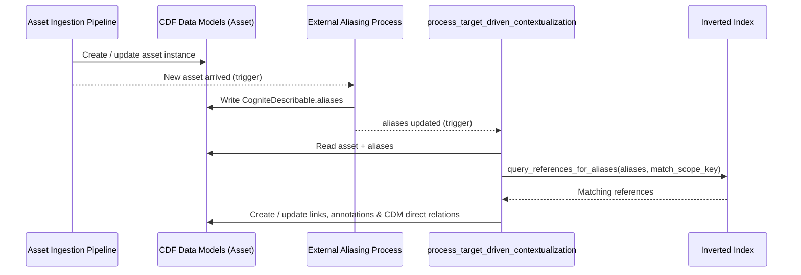
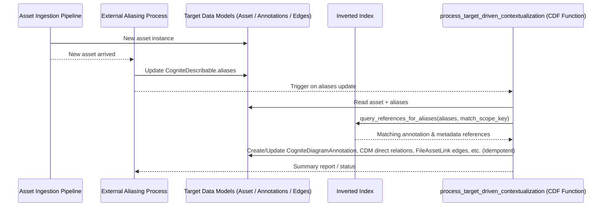

# Function Specification: Inverted Index for Contextualization Support in Cognite Data Fusion (CDF)

**Version:** 2.3  
**Date:** 2026-06-25  
**Author:** Darren Downtain 
**Purpose:** Define the functions, data model, and implementation approach for building and using custom inverted indexes to support contextualization scoring, missing tag detection (pattern vs standard diagram detection), and **Target-Driven Contextualization**.

---

## 1. Overview and Business Objectives

Cognite Data Fusion (CDF) provides powerful native capabilities for diagram parsing (tag detection mode and pattern/full diagram parsing mode), entity matching, and data modeling with `CogniteDescribable` (including `aliases` and `tags`). However, for high-performance, custom lookups across metadata references and diagram annotations (especially distinguishing standard vs. pattern mode detections), a dedicated **inverted index** layer is required.

### Supported Use Cases
1. **Contextualization Scoring**: Compute scores for diagrams/files based on **annotation matches** (standard vs pattern overlap, confidence-weighted detection rate, asset linkage) and **metadata index matches** (asset tags and file references found in domain DM views). Produces separate annotation and metadata score components plus a combined `overall_score`.
2. **Detection Mode Delta Lists**: Bidirectional comparison of standard tag detection vs pattern (full diagram parsing) extractions on the same file:
   - **Missing tags** (`get_pattern_not_in_standard_delta`): Tags found in pattern mode but not in standard detection — review and metadata enrichment.
   - **Pattern improvement candidates** (`get_standard_not_in_pattern_delta`): Tags found in standard detection but not in pattern extraction — feed back into pattern libraries/rules to improve pattern hit rate.
3. **Target-Driven Contextualization (Primary Driver)**: 
   - New **assets** arrive in CDF via the data ingestion pipeline.
   - An **external aliasing process** (separate from this inverted-index system) is triggered by the arrival of new assets, computes aliases, and writes them to `CogniteDescribable.aliases` (and related fields) on the asset instance.
   - **Target-driven contextualization runs when the external aliasing process updates `aliases`** — not on raw asset ingest alone. The inverted-index lookup uses the freshly populated aliases as query terms.
   - Query the inverted index to discover existing **annotation references** (from processed diagrams) and **metadata references** (other DM instances whose fields mention the asset tag or file name).
   - Automatically (or semi-automatically) create/update `CogniteDiagramAnnotation`, custom annotation instances, edges/links (e.g., `FileAssetLink`, `AssetAssetRelation`), and **CDM direct relations** on forward properties (`CogniteFile.assets`, `CogniteEquipment.asset` / `CogniteEquipment.files`, `CogniteTimeSeries.assets` / `CogniteTimeSeries.equipment`; reverse properties such as `CogniteAsset.files`, `CogniteAsset.equipment`, `CogniteAsset.timeSeries`, `CogniteFile.equipment`, and `CogniteEquipment.timeSeries` are system-maintained) in the appropriate data models.
   - Enables reactive, "pull-based" contextualization once aliases are available for a new asset.

The inverted index maps **terms** (asset tags, file names/references, detected annotation values) → **references** (the DM instance or annotation where the term was found), scoped by **match context** (site, unit, area, etc.) so reused tags across units at the same site do not cross-match incorrectly.

Index rows are stored in either a DM `InvertedIndexEntry` container (recommended for production) or RAW scoped postings tables (alternate); see §2 for `INDEX_STORAGE_CONFIG.backend` selection. Source reads and contextualization outputs always use data modeling regardless of index storage backend.

### 1.1 Pilot deployment defaults (shipped implementation)

The accelerator module ships with pilot defaults aligned to CDM core views and RAW index storage. Override via `default.config.yaml` / Toolkit config merge.

| Decision | Pilot setting |
|----------|---------------|
| Index storage | **RAW** (`db_contextualization_idx`, scoped postings) |
| Scope | **Disabled** OOTB → single `global` partition (`scope.enabled: false`, `fallback_scope_key: global`) |
| Metadata sources | `CogniteFile`, `CogniteEquipment`, `CogniteTimeSeries` — `name` + `description` (regex tag extraction on both; **`default.config.yaml` overrides** `inverted_index/config.py` when present) |
| Diagram annotations | CDM **edge** `CogniteDiagramAnnotation` — `startNodeText`, `confidence`, `status`, `startNodePageNumber`, bbox via `startNode*Min/Max` |
| Diagram index reference | **`reference_type: CogniteFile`**; annotation identity in `additional_metadata.annotation_external_id` / `detection_key` |
| Target-driven trigger | **Instance subscription** on `aliases` changes (`fn_idx_handle_subscription` / `handle_aliases_subscription_event`) |
| CDM link writes | All five link keys enabled; per-link `write_modes: [direct_relation]`; `allowed_annotation_statuses: [Suggested, Approved]` |
| Source / index reads | **`instances.query`** with server-side filters (`inverted_index/dm_query.py`); RAW steady-state term lookup via `rows.retrieve` |

**Index migration:** After upgrading to file-as-reference diagram entries, run `python module.py migrate` (purge RAW partitions + full rebuild). Legacy rows with `reference_type: CogniteDiagramAnnotation` are not read.

### 1.2 Configuration loading

Runtime config is assembled by `build_runtime_config()` (`inverted_index/config_loader.py`):

| Source | Keys / env vars | Merge behaviour |
|--------|-----------------|-----------------|
| `default.config.yaml` | `index_storage_backend`, `index_raw_database`, `scope`, `index_field_config`, `annotation_index_config`, `subscription`, `direct_relation_config`, `instance_spaces` | Shallow merge for most keys; **deep merge** for `direct_relation_config.links.*` and `edge_views` |
| Code defaults | `inverted_index/config.py` | Base values when YAML omits a key |
| Environment | `INDEX_STORAGE_BACKEND`, `INDEX_RAW_DATABASE`, `INDEX_INSTANCE_SPACES` (comma-separated) | Override YAML |

`scope_levels` in YAML (legacy) sets `scope.levels` and forces `scope.enabled: true`.

When `default.config.yaml` defines `index_field_config`, it **replaces** the code default list for metadata sources (shallow merge). The shipped pilot YAML applies regex extraction to `name` and `description` on all three CDM views and indexes `CogniteFile.description` under both `asset_metadata` and `file_metadata`.

CDF Function handlers and the local CLI both call `build_runtime_config()` so deploy-time YAML and code defaults stay aligned.

---

## 2. Recommended Architecture & Data Model

The inverted index supports two **index storage backends**. Choose one at deploy time via `INDEX_STORAGE_CONFIG.backend`. **Recommended production default is `dm`.** The shipped pilot uses **`raw`** with scope disabled. RAW scoped postings is also appropriate when a DM index container cannot be deployed.

| Backend | Section | When to use |
|---------|---------|-------------|
| **DM `InvertedIndexEntry`** | §2.1 (**recommended default**) | Production index; governance; indexed `normalized_term` + `match_scope_key` filters; aligns with target-driven and scoring query shapes |
| **RAW scoped postings** | §2.2 (alternate) | Cannot deploy DM container; team already uses RAW for pipeline state; scope-partitioned tables stay under ~100k–500k rows per partition |

```python
INDEX_STORAGE_CONFIG = {
    "backend": "dm",  # "dm" | "raw" — recommended "dm"; pilot ships "raw"
    "dm": {"space": "contextualization_idx", "view": "InvertedIndexEntry", "version": "v1"},
    "raw": {
        "database": "db_contextualization_idx",
        "table_template": "inverted_index__{scope_slug}",  # partition by match_scope_key; §4.7.1
        "row_key_template": "{match_scope_key}::{normalized_term}",
        "postings_column": "POSTINGS_JSON",
        "registry_table": "inverted_index__registry",  # match_scope_key → partition_table; §4.7.1
    },
}
```

Operational policies when `backend = "raw"`: `RAW_SCOPE_POLICY`, `RAW_POSTINGS_POLICY`, `FRESHNESS_CONFIG`, `TARGET_DRIVEN_DEDUPE_CONFIG` (§4.7).

**Reads** of source data (DM views, `CogniteDiagramAnnotation`) and **writes** of contextualization results (annotations, CDM direct relations — §2.7) always use **data modeling**, regardless of index storage backend.

Sections **§2.3–§2.7** apply to both backends unless noted.



### 2.1 Storage: CDF Data Modeling (Recommended Default)
Use a dedicated **space** (e.g., `contextualization_idx` or project-specific) for scalability, query performance, governance, and integration with CDF Workflows/Functions. This is the **default** when `INDEX_STORAGE_CONFIG.backend = "dm"`.

**Core Container**: `InvertedIndexEntry` (in `contextualization_idx` space)

**Properties** (all indexed where beneficial for filtering/query performance):
- `term` (String, **indexed**): The raw or lightly normalized key (e.g., "P-101A", "pump-101").
- `normalized_term` (String, **indexed**): Canonical form for fast exact/prefix matching (e.g., lowercased, alphanum only or aligned with CDF entity matching tokenizer `\p{L}+|[0-9]+`).
- `original_value` (String): Original string as extracted from metadata or annotation.
- `source_type` (String/Enum): Category of the indexed term and where it was found. One of:
  - `asset_metadata` — an **asset tag** (or asset-identifying string) found in a metadata field on a DM instance. The instance is typically **not** the asset itself; it is another view (equipment record, work order, custom entity, etc.) whose properties reference assets by tag.
  - `file_metadata` — a **file name or file reference** found in a metadata field on a DM instance. The instance is typically **not** the file itself; it is another view whose properties reference files by name or identifier.
  - `diagram_annotation_pattern` (from pattern mode / full diagram parsing detections)
  - `diagram_annotation_standard` (from standard tag detection mode)
  - `other_annotation` (future extensibility)
- `source_property` (String, **indexed**): Property path on the **containing** DM instance from which the term was read (e.g., `relatedEquipmentTag`, `sourceDrawing`, `metadata.drawingNumber`). For diagram annotations (file-as-reference), use `detection:{detection_key}` (§2.4.1) — not the raw annotation text field name. Enables multiple distinct index rows for the same term on the same file when detections differ by page/bbox.
- `reference_external_id` (String): External ID of the **containing** object where the term was found — the DM instance whose metadata held the asset tag or file reference, or the **parent file** external id for diagram sources (file-as-reference).
- `reference_space` (String): Space of the containing instance (default: `cdf_cdm` or the view's space).
- `reference_type` (String): View of the **containing** instance (e.g., `MyCustomEquipment`, `MaintenanceWorkOrder`, `CogniteFile` for diagram detections) — not the type of asset/file the term identifies.
- `match_scope_key` (String, **indexed**): Canonical scope identifier for match isolation within a DM space — e.g., `site:Rotterdam|unit:U100`. Required when scope config is enabled. All index lookups for contextualization, scoring, and target-driven linking **must filter on this field** (in addition to `normalized_term`) to avoid false positives when the same tag is reused across units, areas, or plants at one site.
- `match_scope` (Json, optional): Structured scope dimensions used to build `match_scope_key`, e.g. `{"site": "Rotterdam", "unit": "U100", "area": "Crude"}` — for display, audit, and hierarchical scope rules.
- `additional_metadata` (Json): Rich context. Shape depends on `source_type`:
  **Metadata entries** (`asset_metadata`, `file_metadata`) — term is the asset tag or file reference; reference fields point at the instance that **contains** the mention, e.g.:
  ```json
  {
    "source_view": "MyCustomEquipment",
    "source_view_space": "my_dm_space",
    "match_scope": {"site": "Rotterdam", "unit": "U100"},
    "term_kind": "asset_tag",
    "extract_mode": "regex",
    "match_start": 4,
    "match_end": 10,
    "occurrence_count": 2
  }
  ```
  For regex extractions where the same term matched multiple times, store span of the **first** match plus `occurrence_count`. Optionally include `match_spans` (all `{start, end}` pairs) when audit/detail is needed.
  **Diagram annotation entries**, e.g.:
  ```json
  {
    "page": 3,
    "shape": "rectangle",
    "vertices": [
      {"x": 0.12, "y": 0.45},
      {"x": 0.18, "y": 0.45},
      {"x": 0.18, "y": 0.52},
      {"x": 0.12, "y": 0.52}
    ],
    "bbox": [0.12, 0.45, 0.18, 0.52],
    "confidence": 0.92,
    "detection_mode": "pattern",
    "extracted_text": "P-101A",
    "linked_asset_extid": "ASSET_P101",
    "symbol_type": "pump",
    "status": "Suggested"
  }
  ```
  For diagram annotations, store **both** the full `vertices` array and a `bbox` in `additional_metadata`:
  - **`vertices`**: Complete array from the source annotation region (each element `{"x": float, "y": float}` in normalized page coordinates). Preserve the full array for accurate overlay/review UI and round-trip to `CogniteDiagramAnnotation`.
  - **`bbox`**: Axis-aligned bounding box as `[xMin, yMin, xMax, yMax]` in the same normalized coordinates. Use the value from the source annotation when present; otherwise derive from vertex min/max for fast filtering and spatial queries.
- `created_time`, `updated_time` (Timestamp, auto-managed or explicit).
- `build_job_id` (String, optional): For traceability of which build/rebuild created/updated the entry.

**Constraints**:
- Unique constraint on combination of (`normalized_term`, `source_type`, `reference_external_id`, `source_property`) to support idempotent upserts, **deduplication** (at most one row per term per property per containing instance), and distinct rows when the same term appears in different fields on the same instance.
- Or use deterministic `external_id` for the instance: `f"iie_{hash(normalized_term)}_{source_type}_{reference_external_id}_{source_property}"` (truncated hash).

**View**: `InvertedIndexEntryView` (projects container + any computed fields, e.g., `match_score` placeholder).

**Why this model?**
- Fast `IN` / `EQ` / `PREFIX` filters on `normalized_term`, `source_type`, `source_property`, and **`match_scope_key`**.
- Same term can appear across multiple sources and **scopes** (e.g., `P-101A` in unit U100 vs U200) as distinct index rows without ambiguous lookups when queries include scope.
- Rich `additional_metadata` avoids needing separate joins for common use cases (scoring, deltas).
- Easy to delete/rebuild subsets (filter by `source_type` or `build_job_id`).
- Scales with CDF DM limits; for very high cardinality, consider sharding by first letter or separate containers per major `source_type`.
- Graph-friendly: Can later add edges from `SearchTerm` nodes if advanced traversal needed.

**Alternative (if graph traversal preferred)**: 
- `SearchTerm` node (unique on `normalized_term`) + directed edges `SearchTerm --references--> Target` (with properties on edge for `source_type`, `source_property`, `additional_metadata`, etc.). Use for complex graph queries later.

### 2.2 Storage: CDF RAW Tables — Scoped Postings (Alternate)

Use when `INDEX_STORAGE_CONFIG.backend = "raw"`. **Do not** use flat row-per-reference RAW tables or full-table scan as the primary query path.

**Read model:** one RAW row per lookup key `(match_scope_key, normalized_term)`, value = array of **postings** (same logical fields as DM `InvertedIndexEntry` minus the key columns).

**Row key:**

```
{match_scope_key}::{normalized_term}
```

Example: `site:Rotterdam|unit:U100::p101a`

**Partitioning (required for scale):**

- **One RAW table per `match_scope_key`** (slugged), e.g. `inverted_index__rotterdam_u100`, configured via `table_template`. Naming algorithm and 64-char limit: §4.7.1.
- Target-driven query touches **one partition** (scope from incoming asset).
- Avoid a single global table — term lookup is `retrieve` per alias, but partition bounds row count per scope.
- RAW backend requires scope granularity of at least **site + unit** (§4.7.2).

**Columns:**

| Column | Purpose |
|--------|---------|
| `RECORD_KIND` | `index_postings` |
| `LOOKUP_KEY` / `NORMALIZED_TERM` | normalized term (redundant with key for debugging) |
| `MATCH_SCOPE_KEY` | scope (redundant with table partition) |
| `POSTINGS_JSON` | JSON array of posting objects |
| `OVERFLOW_KEYS` | Optional JSON array of spill row keys when `postings_count` exceeds `RAW_POSTINGS_POLICY.max_postings_per_row` (§4.7.4) |
| `UPDATED_AT` | ISO timestamp |
| `BUILD_JOB_ID` | optional traceability |

**Posting object** (each element in `POSTINGS_JSON`):

```json
{
  "term": "P-101A",
  "original_value": "P-101A",
  "source_type": "diagram_annotation_pattern",
  "source_property": "detection:page3:bbox_e5f6g7h8:p101a",
  "reference_external_id": "FILE_PID_12",
  "reference_space": "cdf_cdm",
  "reference_type": "CogniteFile",
  "additional_metadata": {
    "annotation_external_id": "idx_ann_FILE_PID_12_3_...",
    "detection_key": "page3:bbox_e5f6g7h8:p101a",
    "page": 3,
    "confidence": 0.92,
    "bbox": [0.12, 0.45, 0.18, 0.52]
  }
}
```

**Upsert / merge:** on build, `retrieve` existing row → `merge_postings` by dedupe key `(source_type, reference_external_id, source_property)`; for `diagram_annotation_*` source types, extend with `additional_metadata.detection_key` (or `annotation_external_id`) so multiple detections on the same file and term do not collapse.

**Query (`query_index_by_terms`):**

1. Resolve `match_scope_key` from caller.
2. Select partition table for that scope (`resolve_raw_partition_table`).
3. Normalize input terms; dedupe.
4. For each term: `client.raw.rows.retrieve(db, table, f"{scope}::{term}")`.
5. Parse `POSTINGS_JSON`; filter `source_types`, `min_confidence` in memory.
6. Return same dict shape as DM query examples (flatten postings to entry list).

**RAW API constraints:**

- No key-prefix or column filters on `list` — only `limit`, `cursor`, `columns` (projection), `minLastUpdatedTime` / `maxLastUpdatedTime`.
- `retrieve(key)` for steady-state term lookup; `list` + scan only for partition rebuild/purge/admin.

#### Storage adapter contract

Both backends expose the same interface and return identical entry dicts from `query_index_by_terms`:

- `upsert_index_entries(entries: list[dict]) -> dict`
- `query_index_by_terms(terms, match_scope_key, source_types, ...) -> list[dict]`
- `delete_index_subset(scope, source_type=None, build_job_id=None) -> int`

**DM path:** `dm.instances.apply` for writes; `dm.instances.query` with server-side filters and cursor pagination for reads (§2.1). Implementation: `inverted_index/dm_query.py`.

**RAW path:**

- Build: group extracted entries by `(match_scope_key, normalized_term)` → merge into postings → upsert row.
- Query: partition resolve + per-term `retrieve` (steps above).

Helpers:

- `build_raw_postings_row_key(scope, normalized_term) -> str`
- `merge_postings(existing, incoming) -> list[dict]`
- `posting_from_index_entry(entry: dict) -> dict`
- `flatten_postings_to_entries(postings: list[dict], lookup_meta) -> list[dict]`
- `resolve_raw_partition_table(match_scope_key, config) -> str` — deterministic partition name; see §4.7.1 (64-char limit, slug + hash, registry).
- `scope_slug(match_scope_key) -> str` — lowercase slug for `table_template`; see §4.7.1.

### 2.3 Metadata Reference Indexing (Asset Tags & File Names in Other Views)

`asset_metadata` and `file_metadata` index **cross-references embedded in DM metadata** — not terms extracted from `CogniteAsset` or `CogniteFile` records as primary sources.

| `source_type` | What `term` represents | What `reference_*` points to |
|---|---|---|
| `asset_metadata` | An asset tag or asset-identifying string found in a field (e.g., `"P-101A"`) | The DM instance whose metadata contains that tag (e.g., an equipment or work-order record) |
| `file_metadata` | A file name or file reference found in a field (e.g., `"DWG-12345.pdf"`, `"PID-Area-12"`) | The DM instance whose metadata contains that file reference |

**Example**: Equipment instance `EQ-1001` (view `MyCustomEquipment`) has `relatedEquipmentTag: "P-101A"`. The index stores:

| Field | Value |
|---|---|
| `term` | `P-101A` |
| `source_type` | `asset_metadata` |
| `source_property` | `relatedEquipmentTag` |
| `reference_external_id` | `EQ-1001` |
| `reference_type` | `MyCustomEquipment` |
| `match_scope_key` | `site:Rotterdam\|unit:U100` |

When target-driven contextualization ingests asset `P-101A` **in unit U100**, a scoped lookup finds this row; the same tag in unit U200 does not match unless scope aligns.

Terms may be read from **any property on any configured DM view** — custom equipment, maintenance, document registry, etc. Projects define which views, properties, and term kinds participate via an **index field configuration**.

**Index field configuration** (per project; stored in code, config file, or DM container):

```python
# Illustrative — scan domain views; classify each property by term kind
INDEX_FIELD_CONFIG = [
    {"view": "MyCustomEquipment", "view_space": "my_dm_space", "properties": [
        {"path": "relatedEquipmentTag", "source_type": "asset_metadata"},
        {"path": "parentLineId", "source_type": "asset_metadata"},
        {"path": "notes", "source_type": "asset_metadata",
         "extract_mode": "regex",
         "extract_pattern": r"\b[A-Z]{1,2}-\d{3,4}[A-Z]?\b"},
        {"path": "sourceDrawing", "source_type": "file_metadata"},
        {"path": "metadata.drawingNumber", "source_type": "file_metadata"},
        {"path": "description", "source_type": "file_metadata",
         "extract_mode": "regex",
         "extract_pattern": r"\b[A-Z]{2,5}-\d{4,6}(?:\.[a-z]+)?\b"},
    ]},
    {"view": "MaintenanceWorkOrder", "view_space": "ops_space", "properties": [
        {"path": "referencedEquipmentTag", "source_type": "asset_metadata"},
        {"path": "attachedDrawingRef", "source_type": "file_metadata"},
        {"path": "workDescription", "source_type": "asset_metadata",
         "extract_mode": "regex",
         "extract_pattern": r"\b[A-Z]{1,2}-\d{3,4}[A-Z]?\b"},
    ]},
    {"view": "EngineeringDocument", "view_space": "my_dm_space", "properties": [
        {"path": "referencedTags", "source_type": "asset_metadata"},
        {"path": "supersededByFile", "source_type": "file_metadata"},
    ]},
]
```

**Term extraction modes** (per property in config):

| `extract_mode` | Behavior |
|---|---|
| `whole_value` (default) | Treat the entire property value (after type coercion) as a single candidate term |
| `regex` | Apply `extract_pattern` to the string form of the value; emit **one candidate term per regex match**, then deduplicate (see below) |

- `extract_pattern` (String, required when `extract_mode="regex"`): Python-compatible regular expression. Use capturing groups only when a subset of the match should become the term; otherwise the full match is used.

**Multi-term extraction and deduplication**

Extraction may yield multiple distinct terms from one property value (regex matches, list elements). Before upsert, **deduplicate by `normalized_term`** within the scope of (`source_type`, `reference_external_id`, `source_property`):

| Input | Extracted terms (before dedupe) | Index rows (after dedupe) |
|---|---|---|
| `notes = "See P-101A and P-102B"` (regex) | `P-101A`, `P-102B` | **2 rows** (distinct terms) |
| `notes = "P-101A and P-101A again"` (regex) | `P-101A`, `P-101A` | **1 row** (`occurrence_count: 2`) |
| `referencedTags = ["P-101A", "P-102B"]` (list) | `P-101A`, `P-102B` | **2 rows** |
| `referencedTags = ["P-101A", "P-101A"]` (list) | `P-101A`, `P-101A` | **1 row** |

Deduplication rules (implement in `dedupe_extracted_terms(...)` after `extract_terms_from_property`):
1. Group candidates by `normalize_term(term)`.
2. Emit **one** `InvertedIndexEntry` per unique `normalized_term` per property per containing instance.
3. When merging duplicates, prefer the **first** occurrence for `term`, `original_value`, and span metadata; set `additional_metadata.occurrence_count` to the total number of extractions that normalized to the same key.
4. Optionally populate `additional_metadata.match_spans` with all `{start, end}` pairs from regex deduplication for review/audit.

**Example (regex, multiple distinct terms)**: `notes = "See P-101A and P-102B on line L-200"` → two rows sharing `source_property` and `reference_*`, differing in `term` / `normalized_term`.

**Not in scope for `asset_metadata` / `file_metadata`**: indexing an asset's own `name`/`tags` or a file's own `name` as self-referential records. Those are identity fields on the target entity, not cross-references found in other views. (Diagram detections and annotation indexing remain separate via `diagram_annotation_*` source types.)

**Pilot exception:** The shipped pilot scans `CogniteFile`, `CogniteEquipment`, and `CogniteTimeSeries` `name`/`description` fields to extract embedded asset tags via regex — treating CDM core instances as *containers* of tag-like strings in free text, not as self-identity index rows. Production projects should prefer custom domain views (equipment records, work orders) per the illustrative `INDEX_FIELD_CONFIG` above.

**Pilot `INDEX_FIELD_CONFIG` (from `default.config.yaml`):**

```yaml
index_field_config:
  - view: CogniteFile
    view_space: cdf_cdm
    properties:
      - { path: name, source_type: asset_metadata, extract_mode: regex, extract_pattern: '\b[A-Z]{1,2}-\d{3,4}[A-Z]?\b' }
      - { path: description, source_type: asset_metadata, extract_mode: regex, extract_pattern: '\b[A-Z]{1,2}-\d{3,4}[A-Z]?\b' }
      - { path: description, source_type: file_metadata, extract_mode: regex, extract_pattern: '\b[A-Z]{1,2}-\d{3,4}[A-Z]?\b' }
  - view: CogniteEquipment
    view_space: cdf_cdm
    properties:
      - { path: name, source_type: asset_metadata, extract_mode: regex, ... }
      - { path: description, source_type: asset_metadata, extract_mode: regex, ... }
  - view: CogniteTimeSeries
    view_space: cdf_cdm
    properties:
      - { path: name, source_type: asset_metadata, extract_mode: regex, ... }
      - { path: description, source_type: asset_metadata, extract_mode: regex, ... }
```

**Property path rules**:
- Dot notation for nested JSON/map properties (e.g., `metadata.drawingNumber`).
- Each configured property is read from the instance; extractors produce zero or more candidate terms, then deduplication yields zero or more **unique** terms per property.

**Supported field value types** (implementation must handle):

| DM type | Extraction behavior |
|---|---|
| `text` / string | `whole_value`: one candidate term if non-empty. `regex`: one candidate per match; then dedupe by `normalized_term` |
| `text[]` / list of strings | One candidate per element (`additional_metadata.list_index` on each); dedupe across elements by `normalized_term` |
| JSON / map | Follow configured dot paths only; do not blindly flatten entire JSON blobs |
| Direct relation / `InstanceId` | `whole_value` only: index `external_id` (and optionally a configured display-name property on the linked instance) |
| Numeric / boolean | Coerce to string; index only when configured explicitly (`whole_value`) |

**Build behavior**:
- For each configured view: enumerate instances via `dm.instances.query` (`NodeResultSetExpression` / `EdgeResultSetExpression`) with server-side filters (view `HasData`, instance space, optional `lastUpdatedTime` watermark, file start-node filter for annotations).
- For each instance × configured property: resolve `match_scope_key` from containing instance (§2.6) → extract → dedupe → upsert via `upsert_index_entries` (DM `InvertedIndexEntry` rows or RAW postings merge per §2.2).

**Query behavior**: Lookups match on `normalized_term` **and** `match_scope_key` (when scope is configured). Unscoped queries are discouraged in multi-unit sites — they may return cross-unit false positives. Callers may additionally post-filter on `source_type`, `source_property`, or `reference_type`.

### 2.4 Integration Points
- **Reads from**: Configured DM view instances (custom equipment, work orders, document registries, etc.) for `asset_metadata` / `file_metadata`; `CogniteDiagramAnnotation` (or custom annotation views) for diagram sources; legacy `Annotation` API where needed. Does **not** treat `CogniteAsset` / `CogniteFile` as primary scan targets for metadata source types unless explicitly configured for cross-reference fields only.
- **DM query API**: Source enumeration and DM index lookups use **`instances.query`** with server-side filters (`NodeResultSetExpression` / `EdgeResultSetExpression`, cursor pagination) — see `inverted_index/dm_query.py`. RAW steady-state term lookup remains `rows.retrieve` per `(match_scope_key, normalized_term)`.
- **Writes to**: The index storage backend (DM §2.1 or RAW postings §2.2) + target data models (`CogniteDiagramAnnotation`, custom link edges/containers for `FileAssetLink`, `AssetAnnotation`, etc.) and **CDM direct relations** on forward properties for file, asset, equipment, and time series (see §2.7).
- **Triggers (index build)**: CDF Functions (`fn_idx_build_metadata`, `fn_idx_build_annotations`), Workflows, or Extraction Pipelines on schedules, diagram-processing completion, or targeted rebuilds.
- **Triggers (target-driven contextualization)**: Invoked **after the external aliasing process updates `aliases`** on an asset (see §3.3). Primary pilot path: CDF instance subscription → `fn_idx_handle_subscription` → `handle_aliases_subscription_event`. The aliasing process itself is triggered by the arrival of new assets; target-driven is downstream of alias population, not a direct subscriber to raw ingest events.

### 2.4.1 CDM `CogniteDiagramAnnotation` as edge

Production CDM stores diagram detections as **edges** from `CogniteFile` (start node) to an asset or equipment (end node). Configure via `ANNOTATION_INDEX_CONFIG`:

```python
ANNOTATION_INDEX_CONFIG = {
    "view": "CogniteDiagramAnnotation",
    "view_space": "cdf_cdm",
    "version": "v1",
    "instance_type": "edge",  # required for CDM
    "text_property": "startNodeText",
    "confidence_property": "confidence",
    "status_property": "status",
    "page_property": "startNodePageNumber",
    "bbox_properties": ["startNodeXMin", "startNodeYMin", "startNodeXMax", "startNodeYMax"],
    "detection_mode_property": None,  # optional explicit mode field on the edge
    "detection_mode_tags": {
        "pattern": ["pattern", "pattern_mode"],
        "standard": ["standard", "tag", "tag_detection"],
    },
    "default_detection_mode": "pattern",
    "index_store_vertices": False,  # default: bbox/page/confidence only in index; vertices on DM edge
}
```

**Detection mode inference** (`detection_mode_from_annotation`): (1) configured `detection_mode_property` when present; (2) `tags` list matching `detection_mode_tags`; (3) external-id heuristics (`pat` / `std` / `pattern`); (4) `default_detection_mode`.

**Index entry shape (file-as-reference):** `reference_type` / `reference_external_id` / `reference_space` identify the **parent file** (`start_node`). Annotation identity is stored in `additional_metadata.annotation_external_id` (real edge id when present, or deterministic `idx_ann_*` for index-only detections). `source_property` is `detection:{detection_key}` where `detection_key = page{N}:bbox_{hash}:{term_prefix}` — enabling multiple detections of the same term on one file without merge collapse.

**Pattern-mode index-only detections:** Pattern pipelines may persist detections to the inverted index without promoting every hit to a DM `CogniteDiagramAnnotation` edge. Use `pattern_detection_to_index_entry(...)` with the same file-as-reference shape; target-driven can still create edges/annotations via `write_modes` including `diagram_annotation`.

### 2.5 Target-Driven Orchestration (External Aliasing → Contextualization)

Expected production sequence for new assets:



**Contract with external aliasing**:
- **Aliasing owns** alias generation and the `aliases` field write on the asset.
- **Target-driven owns** inverted-index lookup and link/annotation creation; it **reads** `aliases` only after aliasing completes.
- **Trigger point**: `process_target_driven_contextualization` must be invoked when aliasing finishes updating `aliases` (same transaction callback, CDF Function webhook from aliasing, Workflow step, or subscription filtered to `aliases` changes on asset views). Do **not** rely solely on asset create events — aliases may not exist yet at ingest time.

**Optional file / equipment / time series paths**: The same pattern may apply to files, equipment, or time series when a separate aliasing step populates `aliases` on those instances; primary driver in this spec is **new assets → aliasing → target-driven**.

### 2.6 Contextualization Scope (Match Isolation)

DM **space** (`reference_space`, index container space) is necessary but often **not sufficient** for correct matching. Tags such as `P-101A` are frequently **reused across units, areas, or plants at the same site**. Index entries and queries must carry a finer **`match_scope_key`** so match determination is isolated to the same operational context.

**Scope dimensions** (project-defined; typical hierarchy):

| Dimension | Example | Notes |
|---|---|---|
| `site` | `Rotterdam` | Top-level facility / site |
| `unit` | `U100`, `CDU` | Process unit — common reuse boundary for tags |
| `area` | `Crude`, `TankFarm` | Optional sub-unit |
| `plant` | `Refinery-East` | Optional; may substitute for or complement `site` |

Projects configure which dimensions participate and how they are populated via **`SCOPE_CONFIG`** (alongside `INDEX_FIELD_CONFIG`):

```python
SCOPE_CONFIG = {
    "levels": ["site", "unit"],  # ordered; all required levels must resolve or scope is invalid
    "scope_key_template": "site:{site}|unit:{unit}",  # canonical match_scope_key format
    # Per view: where each scope level is read on the containing instance (index build + query).
    # Preferred shape: dict[level_name] -> property path OR ordered fallback path list.
    "resolve_from": {
        "MyCustomEquipment": {
            "site": ["siteId", "metadata.site"],
            "unit": ["unitId", "metadata.unit"],
        },
        "MaintenanceWorkOrder": {
            "site": "site",
            "unit": ["metadata.unit", "unitCode"],
        },
        "CogniteDiagramAnnotation": {
            "site": ["metadata.site", "siteId"],
            "unit": ["metadata.unit", "unitId"],
        },
        "CogniteFile": {
            "site": ["metadata.site", "siteExternalId"],
            "unit": ["metadata.unit", "unitCode"],
        },
        "CogniteAsset": {  # target-driven query side
            "site": ["metadata.site", "siteId", "parentSite"],
            "unit": ["metadata.unit", "unitCode"],
        },
        "CogniteEquipment": {
            "site": ["metadata.site", "siteId"],
            "unit": ["metadata.unit", "unitId"],
        },
        "CogniteTimeSeries": {
            "site": ["metadata.site", "siteId"],
            "unit": ["metadata.unit", "unitId"],
        },
    },
    # Optional: merged under each view entry; view-specific keys override.
    "resolve_from_default": {
        "site": ["metadata.site", "siteId"],
        "unit": ["metadata.unit", "unitId"],
    },
    "annotation_scope_via_linked_file": True,  # when a level is still empty, read from linked CogniteFile (diagram annotations)
    "strict_scope": True,  # if True, skip indexing / querying when scope cannot be resolved
}
```

#### `resolve_from` shapes (per view)

Each `SCOPE_CONFIG.resolve_from[view]` entry maps **scope level names** (keys in `levels`) to one or more **DM property paths** on the containing instance. Implement `normalize_resolve_from(view_config, levels) -> dict[str, list[str]]` once at config load.

| Form | Example | Normalized to |
|------|---------|---------------|
| **Named dict** (preferred) | `{"site": ["metadata.site", "siteId"], "unit": "unitId"}` | `{"site": ["metadata.site", "siteId"], "unit": ["unitId"]}` |
| **Positional list** (shorthand) | `["siteId", "unitId"]` with `levels: ["site", "unit"]` | `{"site": ["siteId"], "unit": ["unitId"]}` — index `i` → `levels[i]` |
| **Single path string** | `"metadata.site"` | `["metadata.site"]` — one candidate, no fallback |

**Rules:**

1. Every key in `levels` MUST appear in the normalized `resolve_from` entry for that view after merging with optional `resolve_from_default` (view-specific keys override defaults).
2. Property paths use the same dot notation as `INDEX_FIELD_CONFIG` (e.g. `metadata.unit`).
3. Values are coerced to non-empty strings; whitespace-only counts as empty.

#### Per-dimension fallback chains

When a level maps to a **list** of paths, `resolve_scope_level(instance, paths)` returns the **first non-empty** value:

```python
def resolve_scope_level(instance: dict, paths: list[str]) -> tuple[str | None, str | None]:
    """Return (value, winning_path) or (None, None) when all candidates are empty."""
    for path in paths:
        value = read_property_path(instance, path)  # dot-path walk; direct relation -> external_id
        if value is not None and str(value).strip():
            return str(value).strip(), path
    return None, None
```

**Example** (`CogniteAsset` with `site: ["metadata.site", "siteId", "parentSite"]`):

| `metadata.site` | `siteId` | `parentSite` | Resolved `site` | `winning_path` |
|-----------------|----------|--------------|-----------------|----------------|
| `"Rotterdam"` | `"RTM"` | `"RTM-OLD"` | `"Rotterdam"` | `metadata.site` |
| `""` | `"RTM"` | `"RTM-OLD"` | `"RTM"` | `siteId` |
| missing | missing | `"RTM-OLD"` | `"RTM-OLD"` | `parentSite` |
| missing | missing | missing | — (level unresolved) | — |

Optional audit: when `additional_metadata` or scope resolution diagnostics are enabled, store `match_scope_sources: {"site": "siteId", "unit": "metadata.unit"}` on the index row or in build logs (which path won per level).

**Conflict policy:** Only one value per level is used (first non-empty in list order). The spec does **not** merge or validate agreement across multiple non-empty candidates — put the preferred source first in the list.

#### `resolve_match_scope` algorithm

```python
def resolve_match_scope(
    instance: dict,
    view_external_id: str,
    scope_config: dict,
    *,
    client=None,
    linked_file: dict | None = None,
) -> tuple[str | None, dict]:
    """
  1. Load normalized resolve_from for view_external_id (merge `resolve_from_default` then view entry).
  2. For each level in scope_config["levels"] (in order):
       a. candidates = resolve_from[level]
       b. (value, path) = resolve_scope_level(instance, candidates)
       c. If value is empty and linked_file is set and annotation_scope_via_linked_file:
            (value, path) = resolve_scope_level(linked_file, candidates)
       d. If value is still empty: level failed.
  3. If any required level failed:
       - strict_scope=True  -> return (None, {})
       - strict_scope=False -> omit failed levels; set scope_fallback on callers
  4. Build match_scope dict from resolved level values; match_scope_key = build_scope_key(match_scope, scope_config).
  5. Return (match_scope_key, match_scope). Values in match_scope are normalized (strip; optional casefold per project policy).
    """
```

**Cross-instance scope** (beyond annotations → linked file): only `annotation_scope_via_linked_file` is defined today. Other views do not walk relations for scope; add explicit `resolve_from` paths (or future `resolve_via` extensions) instead of implicit graph traversal.

**Index build**: For each indexed instance, `resolve_match_scope(instance, view, scope_config)` → `(match_scope_key, match_scope dict)`. Store on every `InvertedIndexEntry`. Diagram annotations: pass `linked_file` when `annotation_scope_via_linked_file` is enabled and annotation-level paths are empty for a level.

**Query / match determination**: Pass `match_scope_key` (or `match_scope` dict normalized to key) into `query_index_by_terms`, `calculate_metadata_match_score`, and `process_target_driven_contextualization`. Filter:

```python
# DM backend (INDEX_STORAGE_CONFIG.backend == "dm"):
filters.And(
    filters.In("normalized_term", normalized_terms),
    filters.Equals("match_scope_key", match_scope_key),
    ...
)
```

**RAW backend** (`backend == "raw"`): Scope isolation is via **partition table selection**, not a `match_scope_key` column filter. Resolve the scope partition with `resolve_raw_partition_table(match_scope_key, config)` (§2.2), then per-term `client.raw.rows.retrieve(db, table, build_raw_postings_row_key(scope, term))`. Post-filter `source_types` and `min_confidence` in memory after `flatten_postings_to_entries`.

**Target-driven**: Before alias lookup, resolve scope from the **incoming asset** using `SCOPE_CONFIG.resolve_from[CogniteAsset]` (or custom asset view). Only index hits within that scope are eligible for link creation.

**Scoring / deltas**: File-level functions already scope by `file_external_id`; metadata cross-checks inside `calculate_metadata_match_score` must also pass the file's (or asset's) `match_scope_key` so metadata mentions from other units are excluded.

**Strict vs lenient scope**:
- `strict_scope=True` (recommended for multi-unit sites): No scope → skip index row or reject query with explicit error.
- `strict_scope=False`: Fall back to space-only matching with a warning flag on results (`scope_fallback: true`) — use only during migration.

### 2.7 CDM Direct Relations (File, Asset, Equipment, Time Series)

The Cognite Core Data Model (space `cdf_cdm`) defines contextualization links as **direct relation properties** on core concepts. Target-driven contextualization writes only **forward (stored)** properties; **reverse** properties are maintained by CDM at query time and must **not** be written directly.

#### Writable forward relations (by target-driven)

| Link | Forward property | Defined on | Target concept | Cardinality | Typical trigger (`instance_type`) |
|---|---|---|---|---|---|
| File → Asset | `assets` | `CogniteFile` | `CogniteAsset` | List (max 1000) | `asset` |
| Equipment → Asset | `asset` | `CogniteEquipment` | `CogniteAsset` | Single | `asset`, `equipment` |
| Equipment → File | `files` | `CogniteEquipment` | `CogniteFile` | List (max 1000) | `asset`, `equipment`, `file` |
| Time series → Asset | `assets` | `CogniteTimeSeries` | `CogniteAsset` | List (max 1000) | `asset`, `timeseries` |
| Time series → Equipment | `equipment` | `CogniteTimeSeries` | `CogniteEquipment` | List (max 1000) | `equipment`, `timeseries` |

#### Reverse relations (read-only — never write)

| Property | Defined on | Resolves through |
|---|---|---|
| `files` | `CogniteAsset` | `CogniteFile.assets` |
| `equipment` | `CogniteAsset` | `CogniteEquipment.asset` |
| `timeSeries` | `CogniteAsset` | `CogniteTimeSeries.assets` |
| `equipment` | `CogniteFile` | `CogniteEquipment.files` |
| `timeSeries` | `CogniteEquipment` | `CogniteTimeSeries.equipment` |

Use **CDM direct relations** for navigable linkage in Asset Explorer, equipment/file/time-series queries, and reverse traversal. Use **`CogniteDiagramAnnotation`** for spatial diagram context (page, region, confidence, Suggested/Approved review). Target-driven may create **both** for the same match when configured.

#### Resolution rules (index hit → DM nodes)

**File** (for `CogniteFile.assets`, `CogniteEquipment.files`):

1. If `reference_type` is `CogniteFile` (or a view implementing it), `reference_external_id` / `reference_space` identify the file directly — **primary path for diagram index entries** (file-as-reference).
2. If `reference_type` is `CogniteDiagramAnnotation` (legacy rows only), resolve the parent file from `additional_metadata.file_external_id` / `file_space` or the annotation's `startNode`.
3. Skip file-linked direct-relation writes when the file node cannot be resolved; log and continue with annotation-only linking.

**Equipment** (for `CogniteEquipment.asset`, `CogniteEquipment.files`, `CogniteTimeSeries.equipment`):

1. If `reference_type` is `CogniteEquipment` (or implementing view), use `reference_*` directly.
2. If `reference_type` is a custom equipment view indexed under `asset_metadata`, map the containing instance to `CogniteEquipment` when the view implements or requires `CogniteEquipment`.
3. Optional: resolve equipment from diagram annotation `additional_metadata.symbol_type` / `linked_equipment_extid` when present.

**Time series** (for `CogniteTimeSeries.assets`, `CogniteTimeSeries.equipment`):

1. If `reference_type` is `CogniteTimeSeries` (or implementing view), use `reference_*` directly.
2. Metadata hits on views implementing `CogniteTimeSeries` may qualify when the incoming target's aliases match indexed terms.

**Asset** (target of list/single relations):

- Resolved from `process_target_driven_contextualization` `instance_external_id` / `instance_space` when `instance_type="asset"`.
- When `instance_type="equipment"` or `"timeseries"`, optionally resolve a parent asset via `CogniteEquipment.asset` or configured hierarchy rules before writing `CogniteTimeSeries.assets` / `CogniteFile.assets`.

#### Merge semantics (`apply_configured_links` / `_apply_single_relation`, §3.3)

- **List properties** (`assets`, `files`, `equipment` on time series): read current list via `instances.retrieve_nodes`, append target `NodeId` / `DirectRelationReference` if not present (idempotent upsert). Respect CDM `maxListSize` (typically **1000**); when at capacity, skip and count toward `already_linked`.
- **Single property** (`CogniteEquipment.asset`): set only when empty or when `equipment_to_asset.overwrite_existing` is true; otherwise skip and count as `already_linked`.
- **Forward node required:** `direct_relation` writes **require the forward node to already exist** in DM. If `instances.retrieve_nodes` returns nothing, the apply raises an error (logged in `apply_configured_links.errors`) — the system does **not** create missing `CogniteFile` / `CogniteEquipment` / `CogniteTimeSeries` instances.
- Apply via `client.data_modeling.instances.apply()` with `NodeApply` + `NodeOrEdgeData` for the forward view.

#### Target-driven link matrix (by `instance_type`)

| `instance_type` | Enabled link keys (default) | Default `source_types` per link |
|---|---|---|
| `asset` | `file_to_asset`, `equipment_to_asset`, `timeseries_to_asset` | Diagram hits → file/equipment/timeseries links; metadata hits → equipment/timeseries |
| `equipment` | `equipment_to_asset`, `equipment_to_file`, `timeseries_to_equipment` | Mixed diagram + metadata per link config |
| `timeseries` | `timeseries_to_asset`, `timeseries_to_equipment` | Primarily `asset_metadata` |
| `file` | `file_to_asset`, `equipment_to_file` | Diagram + metadata per link config |

Per-link `source_types` in `DIRECT_RELATION_CONFIG.links.*` override the global list. Implemented defaults:

| Link key | `source_types` |
|---|---|
| `file_to_asset` | `diagram_annotation_pattern`, `diagram_annotation_standard` |
| `equipment_to_asset` | `asset_metadata`, `diagram_annotation_pattern` |
| `equipment_to_file` | `asset_metadata`, `file_metadata` |
| `timeseries_to_asset` | `asset_metadata` |
| `timeseries_to_equipment` | `asset_metadata` |

#### Configuration (`DIRECT_RELATION_CONFIG`, per project; alongside `SCOPE_CONFIG`)

Each link entry supports **`write_modes`**: `direct_relation` (CDM forward property merge), `edge` (custom DM link `EdgeApply`), and/or `diagram_annotation` (`upsert_diagram_annotation` — create edge or patch `endNode`). Pilot default: `write_modes: [direct_relation]` on all links.

**Config-driven node resolution:** Per link, `resolve_by_instance_type[instance_type]` maps `forward` and `target` to either `{"source": "incoming_instance"}` or `{"rules": [...]}`. Each rule uses `when_reference_types`, `space`, `external_id` (dot-paths into the hit, e.g. `additional_metadata.file_space`), and optional `fallback`.

```python
_INCOMING = {"source": "incoming_instance"}

DIRECT_RELATION_CONFIG = {
    "enabled": True,
    "views": {
        "file": {"space": "cdf_cdm", "external_id": "CogniteFile", "version": "v1"},
        "asset": {"space": "cdf_cdm", "external_id": "CogniteAsset", "version": "v1"},
        "equipment": {"space": "cdf_cdm", "external_id": "CogniteEquipment", "version": "v1"},
        "timeseries": {"space": "cdf_cdm", "external_id": "CogniteTimeSeries", "version": "v1"},
        "diagram_annotation": {"space": "cdf_cdm", "external_id": "CogniteDiagramAnnotation", "version": "v1"},
    },
    "edge_views": {  # used when write_modes includes "edge"
        "file_asset_link": {"space": "cdf_cdm", "external_id": "FileAssetLink", "version": "v1"},
    },
    "links": {
        "file_to_asset": {
            "enabled": True,
            "write_modes": ["direct_relation"],
            "forward_view": "file",
            "property": "assets",
            "target_view": "asset",
            "instance_types": ["asset", "file"],
            "source_types": ["diagram_annotation_pattern", "diagram_annotation_standard"],
            "resolve_by_instance_type": {
                "asset": {
                    "forward": {"rules": [
                        {"when_reference_types": ["CogniteFile"], "space": "reference_space", "external_id": "reference_external_id"},
                    ]},
                    "target": _INCOMING,
                },
                "file": {"forward": _INCOMING, "target": {"rules": [
                    {"when_reference_types": ["CogniteAsset"], "space": "reference_space", "external_id": "reference_external_id"},
                ]}},
            },
            "diagram_annotation": {  # when write_modes includes "diagram_annotation"
                "when_source_types": ["diagram_annotation_pattern", "diagram_annotation_standard"],
                "annotation_id_path": "additional_metadata.annotation_external_id",
                "file_from_reference": True,
                "create_status": "Suggested",
                "update_end_node_only": True,
            },
        },
        # equipment_to_asset, equipment_to_file, timeseries_to_asset, timeseries_to_equipment — same pattern
    },
    "min_confidence": 0.6,
    "require_annotation_status": None,  # None | "Approved"
    "allowed_annotation_statuses": ["Suggested", "Approved"],
    "write_on_suggested_annotations": True,
    "source_types": ["diagram_annotation_pattern", "diagram_annotation_standard", "asset_metadata", "file_metadata"],
    "max_list_size": 1000,
}
```

**Apply path:** `process_target_driven_contextualization` calls `apply_configured_links(...)`, which dispatches all enabled links and write modes. `apply_cdm_direct_relations` is a **legacy wrapper** that delegates to `apply_configured_links` and returns only the direct-relation subset of the result.

#### Config-driven node resolution (`inverted_index/cdm_relations.py`)

```python
def resolve_node_from_config(hit, resolve_cfg, *, incoming_space, incoming_external_id) -> tuple[str, str] | None:
    """
    resolve_cfg shapes:
      {"source": "incoming_instance"}  -> (incoming_space, incoming_external_id)
      {"rules": [
          {"when_reference_types": ["CogniteFile"], "space": "reference_space", "external_id": "reference_external_id",
           "fallback": {"space": "...", "external_id": "..."}},
      ]}
    Rules match hit.reference_type; first rule with a non-empty external_id wins.
    Paths support dot notation via read_property_path (e.g. additional_metadata.file_external_id).
    Special paths: reference_space, reference_external_id.
    """

def hit_link_gate_reason(hit, link_cfg, dr_cfg) -> str | None:
    """
    Returns None when the hit may be linked; otherwise a gate failure code:
    - "source_type" — hit.source_type not in link_cfg.source_types or dr_cfg.source_types
    - "confidence" — additional_metadata.confidence below min_confidence
    - "require_annotation_status" — status != require_annotation_status when set
    - "annotation_status" — status present but not in allowed_annotation_statuses
    Used by apply_configured_links for skip accounting (filtered_by_confidence, etc.).
    """

def hit_passes_link_gates(hit, link_cfg, dr_cfg) -> bool:
    """
    True when hit_link_gate_reason returns None.
    Gates (all must pass):
    - source_type in link_cfg.source_types or dr_cfg.source_types
    - additional_metadata.confidence >= min_confidence (when confidence present)
    - status == require_annotation_status when set
    - status in allowed_annotation_statuses when status present (default Suggested, Approved)
    """
```

**Scoring**: `calculate_contextualization_score` may optionally report per-link CDM coverage when `include_cdm_direct_relation_scoring` is enabled (see §3.4): `cdm_file_asset_coverage`, `cdm_equipment_asset_coverage`, `cdm_equipment_file_coverage`, `cdm_timeseries_asset_coverage`, `cdm_timeseries_equipment_coverage`.

### 2.8 Edge link and diagram annotation write-back

Per-link `write_modes` in `DIRECT_RELATION_CONFIG.links.*` controls how target-driven persists relationships (explicit list — no silent fallback between modes):

| Mode | Behaviour |
|---|---|
| `direct_relation` | Read-merge-write CDM forward property via `NodeApply` (§2.7) |
| `edge` | Create custom DM link edge via `build_custom_edge_apply` + `instances.apply` (`edge_views` in config) |
| `diagram_annotation` | Upsert `CogniteDiagramAnnotation`: create when missing; patch `endNode` when existing (`upsert_diagram_annotation`) |

Resolution uses `resolve_by_instance_type` + `resolve_node_from_config` (forward/target rules per `instance_type`). Diagram hits use **file-as-reference** index entries (`reference_type: CogniteFile`); annotation identity lives in `additional_metadata.annotation_external_id`.

#### `upsert_diagram_annotation` (`inverted_index/edge_links.py`)

When `write_modes` includes `diagram_annotation`:

1. Resolve annotation `external_id` from `diagram_annotation.annotation_id_path` (default `additional_metadata.annotation_external_id`) or `build_deterministic_annotation_external_id` from file + page + term + bbox.
2. `retrieve_edges` — if edge exists and `update_end_node_only` (default `true`): patch `endNode` when it differs; skip when already linked to target.
3. If edge missing: `EdgeApply` with `startNode` = file, `endNode` = target asset/equipment, properties from `diagram_annotation.property_map` (maps hit fields → CDM edge properties, e.g. `startNodeText` ← `term`, bbox ← `additional_metadata.bbox`).
4. `required_for_create` paths must be present on the hit or create is skipped.
5. Returns `"created"` | `"updated"` | `"skipped"`.

**Migration:** Rebuild the index after deploy — legacy rows with `reference_type: CogniteDiagramAnnotation` are obsolete.

---

## 3. Core Functions Specification

All functions use `from cognite.client import CogniteClient` and `cognite.client.data_modeling as dm` (or `dm_client = client.data_modeling`).

Index storage is selected via `INDEX_STORAGE_CONFIG.backend` (see §2). Sections §2.3–§2.7 apply to both backends unless noted. Build and query functions delegate to the **storage adapter** (§2.2); `query_index_by_terms` returns the same entry dict shape for DM and RAW.

Shared utilities (internal):
- `normalize_term(value: str) -> str`: Consistent normalization (align with entity matching tokenizer where possible; e.g., lowercase + keep alphanum + separators or token split). Document the exact rules in implementation.
- `extract_terms_from_property(value: Any, property_config: dict) -> list[tuple[str, dict]]`: Extract **candidate** terms from a DM property value per §2.3. `property_config` includes `path`, `source_type`, optional `extract_mode` (`whole_value` | `regex`), and optional `extract_pattern`. Returns one tuple per raw extraction (may include duplicates). Fragments include `list_index`, `match_start`, `match_end`, `extract_mode`, etc.
- `dedupe_extracted_terms(candidates: list[tuple[str, dict]]) -> list[tuple[str, dict]]`: Collapse candidates that share the same `normalize_term(term)`. Merge metadata: first occurrence wins for display fields; set `occurrence_count`; optionally aggregate `match_spans`.
- `resolve_match_scope(instance, view_external_id, scope_config, *, client=None, linked_file=None) -> tuple[str | None, dict]`: Resolve scope per §2.6 — named `resolve_from` map, per-level fallback path lists, optional linked-file fallback for annotations; build `match_scope_key` via `build_scope_key`.
- `normalize_resolve_from(view_config, levels) -> dict[str, list[str]]`: Coerce positional list or named dict `resolve_from` to `level -> [paths]` (§2.6).
- `resolve_scope_level(instance, paths) -> tuple[str | None, str | None]`: First non-empty property path wins (§2.6).
- `read_property_path(instance, path) -> Any`: Dot-path property read; direct relations → `external_id` (§2.6).
- `build_scope_key(scope_dict: dict, scope_config) -> str`: Format `scope_key_template` with normalized dimension values.
- `build_entries_from_instance(instance, view_config, scope_config) -> list[dict]`: Walk configured properties, resolve scope, extract + dedupe, produce `InvertedIndexEntry` payloads with `match_scope_key`.
- `upsert_index_entries(client, entries: list[dict], storage_config) -> dict`: Storage adapter entry point — DM `instances.apply` or RAW postings merge/upsert per §2.2.
- `delete_index_subset(client, scope, source_type=None, build_job_id=None, storage_config) -> int`: Delete or purge index rows for a scope (DM filter delete or RAW partition purge).
- `build_raw_postings_row_key(scope, normalized_term) -> str`, `merge_postings(...)`, `posting_from_index_entry(...)`, `flatten_postings_to_entries(...)`, `resolve_raw_partition_table(...)`, `scope_slug(...)`: RAW postings helpers (§2.2, §4.7.1).
- `list_registered_scope_keys(...)`, `iter_partition_terms(...)`, `upsert_partition_registry(...)`, `check_index_freshness(...)`, `should_run_target_driven(...)`: operational helpers (§3.2.1, §4.7.2, §4.7.6).
- `batch_upsert_instances(...)`: Wrapper around `dm.instances.apply()` with retry, chunking (recommended chunk size 500–1000), and conflict resolution (upsert semantics).
- `resolve_node_from_config(hit, resolve_cfg, *, incoming_space, incoming_external_id) -> Optional[tuple[str, str]]`: Config-driven forward/target node resolution from index hits (`resolve_by_instance_type` rules in §2.7).
- `apply_configured_links(...)`: Multi-mode link dispatcher (`direct_relation`, `edge`, `diagram_annotation`) per §2.8.
- `hit_link_gate_reason(hit, link_cfg, dr_cfg) -> Optional[str]`: Per-link gate failure reason (`source_type`, `confidence`, `require_annotation_status`, `annotation_status`) or `None` when pass.
- `hit_passes_link_gates(hit, link_cfg, dr_cfg) -> bool`: Per-link source_type, confidence, and annotation status gates.
- `list_index_entries_by_file(client, file_external_id, *, file_space, match_scope_key, source_types, storage_adapter) -> list[dict]`: Union query for diagram and file-metadata entries where `reference_type == CogniteFile` and `reference_external_id` matches (§3.2).
- `build_custom_edge_apply(...)`, `upsert_diagram_annotation(...)`: Custom edge and diagram annotation write paths (§2.8).
- `merge_direct_relation_list(existing: list, target_space: str, target_external_id: str, max_list_size: int = 1000) -> list`: Idempotent append for list-valued CDM direct relations (`assets`, `files`, `equipment` on time series).
- `merge_direct_relation_single(current: Optional[dict], target_space: str, target_external_id: str, overwrite: bool = False) -> Optional[dict]`: Set or skip single direct relation (`CogniteEquipment.asset`).
- Pagination helpers for large result sets.

### 3.1 Index Build / Update Functions (Batch & Incremental)

#### `build_metadata_index` (asset tags & file references in domain metadata)
```python
def build_metadata_index(
    client: CogniteClient,
    space: str = "contextualization_idx",  # DM backend only: InvertedIndexEntry container space (§2.1). Ignored when INDEX_STORAGE_CONFIG.backend == "raw"; RAW uses INDEX_STORAGE_CONFIG.raw.database + partition tables (§2.2).
    index_field_config: Optional[list[dict]] = None,  # defaults to INDEX_FIELD_CONFIG; see §2.3
    scope_config: Optional[dict] = None,  # defaults to SCOPE_CONFIG; see §2.6
    filter_updated_after: Optional[datetime] = None,
    batch_size: int = 1000,
    dry_run: bool = False
) -> dict:
    """
    Scans configured DM views and indexes asset tags and file names/references found in their metadata fields.
    Does not index CogniteAsset/CogniteFile identity fields as metadata sources unless explicitly configured.

    Index destination is selected by INDEX_STORAGE_CONFIG.backend: DM instances.apply to `space`, or RAW postings merge to INDEX_STORAGE_CONFIG.raw.database partitions.

    Returns: {"processed": int, "entries_created": int, "entries_updated": int, "errors": [...]}
    """
    # 1. For each view in index_field_config: query instances (incrementally if filter_updated_after)
    # 2. For each instance:
    #    - For each configured property: candidates = extract_terms_from_property(value, property_config)
    #    - unique_terms = dedupe_extracted_terms(candidates)
    #    - For each (term, fragment): create entry; normalized_term = normalize_term(term);
    #      source_type from config, source_property=path, reference_*=containing instance
    # 3. Call upsert_index_entries(client, entries_list, INDEX_STORAGE_CONFIG) — DM apply or RAW postings merge
    # 4. Handle pagination, rate limits, and logging.
```

#### `build_asset_metadata_index` / `build_file_metadata_index`
Convenience wrappers around `build_metadata_index` that pass a filtered `index_field_config` (properties where `source_type` is `asset_metadata` or `file_metadata` respectively). Used for scoped rebuilds of one term kind.

#### `build_diagram_annotation_index`
```python
def build_diagram_annotation_index(
    client: CogniteClient,
    space: str = "contextualization_idx",  # DM backend only; see build_metadata_index `space` note
    detection_mode: Literal["standard", "pattern", "all"] = "all",
    annotation_view: str = "CogniteDiagramAnnotation",  # or project-specific view from diagram parsing
    filter_updated_after: Optional[datetime] = None,
    file_filter: Optional[dm.filters.Filter] = None,  # e.g., specific files or locations
    batch_size: int = 500,
    dry_run: bool = False
) -> dict:
    """
    Processes diagram annotations created by standard tag detection or pattern mode (full diagram parsing).
    Extracts detected tags/text, linked assets, full region vertices, bbox, page info, confidence, status, etc.
    Creates index entries with rich additional_metadata.

    For pattern mode: Captures extra detected symbols/relations not present in standard mode.
    """
    # Query logic:
    # - Filter annotations by detection_mode property (if modeled) or by job/source metadata.
    # - Or separate calls for standard vs pattern if they land in different views/containers.
    # - Extract:
    #   - Primary term(s): detected_tag / extracted_text / symbol_name
    #   - Also index the linked_asset name/aliases if present (for reverse lookup)
    # - source_type = f"diagram_annotation_{detection_mode}"
    # - source_property = f"detection:{detection_key}" (§2.4.1)
    # - reference_type = CogniteFile; reference_external_id = parent file; annotation id in additional_metadata
    # - additional_metadata includes full vertices array, bbox, page, shape, confidence, status, symbol_type, etc.
    # Upsert entries via upsert_index_entries (DM or RAW postings per INDEX_STORAGE_CONFIG)
```

**Rebuild vs Incremental**: Provide `filter_updated_after` for incremental (using annotation/file/asset updated times). Full rebuild supported by omitting filter (with care for large tenants — run in CDF Function with timeout/memory tuning).

**Idempotency**: DM backend — upsert with deterministic external IDs or unique constraints (§2.1). RAW backend — row key `{match_scope_key}::{normalized_term}` plus `merge_postings` dedupe by `(source_type, reference_external_id, source_property)` (§2.2). Both paths go through `upsert_index_entries`.

### 3.2 Query Functions (Core for Target-Driven + Scoring/Deltas)

#### `query_index_by_terms`
```python
def query_index_by_terms(
    client: CogniteClient,
    terms: list[str],
    match_scope_key: Optional[str] = None,
    match_scope_keys: Optional[list[str]] = None,
    match_scope: Optional[dict] = None,
    source_types: Optional[list[str]] = None,
    min_confidence: float = 0.0,
    limit: int = 5000,
    include_additional_metadata: bool = True,
    strict_scope: bool = True,
) -> list[dict]:
    """
    Primary lookup function. Normalizes input terms (aliases) and returns matching index entries
    within the same contextualization scope (site, unit, etc.) when scope config is enabled.

    Used by:
    - Target-Driven Contextualization (after alias population + scope resolution) — single scope, strict_scope=True
    - Scoring & delta calculations (to cross-reference standard vs pattern)
    - Admin tag-reuse analytics — pass match_scope_keys or resolve via resolve_query_scope_keys(..., all_scopes=True) with strict_scope=False

    Provide `match_scope_key` for a single scope, `match_scope_keys` for multiple scopes, or `match_scope` dict (converted via build_scope_key).
    Do not pass both `match_scope_key` and `match_scope_keys`.
    When strict_scope=True and scope cannot be determined, returns [] and logs a warning.

    Returns list of entries (shape varies by source_type), e.g. metadata hit:
    {
      "term": "P-101A",
      "normalized_term": "p101a",
      "source_type": "asset_metadata",
      "source_property": "relatedEquipmentTag",
      "reference_external_id": "EQ-1001",
      "reference_type": "MyCustomEquipment",
      "match_scope_key": "site:Rotterdam|unit:U100",
      "match_scope": {"site": "Rotterdam", "unit": "U100"},
      "additional_metadata": {"source_view": "MyCustomEquipment", "term_kind": "asset_tag", ...},
      "original_value": "P-101A"
    }
    Or diagram annotation hit (file-as-reference):
    {
      "term": "P-101A",
      "source_type": "diagram_annotation_pattern",
      "source_property": "detection:page3:bbox_e5f6g7h8:p101a",
      "reference_external_id": "FILE_PID_12",
      "reference_space": "cdf_cdm",
      "reference_type": "CogniteFile",
      "additional_metadata": {
        "annotation_external_id": "ann_pat_002",
        "detection_key": "page3:bbox_e5f6g7h8:p101a",
        "page": 3,
        "bbox": [0.12, 0.45, 0.18, 0.52],
        "confidence": 0.92,
        "status": "Suggested"
      },
      ...
    }
    """
    normalized_terms = [normalize_term(t) for t in terms if t]
    if not normalized_terms:
        return []

    # DM backend (INDEX_STORAGE_CONFIG.backend == "dm"):
    # filters.And(
    #   filters.In("normalized_term", normalized_terms),
    #   filters.Equals("match_scope_key", match_scope_key) if match_scope_key else None,
    #   filters.In("source_type", source_types) if source_types else None,
    #   filters.GreaterOrEqual(["additional_metadata", "confidence"], min_confidence) if applicable (json filter support)
    # )
    # Use dm.instances.query (InvertedIndexEntryView, filter=..., cursor pagination) via query_index_entries.
    #
    # RAW backend (INDEX_STORAGE_CONFIG.backend == "raw"):
    # resolve_raw_partition_table(match_scope_key) → for each normalized term:
    #   client.raw.rows.retrieve(db, table, build_raw_postings_row_key(scope, term))
    # flatten_postings_to_entries(...); filter source_types and min_confidence in memory.
    #
    # Post-process / enrich if needed (e.g., fetch linked objects for display).
```

#### `list_index_entries_by_file`
```python
def list_index_entries_by_file(
    client: CogniteClient,
    file_external_id: str,
    *,
    file_space: str = "cdf_cdm",
    match_scope_key: Optional[str] = None,
    source_types: Optional[list[str]] = None,
    storage_adapter=None,
    limit: int = 5000,
) -> list[dict]:
    """
    File-scoped index listing for scoring, deltas, and file-level analytics.

    Returns entries where reference_type == CogniteFile and reference_external_id matches,
    plus legacy metadata fallback (additional_metadata.file_external_id) when present.

    DM backend: instances.query with reference filters (§2.1).
    RAW backend: partition scan / adapter list_by_file — admin/scoring path, not steady-state term lookup.
    """
```

#### `query_references_for_aliases` (Convenience wrapper)
```python
def query_references_for_aliases(
    client: CogniteClient,
    aliases: list[str],
    match_scope_key: Optional[str] = None,
    match_scope: Optional[dict] = None,
    **kwargs
) -> list[dict]:
    """Thin wrapper around query_index_by_terms using aliases and scope from a target asset/context."""
    return query_index_by_terms(
        client, terms=aliases, match_scope_key=match_scope_key, match_scope=match_scope, **kwargs
    )
```

### 3.2.1 Tag reuse analysis (admin)

Scope isolation (§2.6) prevents **false-positive contextualization** when the same tag string is reused across units at one site. Operators still need to **measure and audit** that reuse — e.g. `P-101A` indexed in both `site:Rotterdam|unit:U100` and `site:Rotterdam|unit:U200`.

This is an **admin / analytics** workload only. Target-driven, scoring hot paths, and subscription handlers MUST continue to use **single-scope** `match_scope_key` with `strict_scope=True`.

#### `summarize_tag_scope_reuse`
```python
def summarize_tag_scope_reuse(
    hits: list[dict],
    *,
    terms_queried: Optional[list[str]] = None,
    scopes_queried: Optional[list[str]] = None,
    reuse_only: bool = False,
) -> dict:
    """
    Aggregate per-term cross-scope metrics from index query hits.

    Per normalized_term:
      scope_count, scopes, hit_count, reference_count_by_scope, cross_scope_duplicate (scope_count > 1)

    Top-level reuse_metrics:
      terms_with_hits, cross_scope_duplicate_count, cross_scope_duplicate_rate, by_term
    """
```

#### `audit_cross_scope_tags`
```python
def audit_cross_scope_tags(
    client: CogniteClient,
    storage_config: dict,
    *,
    scope_keys: list[str],
    min_scope_count: int = 2,
    limit: int = 5000,
    storage_adapter=None,
) -> dict:
    """
    Index-wide audit: scan RAW partition tables (via partition registry) and report tags
    present in >= min_scope_count scopes.

    Cost: O(scopes × partition_rows) — admin list+scan per §4.7.8; not a request-path query.
    Returns scopes_scanned, lookup_keys_scanned, duration_sec, reuse_metrics.by_term.
    """
```

#### `list_registered_scope_keys` / `iter_partition_terms`

RAW helpers in `inverted_index/raw_ops.py`:
- `list_registered_scope_keys` — read `inverted_index__registry` (`RECORD_KIND=partition_registry`).
- `iter_partition_terms` — paginate one partition; yield `normalized_term` from lookup keys (skip `::__overflow_` spill rows).

#### CLI (`module.py`)

```bash
# Ad-hoc term lookup across scopes (structured JSON + reuse_metrics)
python module.py query --terms P-101A --scope-key 'site:A|unit:1' --scope-key 'site:A|unit:2'
python module.py query --terms P-101A --all-scopes
python module.py query --terms P-101A --scope-key global --hits-only   # flat hit list

# Index-wide duplicate audit
python module.py tag-reuse-audit --all-scopes
python module.py tag-reuse-audit --scope-key 'site:A|unit:1' --scope-key 'site:A|unit:2' --min-scope-count 2 --limit 1000
```

**Argparse rules:** require `--all-scopes` **or** at least one `--scope-key` (repeatable; comma-separated values allowed). Omitting both is an error — no silent full scan.

**Example query response:**
```json
{
  "scopes_queried": ["site:Rotterdam|unit:U100", "site:Rotterdam|unit:U200"],
  "terms_queried": ["p101a"],
  "hits": [
    {
      "term": "P-101A",
      "normalized_term": "p101a",
      "match_scope_key": "site:Rotterdam|unit:U100",
      "reference_external_id": "EQ-1001",
      "source_type": "asset_metadata"
    },
    {
      "term": "P-101A",
      "normalized_term": "p101a",
      "match_scope_key": "site:Rotterdam|unit:U200",
      "reference_external_id": "EQ-2001",
      "source_type": "asset_metadata"
    }
  ],
  "reuse_metrics": {
    "terms_with_hits": 1,
    "cross_scope_duplicate_count": 1,
    "cross_scope_duplicate_rate": 1.0,
    "by_term": [
      {
        "normalized_term": "p101a",
        "term": "P-101A",
        "scope_count": 2,
        "scopes": ["site:Rotterdam|unit:U100", "site:Rotterdam|unit:U200"],
        "hit_count": 2,
        "reference_count_by_scope": {
          "site:Rotterdam|unit:U100": 1,
          "site:Rotterdam|unit:U200": 1
        },
        "cross_scope_duplicate": true
      }
    ]
  }
}
```

### 3.3 Target-Driven Contextualization Functions

#### `process_target_driven_contextualization`
```python
def process_target_driven_contextualization(
    client: CogniteClient,
    instance_external_id: str,
    instance_type: Literal["asset", "file", "equipment", "timeseries"],
    instance_space: str = "cdf_cdm",
    scope_config: Optional[dict] = None,  # defaults to SCOPE_CONFIG; see §2.6
    source_types_to_consider: list[str] = [
        "diagram_annotation_pattern",
        "diagram_annotation_standard",
        "file_metadata",
        "asset_metadata"
    ],
    min_confidence: float = 0.6,
    auto_create_links: bool = True,
    direct_relation_config: Optional[dict] = None,  # defaults to DIRECT_RELATION_CONFIG; see §2.7
    dry_run: bool = False,
    match_scope_keys: Optional[list[str]] = None,  # optional scope filter / override for batch runs
    scope_lookup_override: bool = False,  # when True with match_scope_keys, query those scopes instead of asset-resolved scope
) -> dict:
    """
    Main entry point for Target-Driven Contextualization.

    Expected invocation: called by the external aliasing process (or an orchestrating Workflow)
    immediately after it updates CogniteDescribable.aliases on a newly arrived asset, equipment,
    or time series (or file when file aliasing is enabled).

    Assumes:
    - The asset has been ingested and the external aliasing process has already written aliases.
    - Index is up-to-date (or call build functions first if stale).

    Steps performed:
    1. Retrieve the target instance (`asset`, `file`, `equipment`, or `timeseries`) and read query terms from aliases (primary input from external aliasing).
       Resolve `match_scope_key` from the instance via `resolve_match_scope(...)` (§2.6).
       Optional fallbacks (name, tags) only if aliases are empty and config allows.
    2. Call query_references_for_aliases(..., match_scope_key=...) — **scoped** to the asset's site/unit context.
    3. Group/filter results (e.g., by source_type, confidence, whether already linked).
    4. If auto_create_links:
       - For diagram_annotation_* refs: Create or update CogniteDiagramAnnotation / custom annotation linking the new instance to the diagram/file (or update status/confidence of existing).
       - For *_metadata refs: Create edges/links from the newly ingested asset/file to the **containing** DM instance that mentioned it (e.g., Asset → referenced on → Equipment record, or FileAssetLink where metadata cited the file name).
       - When `direct_relation_config.enabled` (§2.7–§2.8): call `apply_configured_links(...)` to dispatch enabled `write_modes` per link (`direct_relation`, `edge`, `diagram_annotation`).
       - Use appropriate containers/views and respect existing status (Suggested → Approved flow if human-in-loop desired).
    5. Return summary: `references_found`, `links_created` (sum across modes), `direct_relations_updated`, `edges_created`, `annotations_created`, `annotations_updated`, `annotations_skipped`, `direct_relations_by_link`, `skipped_already_linked`, ...
    """
    # Implementation outline in code comments above.
    # Idempotency: Check for existing links/annotations before creating (query by external_id pattern or relation filters).
    # Direct relations: skip when target already present; batch applies per forward view where possible.
    # Use client.data_modeling.instances.apply() for creates/updates.
    # For edges: Use dm.edges.apply() if using edge-based model, or create annotation instances that act as links.
```

#### `apply_configured_links`
```python
def apply_configured_links(
    client: CogniteClient,
    instance_external_id: str,
    instance_space: str,
    instance_type: Literal["asset", "file", "equipment", "timeseries"],
    index_hits: list[dict],
    direct_relation_config: Optional[dict] = None,
    dry_run: bool = False,
) -> dict:
    """
    Primary link write-back entry point. For each enabled link in direct_relation_config.links
    where instance_type matches, resolves forward/target nodes via resolve_by_instance_type rules
    and dispatches each configured write_mode:

    - direct_relation: read-merge-write CDM forward property (§2.7)
    - edge: build_custom_edge_apply + instances.apply (edge_views in config)
    - diagram_annotation: upsert_diagram_annotation (create edge or patch endNode)

    Returns direct_relations_updated, edges_created, annotations_created/updated/skipped,
    per-link counts, already_linked, skipped, errors.
    Dry-run returns pending_applies, pending_edges, pending_annotations without writes.
    """
```

#### `apply_cdm_direct_relations` (legacy wrapper)
```python
def apply_cdm_direct_relations(...) -> dict:
    """
    Legacy entry point — delegates to apply_configured_links and returns only
    direct_relations_updated, direct_relations_by_link, already_linked, skipped, errors.
    Prefer apply_configured_links for new code.
    """
```

#### `run_target_driven_for_all_assets` (batch backfill)
```python
def run_target_driven_for_all_assets(
    client: CogniteClient,
    *,
    instance_spaces: Optional[list[str]] = None,
    asset_views: Optional[list[str]] = None,
    scope_config: Optional[dict] = None,
    direct_relation_config: Optional[dict] = None,
    min_confidence: float = 0.6,
    dry_run: bool = False,
    batch_size: int = 1000,
    max_assets: Optional[int] = None,
    match_scope_keys: Optional[list[str]] = None,
    scope_lookup_override: bool = False,
) -> dict:
    """
    Enumerate CogniteAsset instances (instances.query), skip those without aliases,
    run process_target_driven_contextualization per asset.

    CLI: python module.py target-driven  (no --instance-id) triggers this path.

    Returns processed, skipped, scope_filtered, references_found, links_created, errors, results (dry_run).
    """
```

**Invocation Pattern**:
- **Primary (required)**: Triggered when the **external aliasing process completes an `aliases` update** on an asset it was processing because a new asset arrived. Implementation options:
  - **Instance subscription (pilot)**: CDF subscription filtered to `aliases` on `CogniteAsset` → `fn_idx_handle_subscription` → `handle_aliases_subscription_event` (dedupe via `TARGET_DRIVEN_DEDUPE_CONFIG` RAW state table).
  - Direct call / webhook from the aliasing pipeline to `fn_idx_target_driven`.
  - CDF Workflow with steps: `External Aliasing` → `process_target_driven_contextualization`.
- **Secondary**: Manual or API-driven runs for replay, dry-run, or backfill after index rebuild.
- **Not primary**: Raw asset create/ingest events — these fire **before** aliases exist; use only to trigger aliasing, not target-driven directly.
- Diagram parsing completion may still trigger **index rebuilds** (`build_diagram_annotation_index`); optionally re-run target-driven for assets whose aliases were recently updated if new diagram references appeared.

#### `handle_aliases_subscription_event` (subscription handler)
```python
def handle_aliases_subscription_event(
    client: CogniteClient,
    event: dict,
    *,
    dry_run: bool = False,
) -> dict:
    """
    Process a CDF instance subscription event when CogniteDescribable.aliases changes.

    Config: SUBSCRIPTION_CONFIG (watch_property, instance_spaces, asset_views, default_instance_type).
    Dedupe: TARGET_DRIVEN_DEDUPE_CONFIG RAW state row keyed by instance + aliases_hash + scope.

    Expected event shape:
      {"space": "cdf_cdm", "externalId": "ASSET_P101", "view_external_id": "CogniteAsset",
       "changed_properties": ["aliases"], "after": {"properties": {"aliases": ["P-101A"]}}}

    Returns {"status": "ok"|"skipped"|"error", "trigger": "instance_subscription", ...summary}.
    """
```

**Subscription config (`SUBSCRIPTION_CONFIG`):**
```python
SUBSCRIPTION_CONFIG = {
    "enabled": True,
    "trigger": "instance_subscription",
    "watch_property": "aliases",
    "instance_spaces": ["cdf_cdm"],
    "asset_views": ["CogniteAsset"],
    "default_instance_type": "asset",
}
```

### 3.4 Scoring and Delta Functions

Scoring uses the inverted index to compare **diagram annotation detections** (per file) against **metadata index entries** (`asset_metadata`, `file_metadata`) and against each other. Annotation and metadata dimensions are scored separately, then combined.

#### Score components (overview)

| Component | Source data | Key metrics |
|---|---|---|
| **Annotation** | `diagram_annotation_pattern`, `diagram_annotation_standard` on the file | Mode overlap, asset linkage, CDM direct-relation coverage (file/asset/equipment/time series), mean confidence |
| **Metadata** | `asset_metadata`, `file_metadata` index entries for terms detected on the file | Match rates by metadata type, containing-instance coverage |
| **Combined** | Weighted blend of annotation + metadata subscores | `overall_score` |

Default weights (configurable): `annotation_weight=0.6`, `metadata_weight=0.4`.

---

#### `calculate_contextualization_score`
```python
def calculate_contextualization_score(
    client: CogniteClient,
    file_external_id: str,
    file_space: str = "cdf_cdm",
    annotation_view: str = "CogniteDiagramAnnotation",
    include_metadata_scoring: bool = True,
    annotation_weight: float = 0.6,
    metadata_weight: float = 0.4,
    min_confidence_pattern: float = 0.0,
    include_cdm_direct_relation_scoring: bool = True,
) -> dict:
    """
    Computes contextualization quality for a diagram/file across annotation and metadata dimensions.

    Example output:
    {
      "overall_score": 0.84,
      "annotation_scores": {
        "pattern_detections": 145,
        "standard_detections": 98,
        "mode_overlap_rate": 0.68,
        "matched_to_assets": 112,
        "asset_linkage_rate": 0.77,
        "cdm_direct_relation_coverage": {
          "file_to_asset": 0.71,
          "equipment_to_asset": 0.65,
          "equipment_to_file": 0.58,
          "timeseries_to_asset": 0.42,
          "timeseries_to_equipment": 0.39,
        },
        "terms_with_cdm_file_asset_link": 103,
        "terms_with_cdm_equipment_file_link": 41,
        "missing_in_standard_but_in_pattern": 32,
        "missing_in_pattern_but_in_standard": 21,
        "average_confidence_pattern": 0.91,
        "average_confidence_standard": 0.89,
        "annotation_subscore": 0.88
      },
      "metadata_scores": {
        "unique_detected_terms": 145,
        "terms_with_asset_metadata_match": 98,
        "terms_with_file_metadata_match": 41,
        "terms_with_any_metadata_match": 112,
        "asset_metadata_match_rate": 0.68,
        "file_metadata_match_rate": 0.28,
        "metadata_match_rate": 0.77,
        "unique_metadata_containing_instances": 63,
        "metadata_by_containing_view": {"MyCustomEquipment": 45, "MaintenanceWorkOrder": 18, ...},
        "terms_without_metadata_match": 33,
        "metadata_subscore": 0.77
      },
      "details": {
        "terms_missing_metadata": ["P-999Z", ...],
        "terms_metadata_only": [...],
        "terms_pattern_not_standard": [...],
        "terms_standard_not_pattern": [...],
        ...
      }
    }
    """
    # 1. Collect unique detected terms from pattern (+ optionally standard) annotations on the file.
    # 2. Annotation subscore (annotation_subscore):
    #    - mode_overlap_rate = |pattern ∩ standard| / |pattern ∪ standard|
    #    - missing_in_standard_but_in_pattern, missing_in_pattern_but_in_standard (set diffs on normalized terms)
    #    - asset_linkage_rate = linked pattern detections / pattern detections
    #    - If include_cdm_direct_relation_scoring: per-link coverage under cdm_direct_relation_coverage
    #      (e.g. file_to_asset = detections whose matched assets appear on parent CogniteFile.assets;
    #       equipment_to_file = detections whose files appear on matched CogniteEquipment.files; etc.)
    #    - Blend with average_confidence_pattern (configurable weights).
    # 3. If include_metadata_scoring: call calculate_metadata_match_score(detected_terms, ...).
    # 4. metadata_subscore = metadata_match_rate (or weighted asset + file rates).
    # 5. overall_score = annotation_weight * annotation_subscore + metadata_weight * metadata_subscore.
```

**Annotation subscore** (`annotation_subscore`): Derived only from annotation instances on the file — pattern/standard overlap, asset linkage on pattern detections, and confidence. Does not use the metadata index. When `include_cdm_direct_relation_scoring` is enabled, **`cdm_direct_relation_coverage`** reports per-link fractions for enabled CDM forward relations (`file_to_asset`, `equipment_to_asset`, `equipment_to_file`, `timeseries_to_asset`, `timeseries_to_equipment`) — distinct from annotation `linked_asset_extid` alone.

**Metadata subscore** (`metadata_subscore`): For the set of terms detected on the diagram, the fraction (and breakdown) that also appear in the inverted index under `asset_metadata` and/or `file_metadata` — i.e., tags/file refs already cited in domain metadata elsewhere.

---

#### `calculate_metadata_match_score`
```python
def calculate_metadata_match_score(
    client: CogniteClient,
    terms: list[str],
    match_scope_key: Optional[str] = None,
    file_external_id: Optional[str] = None,  # optional scope filter / audit context
    include_metadata_only_terms: bool = False,
) -> dict:
    """
    Scores how detected diagram terms align with metadata index entries **within the same scope**.

    For each normalized term in `terms`:
    - Query index with source_types=["asset_metadata"], match_scope_key=...
    - Query index with source_types=["file_metadata"], match_scope_key=...
    - Union → metadata_match_rate (terms_with_any_metadata_match / unique_detected_terms)

    Returns metadata_scores dict (see calculate_contextualization_score example) plus:
    - metadata_hits: list of {term, source_type, reference_external_id, reference_type, source_property}
    - terms_without_metadata_match: detected terms with no index hit

    If include_metadata_only_terms=True and file_external_id provided:
    - Optionally query metadata index entries whose terms relate to this file (e.g., file name
      in file_metadata) but were NOT detected on the diagram → terms_metadata_only for gap analysis.
    """
    # Implementation: batch query_index_by_terms; group hits by source_type and reference_type;
    # count unique containing instances (reference_external_id) per term.
```

**Metadata metrics (definitions)**:

| Metric | Definition |
|---|---|
| `asset_metadata_match_rate` | Detected terms with ≥1 `asset_metadata` index hit / unique detected terms |
| `file_metadata_match_rate` | Detected terms with ≥1 `file_metadata` index hit / unique detected terms |
| `metadata_match_rate` | Detected terms with ≥1 hit in either metadata source type / unique detected terms |
| `unique_metadata_containing_instances` | Distinct `reference_external_id` across all metadata hits for detected terms |
| `metadata_by_containing_view` | Hit counts grouped by `reference_type` (equipment, work order, etc.) |
| `terms_without_metadata_match` | Diagram terms with no metadata index presence — candidates for data enrichment |
| `terms_metadata_only` | (Optional) Terms in metadata index referencing this file/context but absent from diagram detections |

**Note:** Metadata index entries do not carry detection confidence. Metadata scoring is **coverage-based** (term presence and containing-instance breadth), not confidence-weighted.

---

#### Detection mode deltas (standard ↔ pattern)

Compare unique normalized terms (and optionally spatial instances) from `diagram_annotation_standard` vs `diagram_annotation_pattern` index entries for the same file.

**Index vs annotation source for file-scoped deltas:**

| Backend | Preferred source for file-scoped term sets | Notes |
|---------|---------------------------------------------|-------|
| **DM** (`backend = "dm"`) | Inverted index when fresh: `list_index_entries_by_file` or `instances.query` on `InvertedIndexEntry` with `reference_type == CogniteFile` + file filter | Compound DM filters support listing all index rows for one file |
| **RAW** (`backend = "raw"`) | `list_index_entries_by_file` (adapter `list_by_file`) or direct `CogniteDiagramAnnotation` edge queries via `instances.query` filtered by file start node | RAW steady-state index path is term+scope `retrieve` only (§2.2) — file listing uses adapter scan or annotation fallback |
| **Either** | Fall back to direct annotation queries when the index is stale or incomplete | Same enrichment shape (vertices, bbox, page, confidence) from annotation rows |

Metadata gap checks inside delta functions (`include_metadata_gap`) still use `query_index_by_terms` / `calculate_metadata_match_score` — compatible with both backends.

| Function | Set operation | Primary use |
|---|---|---|
| `get_pattern_not_in_standard_delta` | pattern terms − standard terms | **Missing tags** — pattern-only detections for review / metadata enrichment |
| `get_standard_not_in_pattern_delta` | standard terms − pattern terms | **Pattern library feedback** — tags standard found but pattern missed |

Shared internal helper: `get_detection_mode_delta(client, file_external_id, left_source_type, right_source_type, ...) -> list[dict]` implementing set difference on normalized terms with enrichment from the **left** source's annotation rows (vertices, bbox, page, confidence, symbol_type).

---

#### `get_pattern_not_in_standard_delta` (Missing tags)
```python
def get_pattern_not_in_standard_delta(
    client: CogniteClient,
    file_external_id: str,
    file_space: str = "cdf_cdm",
    annotation_view: str = "CogniteDiagramAnnotation",
    include_metadata_gap: bool = True,
) -> list[dict]:
    """
    Missing tags: entities in pattern extraction but NOT in standard detection for the same file.
    Successor to get_missing_tags_delta (same semantics; prefer this function name in code).

    Useful for:
    - Human review queues
    - Prioritizing manual contextualization
    - Identifying tags on diagrams not yet reflected in domain metadata
    """
    # Logic:
    # - delta_terms = normalize(pattern_terms) - normalize(standard_terms)
    # - Enrich from pattern annotation index entries (vertices, bbox, page, confidence)
    # - If include_metadata_gap: calculate_metadata_match_score(delta_terms); attach reasons
    return [{"term": "P-101A", "pages": [2, 3], "vertices": [...], "bbox": [...], "confidence": 0.88,
             "reason": "No matching standard annotation or metadata index match",
             "metadata_scores": {"asset_metadata": false, "file_metadata": false}, ...}, ...]
```

#### `get_missing_tags_delta`
User-facing name for **Missing tags**; deprecated alias for `get_pattern_not_in_standard_delta`. Retained for backward compatibility.

---

#### `get_standard_not_in_pattern_delta`
```python
def get_standard_not_in_pattern_delta(
    client: CogniteClient,
    file_external_id: str,
    file_space: str = "cdf_cdm",
    annotation_view: str = "CogniteDiagramAnnotation",
    min_confidence_standard: float = 0.0,
    include_pattern_library_hints: bool = True,
) -> list[dict]:
    """
    Tags/entities found in standard tag detection but NOT in pattern (full diagram parsing)
    extraction for the same file.

    Primary use: feedback loop to improve pattern detection hit rate — identify tags, symbol
    contexts, and regions that standard mode finds reliably but pattern libraries/rules miss.

    Returns list of dicts enriched from standard annotation index entries, e.g.:
    {
      "term": "21-PT-1017",
      "normalized_term": "21pt1017",
      "pages": [2, 5],
      "vertices": [...],
      "bbox": [...],
      "confidence": 0.94,
      "linked_asset_extid": "ASSET_PT1017",
      "symbol_type": "instrument",
      "reason": "In standard detection only; absent from pattern extraction",
      "pattern_library_hints": {
        "suggested_sample": "21-PT-1017",
        "symbol_type": "instrument",
        "occurrence_count_on_file": 2,
        "pages": [2, 5]
      }
    }
    """
    # Logic:
    # 1. Load standard + pattern terms for file (index and/or annotation_view).
    # 2. delta_terms = normalize(standard_terms) - normalize(pattern_terms)
    # 3. Filter by min_confidence_standard on standard annotation additional_metadata.
    # 4. For each delta term: attach standard annotation spatial metadata (vertices, bbox, page).
    # 5. If include_pattern_library_hints: group by symbol_type / term shape; emit suggested
    #    pattern samples for import into pattern-mode entity libraries (diagrams.detect patternMode).
    # 6. Deduplicate by normalized_term per file (one row per unique term; aggregate pages/counts).
```

**Pattern library feedback workflow** (operational):
1. Run `get_standard_not_in_pattern_delta` per file or batch after both detection jobs complete.
2. Export `pattern_library_hints` (or full delta list) to the team maintaining pattern entity libraries.
3. Add/update pattern samples (e.g., `{"sample": "21-PT-1017", "resourceType": "instrument"}`) and re-run pattern detection.
4. Track `missing_in_pattern_but_in_standard` over time via `calculate_contextualization_score` to measure improvement.

---

### 3.5 CDF Functions (deployable handlers)

Registry: `functions/functions.Function.yaml`. Dataset: `ds_inverted_index_all`. Runtime: `py311`.

| externalId | Library entry point | Purpose |
|------------|---------------------|---------|
| `fn_idx_build_metadata` | `build_metadata_index` | Metadata index build |
| `fn_idx_build_annotations` | `build_diagram_annotation_index` | Diagram annotation index build |
| `fn_idx_target_driven` | `process_target_driven_contextualization` | Target-driven contextualization |
| `fn_idx_handle_subscription` | `handle_aliases_subscription_event` | `aliases` subscription handler |
| `fn_idx_score` | `calculate_contextualization_score` | File contextualization score |
| `fn_idx_deltas` | detection mode deltas | Pattern vs standard detection deltas |

Handlers accept JSON `data` (merged with `default.config.yaml` via `cdf_fn_common.fn_runtime`). Common fields: `dry_run`, `filter_updated_after`, `instance_spaces`, `file_external_id`, `instance_external_id`, `instance_type`, `match_scope_key`, `detection_mode`, `delta_mode`, `event` (subscription).

Local invoke: `python module.py invoke-fn fn_idx_build_metadata --data '{"dry_run":true}'`

### 3.6 Local CLI (`module.py`)

| Command | Purpose |
|---------|---------|
| `build-metadata [--dry-run]` | Metadata index build |
| `build-annotations [--file-id FILE] [--detection-mode all\|standard\|pattern] [--dry-run]` | Diagram annotation index build |
| `migrate [--dry-run] [--skip-purge] [--scope-key global]` | Purge RAW partitions + full rebuild (file-as-reference migration) |
| `query --terms T [--scope-key K]... \| --all-scopes [--hits-only] [--reuse-only]` | Term lookup with reuse metrics |
| `tag-reuse-audit --all-scopes \| --scope-key K... [--min-scope-count N] [--limit N]` | Cross-scope duplicate tag audit |
| `target-driven [--instance-id ID] [--type asset\|file\|equipment\|timeseries] [--scope-key K]... [--scope-override] [--max-assets N] [--progress-interval N] [--dry-run]` | Single instance or batch all assets (no `--instance-id`) |
| `score --file-id FILE [--scope-key K] [--space SPACE]` | Contextualization score |
| `list-by-file --file-id FILE [--scope-key K] [--source-types T,...] [--limit N]` | Index entries for a `CogniteFile` |
| `deltas --file-id FILE [--scope-key K]` | Pattern vs standard deltas |
| `handle-subscription --event-file PATH [--dry-run]` | Replay subscription event locally |
| `invoke-fn FN_ID --data '{...}'` | Invoke CDF Function handler locally |
| `demo [--json]` | Offline in-memory end-to-end demo |
| `ui [--api-port PORT] [--vite-port PORT] [--no-browser]` | Operator workbench (§3.7) |
| `whoami` | Verify `.env` CDF connection |

**Credentials** (repo root or module `.env`):

| Auth | Required variables | Aliases |
|------|-------------------|---------|
| API key | `COGNITE_PROJECT`, `COGNITE_BASE_URL` or `CDF_CLUSTER`, `COGNITE_API_KEY` | `CDF_PROJECT`, `CDF_API_KEY`, `API_KEY`, … |
| OAuth | above + `COGNITE_TENANT_ID`, `COGNITE_CLIENT_ID`, `COGNITE_CLIENT_SECRET`, `COGNITE_TOKEN_URL`, `COGNITE_SCOPES` | `IDP_*`, `CLIENT_ID`, `CLIENT_SECRET`, … |

`python module.py whoami` verifies auth.

### 3.7 Operator workbench (`module.py ui`)

Local FastAPI + Vite workbench for configuration editing and operational runs. **Trusted workstation only** — the API binds to localhost and has **no authentication** (`ui/server/main.py`).

**Launch**

```bash
pip install -r requirements.txt
cd ui && npm install && cd ..
python module.py ui [--api-port 8786] [--vite-port 5194] [--no-browser]
```

| Component | Default URL |
|-----------|-------------|
| Operator API | `http://127.0.0.1:8786` |
| Vite UI | `http://127.0.0.1:5194` |

**Panes:** configuration editor (YAML-backed `default.config.yaml`), metadata build, annotation build, term query (with reuse metrics), file contextualization score, detection deltas, target-driven runs, tag-reuse audit.

**Workspace:** `.ui_workspace.json` persists config path and last-open panes (`ui/src/utils/workspacePersistence.ts`).

**API** (`/api/inverted-index/…`, `ui/server/index_api.py`):

| Endpoint | Purpose |
|----------|---------|
| `POST /build/metadata` | Metadata index build |
| `POST /build/annotations` | Diagram annotation index build |
| `POST /query` | Term lookup with reuse metrics |
| `POST /tag-reuse-audit` | Cross-scope duplicate audit |
| `POST /target-driven` | Target-driven contextualization |
| `POST /score` | File contextualization score |
| `POST /deltas` | Pattern vs standard deltas |
| `POST /list-by-file` | Index entries for a file |
| `POST …/stream` variants | Same operations with SSE log streaming and cooperative cancel |

Streaming uses `ui/server/operation_stream.py`; long-running library calls accept `on_progress` / `should_cancel` (`inverted_index/cancellation.py`). Batch target-driven accepts `progress_interval` (default 100; 0 disables progress lines).

---

## 4. Implementation & Operational Considerations

### 4.1 Technology Stack
- **Primary**: `cognite-sdk` (Python) + CDF Data Modeling (containers, views, filters, apply) for index default (`INDEX_STORAGE_CONFIG.backend = "dm"`) and all contextualization outputs.
- **Alternate index storage**: CDF RAW scoped postings tables when `backend = "raw"` (§2.2, §4.6, operational runbook §4.7).
- **Orchestration**: CDF Functions (serverless) or CDF Workflows for build/query/process jobs. Trigger on events or schedules.
- **Normalization**: Align closely with CDF Entity Matching tokenization rules for consistency.
- **Idempotency & Exactly-Once**: DM — deterministic external IDs + unique constraints + `updated_time` checks. RAW — row-key upsert + `merge_postings` dedupe (§2.2).
- **Performance**:
  - Chunked writes (500–1000 instances or RAW row batches).
  - **DM**: Cursor-based pagination on `instances.query` (source scans and index lookups).
  - **RAW**: Steady-state lookups are O(terms) `retrieve` calls per scope partition (§2.2); reserve partition `list`+scan for admin/rebuild only.
  - Index only high-value fields; avoid over-indexing.
  - Consider materialized views or cached query results for very frequent scoring endpoints (if latency critical).
- **Error Handling & Observability**: Structured logging, dead-letter queues for failed upserts, metrics on build duration / query hit rate / index size (expose via custom dashboard or CDF monitoring). Long-running CLI and UI operations emit **progress lines** via `on_progress` callbacks (`build_metadata_index`, `build_diagram_annotation_index`, batch `process_target_driven_contextualization`, `audit_cross_scope_tags`). Batch target-driven CLI: `--progress-interval N` (default 100). UI stream endpoints forward progress over SSE and support **cooperative cancel** (`OperationCancelled` in `inverted_index/cancellation.py`).
- **Testing Strategy**:
  - Unit tests for `normalize_term`, `extract_terms_from_property`, `dedupe_extracted_terms`, `normalize_resolve_from`, `resolve_scope_level`, `resolve_match_scope` (named dict, positional list, per-level fallback chains, linked-file fallback, `strict_scope`), `merge_direct_relation_list`, `merge_direct_relation_single`, `resolve_node_from_config`, `hit_link_gate_reason`, `hit_passes_link_gates`, `apply_configured_links`, `list_index_entries_by_file`, `annotation_to_index_entry` / file-as-reference shape, build progress reporting, and scoring helpers (`calculate_metadata_match_score`, subscore blending).
  - **RAW backend helpers** (when `backend = "raw"`): `build_raw_postings_row_key`, `merge_postings`, `posting_from_index_entry`, `flatten_postings_to_entries`, `resolve_raw_partition_table`, `scope_slug`, partition registry upsert, and `delete_index_subset` partition purge (§4.7).
  - Integration tests in a dedicated CDF test space/project (seed with sample assets, files, synthetic diagram annotations). For RAW, seed at least one scope partition table with postings rows.
  - Unit tests for detection mode deltas (pattern−standard and standard−pattern set diffs, dedupe, pattern_library_hints). RAW delta tests should assert annotation-query fallback path, not DM-style file-scoped index filters.

### 4.2 Data Freshness & Rebuild Strategy
- **Index builds (incremental)**: Filter source instances on `lastUpdatedTime` or annotation job completion, then upsert changed entries.
  - **DM**: `upsert_index_entries` via `instances.apply`; subset delete via `delete_index_subset` with DM filters (`source_type`, `build_job_id`, scope).
  - **RAW**: `upsert_index_entries` via retrieve → `merge_postings` → insert per lookup key; incremental updates merge into existing postings rows. Subset purge via `delete_index_subset` (known lookup keys) or partition truncate for full scope rebuild (§4.6).
- **Full rebuild**: On-demand or scheduled when detection models change materially.
  - **DM**: Filter-delete or replace by `build_job_id`, then batch apply.
  - **RAW**: Truncate affected scope partition table(s), then rebuild postings from source scans.
- **Migration (`migrate_index`)**: After the file-as-reference diagram entry shape change, purge RAW partitions and rebuild metadata + annotation indexes (`python module.py migrate`). Legacy `reference_type: CogniteDiagramAnnotation` rows are dropped on purge — not migrated in place. Supports RAW and memory backends only.
- **Target-driven**: Index is eventually consistent with a bounded freshness SLA (§4.7.6). Runs after external aliasing writes `aliases` on new assets; check `FRESHNESS_CONFIG` before lookup and optionally trigger a scoped incremental build when stale.
- **Diagram processing completion**: After pattern/standard detection jobs finish, invoke `build_diagram_annotation_index` (filtered to the processed files) before or as part of target-driven runs.

### 4.3 Extensibility
- Add new `source_type` values without schema changes (string field).
- Index new asset tags / file references from domain views by extending `index_field_config` — no inverted-index schema change required.
- Support for multi-page documents and vector/raster via `additional_metadata.page`, `additional_metadata.vertices`, and `additional_metadata.bbox`.
- Future: Graph expansion — promote frequent terms to first-class `SearchTerm` nodes + edges if advanced path queries (e.g., "find all diagrams mentioning aliases of this asset and its related equipment") become needed.

### 4.4 Security & Governance
- **DM index backend** (`backend = "dm"`): Dedicated index space (e.g., `contextualization_idx`) with fine-grained DM ACLs — write restricted to service principals / Functions.
- **RAW index backend** (`backend = "raw"`): RAW database and per-scope partition tables (`INDEX_STORAGE_CONFIG.raw.database`, `table_template`) with RAW ACLs — same write restriction for build Functions; read access scoped to query Functions and operators.
- **Index vs source ACLs** (§4.7.9): The index may expose terms and `reference_*` from instances a caller cannot read via DM. After index lookup, re-fetch containing instances with appropriate credentials before creating links; skip unreadable hits.
- Respect source data ACLs when creating new annotations/links (propagate or require explicit permissions).
- Audit trail: Store `build_job_id` and use CDF provenance / activity logging where available.

### 4.5 Limitations & Mitigations
- **Scale (DM)**: For tenants with >10M index entries, monitor query latency; shard by `source_type` or implement application-level partitioning.
- **Scale (RAW)**: Bound row count per scope partition (~100k–500k rows per table per §2.2). RAW backend requires scope granularity of at least `site + unit` (§4.7.2). Many scopes imply many partition tables; monitor postings array size and row bytes per lookup key (§4.7.3).
- **RAW table names**: CDF enforces a **64-character** maximum on RAW table names. Long `match_scope_key` values require slug + hash via `resolve_raw_partition_table` (§4.7.1).
- **JSON filter expressiveness (DM)**: Complex queries on `additional_metadata` may require post-filtering in Python or dual-write of key fields to top-level properties.
- **In-memory post-filtering (RAW)**: `source_types`, `min_confidence`, and similar filters are always applied in Python after `flatten_postings_to_entries` (§2.2) — plan for larger per-term result sets than DM indexed filters.
- **RAW workload boundary**: RAW is optimized for target-driven alias lookup (O(aliases) `retrieve` per scope). Batch scoring with thousands of terms per file is **not** a hot-path workload on RAW — use DM backend or annotation fallbacks (§4.7.7).
- **No native fuzzy search**: Rely on good alias generation (separate system) + normalization coverage. Mitigation: periodic review of low-hit queries.
- **Human-in-the-loop**: Target-driven creates `Suggested` status annotations/edges by default; provide UI or workflow for approval/rejection (aligns with existing CDF diagram review patterns). CDM direct relations (`CogniteFile.assets`, `CogniteEquipment.asset` / `CogniteEquipment.files`, `CogniteTimeSeries.assets` / `CogniteTimeSeries.equipment`) may be written on Suggested matches when `direct_relation_config.write_on_suggested_annotations` is true (default); set `require_annotation_status: "Approved"` to defer CDM direct relations until review completes.

### 4.6 RAW Postings Backend (Alternate)

When `INDEX_STORAGE_CONFIG.backend = "raw"`:

- **Deploy**: Toolkit `raw/*.Table.yaml` per known scope partition, plus dynamic `create_table_if_not_exists` on first build for new scopes (§4.7.2). Maintain a partition registry mapping `match_scope_key` → table name (§4.7.1).
- **Purge**: Truncate scope partition table for full scope rebuild; delete by known lookup keys for incremental fixes. Subset delete by `source_type` or `build_job_id` requires an admin partition scan (§4.7.8) — not a steady-state path.
- **Migration**: DM flat `InvertedIndexEntry` rows → group by `(match_scope_key, normalized_term)` → RAW postings rows (one-time tooling). Populate partition registry during migration.
- **Monitoring**: See §4.7.11 (rows per partition, postings per key, `UPDATED_AT`, retrieve miss rate, hot-term warnings).

**DM vs RAW comparison:**

| Concern | DM (recommended) | RAW postings (alternate) |
|---------|------------------|---------------------------|
| Deploy | Container + view YAML | RAW db + table(s) per scope + registry |
| Term+scope query | Indexed `IN` + `EQ` | `retrieve` per term in one partition |
| Batch scoring (1k+ terms) | Supported | **Not hot path** — use DM or annotation fallback |
| Scale | DM limits + indexes | Bound by partition size; many scopes = many tables |
| Governance | DM ACLs | RAW ACLs + source re-fetch (§4.7.9) |
| Default | **Yes** | Opt-in only |

Operational procedures: **§4.7**.

### 4.7 Operational Runbook (RAW Backend)

Applies when `INDEX_STORAGE_CONFIG.backend = "raw"`. DM deployments should adopt the freshness, dedupe, and monitoring patterns in §4.7.6–§4.7.9 where relevant.

#### 4.7.1 Partition naming and registry

CDF RAW table names are capped at **64 characters** (API rejects longer names). `resolve_raw_partition_table` MUST be **deterministic and stable** for a given `match_scope_key`.

**Slug algorithm** (`scope_slug`):

1. Lowercase `match_scope_key`.
2. Replace characters outside `[A-Za-z0-9_]` with `_`; collapse repeated `_`.
3. Strip leading/trailing `_`; use `default` if empty.

**Table name** (`resolve_raw_partition_table`):

```python
CDF_RAW_TABLE_NAME_MAX_LEN = 64
TABLE_PREFIX = "inverted_index__"  # from table_template prefix; ~16 chars → ~48 char slug budget

def resolve_raw_partition_table(match_scope_key: str, config: dict) -> str:
    slug = scope_slug(match_scope_key)
    name = config["raw"]["table_template"].format(scope_slug=slug)
    if len(name) <= CDF_RAW_TABLE_NAME_MAX_LEN:
        return name
    digest = sha256(match_scope_key.encode("utf-8")).hexdigest()[:12]
    budget = CDF_RAW_TABLE_NAME_MAX_LEN - len(TABLE_PREFIX) - len(digest) - 1
    return f"{TABLE_PREFIX}{slug[:budget].rstrip('_')}_{digest}"
```

**Partition registry** — store in a DM config container or RAW admin table `inverted_index__registry` (one row per scope):

| Field | Purpose |
|-------|---------|
| `match_scope_key` | Canonical scope (registry key) |
| `partition_table` | Resolved RAW table name |
| `created_at` | First provision timestamp |
| `last_build_at` | Last successful build touching this partition |
| `row_count_estimate` | Optional; updated by health job |

Ops tooling MUST resolve partitions via the registry or the same `resolve_raw_partition_table` function — never infer table names from slug alone after hash truncation.

#### 4.7.2 Partition lifecycle

| Event | Action | Owner |
|-------|--------|-------|
| New `match_scope_key` at build | `create_table_if_not_exists` → registry upsert → log `partition_created` | Build Function |
| New site/unit in governance | Pre-provision via Toolkit `raw/*.Table.yaml` (optional) | Deploy pipeline |
| Unit decommissioned | Export if needed → truncate partition → remove registry row | Ops (manual) |
| Full scope rebuild | Truncate partition → rebuild from sources → verify row count | Scheduled job |

**ACL template:**

| Principal | Access |
|-----------|--------|
| Build / query Functions (service) | Write index partitions + registry; read partitions |
| Operators / dashboard | Read-only on partitions + registry |
| Admin | Truncate, registry edit |

**Table count:** One table per active scope. Plan for ~50–200 partitions at multi-unit sites; revisit scope granularity or migrate to DM if partition count exceeds ~500.

#### 4.7.3 Scope granularity and partition overflow

RAW backend MUST use `SCOPE_CONFIG.levels` with **at least** `site` and `unit` when `scope.enabled` is true. Coarser scopes (site-only) are rejected at deploy or build time when `backend = "raw"`.

**Pilot exception:** When `scope.enabled = false`, all entries use `fallback_scope_key` (default `global`) in a single partition — acceptable for single-site pilots; enable site+unit scope before multi-unit production.

```python
RAW_SCOPE_POLICY = {
    "min_levels": ["site", "unit"],
    "warn_rows_per_partition": 300_000,
    "alert_rows_per_partition": 400_000,
    "hard_max_rows_per_partition": 500_000,
}
```

| Rows in partition | Action |
|-------------------|--------|
| < 300k | Normal operation |
| 300k–400k | Warn; plan finer scope (`area`) or DM migration |
| 400k–500k | Throttle incremental build; page on-call |
| > 500k | **Block writes**; run remediation: add scope level, shard by `source_type`, or migrate to DM |

Row-count checks use admin `list` + cursor (periodic health job only — not steady-state queries).

#### 4.7.4 Hot-term and row-size controls

A single `normalized_term` can accumulate large `POSTINGS_JSON` (many diagram regions × full geometry). Mitigate RAW row-size failures:

```python
RAW_POSTINGS_POLICY = {
    "max_postings_per_row": 500,
    "warn_postings_per_row": 200,
    "index_store_vertices": False,  # default for RAW: bbox/page/confidence only
    "warn_postings_json_bytes": 262_144,   # 256 KiB
    "alert_postings_json_bytes": 524_288,  # 512 KiB
}
```

| Control | Behavior |
|---------|----------|
| `index_store_vertices = false` | Store `bbox`, `page`, `confidence`, `reference_external_id` in index; full `vertices` remain on `CogniteDiagramAnnotation` |
| `max_postings_per_row` | After merge, spill overflow postings to companion rows `{scope}::{term}::__overflow_{n}` in the same partition |
| Query path | `retrieve` primary key; if `OVERFLOW_KEYS` column present, `retrieve` spill keys and concatenate before `flatten_postings_to_entries` |

Log `hot_term` when `postings_count > warn_postings_per_row` (include `match_scope_key`, `normalized_term`, `partition_table`).

#### 4.7.5 Build concurrency and consistency

RAW upsert is read-modify-write: `retrieve` → `merge_postings` → `insert`.

| Mode | When | Mechanism |
|------|------|-----------|
| **Single-writer per partition** (recommended) | Production | Workflow mutex: at most one `build_*_index` per `match_scope_key` |
| **Optimistic retry** | Incremental | Re-`retrieve` if `UPDATED_AT` changed between read and write; retry up to 3 |
| **Full rebuild** | Model / detection change | Truncate partition; rebuild with new `build_job_id` — no live merge |

Queries may return slightly stale postings during merge windows. Acceptable for target-driven when freshness SLA is met (§4.7.6).

#### 4.7.6 Index freshness and target-driven deduplication

Replace unbounded "eventually consistent" with a measurable SLA:

```python
FRESHNESS_CONFIG = {
    "max_index_age_seconds": 900,
    "check_before_target_driven": True,
    "on_stale": "warn_and_continue",  # "queue_rebuild" | "fail"
}

TARGET_DRIVEN_DEDUPE_CONFIG = {
    "cooldown_seconds": 300,
    "dedupe_key_fields": ["instance_space", "instance_external_id", "aliases_hash", "match_scope_key"],
}
```

**Freshness signals** (one or more):

- Registry `last_build_at` per partition
- Last successful `build_diagram_annotation_index` workflow run for scope
- Sampled `max(UPDATED_AT)` from partition rows

**On stale:** Log `index_stale`; optionally enqueue scoped incremental build before `query_references_for_aliases`. When `on_stale = "fail"`, return explicit error to aliasing orchestrator.

**Trigger dedupe:** Store `target_driven_state__{instance_space}:{instance_external_id}` with `last_run_at`, `aliases_hash`, `links_created`. Skip re-run when `aliases_hash` unchanged and within `cooldown_seconds` unless `force=True`.

#### 4.7.7 Workload boundaries (RAW SLO)

| Workload | RAW backend | DM backend |
|----------|-------------|------------|
| Target-driven alias lookup | **Primary SLO** — O(aliases) `retrieve` per scope | Supported |
| `calculate_metadata_match_score` (1k+ terms) | **Not hot path** — risk of Function timeout | **Primary** |
| File-scoped detection deltas | Annotation query fallback (§992–998) | Index + annotation fallback |

If RAW scoring is unavoidable: parallel `retrieve` with bounded pool (e.g. 20 workers), term dedupe, and Function timeout ≥ `ceil(terms / pool_size) * p95_retrieve_ms`.

#### 4.7.8 `delete_index_subset` on RAW

RAW has no column/key-prefix filters on `list`. Subset delete tiers:

| Tier | Scope | Method | Cost |
|------|-------|--------|------|
| Full scope rebuild | One partition | Truncate → rebuild | High; scheduled |
| Known keys | Incremental fix | Delete rows by lookup keys from build job change set | Low |
| By `source_type` / `build_job_id` | Admin rollback | Chunked partition `list` → filter `POSTINGS_JSON` in memory → rewrite or delete row | Medium; **admin-only** |

`delete_index_subset(..., source_type=..., build_job_id=...)` on RAW MUST document O(partition rows) cost and MUST NOT be used on request paths.

#### 4.7.9 Security: index vs source ACLs

The index may contain terms and `reference_external_id` values from DM instances the caller cannot read.

1. Restrict human read access to index RAW DB / DM index space.
2. In `process_target_driven_contextualization`, after index hit, **re-fetch** `reference_*` via DM before creating links.
3. Skip hits where the containing instance is not readable under project ACL policy.
4. Do not expose raw `POSTINGS_JSON` in operator UI without redaction.

#### 4.7.10 Disaster recovery

| Scenario | Procedure |
|----------|-----------|
| Corrupt partition | Truncate one partition → scoped rebuild from DM sources |
| Bad merge logic deployed | `delete_index_subset(build_job_id=...)` or truncate → rebuild |
| RAW → DM migration | Scan partitions → flatten postings → `instances.apply` in chunks |
| DM → RAW migration | Group by `(match_scope_key, normalized_term)` → postings upsert; populate registry |
| Registry lost | Recompute from canonical scope list in `SCOPE_CONFIG` / asset metadata via `resolve_raw_partition_table` |

#### 4.7.11 Monitoring and alerting

| Metric | Source | Warn | Critical |
|--------|--------|------|----------|
| `partition_row_count` | Admin health job (`list` + cursor) | > 300k | > 450k |
| `max_postings_per_key` | Build-time histogram | > 200 | > 500 |
| `postings_json_bytes_p99` | Build-time | > 256 KiB | > 512 KiB |
| `retrieve_miss_rate` | `query_index_by_terms` | > 30% | > 50% |
| `build_duration_seconds` | Build job | > 2× baseline | failure |
| `merge_retry_count` | Build upsert | > 5% of keys | > 20% |
| `target_driven_stale_index` | Freshness check | any | consecutive failures |
| `partition_table_count` | Registry | > 200 | > 400 |
| `cross_scope_duplicate_count` | Scheduled `tag-reuse-audit` (ops follow-up) | trending up | spike after scope migration |

**Structured log fields:** `match_scope_key`, `partition_table`, `build_job_id`, `terms_queried`, `hits`, `duration_ms`, `backend`.

**Implementation priority:** (1) `resolve_raw_partition_table` + registry, (2) scope granularity gate, (3) hot-term policy, (4) freshness + dedupe, (5) monitoring, (6) scoring boundary enforcement.

---

## 5. Example High-Level Flow (Target-Driven Contextualization)

See §2.5 for the canonical orchestration diagram (asset ingest → external aliasing → aliases update → target-driven).

Summary:
1. New asset arrives → external aliasing process runs.
2. Aliasing writes `aliases` on the asset → **this triggers** `process_target_driven_contextualization`.
3. Target-driven reads aliases, queries the inverted index, creates links/annotations, and updates **CDM forward direct relations** when enabled.



---

## 6. Next Steps & Recommendations

1. **Production index backend**: Deploy DM `InvertedIndexEntry` (`INDEX_STORAGE_CONFIG.backend = "dm"`) for governance, indexed filters, and batch scoring at scale. The shipped pilot uses RAW with `global` scope — migrate when multi-unit scope is enabled.
2. **Enable site + unit scope**: Copy `config/scope.example.yaml` into project config; set `scope.enabled: true` once DM views expose site/unit fields.
3. **Integrate with Diagram Parsing Output**: Map CDM edge fields (`startNodeText`, `startNode*Min/Max`, `confidence`, `status`) into `additional_metadata`; store `annotation_external_id` and `detection_key` for file-as-reference rows (§2.4.1).
4. **CDF Function Deployment**: Deploy `fn_idx_*` handlers; wire `fn_idx_handle_subscription` to instance subscription on `aliases` after `cdf_discovery_aliasing` writeback.
5. **Dashboard / Monitoring**: Build a simple UI showing index health, target-driven actions, detection-mode deltas (pattern vs standard), **missing-tags** queues, and **standard-not-in-pattern** queues for pattern library feedback.
6. **Align with Entity Matching**: Reuse tokenization logic and consider hybrid use (entity matching for initial suggestions, inverted index for fast reactive lookup on new entities).
7. **Documentation**: Maintain normalization rules, `source_type` taxonomy, `index_field_config`, **`INDEX_STORAGE_CONFIG`**, **`scope_config`**, **`direct_relation_config`**, **`ANNOTATION_INDEX_CONFIG`**, **`SUBSCRIPTION_CONFIG`**, extraction modes, and deduplication behavior in code docstrings and this spec.

This specification provides a complete, production-oriented blueprint for implementing the required inverted index capabilities while leveraging CDF's native strengths in data modeling, annotations, and orchestration.

---

**Appendix A: Sample Container YAML (Illustrative)**

```yaml
space: contextualization_idx
externalId: InvertedIndexEntry
name: Inverted Index Entry
usedFor: node
properties:
  term:
    type: text
    nullable: false
  normalized_term:
    type: text
    nullable: false
    index: prefix  # or eq if supported
  source_property:
    type: text
    nullable: false
    index: eq
  match_scope_key:
    type: text
    nullable: false
    index: eq
  # ... other properties as described
constraints:
  unique:
    - properties: [normalized_term, source_type, reference_external_id, source_property]
```

**Appendix B: Glossary**
- **Index storage backend**: Where inverted-index rows live — DM `InvertedIndexEntry` (default, §2.1) or RAW scoped postings (alternate, §2.2), selected by `INDEX_STORAGE_CONFIG.backend`.
- **Scoped postings row**: RAW row keyed by `{match_scope_key}::{normalized_term}` with a `POSTINGS_JSON` array of index hits for that term in that scope.
- **Posting**: One element in `POSTINGS_JSON` — logical equivalent of a DM `InvertedIndexEntry` minus scope/term key columns.
- **RAW partition table**: One RAW table per `match_scope_key` (slugged via `table_template`) to bound row count and isolate target-driven lookups. Resolved via `resolve_raw_partition_table` and recorded in the partition registry (§4.7.1).
- **Partition registry**: Admin table mapping canonical `match_scope_key` to RAW `partition_table` name; required when slug hashing is used (§4.7.1).
- **Hot term**: A `normalized_term` with unusually high posting count or `POSTINGS_JSON` size in one scope partition; may require spill rows (§4.7.4).
- **Index freshness SLA**: Maximum acceptable age of index data before target-driven lookup; configured via `FRESHNESS_CONFIG` (§4.7.6).
- **Asset metadata (source type)**: An asset tag or asset-identifying string found in a metadata field on a DM instance (typically not the asset record itself).
- **File metadata (source type)**: A file name or file reference found in a metadata field on a DM instance (typically not the file record itself).
- **Containing instance**: The DM object whose `reference_*` fields are stored on an index entry — where the term was discovered, not necessarily what the term identifies.
- **Index Field Config**: Project-defined list of DM views and property paths (with `asset_metadata` or `file_metadata` classification, optional `extract_mode` and `extract_pattern`) whose values are scanned for cross-references.
- **Extract mode**: Per-property setting: `whole_value` (entire field) or `regex` (pattern matches).
- **Term deduplication**: Collapsing multiple extractions that normalize to the same term on the same property and containing instance into a single index row.
- **Pattern Mode**: Full diagram parsing / symbol + relation detection (vector files, symbol libraries).
- **Standard Mode**: Tag detection (raster + vector).
- **Pattern improvement delta**: Standard-only detections (`get_standard_not_in_pattern_delta`) used to expand pattern libraries and raise pattern hit rate.
- **Missing tags**: Pattern-only detections (`get_pattern_not_in_standard_delta`) — tags found in pattern mode but not in standard detection; used for review and metadata enrichment.
- **Missing tags delta**: Same as **Missing tags**; output of `get_pattern_not_in_standard_delta`.
- **Match scope / scope key**: Granular contextualization boundary (e.g., site + unit) stored as `match_scope_key` on index entries and required on queries to isolate reused tags across units.
- **Scope config**: Project-defined `SCOPE_CONFIG` specifying scope dimensions (`levels`), `scope_key_template`, and per-view `resolve_from` — named level → property path(s) with optional fallback chains (§2.6).
- **Scope fallback chain**: Ordered list of property paths for one scope level; `resolve_scope_level` uses the first non-empty value (§2.6).
- **Scope resolution sources**: Optional `match_scope_sources` audit map recording which property path won for each scope level.
- **Metadata match rate**: Fraction of diagram-detected terms that also appear in the inverted index under `asset_metadata` and/or `file_metadata` **within the same match scope**.
- **Metadata subscore**: Coverage-based score from scoped metadata index cross-checks; combined with annotation subscore for `overall_score`.
- **External aliasing process**: Separate system triggered by new asset arrival; computes and writes `CogniteDescribable.aliases`; responsible for kicking off target-driven contextualization after alias updates.
- **Target-Driven**: Reactive contextualization triggered when external aliasing updates `aliases` on a new asset (not on raw ingest alone).
- **CDM direct relation**: Canonical contextualization links via CDM **forward** properties. Applied by `apply_configured_links` (`direct_relation` write mode). `apply_cdm_direct_relations` is a legacy wrapper. See §2.7.
- **File-as-reference**: Diagram index entries use `reference_type: CogniteFile`; annotation identity lives in `additional_metadata.annotation_external_id` / `detection_key` (§2.4.1, §2.8).
- **Detection key**: Stable dedupe fragment `page{N}:bbox_{hash}:{term_prefix}` for multiple detections per file/term.
- **Annotation index config**: `ANNOTATION_INDEX_CONFIG` — CDM edge field mapping and detection mode inference (§2.4.1).
- **Subscription config**: `SUBSCRIPTION_CONFIG` — instance subscription filter for `aliases` changes triggering target-driven (§3.3).
- **Apply configured links**: Multi-mode link dispatcher (`direct_relation` / `edge` / `diagram_annotation`) replacing per-link hard-coded resolvers (§2.7–§2.8).
- **Direct relation config**: Project-defined `DIRECT_RELATION_CONFIG` with per-link toggles, `write_modes`, `resolve_by_instance_type` rules, and view mappings (§2.7).

Partition table for scope `site:Rotterdam|unit:U100` (slug `rotterdam_u100`):

```yaml
database: db_contextualization_idx
table: inverted_index__rotterdam_u100
columns:
  RECORD_KIND:
    type: STRING
  LOOKUP_KEY:
    type: STRING
  NORMALIZED_TERM:
    type: STRING
  MATCH_SCOPE_KEY:
    type: STRING
  POSTINGS_JSON:
    type: STRING
  OVERFLOW_KEYS:
    type: STRING
  UPDATED_AT:
    type: STRING
  BUILD_JOB_ID:
    type: STRING
```

**Row key example:** `site:Rotterdam|unit:U100::p101a`

**POSTINGS_JSON sample:**

```json
[
  {
    "term": "P-101A",
    "original_value": "P-101A",
    "source_type": "diagram_annotation_pattern",
    "source_property": "detection:page3:bbox_e5f6g7h8:p101a",
    "reference_external_id": "FILE_PID_12",
    "reference_space": "cdf_cdm",
    "reference_type": "CogniteFile",
    "additional_metadata": {
      "annotation_external_id": "ann_pat_002",
      "detection_key": "page3:bbox_e5f6g7h8:p101a",
      "page": 3,
      "confidence": 0.92,
      "bbox": [0.12, 0.45, 0.18, 0.52]
    }
  },
  {
    "term": "P-101A",
    "original_value": "P-101A",
    "source_type": "asset_metadata",
    "source_property": "relatedEquipmentTag",
    "reference_external_id": "EQ-1001",
    "reference_space": "my_dm_space",
    "reference_type": "MyCustomEquipment",
    "additional_metadata": { "term_kind": "asset_tag", "occurrence_count": 1 }
  }
]
```

---

*End of Specification*