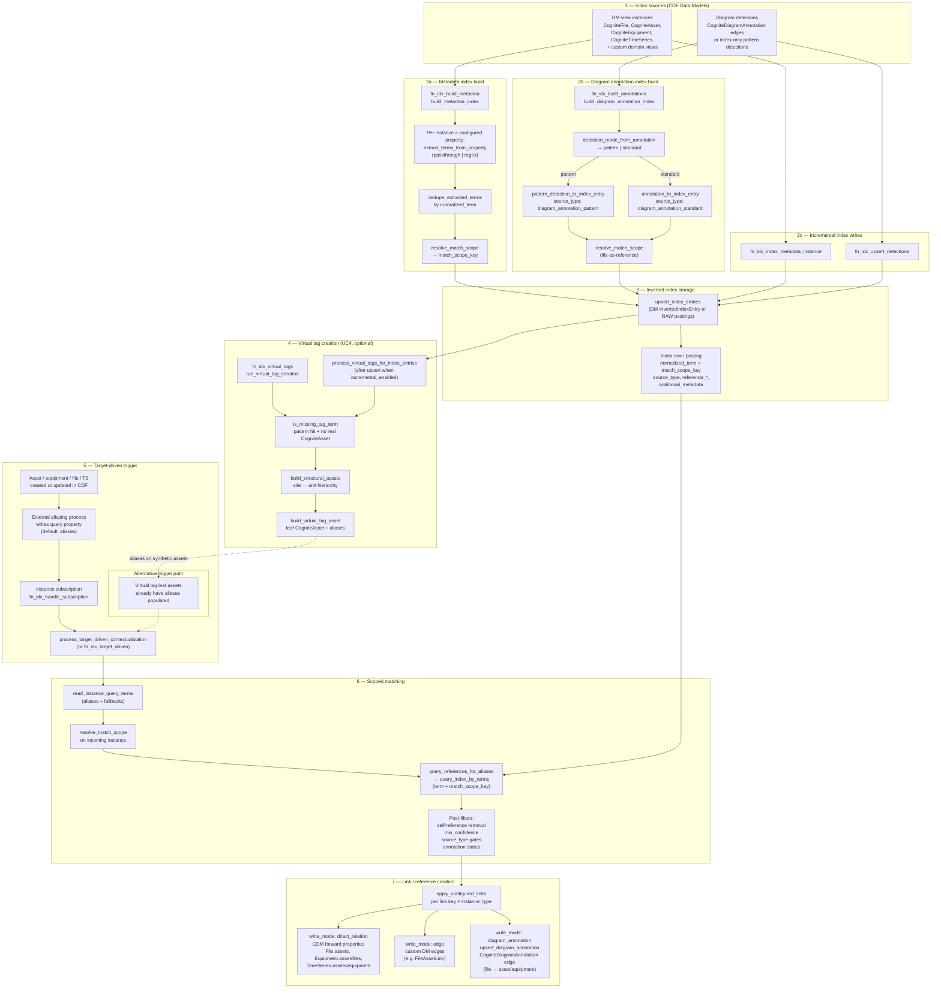
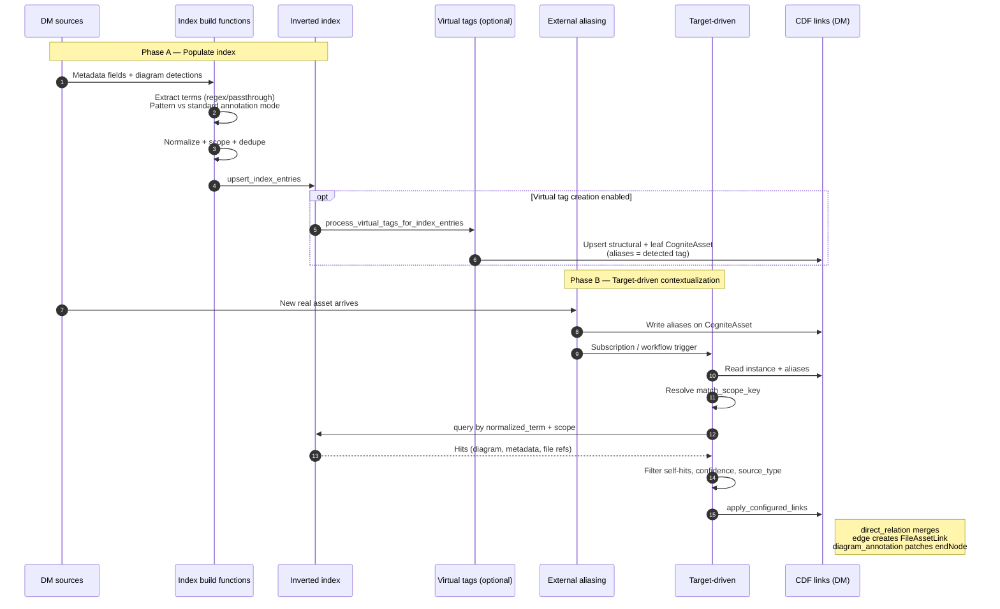

# Target-Driven Contextualization Flow

End-to-end view of the **target-driven contextualization** pipeline in `cdf_inverted_index_contextualization`: from index entry creation and pattern/standard extraction, through scoped matching, to edge and direct-reference creation and virtual tag materialization.

For API contracts, configuration schemas, and function signatures, see [cdf_inverted_index_function_spec.md](cdf_inverted_index_function_spec.md) (§2.3–§2.8, §3.3, §3.5).

## End-to-end process

## Production sequence (swimlane)

Index build is **upstream**; target-driven runs **after** query terms exist on the target instance (typically `aliases` from external aliasing).

## Stage reference

| Stage | Key functions | Output |
|-------|---------------|--------|
| **Metadata extraction** | `build_metadata_index`, `extract_terms_from_property` | `asset_metadata` / `file_metadata` rows pointing at the **containing** DM instance |
| **Pattern extraction** | `build_diagram_annotation_index`, `pattern_detection_to_index_entry` | `diagram_annotation_pattern` rows; file-as-reference (`reference_type: CogniteFile`) |
| **Standard extraction** | `annotation_to_index_entry` | `diagram_annotation_standard` rows from CDM `CogniteDiagramAnnotation` edges |
| **Index storage** | `upsert_index_entries` | DM `InvertedIndexEntry` or RAW postings keyed by `(match_scope_key, normalized_term)` |
| **Virtual tags** | `run_virtual_tag_creation`, `process_virtual_tags_for_index_entries` | Synthetic `CogniteAsset` hierarchy for **missing** pattern-detected tags; leaf `aliases` feed target-driven |
| **Matching** | `process_target_driven_contextualization` → `query_references_for_aliases` | Scoped hits filtered by confidence, source type, and self-reference |
| **Direct relations** | `apply_configured_links` (`direct_relation`) | Forward CDM properties such as `CogniteFile.assets`, `CogniteEquipment.asset` |
| **Edges** | `apply_configured_links` (`edge`) | Custom link edges (e.g. `FileAssetLink`) via `build_custom_edge_apply` |
| **Diagram annotations** | `apply_configured_links` (`diagram_annotation`) | Create or patch `CogniteDiagramAnnotation` with file start node → asset end node |

## Key relationships

### Scope isolation

Both index build and target-driven matching use `match_scope_key` (e.g. `site:Rotterdam|unit:U100`) so reused tags across units do not cross-match. Unscoped lookups are discouraged at multi-unit sites.

### Trigger contract

Target-driven does **not** run on raw ingest alone. It expects query terms on the target instance (default property: `aliases`, populated by an external aliasing process). Virtual tag leaves are an exception: they pre-populate `aliases` so target-driven can link diagram-detected tags that have no real asset yet.

Primary incremental path: instance subscription on `watch_property` → `fn_idx_handle_subscription` → `handle_aliases_subscription_event` → `process_target_driven_contextualization`.

### Pattern vs standard diagram detections

| Mode | Index source | Notes |
|------|--------------|-------|
| **Pattern** | `diagram_annotation_pattern` | May be index-only (no DM `CogniteDiagramAnnotation` edge yet). Target-driven can promote via `write_modes: [diagram_annotation]`. |
| **Standard** | `diagram_annotation_standard` | Indexes existing CDM `CogniteDiagramAnnotation` edges. |

Detection mode is inferred from annotation properties, tags, external-id heuristics, or `default_detection_mode` in `ANNOTATION_INDEX_CONFIG`.

### Write modes

Per link in `DIRECT_RELATION_CONFIG`, `write_modes` is an explicit list — no silent fallback between modes:

| Mode | Behaviour |
|------|-----------|
| `direct_relation` | Read-merge-write CDM forward property via `NodeApply` |
| `edge` | Create custom DM link edge (e.g. `FileAssetLink`) |
| `diagram_annotation` | Upsert `CogniteDiagramAnnotation`: create when missing; patch `endNode` when existing |

The same match can produce multiple relationship artifacts when several modes are enabled.

### Self-reference handling

Index build indexes all configured views uniformly — self-referential rows are valid at build time. Target-driven filters them at lookup via `is_self_reference_hit` (when `reference_external_id` / `reference_space` match the incoming instance).

## Implementation map

| Area | Module path |
|------|-------------|
| Target-driven orchestration | `inverted_index/target_driven.py` |
| Index entry builders | `inverted_index/entries.py` |
| Virtual tags | `inverted_index/virtual_tags.py` |
| Link apply (direct relation, edge, annotation) | `inverted_index/cdm_relations.py`, `inverted_index/edge_links.py`, `inverted_index/dm_apply.py` |
| Scoped query | `inverted_index/query.py`, `inverted_index/aliases.py` |
| Subscription handler | `inverted_index/subscription.py` |
