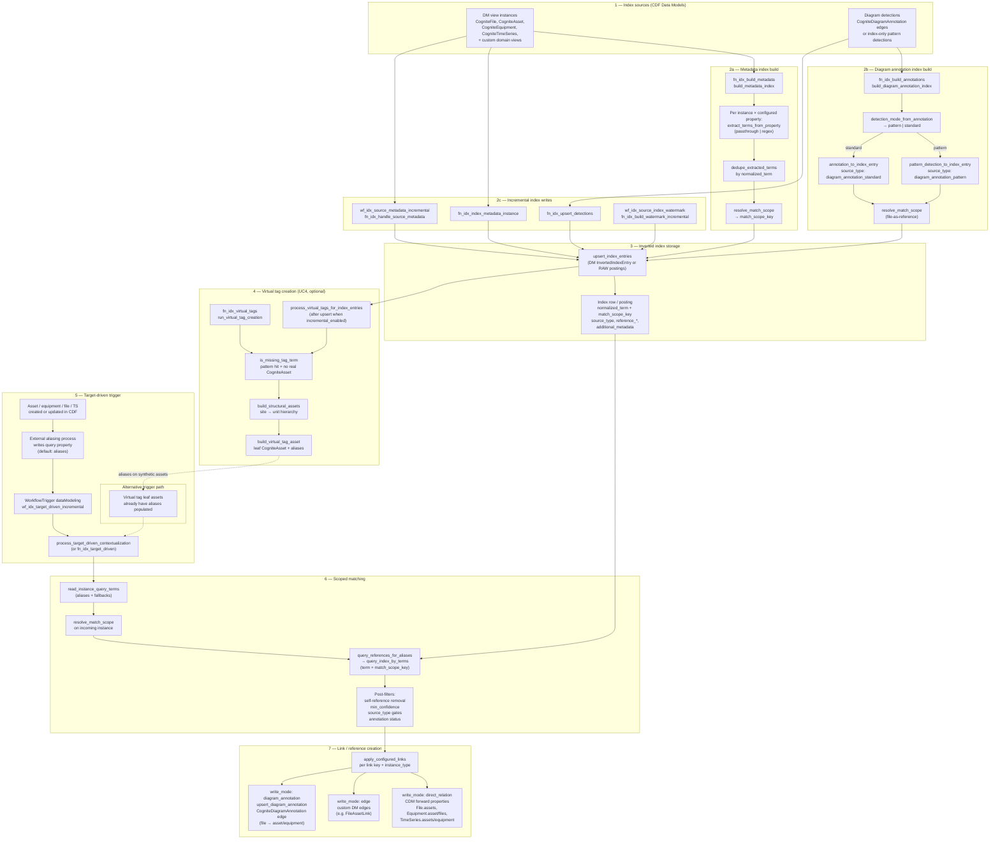
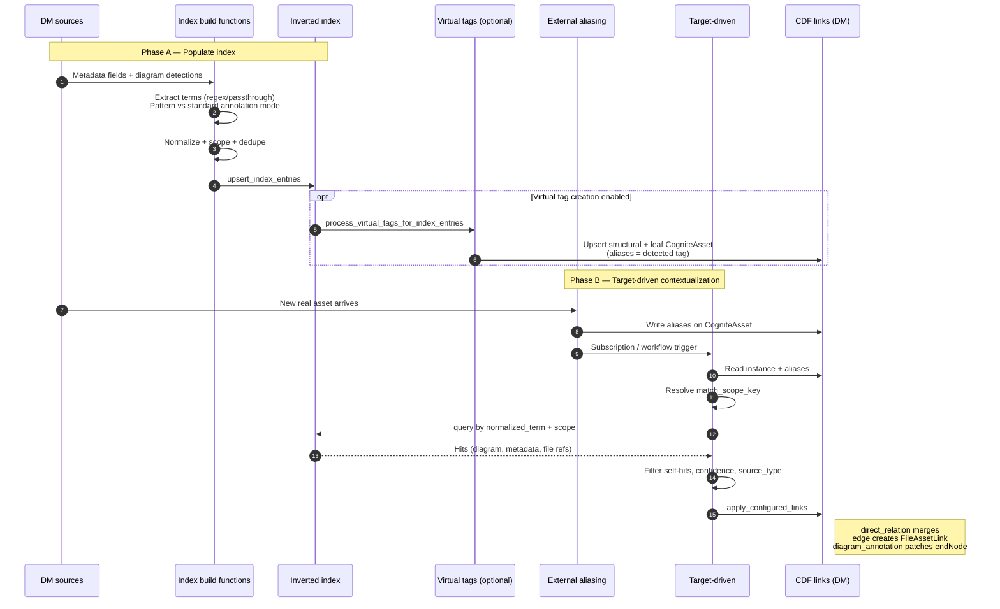

# Target-Driven Contextualization Flow

End-to-end view of the **target-driven contextualization** pipeline in `cdf_inverted_index_contextualization`: from index entry creation and pattern/standard extraction, through scoped matching, to edge and direct-reference creation and virtual tag materialization.

For a step-by-step setup path, see [QUICKSTART.md](QUICKSTART.md). For API contracts, configuration schemas, and function signatures, see [cdf_inverted_index_function_spec.md](cdf_inverted_index_function_spec.md) (§2.3–§2.8, §3.3, §3.5). Scope behaviour for target-driven matching is documented below under **Scope isolation and target-driven matching** and in the function spec §2.6 / §3.3.

## End-to-end process

```mermaid
flowchart TB
  subgraph sources["1 — Index sources (CDF Data Models)"]
    DMViews["DM view instances<br/>CogniteFile, CogniteAsset,<br/>CogniteEquipment, CogniteTimeSeries,<br/>+ custom domain views"]
    Diagrams["Diagram detections<br/>CogniteDiagramAnnotation edges<br/>or index-only pattern detections"]
  end

  subgraph metadataBuild["2a — Metadata index build"]
    MetaFn["fn_idx_build_metadata<br/>build_metadata_index"]
    Extract["Per instance × configured property:<br/>extract_terms_from_property<br/>(passthrough | regex)"]
    Dedupe["dedupe_extracted_terms<br/>by normalized_term"]
    ScopeMeta["resolve_match_scope<br/>→ match_scope_key"]
    MetaFn --> Extract --> Dedupe --> ScopeMeta
  end

  subgraph annotationBuild["2b — Diagram annotation index build"]
    AnnFn["fn_idx_build_annotations<br/>build_diagram_annotation_index"]
    ModeInfer["detection_mode_from_annotation<br/>→ pattern | standard"]
    PatternEntry["pattern_detection_to_index_entry<br/>source_type: diagram_annotation_pattern"]
    StandardEntry["annotation_to_index_entry<br/>source_type: diagram_annotation_standard"]
    ScopeAnn["resolve_match_scope<br/>(file-as-reference)"]
    AnnFn --> ModeInfer
    ModeInfer -->|pattern| PatternEntry --> ScopeAnn
    ModeInfer -->|standard| StandardEntry --> ScopeAnn
  end

  subgraph incremental["2c — Incremental index writes"]
    UpsertDet["fn_idx_upsert_detections"]
    IndexMetaInst["fn_idx_index_metadata_instance"]
    SourceWF["wf_idx_source_metadata_incremental\nfn_idx_handle_source_metadata"]
    WatermarkWF["wf_idx_source_index_watermark\nfn_idx_build_watermark_incremental"]
  end

  subgraph storage["3 — Inverted index storage"]
    Upsert["upsert_index_entries<br/>(DM InvertedIndexEntry or RAW postings)"]
    IndexRow["Index row / posting<br/>normalized_term + match_scope_key<br/>source_type, reference_*,<br/>additional_metadata"]
    Upsert --> IndexRow
  end

  subgraph virtualTags["4 — Virtual tag creation (UC4, optional)"]
    VTBatch["fn_idx_virtual_tags<br/>run_virtual_tag_creation"]
    VTIncr["process_virtual_tags_for_index_entries<br/>(after upsert when incremental_enabled)"]
    MissingCheck["is_missing_tag_term<br/>pattern hit + no real CogniteAsset"]
    StructAssets["build_structural_assets<br/>site → unit hierarchy"]
    LeafAsset["build_virtual_tag_asset<br/>leaf CogniteAsset + aliases"]
    VTBatch --> MissingCheck
    VTIncr --> MissingCheck
    MissingCheck --> StructAssets --> LeafAsset
  end

  subgraph trigger["5 — Target-driven trigger"]
    Ingest["Asset / equipment / file / TS<br/>created or updated in CDF"]
    Aliasing["External aliasing process<br/>writes query property<br/>(default: aliases)"]
    subgraph altTrigger["Alternative trigger path"]
      VTAliases["Virtual tag leaf assets<br/>already have aliases populated"]
    end
    Sub["WorkflowTrigger dataModeling<br/>wf_idx_target_driven_incremental"]
    TDEntry["process_target_driven_contextualization<br/>(or fn_idx_target_driven)"]
    Ingest --> Aliasing
    Aliasing --> Sub --> TDEntry
    LeafAsset -.->|aliases on synthetic assets| VTAliases -.-> TDEntry
  end

  subgraph matching["6 — Scoped matching"]
    ReadTerms["read_instance_query_terms<br/>(aliases + fallbacks)"]
    ResolveScope["resolve_match_scope<br/>on incoming instance"]
    Query["query_references_for_aliases<br/>→ query_index_by_terms<br/>(term + match_scope_key)"]
    Filters["Post-filters:<br/>self-reference removal<br/>min_confidence<br/>source_type gates<br/>annotation status"]
    ReadTerms --> ResolveScope --> Query --> Filters
  end

  subgraph apply["7 — Link / reference creation"]
    ApplyLinks["apply_configured_links<br/>per link key + instance_type"]
    DR["write_mode: direct_relation<br/>CDM forward properties<br/>File.assets, Equipment.asset/files,<br/>TimeSeries.assets/equipment"]
    Edge["write_mode: edge<br/>custom DM edges<br/>(e.g. FileAssetLink)"]
    DiagAnn["write_mode: diagram_annotation<br/>upsert_diagram_annotation<br/>CogniteDiagramAnnotation edge<br/>(file → asset/equipment)"]
    ApplyLinks --> DR
    ApplyLinks --> Edge
    ApplyLinks --> DiagAnn
  end

  DMViews --> MetaFn
  DMViews --> IndexMetaInst
  DMViews --> SourceWF
  Diagrams --> AnnFn
  Diagrams --> UpsertDet
  WatermarkWF --> Upsert
  ScopeMeta --> Upsert
  ScopeAnn --> Upsert
  IndexMetaInst --> Upsert
  SourceWF --> Upsert
  UpsertDet --> Upsert
  Upsert --> VTIncr
  IndexRow --> Query
  TDEntry --> ReadTerms
  Filters --> ApplyLinks
```

## Production sequence (swimlane)

Index build is **upstream**; target-driven runs **after** query terms exist on the target instance (typically `aliases` from external aliasing).

```mermaid
sequenceDiagram
  autonumber
  participant Src as DM sources
  participant Build as Index build functions
  participant Idx as Inverted index
  participant VT as Virtual tags (optional)
  participant Alias as External aliasing
  participant TD as Target-driven
  participant CDF as CDF links (DM)

  Note over Src,Idx: Phase A — Populate index
  Src->>Build: Metadata fields + diagram detections
  Build->>Build: Extract terms (regex/passthrough)<br/>Pattern vs standard annotation mode
  Build->>Build: Normalize + scope + dedupe
  Build->>Idx: upsert_index_entries

  opt Virtual tag creation enabled
    Idx->>VT: process_virtual_tags_for_index_entries
    VT->>CDF: Upsert structural + leaf CogniteAsset<br/>(aliases = detected tag)
  end

  Note over Alias,TD: Phase B — Target-driven contextualization
  Src->>Alias: New real asset arrives
  Alias->>CDF: Write aliases on CogniteAsset
  Alias->>TD: Subscription / workflow trigger
  TD->>CDF: Read instance + aliases
  TD->>TD: Resolve match_scope_key
  TD->>Idx: query by normalized_term + scope
  Idx-->>TD: Hits (diagram, metadata, file refs)
  TD->>TD: Filter self-hits, confidence, source_type
  TD->>CDF: apply_configured_links
  Note right of CDF: direct_relation merges<br/>edge creates FileAssetLink<br/>diagram_annotation patches endNode
```

## Stage reference

| Stage | Key functions | Output |
|-------|---------------|--------|
| **Metadata extraction** | `build_metadata_index`, `extract_terms_from_property` | `asset_metadata` / `file_metadata` rows pointing at the **containing** DM instance |
| **Pattern extraction** | `build_diagram_annotation_index`, `pattern_detection_to_index_entry` | `diagram_annotation_pattern` rows; file-as-reference (`reference_type: CogniteFile`) |
| **Standard extraction** | `annotation_to_index_entry` | `diagram_annotation_standard` rows from CDM `CogniteDiagramAnnotation` edges |
| **Index storage** | `upsert_index_entries` | DM `InvertedIndexEntry` or RAW postings keyed by `(match_scope_key, normalized_term)` |
| **Virtual tags** | `run_virtual_tag_creation`, `process_virtual_tags_for_index_entries` | Synthetic `CogniteAsset` hierarchy for **missing** pattern-detected tags; leaf `aliases` feed target-driven |
| **Matching** | `process_target_driven_contextualization` → `query_references_for_aliases` | Scoped hits filtered by confidence, source type, and self-reference |
| **Direct relations** | `apply_configured_links` (`direct_relation`) | Forward CDM properties such as `CogniteFile.assets`, `CogniteEquipment.asset` |
| **Edges** | `apply_configured_links` (`edge`) | Custom link edges (e.g. `FileAssetLink`) via `build_custom_edge_apply` |
| **Diagram annotations** | `apply_configured_links` (`diagram_annotation`) | Create or patch `CogniteDiagramAnnotation` with file start node → asset end node |

## Key relationships

### Scope isolation and target-driven matching

Target-driven contextualization is **target-first**: it starts from the **incoming instance** (typically a `CogniteAsset` with query terms on `aliases`), resolves scope on that instance, then queries the inverted index with **both** normalized query terms and `match_scope_key`. Index hits (diagram detections, file metadata, asset metadata) that share the term but were indexed under a different scope are excluded.

#### Bidirectional scope (index build + query)

Scope is applied on **both sides** of the lookup so file and asset targets stay within the same operational boundary:

| Phase | When | What happens |
|-------|------|--------------|
| **Index build** | `build_metadata_index`, `build_diagram_annotation_index`, incremental upserts | `resolve_match_scope(instance, view, scope_config)` on each indexed instance → `match_scope_key` stored on every index row / RAW posting |
| **Target-driven query** | `process_target_driven_contextualization` | Same `resolve_match_scope` on the **incoming target** (asset, file, equipment, or time series per `incoming_view_key`) → `query_index_by_terms(terms, match_scope_key=…)` |

Index storage is keyed by `(match_scope_key, normalized_term)`, so an asset in `site:Rotterdam|unit:U100` only sees hits indexed under that same key — not the same tag from another unit's files or assets.

**Per view at index build:**

- **Files / assets / equipment / time series** — scope from configured `resolve_from` property paths (e.g. `sourceContext`, `sourceId`; see `config/scope.example.yaml`).
- **Diagram annotations** — scope from annotation properties; when a level is still empty and `annotation_scope_via_linked_file: true`, scope is read from the **linked `CogniteFile`** (file-as-reference rows use the file's scope).

#### Out-of-the-box vs configured scope

| Setting | OOTB (`default.config.yaml`) | Multi-unit production (recommended) |
|---------|------------------------------|--------------------------------------|
| `scope.levels` | `[]` (empty) | e.g. `[site, unit]` |
| `scope.strict_scope` | `false` | `true` |
| Effective partition | Single **`global`** fallback (`fallback_scope_key: global`) | One partition per resolved scope, e.g. `site:Rotterdam\|unit:U100` |
| Isolation | **None** — all terms share one partition; cross-unit false positives possible | Same tag in unit A does not match files/assets indexed in unit B |

Enable scope explicitly for multi-unit sites: copy `config/scope.example.yaml` into project config, map `resolve_from` per view, and set `strict_scope: true`. See [cdf_inverted_index_function_spec.md](cdf_inverted_index_function_spec.md) §2.6.

#### What scope ensures — and what it does not

**Scope ensures** organizational isolation: when the same tag (e.g. `P-101A`) appears in multiple units at one site, target-driven only links to index entries (file detections, `file_metadata`, `asset_metadata`) that were built under the **same** `match_scope_key`.

**Scope does not:**

- Walk DM relations to infer scope (except annotations → linked file via `annotation_scope_via_linked_file`).
- By itself pick "the correct file for this asset" beyond "same scope + term match".
- Replace link resolution — which file or asset gets linked still comes from each hit's `reference_type` / `reference_external_id`, plus post-filters below.

#### Skip reasons and strict scope

When scope cannot be resolved or does not pass optional filters, target-driven skips link creation:

| `reason` | When |
|----------|------|
| `scope_unresolved` | `strict_scope: true` (or empty `levels` with strict enabled) and `resolve_match_scope` returned no key |
| `scope_filtered` | Caller passed `match_scope_keys` and the instance's resolved key is not in that list (`scope_lookup_override: false`) |

Optional CLI / function args: `match_scope_keys` restricts which scopes may run; `scope_lookup_override: true` queries those keys without requiring the instance to resolve to one of them (admin / replay use).

#### Filters beyond scope

After scoped term lookup, target-driven applies additional gates before `apply_configured_links`:

- **Self-reference removal** — hits where `reference_external_id` / `reference_space` equal the incoming instance (`is_self_reference_hit`).
- **`min_confidence`** — diagram detection confidence threshold.
- **`source_types_to_consider`** — e.g. `diagram_annotation_pattern`, `diagram_annotation_standard`, `file_metadata`, `asset_metadata` (from `direct_relation_config.source_types` or per-link overrides).
- **Annotation status** — where configured on link apply paths.

Unscoped or `global`-only deployments are acceptable for single-partition pilots; at multi-unit sites, unscoped lookups can return cross-unit false positives.

### Trigger contract

Target-driven does **not** run on raw ingest alone. It expects query terms on the target instance (default property: `aliases`, populated by an external aliasing process). Virtual tag leaves are an exception: they pre-populate `aliases` so target-driven can link diagram-detected tags that have no real asset yet.

Primary incremental path (Toolkit-deployable): **`dataModeling` WorkflowTrigger** on `wf_idx_target_driven_incremental` → `fn_idx_handle_subscription` with `workflow.input.items` → `handle_aliases_subscription_event` → `process_target_driven_contextualization`. Runtime `subscription:` config controls handler filters (`watch_property`, `watch_view_keys`). Cognite Toolkit does not ship a YAML resource for native DM instance subscriptions that invoke a Function directly.

### Pattern vs standard diagram detections

| Mode | Index source | Notes |
|------|--------------|-------|
| **Pattern** | `diagram_annotation_pattern` | May be index-only (no DM `CogniteDiagramAnnotation` edge yet). Target-driven can promote via `write_modes: [diagram_annotation]`. |
| **Standard** | `diagram_annotation_standard` | Indexes existing CDM `CogniteDiagramAnnotation` edges. |

Detection mode is inferred from annotation properties, tags, external-id heuristics, or `default_detection_mode` in `ANNOTATION_INDEX_CONFIG`.

### Write modes

Per link in `DIRECT_RELATION_CONFIG`, `write_modes` is an explicit list — no silent fallback between modes:

| Mode | Behaviour |
|------|-----------|
| `direct_relation` | Read-merge-write CDM forward property via `NodeApply` |
| `edge` | Create custom DM link edge (e.g. `FileAssetLink`) |
| `diagram_annotation` | Upsert `CogniteDiagramAnnotation`: create when missing; patch `endNode` when existing |

The same match can produce multiple relationship artifacts when several modes are enabled.

### Self-reference handling

Index build indexes all configured views uniformly — self-referential rows are valid at build time. Target-driven filters them at lookup via `is_self_reference_hit` (when `reference_external_id` / `reference_space` match the incoming instance).

## Implementation map

| Area | Module path |
|------|-------------|
| Target-driven orchestration | `inverted_index/target_driven.py` |
| Index entry builders | `inverted_index/entries.py` |
| Virtual tags | `inverted_index/virtual_tags.py` |
| Link apply (direct relation, edge, annotation) | `inverted_index/cdm_relations.py`, `inverted_index/edge_links.py`, `inverted_index/dm_apply.py` |
| Scoped query | `inverted_index/query.py`, `inverted_index/aliases.py` |
| Subscription handler | `inverted_index/subscription.py` |
