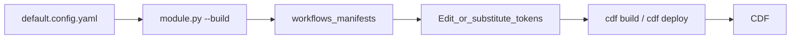

# Scoped deployment — hierarchy, workflow manifests, and Toolkit

Use this guide when you need **one workflow** (`key_extraction_aliasing`) with **per-scope schedule triggers** (different sites, plants, or instance spaces). You edit the **scope hierarchy** in [`default.config.yaml`](../../default.config.yaml), generate **CDF Toolkit** YAML under [`workflows/`](../../workflows/), optionally adjust **instance space** handling, validate locally with [`module.py`](../../module.py), and deploy from a **Cognite Toolkit** project that includes this module.

**Documentation index:** [docs/README.md](../README.md) · **Workflow task graph:** [workflows/README.md](../../workflows/README.md) · **Quickstart:** [howto_quickstart.md](howto_quickstart.md)

## Flow overview



## 1. Customize the scope hierarchy

Authoring lives in **[`default.config.yaml`](../../default.config.yaml)** at the module root.

- **`scope_hierarchy.levels`** — Ordered labels for path tiers (site, plant, area, …). You do not have to use every tier; deeper paths can use synthetic tier names when you exceed the list (see [config/README.md](../../config/README.md)).
- **`scope_hierarchy.locations`** — Root list of nodes. Each node has a stable **`id`** (used in trigger `externalId` suffixes and `scope_id`). Nest children under another **`locations`** key on each node.
- **Leaves** — A leaf is a node with no child `locations` or **`locations: []`**. Each leaf gets its own **`key_extraction_aliasing.<scope>.WorkflowTrigger.yaml`** (path depends on `scope_build_mode`; see below).
- **Optional `instance_space` on a leaf** — When set, the scope builder can emit **literal** node `space` filters in that leaf’s embedded **`input.configuration`** instead of the Toolkit placeholder `{{instance_space}}`. See *Instance spaces* below.

Commented examples in `default.config.yaml` show how to add sites and nested locations.

## 2. `scope_build_mode`: where files are written

| Mode | Layout |
|------|--------|
| **`trigger_only`** | Root **`workflows/key_extraction_aliasing.Workflow.yaml`** and **`WorkflowVersion.yaml`** (if missing), plus **flat** **`workflows/key_extraction_aliasing.<scope>.WorkflowTrigger.yaml`** per leaf. |
| **`full`** | Per leaf under **`workflows/<suffix>/`**: **`Workflow.yaml`**, **`WorkflowVersion.yaml`**, and **`WorkflowTrigger.yaml`** for that scope (no shared root pair). |

Set **`scope_build_mode`** in `default.config.yaml`. Templates always come from [`workflow_template/`](../../workflow_template/) (see [workflow_template/README.md](../../workflow_template/README.md)).

## 3. Build commands (`module.py --build`)

**`python module.py --build`** does **not** connect to CDF. It runs the same orchestrator as [`scripts/build_scopes.py`](../../scripts/build_scopes.py). Forwarded flags include:

| Flag | Purpose |
|------|---------|
| *(none)* | Create **missing** Workflow / WorkflowVersion / WorkflowTrigger files from templates. Existing files are **not** overwritten unless **`--force`**. |
| **`--force`** | Overwrite existing generated workflow YAML from templates. |
| **`--hierarchy <path>`** | Use a different hierarchy file instead of module-root `default.config.yaml`. |
| **`--scope-document <path>`** | Patch scope body from another YAML (default: `workflow_template/workflow.template.config.yaml`). |
| **`--workflow-trigger-template <path>`** | Custom trigger shell template. |
| **`--dry-run`** | Log actions without writing. |
| **`--check-workflow-triggers`** | Exit non-zero if required artifacts are missing or out of date vs templates (CI gate). **No writes.** |
| **`--list-builders`** | Print builder names. |
| **`--only <name>`** | Run only named builders (repeatable). |
| **`-v` / `--verbose`** | Debug logging. |
| **`--clean`** | Delete generated workflow YAML under **`workflows/`** for this module’s **`workflow`** id (with confirmation, or **`--yes`**). **`--dry-run --clean`** lists paths only. **No build runs after a successful clean** — run **`--build`** again to recreate. |
| **`--yes`** | With **`--clean`**, skip confirmation (needed when stdin is not a TTY). |

**Do not confuse** **`--build --clean`** (removes Toolkit manifest files under `workflows/`) with **`module.py --clean-state`** (drops **RAW** pipeline tables for a scope). They are unrelated.

Example:

```bash
# From repository root
python modules/accelerators/contextualization/cdf_key_extraction_aliasing/module.py --build
python modules/accelerators/contextualization/cdf_key_extraction_aliasing/module.py --build --check-workflow-triggers
```

## 4. Instance spaces in generated triggers

Deployed workflows read **`workflow.input.configuration`** (v1 scope shape). The builder patches **`source_views`** (including node **`space`** filters) per leaf. You can control instance space in three ways:

**A — Leaf `instance_space` in the hierarchy**  
Set **`instance_space`** on the leaf node in `default.config.yaml`. Regenerate with **`--build`** (and **`--force`** if the trigger file already exists). Generated filters can contain the **literal** space string instead of a template token.

**B — Toolkit placeholder `{{instance_space}}`**  
If the leaf has no baked-in space, triggers may keep **`{{instance_space}}`** inside **`input.configuration`** (for example on node `space` filters). **CDF Toolkit** substitutes that value at **`cdf build` / deploy** from your project’s variables (often aligned with keys in `default.config.yaml`). Substitution applies **inside the embedded configuration**, not only on `workflow.input` top-level fields. See [workflows/README.md](../../workflows/README.md).

**C — Manual edits after generation**  
Edit **`workflows/.../key_extraction_aliasing.<scope>.WorkflowTrigger.yaml`** and change **`input.configuration`** (or specific `source_views` / filters) for one leaf. Prefer **rebuild from hierarchy** when you want reproducible, reviewable changes; use manual edits for one-off fixes or experiments, then consider folding the change back into `default.config.yaml` or templates.

Also ensure your Toolkit / project config supplies **`instance_space`** (or equivalent) for every deploy target where triggers still contain `{{instance_space}}`.

## 5. Run locally against one generated scope (trigger parity)

There is **no** CLI flag to point `module.py` directly at a `WorkflowTrigger.yaml` file. To mirror what CDF runs for **one** leaf:

1. Open the leaf’s **`...WorkflowTrigger.yaml`** under **`workflows/`**.
2. Copy the entire **`input.configuration`** mapping (the value of the **`configuration`** key under **`input`**).
3. Save it as a **standalone** v1 scope YAML file (for example `my_leaf.local.yaml`). The document root should match the workflow payload: top-level **`source_views`**, **`key_extraction`**, optional **`aliasing`**, etc.
4. Replace any **Toolkit placeholders** (`{{instance_space}}`, and any others your file contains) with **real** values for your CDF project. Unsubstituted `{{...}}` strings will break YAML parsing or DM queries.
5. Run from repository root with **`PYTHONPATH=.`**:

```bash
python modules/accelerators/contextualization/cdf_key_extraction_aliasing/module.py \
  --config-path /path/to/my_leaf.local.yaml \
  --dry-run --limit 50
```

Use **`--dry-run`** and **`--limit`** until you are confident. Optional **`--instance-space`** filters views when your file lists multiple views; see [`module.py`](../../module.py).

## 6. Deploy with Cognite Toolkit

This **library** repository does not ship a root **`cdf.toml`** or **`fusion.yaml`**. In practice you **add or symlink this module** into a **Cognite Toolkit** project that already defines modules, build variables, and deployment profiles.

1. **Artifacts to deploy** — Under this module, Toolkit resources include at least:
   - **`workflows/`** — `Workflow`, `WorkflowVersion`, and per-scope **`WorkflowTrigger`** YAML produced by **`--build`**.
   - **`functions/`** — Cognite Function definitions (for example [`functions.Function.yaml`](../../functions/functions.Function.yaml)) and handler code.
2. **Build** — From your Toolkit project root, run **`cdf build`** (with the correct profile / config) so templates and variables resolve.
3. **Deploy** — Run **`cdf deploy`** (same project conventions your team uses). Schedule cron, OAuth placeholders (`{{functionClientId}}`, `{{functionClientSecret}}`), and **`{{instance_space}}`** are resolved from your project’s configuration when you build/deploy, not by `module.py`.

Official Toolkit repository and docs: [CDF Toolkit](https://github.com/cognitedata/cdf-toolkit). For workflow triggers and **`workflow.input`**, see Cognite’s data workflows documentation (linked from [workflows/README.md](../../workflows/README.md)).

## Related reading

- [config/README.md](../../config/README.md) — hierarchy builder details
- [Configuration guide](configuration_guide.md) — v1 scope shape, `source_views`, parameters
- [Quickstart](howto_quickstart.md) — `.env` and first `module.py` run
- [How to add a custom handler](howto_custom_handlers.md) — when YAML is not enough
