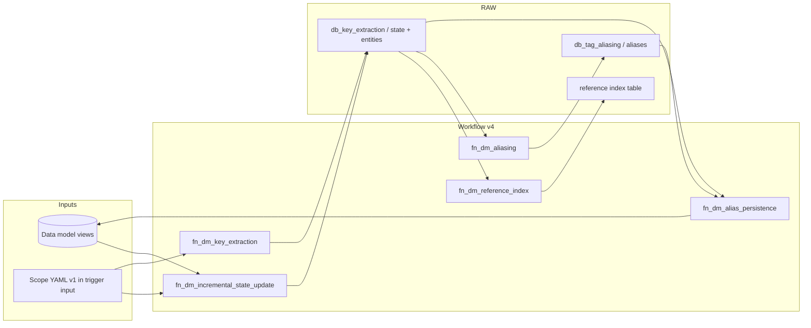

# Module functional document — `cdf_key_extraction_aliasing`

This document describes **what the module does** in operational terms: scope, behaviors, components, data flows, and interfaces. Detailed rule semantics live in the [key extraction](specifications/1.%20key_extraction.md) and [aliasing](specifications/2.%20aliasing.md) specifications; step-by-step authoring is in the [configuration guide](guides/configuration_guide.md) and [workflows README](../workflows/README.md).

---

## 1. Purpose and scope

### 1.1 Business intent

Industrial and engineering data in Cognite Data Fusion (CDF) often encodes equipment tags, document names, and cross-references inside **text metadata** (names, descriptions, external IDs). Different systems use different spellings and separators for the “same” tag. This module:

1. **Extracts** structured identifiers from configured data-model views: **candidate keys** (an entity’s own tags), **foreign key references** (mentions of other entities’ tags), and **document references**.
2. **Generates alias sets** for candidate keys so search, matching, and contextualization can recognize variant forms.
3. **Persists** aliases (and optionally foreign-key reference strings) back onto **`cdf_cdm:CogniteDescribable:v1`** (or equivalent views that expose the configured properties).
4. **Optionally maintains** a **RAW inverted reference index** from extracted FK and document references for lookup-style use cases.

### 1.2 Technical boundaries

| In scope | Out of scope (by design) |
| -------- | ------------------------ |
| Rule-driven extraction and aliasing from YAML config | Automatic DM relationship edges or graph sync (see module README roadmap) |
| CDF Functions + Workflow orchestration (v4) | Replacing trigger-embedded `scope_document` without updating workflow task wiring |
| RAW as inter-task buffer and incremental state | Removing values already written to DM instances (`--clean-state` clears RAW only) |
| Local runner (`main.py`) for dev / parity testing | General-purpose ETL outside contextualization |

---

## 2. Actors and consumers

| Actor | Role |
| ----- | ---- |
| **Config author** | Maintains v1 scope YAML at module root / trigger template (`workflows/_template/key_extraction_aliasing.scope_document.yaml`) and runs `build_scopes` for multi-site triggers. |
| **CDF operator** | Deploys Toolkit manifests, monitors workflow runs and RAW/DM outcomes. |
| **Application / search** | Consumes **`aliases`** (and optional FK list properties) on describable instances. |
| **Downstream jobs** | May read **reference index** RAW for “who references tag X” style queries. |

---

## 3. Functional capabilities (summary)

### 3.1 Key extraction

**Engine:** `KeyExtractionEngine` dispatches each rule’s `method` to a **method handler** (`functions/fn_dm_key_extraction/engine/handlers/`). Rules declare `extraction_type` (`candidate_key`, `foreign_key_reference`, `document_reference`); the engine sorts extracted keys into the matching lists on `ExtractionResult`.

**Outputs per instance:** validated **candidate keys**, **foreign key references**, and **document references**, each with confidence, rule id, source field, and metadata. **Source binding** uses `source_views` plus `extraction_rules` (priority, `enabled`, `scope_filters`, validation).

**YAML note:** `fixed_width` and `token_reassembly` in config are normalized to the enum values **`fixed width`** and **`token reassembly`** before lookup.

#### 3.1.1 Extraction method handlers

| Handler (class) | Config `method` | Purpose | Typical usage |
| ----------------- | --------------- | -------- | -------------- |
| **PassthroughExtractionHandler** | `passthrough` | Returns the **entire** (trimmed) field value as a single `ExtractedKey`; no pattern parsing. | Use when the identifier is already stored whole (`name`, `externalId`, pre-normalized code). At runtime, **`normalize_method`** treats a **missing or blank** `method` as **passthrough** (`rule_utils.normalize_method`); still set `method: passthrough` in YAML for readability. |
| **RegexExtractionHandler** | `regex` | Compiles `parameters.pattern` (with optional flags); finds all matches; uses **group 1** if present, else full match. Scores confidence via `compute_confidence` vs `min_confidence`. | Primary workhorse for tag-like substrings in free text (`alphanumeric_tag` anchors, P&ID names, etc.). Capture groups control what becomes the key value. |
| **FixedWidthExtractionHandler** | `fixed width` | Parses lines/records using **`field_definitions`** or **`positions`** in `parameters`, optional `record_delimiter`, `line_pattern`, `skip_lines`, and optional byte decoding. Converts layout to regex internally where needed. | Legacy mainframe/flat-file style fields, fixed-column exports, or line-oriented logs where position matters more than delimiters. |
| **TokenReassemblyExtractionHandler** | `token reassembly` | Tokenizes text using configured **token patterns**, then applies **assembly rules** with conditions (`all_required_present`, `*_missing`, `context_match`, …) to build candidate strings from token combinations. | Tags built from multiple fragments (site + unit + equipment), or when you must validate token presence before accepting a composed key. |
| **HeuristicExtractionHandler** | `heuristic` | Runs one or more **`heuristic_strategies`** in `parameters` (`positional_detection`, `frequency_analysis`, `context_inference`, `example_based_learning`), each with a **weight**. Merges scores, applies **`confidence_modifiers`**, keeps candidates above `min_confidence`. | Noisy or inconsistent text where rigid regex is brittle; exploratory extraction; combining weak signals. Unknown strategy names are skipped with a log warning. |

For field-level behavior (required vs optional fields, preprocessing, `max_matches_per_field`), see the [key extraction specification](specifications/1.%20key_extraction.md).

### 3.2 Aliasing

**Engine:** `AliasingEngine` walks **sorted-by-priority** rules. For each rule it resolves `type` → **transformer handler** (`functions/fn_dm_aliasing/engine/handlers/`), calls `transform` on the current alias **set**, then merges or replaces the set per `preserve_original`. **`scope_filters`** / **`conditions`** gate rules (e.g. `entity_type`, context keys). Final output passes **validation** (`min_alias_length`, `max_alias_length`, `max_aliases_per_tag`, `allowed_characters`).

**Input:** candidate key strings from extraction (workflow reads RAW) or direct `generate_aliases(tag, entity_type, context)` in Python.

**Separator variants** (e.g. `-` vs `_` vs none) are usually modeled with **`character_substitution`**; there is no separate `separator_normalization` type in code.

#### 3.2.1 Aliasing transformer handlers (`type` → handler)

| `type` | Handler | Purpose | Typical usage |
| ------ | -------- | -------- | -------------- |
| `character_substitution` | **CharacterSubstitutionHandler** | Maps characters to one or more replacements per input string; optional **cascade**, **bidirectional**, **`max_aliases_per_input`**. | Normalize delimiters, remove spaces, generate `-`/`_`/empty variants for matching. |
| `prefix_suffix` | **PrefixSuffixHandler** | `operation`: `add_prefix`, `remove_prefix`, `add_suffix`, `remove_suffix`; optional **`context_mapping`** + **`resolve_from`** (e.g. site → plant prefix). | Site- or plant-prefixed tags, stripping known prefixes for canonical forms. |
| `regex_substitution` | **RegexSubstitutionHandler** | List of `{pattern, replacement}` (or single `pattern` / `replacement` on the rule config). Applies to each alias when the pattern matches. | Structural rewrites (insert hyphen between letters and digits, normalize loop suffixes). |
| `case_transformation` | **CaseTransformationHandler** | `operation` or `operations`: `upper`, `lower`, `title`, `preserve`. | Case-insensitive search surfaces, historian conventions. |
| `leading_zero_normalization` | **LeadingZeroNormalizationHandler** | Strips leading zeros in numeric tokens (`\b0+(\d+)\b`); **`preserve_single_zero`**, **`min_length`**. | `P-001` vs `P-1` equivalence. |
| `equipment_type_expansion` | **EquipmentTypeExpansionHandler** | **`type_mappings`** (letter → full words), **`format_templates`** (`{type}-{tag}`), **`auto_detect`** from tag shape; uses **`context.equipment_type`** when present. | Semantic aliases (`P-101` → `PUMP-101`) for equipment-aware matching. |
| `related_instruments` | **RelatedInstrumentsHandler** | Requires **`context.equipment_type`**; **`instrument_types`** with `prefix` and `applicable_to`; **`format_rules`**; emits instrument tags from **`extract_equipment_number`** plus separator variants. | Infer likely FIC/PI-style tags from a pump/compressor tag when context says equipment class. |
| `hierarchical_expansion` | **HierarchicalExpansionHandler** | **`hierarchy_levels`** with `format` strings using placeholders from **context** plus `{equipment}` (current alias). Skips formats if any placeholder is empty/null. | `{site}-{unit}-{equipment}` style global names. |
| `document_aliases` | **DocumentAliasesHandler** | **`pid_rules`**, **`drawing_rules`**, **`file_rules`** (e.g. `P&ID` → `PID`, revision stripping, zero-padding numbers, sheet variants). | File / drawing / P&ID naming variants. |
| `pattern_recognition` | **PatternRecognitionHandler** | Uses **`tag_pattern_library`** when importable: matches standard tag/document patterns, optionally **updates `context`** (`equipment_type`, `instrument_type`, …) and adds **pattern-based variants** from pattern examples. | Feed later rules with richer `context`; add library-driven variants. If the pattern library is unavailable, returns inputs unchanged (warning). |
| `pattern_based_expansion` | **PatternBasedExpansionHandler** | Depends on pattern library + optional **`EquipmentType`** in context or inferred from **`match_patterns`**: similar-equipment aliases, **instrument loop expansion** for pump/compressor/tank. | Rich ISA-style expansion when the optional library is deployed. |
| `alias_mapping_table` | **AliasMappingTableHandler** | Uses **`resolved_rows`** (injected or loaded from Cognite **RAW** at engine init via **`raw_table`** + client). Rows support **`scope`** / **`scope_value`**, **`source`**, **`source_match`** (`exact`, `glob`, `regex`), and alias lists. | Curated tag→alias catalogs, site-specific overrides, legacy system mappings. **Requires** a Cognite client at engine construction for RAW load, or pre-injected rows. |

#### 3.2.2 `composite` and rule ordering

The enum includes **`composite`**, but **`AliasingEngine._initialize_transformers`** does **not** register a composite handler: at runtime, rules with `type: composite` log a missing-transformer warning and contribute **no** transforms. Model composite behavior as **several ordered rules** (substitution → case → expansion, etc.) using `priority` and `preserve_original` instead.

#### 3.2.3 Optional pattern library

**`pattern_recognition`** and **`pattern_based_expansion`** are only fully active when `tag_pattern_library` imports succeed in the function environment. Otherwise handlers degrade gracefully (no-op or passthrough with warnings).

### 3.3 Persistence

- **Aliases**: written to a configurable describable property (default **`aliases`**).
- **Foreign keys**: optional list property when enabled and present on the target view.

### 3.4 Incremental processing

When **`incremental_change_processing`** is enabled in scope parameters:

- **Detection** (`fn_dm_incremental_state_update`) advances **watermarks** and emits **cohort** rows in key-extraction RAW with **`WORKFLOW_STATUS=detected`** and a **`RUN_ID`**.
- **Skip unchanged** (`incremental_skip_unchanged_source_inputs`): digest of source inputs + rules can suppress redundant cohort rows while watermarks still advance.
- **`full_rescan`**: overrides incremental narrowing (workflow input or scope); local runner mirrors this via `main.py --full-rescan`.

### 3.5 Reference index

When enabled (`enable_reference_index` in scope), **`fn_dm_reference_index`** reads FK and document reference JSON from key-extraction RAW and writes an **inverted index** table (key from `reference_index_raw_table_key` or naming convention derived from `raw_table_key`). Candidate keys are **not** indexed here.

---

## 4. Architecture overview

### 4.1 Core engines (library code)

| Component | Location (conceptual) | Responsibility |
| --------- | -------------------- | --------------- |
| **KeyExtractionEngine** | `functions/fn_dm_key_extraction/engine/` | Apply rules → `ExtractionResult`. |
| **AliasingEngine** | `functions/fn_dm_aliasing/engine/` | Apply aliasing rules → `AliasingResult`. |

### 4.2 CDF Functions (deployable units)

| Function | Primary function |
| -------- | ----------------- |
| `fn_dm_incremental_state_update` | Watermarks + cohort detection to RAW. |
| `fn_dm_key_extraction` | Query DM / process cohort → write extraction RAW; status **`extracted`** / **`failed`**. |
| `fn_dm_reference_index` | Inverted FK/document index RAW (parallel to aliasing after extraction). |
| `fn_dm_aliasing` | Read extraction RAW → write aliasing RAW; advance **`aliased`**. |
| `fn_dm_alias_persistence` | Read aliasing RAW (+ optional extraction RAW for FKs) → patch describables; advance **`persisted`**. |

Shared helpers live under `functions/cdf_fn_common/` (logging, scope document loading, clean state, naming).

### 4.3 Local runner

**`main.py`** loads scope YAML from disk, optionally filters `source_views` by **`--instance-space`**, can **`--clean-state`**, then runs the same engines against live CDF data. Results are written under **`tests/results/`** as JSON. **`--dry-run`** skips alias persistence to DM.

---

## 5. Configuration model

### 5.1 V1 scope document

Single YAML document shape (local file or embedded in each schedule trigger) combining:

- **`key_extraction`**: `config` (rules, validation, `source_views`, parameters such as `raw_table_key`, incremental flags, reference index toggles).
- **`aliasing`**: `config` (rules, validation, parameters such as `raw_table_aliases`, `alias_writeback_property`).
- Optional top-level keys consumed by tooling (e.g. `scope` block injected by `build_scopes`).

Validation: Pydantic models in `fn_dm_key_extraction/config.py`, `fn_dm_aliasing/config.py`, and cdf_adapter layers.

### 5.2 Workflow v4 runtime config

Workflow YAML does **not** embed full rule sets inline. Each function task receives **`scope_document`** (v1 mapping) from **`workflow.input`**, optional **`full_rescan`** / **`run_id`**, and RAW wiring. **`instance_space`** for DM handlers is taken from **`scope_document`** (`source_views`) when not set on task **`data`**. Functions resolve **`config`** from **`scope_document`** in memory.

Authoring: **`key_extraction_aliasing.yaml`** (local), **`workflows/_template/key_extraction_aliasing.scope_document.yaml`** (template embedded into triggers by **`build_scopes`**).

### 5.3 Multi-site generation

**`default.config.yaml`** defines `scope_hierarchy` and **`scripts/build_scopes.py`** (or **`main.py --build`**) writes **`cdf_key_extraction_aliasing.<scope>.WorkflowTrigger.yaml`** for each current leaf (**`input.scope_document`** patched from the scope template). **`--build`** does not remove trigger files for scopes no longer in the hierarchy; **`--check-workflow-triggers`** verifies only that required files exist and match (extra files are ignored).

---

## 6. Data and state

### 6.1 RAW databases and tables

| Database | Typical content | Driven by |
| -------- | ----------------- | --------- |
| **`db_key_extraction`** | Entity rows, run summaries, watermarks, cohort keys | `raw_table_key`, `raw_table_state` (and related parameters) in scope |
| **`db_tag_aliasing`** | Rows keyed by **`original_tag`** with `aliases`, metadata, entity map | `raw_table_aliases` |
| **`db_key_extraction`** (index) | Inverted reference rows | `reference_index_raw_table_key` or derived suffix |

Exact column semantics: function READMEs under `functions/fn_dm_*`.

### 6.2 Workflow status lifecycle (incremental entity rows)

Typical progression on cohort entities:

**`detected`** → **`extracted`** / **`failed`** → **`aliased`** → **`persisted`**

Failures remain visible in RAW for operator review; persistence aggregates aliases **per entity** (union when multiple tag rows reference the same node).

### 6.3 DM write-back

- **Target**: nodes implementing **`cdf_cdm:CogniteDescribable:v1`** (configurable view in practice must expose alias property).
- **Properties**: default **`aliases`**; optional FK list per **`foreign_key_writeback_property`** when enabled.

**`--clean-state`** / **`--clean-state-only`**: deletes configured RAW tables for the scope; **does not** strip existing DM property values.

---

## 7. External interfaces

### 7.1 Workflow input (`cdf_key_extraction_aliasing` v4)

| Field | Role |
| ----- | ---- |
| `instance_space` | Merged into source view resolution where applicable. |
| `scope_document` | Full v1 scope mapping (`key_extraction`, `aliasing`, optional `scope`). |
| `full_rescan` | Bool override for incremental behavior. |
| `run_id` | Optional operator/run correlation; auto-discovery paths exist for single-run setups. |

### 7.2 CLI (`main.py`)

Documented in the [module README](../README.md): limits, verbosity, dry-run, FK write-back flags, scope vs `--config-path`, clean-state, full-rescan, skip reference index (incremental parity).

### 7.3 Python API (minimal)

`KeyExtractionEngine` and `AliasingEngine` accept dict configs; RAW-backed rules need a Cognite client where applicable. See [quick start](guides/quick_start.md).

---

## 8. Non-functional considerations

| Topic | Notes |
| ----- | ----- |
| **Idempotency** | Re-runs rewrite RAW rows for the same keys; DM alias lists reflect latest aggregated persistence behavior. |
| **Performance** | Rule count, view filters, `raw_read_limit` on functions, and batch sizes affect runtime; tune per deployment. |
| **Observability** | Structured logging; **`logLevel: DEBUG`** in workflow task `data` for verbose traces. See [logging guide](guides/logging_cdf_functions.md). |
| **Security** | Standard CDF credentials; scope files may contain patterns but not secrets—keep secrets in env / OIDC. |

---

## 9. Related documents

| Need | Document |
| ---- | -------- |
| Documentation index | [docs/README.md](README.md) |
| Operator / developer entry | [Module README](../README.md) |
| Workflow task graph and v4 behavior | [workflows/README.md](../workflows/README.md) |
| YAML authoring | [guides/configuration_guide.md](guides/configuration_guide.md), [config/README.md](../config/README.md) |
| Extraction rules reference | [specifications/1. key_extraction.md](specifications/1.%20key_extraction.md) |
| Aliasing rules reference | [specifications/2. aliasing.md](specifications/2.%20aliasing.md) |
| Default scope narrative | [key_extraction_aliasing_report.md](key_extraction_aliasing_report.md) |
| Incident-style fixes | [troubleshooting/common_issues.md](troubleshooting/common_issues.md) |

---

## 10. Document control

| Item | Value |
| ---- | ----- |
| Module | `modules/accelerators/contextualization/cdf_key_extraction_aliasing` |
| Workflow version referenced | **v4** (`cdf_key_extraction_aliasing`) |
| Audience | Product/engineering readers who need an end-to-end functional picture without reading all specs |

When workflow semantics or default scope behavior change, update this document in the same change set as the workflow YAML or default scope so the functional story stays accurate.
