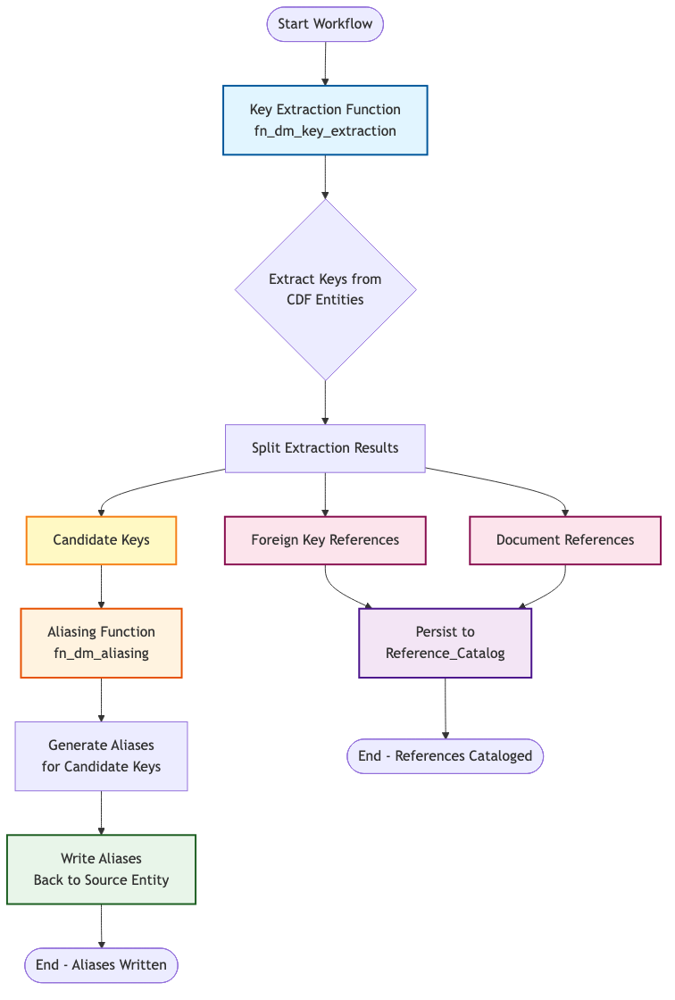
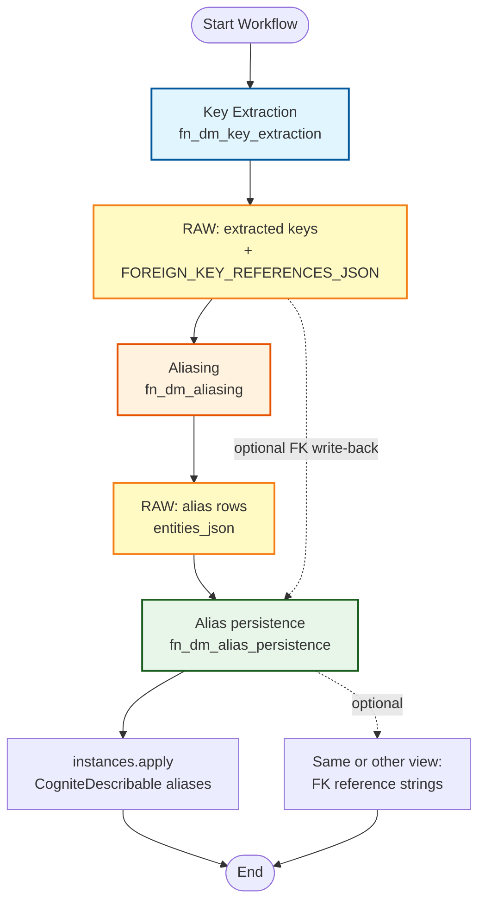

# Key Extraction and Aliasing Workflow

## Workflow Diagram



### Mermaid Source Code



## Detailed Flow Description

### 1. Key Extraction Phase
- **Component**: `fn_dm_key_extraction` CDF Function
- **Input**: CDF data model entities from configured source views
- **Process**:
  - Applies extraction rules from config (**regex**, fixed width, token reassembly, heuristic — the **default CDM scope** uses **regex only**)
  - Extracts candidate keys, foreign key references, and document references
  - Validates and filters results by confidence
- **Output**: `ExtractionResult` containing:
  - `candidate_keys`: List of extracted candidate keys
  - `foreign_key_references`: List of foreign key references
  - `document_references`: List of document references

### 2. RAW handoff (between tasks)
- **Why**: CDF Workflows do not automatically pass function outputs to the next task.
- **Key extraction** writes rows to a configured RAW table (candidate keys per field, plus `FOREIGN_KEY_REFERENCES_JSON` when rules produce FKs).
- **Aliasing** reads that table and writes alias rows to a second RAW table.

### 3. Aliasing Phase
- **Component**: `fn_dm_aliasing` CDF Function
- **Input**: Candidate keys from key-extraction RAW
- **Process**:
  - Generates aliases for each candidate key
  - Applies transformation rules from config (default scope: semantic expansion, unit-prefix strip, leading-zero normalization, document aliases — larger example scopes add character substitution, ISA-style expansion, etc.)
  - Validates generated aliases
- **Output**: Aliases for each candidate key

### 4. Alias (and optional FK) persistence
- **Component**: `fn_dm_alias_persistence`
- **Input**: Alias rows from RAW (or inline `aliasing_results`); optionally foreign-key JSON from key-extraction RAW when `write_foreign_key_references` is true
- **Process**:
  - Applies the alias list to instances via **CogniteDescribable** (`cdf_cdm` / `v1`); property defaults to `aliases` — override with `alias_writeback_property` / `aliasWritebackProperty` on the persistence task `data` (see module README)
  - Optionally writes deduplicated FK reference strings to **`foreign_key_writeback_property`** on the same or another view (task `data`)
- **Output**: Updated entities; handler summary includes `aliases_persisted`, and when FK write is enabled `foreign_keys_persisted` / `entities_fk_updated`

### 5. Reference catalog (roadmap)
- Foreign-key and document-reference **catalog** persistence (separate from optional Describable FK string lists) is not implemented in this workflow yet; see module README roadmap.

## Data Flow

```
DM entities → fn_dm_key_extraction → RAW (keys + FK JSON)
                → fn_dm_aliasing (reads RAW) → RAW (aliases + entities_json)
                → fn_dm_alias_persistence (reads RAW) → DM apply (CogniteDescribable; optional FK property)
```

## Implementation Notes

### Current workflow (`cdf_key_extraction_aliasing` v1)
1. **Key extraction** — queries source views, writes extraction output to RAW.
2. **Aliasing** — reads extraction RAW, writes alias rows to RAW.
3. **Alias persistence** — reads alias RAW, applies aliases to `CogniteDescribable`; optional FK strings from extraction RAW when configured.

### Possible extensions
- Dedicated tasks or pipelines for a **reference catalog** (FK / document references) instead of or in addition to Describable FK string lists.

## Component Details

### Key Extraction Output Format
```python
ExtractionResult(
    entity_id: str,
    candidate_keys: List[ExtractedKey],      # → Aliasing
    foreign_key_references: List[ExtractedKey],  # → RAW JSON; optional Describable write-back
    document_references: List[ExtractedKey]      # → extracted; catalog TBD (roadmap)
)
```

### Aliasing Output Format
```python
AliasingResult(
    original_tag: str,  # Candidate key value
    aliases: List[str],  # Generated aliases
    metadata: Dict      # Alias metadata
)
```

---

**Diagram Version**: 1.2  
**Last Updated**: RAW handoff, optional FK write-back; default CDM scope is regex-only extraction with a slim aliasing stack (see `config/scopes/default/key_extraction_aliasing.yaml`)
