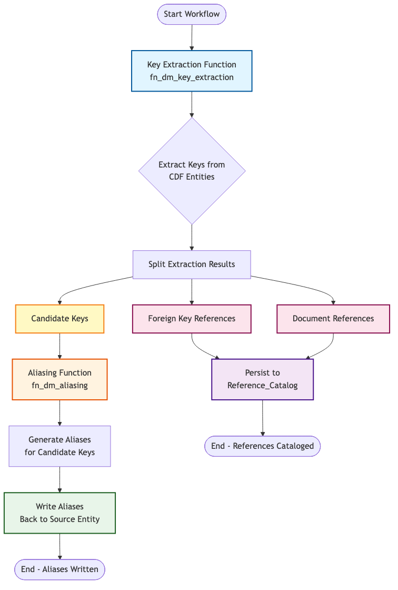

# Key Extraction and Aliasing Results Summary

**Generated:** 2025-10-31 15:24:37
**Results Source:** 20251031_152317

## Executive Summary

This document provides a comprehensive analysis of the key extraction and aliasing pipeline execution results, covering processing statistics, entity type breakdowns, extraction methods, and aliasing transformations.

### Workflow Overview

The following diagram illustrates the complete workflow process from key extraction through aliasing to persistence:

**Workflow Steps:**
1. **Key Extraction** - Extracts candidate keys, foreign key references, and document references from CDF entities
2. **Result Splitting** - Separates extraction results into distinct streams based on type
3. **Aliasing** - Generates aliases for candidate keys to improve matching
4. **Write Aliases** - Persists aliases back to source entities in CDF
5. **Reference Catalog** - Stores foreign key references and document references (future implementation)

---

## 📊 Key Extraction Results

### Overall Statistics

- **Total Entities Processed:** 218
- **Total Candidate Keys Extracted:** 638
- **Total Foreign Key References:** 2
- **Total Document References:** 0

### Entity Type Breakdown

| Entity Type | Count | Candidate Keys | Foreign Keys | Document Refs |
|------------|-------|---------------|--------------|---------------|
| Asset | 7 | 8 | 2 | 0 |
| File | 11 | 19 | 0 | 0 |
| Timeseries | 200 | 611 | 0 | 0 |

### Source View Statistics

| View | Entity Count |
|------|--------------|
| CogniteAsset | 7 |
| CogniteFile | 11 |
| CogniteTimeSeries | 200 |

### Extraction Methods

| Method | Count | Percentage |
|--------|-------|------------|
| Regex | 322 | 50.5% |
| Fixed_width | 200 | 31.3% |
| Heuristic | 116 | 18.2% |

### Top Extraction Rules

| Rule Name | Count | Percentage |
|-----------|-------|------------|
| file_name_extraction | 218 | 34.2% |
| timeseries_tag_pattern_fixed_width | 200 | 31.3% |
| heuristic_tag_extraction | 116 | 18.2% |
| timeseries_tag_pattern_extraction | 59 | 9.2% |
| instrument_tag_extraction | 37 | 5.8% |
| pump_tag_extraction | 8 | 1.3% |

### Confidence Score Statistics

- **Average Confidence:** 0.950
- **Minimum Confidence:** 0.795
- **Maximum Confidence:** 1.000

### Extraction Methods Description

The key extraction system uses different methods to identify and extract key information from entity data:

#### 1. Regex Extraction (50.5% of extractions)

**What it does:** Identifies structured patterns in text, such as equipment tags like `P-101` or `FCV-2001A`.

**How it works:**
- Looks for specific patterns and formats in entity names and descriptions
- Works best with consistent, well-formatted identifiers
- Commonly used for equipment tags, instrument identifiers, and file names

**Best for:** Structured data with consistent naming conventions

#### 2. Heuristic Extraction (18.2% of extractions)

**What it does:** Identifies keys in data that doesn't follow strict patterns, using statistical analysis and context clues.

**How it works:**
- Uses multiple strategies to find identifiers even when formats vary
- Analyzes text position, character patterns, and surrounding context
- Learns from examples to identify similar patterns

**Best for:** Inconsistent or legacy data where formats vary across systems

#### 3. Fixed Width Extraction

**What it does:** Extracts information from structured text where data appears in fixed positions (like columns in a table).

**Best for:** Tabular data or fixed-format records from legacy systems

#### 4. Token Reassembly Extraction

**What it does:** Builds complete identifiers by combining pieces of information from multiple fields (like combining site, unit, and equipment codes).

**Best for:** Hierarchical naming systems where tags are constructed from multiple components

---

## 🔄 Aliasing Results

### Overall Statistics

- **Total Tags Processed:** 638
- **Total Aliases Generated:** 3095
- **Average Aliases per Tag:** 4.85
- **Unique Transformation Rules Applied:** 16

### Alias Distribution

- **Minimum Aliases per Tag:** 0
- **Maximum Aliases per Tag:** 16
- **Median Aliases per Tag:** 8

### Entity Type Aliasing Statistics

| Entity Type | Tags Processed | Total Aliases | Avg Aliases/Tag |
|------------|---------------|---------------|-----------------|
| Asset | 8 | 96 | 12.00 |
| File | 19 | 73 | 3.84 |
| Timeseries | 611 | 2926 | 4.79 |

### Top Applied Transformation Rules by Entity Type

#### Asset Entity Type

| Rule Name | Application Count | Percentage |
|-----------|------------------|------------|
| normalize_separators_to_hyphen | 8 | 6.7% |
| separator_variants_bidirectional | 8 | 6.7% |
| generate_separator_variants | 8 | 6.7% |
| add_site_prefix | 8 | 6.7% |
| add_unit_prefix | 8 | 6.7% |
| add_equipment_type_suffix | 8 | 6.7% |
| pattern_based_replacement | 8 | 6.7% |
| equipment_type_expansion | 8 | 6.7% |
| generate_instruments | 8 | 6.7% |
| hierarchical_expansion | 8 | 6.7% |
| isa_instrument_expansion | 8 | 6.7% |
| equipment_tag_expansion | 8 | 6.7% |
| hierarchical_tag_expansion | 8 | 6.7% |
| case_variants | 8 | 6.7% |
| leading_zero_normalization | 8 | 6.7% |

**Note:** Asset entities receive the most comprehensive transformation coverage, with 15 transformation rules applied across 8 asset tags processed.

#### File Entity Type

| Rule Name | Application Count | Percentage |
|-----------|------------------|------------|
| document_aliases | 19 | 100.0% |

**Note:** File entities receive specialized document-specific transformations, focusing on document naming variants and revision number handling.

#### Timeseries Entity Type

| Rule Name | Application Count | Percentage |
|-----------|------------------|------------|
| generate_separator_variants | 611 | 25.0% |
| isa_instrument_expansion | 611 | 25.0% |
| case_variants | 611 | 25.0% |
| leading_zero_normalization | 611 | 25.0% |

**Note:** Timeseries entities receive streamlined transformations focusing on separator variants, instrument expansion, case variations, and zero normalization - the most commonly needed transformations for data stream identifiers.

### Aliasing Transformation Types Description

The aliasing system generates alternative names (aliases) for extracted keys to improve matching across different systems. This is important because the same equipment might be referred to differently in various systems (e.g., `P-101`, `P_101`, `P101` all refer to the same pump).

**12 transformation types are available:**

1. **Character Substitution** - Creates variations by changing separators (hyphens, underscores, spaces)
2. **Prefix/Suffix Operations** - Adds site, unit, or equipment type prefixes/suffixes based on context
3. **Regex Substitution** - Normalizes tag formats to standard conventions
4. **Case Transformation** - Creates uppercase, lowercase, and title case variants
5. **Equipment Type Expansion** - Expands abbreviations (P → PUMP, PMP) to generate full names
6. **Related Instruments** - Generates related instrument tags (FIC, PIC, TIC, LIC) for equipment
7. **Hierarchical Expansion** - Creates full hierarchical paths (site-unit-equipment) when context is available
8. **Document Aliases** - Handles document naming variants, removes revision numbers from file names
9. **Leading Zero Normalization** - Normalizes numeric formatting (P-001, P-01, P-1)
10. **Pattern Recognition** - Recognizes industry-standard patterns (ISA/ANSI) and identifies equipment types
11. **Pattern-Based Expansion** - Generates ISA-compliant aliases following industry standards
12. **Composite Transformations** - Chains multiple transformations together for complex alias generation

**Why this matters:** Different systems may use different formats for the same identifier. By generating aliases, the system can match entities even when they're named differently, improving data integration and search capabilities.

---

## 📈 Key Insights

### Extraction Insights

1. **Method Distribution:** Regex extraction method is the most commonly used (322 occurrences).
2. **Entity Type Coverage:** The pipeline processed 3 different entity types, with timeseries representing the largest processing volume (200 entities).
3. **Rule Effectiveness:** The top extraction rule (file_name_extraction) was applied 218 times.

### Aliasing Insights

1. **Transformation Coverage:** 16 unique transformation rules were applied across all processed tags.
2. **Alias Generation:** On average, each tag generated 4.85 aliases, demonstrating effective variant generation.
3. **Most Common Transformations:** The top 3 transformation rules (generate_separator_variants, isa_instrument_expansion, case_variants) account for 71.9% of all rule applications.

---

## 🔍 Sample Results

### Sample Extraction Results

The following table shows examples of entities processed by the extraction pipeline, organized by entity type:

| Entity Type | Entity ID | Entity Name | Candidate Keys | Foreign Key References | Document References |
|-------------|-----------|-------------|----------------|----------------------|---------------------|
| Asset | ASSET-P-101 | P-101 | P-101 | T-301 | None |
| Asset | ASSET-FCV-2001 | FCV-2001 | FCV-2001 | None | None |
| Asset | ASSET-T-301 | T-301 | T-301 | None | None |
| File | VAL_PH-25578-P-4110006-001.pdf | PH-25578-P-4110006-001.pdf | PH-25578-P-4110006-001.pdf | None | None |
| File | VAL_PH-25578-P-4110010-001.pdf | PH-25578-P-4110010-001.pdf | PH-25578-P-4110010-001.pdf | None | None |
| File | VAL_PH-25578-P-4110119-001.pdf | PH-25578-P-4110119-001.pdf | PH-25578-P-4110119-001.pdf | None | None |
| Timeseries | pi:160554 | VAL_23-LY-92529_DensityBands_06sandUL:VA | VAL_23-LY-92529_DensityBands_06sandUL:VALUE, 23-LY-92529 | None | None |
| Timeseries | pi:160238 | VAL_23-KA-9101-M01_E_stop_active:VALUE | VAL_23-KA-9101-, VAL_23-KA-9101-M01_E_stop_active:VALUE | None | None |
| Timeseries | pi:163655 | VAL_45-TT-92506:X.Value | VAL_45-TT-92506, VAL_45-TT-92506:X.Value | None | None |

**What this shows:**

- **Candidate Keys** are the primary identifiers extracted from entity names (e.g., equipment tags like `P-101`, file names like `PH-25578-P-4110006-001.pdf`)
- **Foreign Key References** are references to other entities found in descriptions (e.g., pump P-101 references tank T-301)
- **Document References** are references to engineering drawings or documents (none found in these examples)
- **Entity Types** indicate the type of entity: Assets (equipment), Files (documents), or Timeseries (data streams)

---

## 📝 Notes

- Results were generated from CDF Data Model views: CogniteAsset, CogniteFile, and CogniteTimeSeries
- All extracted candidate keys were processed through the aliasing pipeline
- Aliases have been persisted back to the CogniteDescribable view in CDF
- Confidence scores for extraction range from 0.795 to 1.000

---

*This summary was automatically generated from the latest pipeline execution results.*
