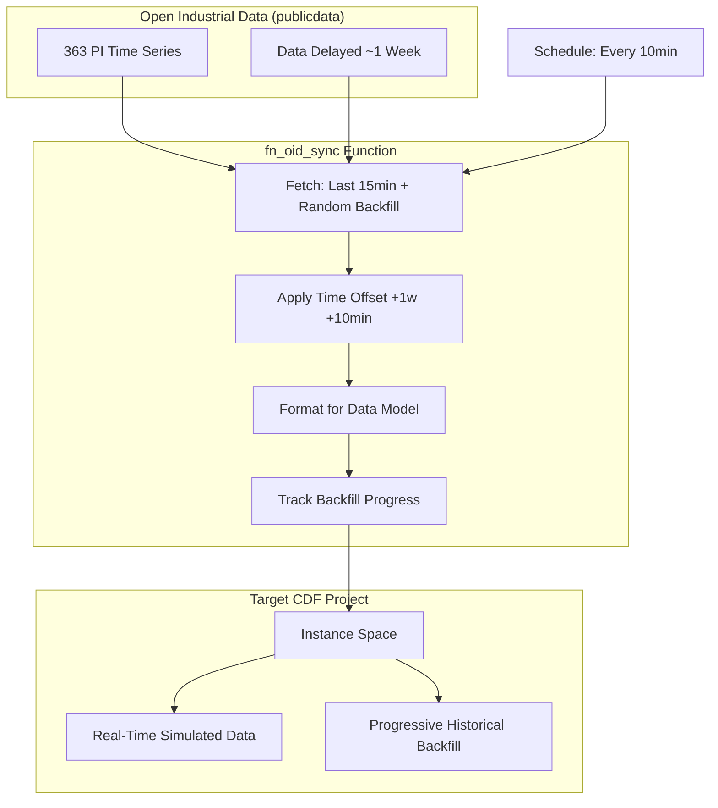

# Open Industrial Data Sync Module

This module synchronizes time series data from Cognite's [Open Industrial Data (OID)](https://hub.cognite.com/open-industrial-data-211) project to your target CDF project, simulating real-time data streaming by fetching historical data and time-shifting it to appear current.

## Why Use This Module?

**Simulate Real-Time Industrial Data Streams for Development and Testing**

Getting realistic industrial data for development, testing, and demos is challenging. This module delivers **production-ready data synchronization** that transforms OID's historical data into simulated real-time streams—perfect for building and showcasing industrial applications.

**Key Benefits:**

- ⚡ **Smart Sync Strategy**: Recent data sync for all time series + progressive historical backfill
- 🔄 **Real-Time Simulation**: Applies time offset to make ~1-week delayed OID data appear current
- 📊 **Compact Logging**: Optimized for UI popups with progress tracking
- 🛡️ **Robust Error Handling**: Graceful handling of API errors, rate limiting, and timeouts
- ⚙️ **Highly Configurable**: YAML-driven configuration for sync intervals, time offsets, and more
- 🎯 **Zero Duplicate Data**: Intelligent tracking prevents re-syncing the same data
- 📈 **Progressive Backfill**: Builds 12 weeks of history without overwhelming the system

**Time & Cost Savings:**

- **Development Time**: Instant access to realistic industrial data without building custom data generators
- **Demo Readiness**: Production-quality data streams for showcasing applications
- **Testing Confidence**: Real-world data patterns for validation and testing
- **Zero Setup**: All resources bundled—datasets, functions, pipelines, auth groups

**Real-World Performance:**

- **Data Volume**: ~363 PI time series with full historical coverage
- **Sync Frequency**: Every 10 minutes for near real-time experience
- **Backfill Speed**: Complete historical coverage in ~60 hours
- **Memory Safe**: Weekly batching prevents out-of-memory issues

## 🎯 Overview

The Open Industrial Data Sync module is designed to:
- **Synchronize OID time series** to your target CDF project
- **Simulate real-time data** by applying configurable time offsets
- **Progressively backfill history** without impacting system performance
- **Track sync state** via time series metadata
- **Provide comprehensive logging** optimized for monitoring
- **Handle errors gracefully** with automatic retry logic

## 🏗️ Module Architecture

```
open_industrial_data_sync/
├── 📁 auth/                                # Authentication groups
│   └── 📄 oid_sync.Group.yaml                     # Access control group definition
├── 📁 data_sets/                           # Dataset definitions
│   └── 📄 ds_oid_sync.DataSet.yaml                # Dataset for organizing resources
├── 📁 extraction_pipelines/                # Pipeline configurations
│   ├── 📄 ep_oid_sync.ExtractionPipeline.yaml     # Pipeline definition
│   └── 📄 ep_oid_sync.config.yaml                 # Pipeline configuration
├── 📁 functions/                           # CDF Functions
│   ├── 📄 fn_oid_sync.Function.yaml               # Function definition
│   ├── 📄 schedules.Schedule.yaml                 # Function schedule (10-min intervals)
│   └── 📁 fn_oid_sync/                            # Function code
│       ├── 📄 handler.py                          # Main entry point
│       ├── 📄 dependencies.py                     # Dependency injection
│       ├── 📄 requirements.txt                    # Python dependencies
│       ├── 📁 services/
│       │   ├── 📄 ConfigService.py                # Configuration loading
│       │   ├── 📄 DataSyncService.py              # Data synchronization logic
│       │   └── 📄 LoggerService.py                # Compact logging
│       └── 📁 utils/
│           └── 📄 DataStructures.py               # Data classes
├── 📄 default.config.yaml                  # Module configuration variables
├── 📄 module.toml                          # Module metadata
└── 📄 test_oid_sync.py                     # Validation test script
```

## 🚀 Core Components

### 1. OID Sync Function

**Purpose**: Synchronizes time series data from OID to your target project with time shifting

**Key Features**:
- 🔄 **Dual Sync Mode**: Recent data for all series + random backfill selection
- ⏰ **Time Offset Application**: Shifts historical data to appear current
- 📊 **Progress Tracking**: Uses metadata tags to track backfill completion
- 🧠 **Memory-Safe Batching**: Processes 1 week at a time to prevent OOM
- 📈 **Comprehensive Metrics**: Returns detailed sync statistics

### 2. Extraction Pipeline

**Purpose**: Manages configuration and provides execution tracking

**Key Features**:
- ⚙️ **Centralized Configuration**: All sync parameters in one place
- 📊 **Run Logging**: Tracks execution history and status
- 🔧 **Easy Updates**: Change behavior without redeploying code

### 3. Scheduled Execution

**Purpose**: Automates sync execution at configurable intervals

**Key Features**:
- ⏱️ **10-Minute Default**: Near real-time data simulation
- 🔄 **Continuous Operation**: Runs automatically without intervention
- 📅 **Cron-Based**: Standard cron expression for scheduling

## 📊 Data Flow



## 🔧 Configuration

### Module Configuration (`default.config.yaml`)

```yaml
# REQUIRED: Update these values
oidDatasetExternalId: ds_oid_sync
instanceSpace: your_instance_space  # e.g., springfield_instances
groupSourceId: your-azure-ad-group-source-id

# Function authentication (use environment variables)
functionClientId: ${IDP_CLIENT_ID}
functionClientSecret: ${IDP_CLIENT_SECRET}

# Schedule (default: every 10 minutes)
scheduleCronExpression: "*/10 * * * *"
```

### Pipeline Configuration (`ep_oid_sync.config.yaml`)

**OID Connection** (connects to publicdata):
```yaml
oid_connection:
  tenant_id: ...        # Azure AD tenant for OID (default provided: 48d5043c-cf70-4c49-881c-c638f5796997)
  client_id: ...        # Application ID for OID (default provided: 1b90ede3-271e-401b-81a0-a4d52bea3273)
  cluster: api          # CDF cluster
  project: publicdata   # Project name
```

**Sync Configuration**:
```yaml
sync_configuration:
  sync_realtime_start: 15m-ago     # Recent data window
  sync_all_end: 168h-ago           # End boundary for syncs
  sync_random_start: 12w-ago       # Historical backfill range
  instance_space: ...              # Target space for time series data
  reset_backfill: false            # Set true to restart backfill
```

**Time Offset** (to simulate real-time):
```yaml
time_offset:
  offset_weeks: 1       # Shift data forward in weeks
  offset_minutes: 10    # Fine-tune offset in minutes
```

**Logging**:
```yaml
logging:
  log_level: INFO       # DEBUG, INFO, WARNING, ERROR
```

### Environment Variables

```bash
# OID Credentials (REQUIRED)
OPEN_ID_CLIENT_SECRET=your-generated-secret-here

# Function Authentication
IDP_CLIENT_ID=your-client-id
IDP_CLIENT_SECRET=your-client-secret
```

## 🏃‍♂️ Getting Started

### 1. Prerequisites

- **Python 3.11+**
- **Active CDF project** with CDF Toolkit configured
- **Open Industrial Data credentials**: Generate a client secret to access OID
  - Visit: https://hub.cognite.com/open-industrial-data-211 (requires Cognite Hub account)
  - Scroll to "Generate client secret for OID" section
  - Select application type: **"Postman and Python SDK"** or **"Other Javascript SPA"**
  - Click **"Create Client Secret"** and copy the generated secret
  - Note: Secrets expire every 180 days
- **Time series must exist** in your target CDF project before syncing data
  - The module assumes PI time series with `external_id` prefix `pi:` already exist

### 2. Get Your Open Industrial Data Client Secret

**CRITICAL:** You must have OID credentials before deployment.

1. Login to https://hub.cognite.com/open-industrial-data-211
2. Generate client secret (valid for 180 days)
3. Add to your `.env` file:
   ```bash
   OPEN_ID_CLIENT_SECRET=your-generated-secret-here
   ```

### 3. Configure the Module

Edit `modules/open_industrial_data_sync/default.config.yaml`:

```yaml
# REQUIRED: Update these values
oidDatasetExternalId: ds_oid_sync
instanceSpace: your_instance_space  # e.g., springfield_instances
groupSourceId: your-azure-ad-group-source-id

# Function authentication (use environment variables)
functionClientId: ${IDP_CLIENT_ID}
functionClientSecret: ${IDP_CLIENT_SECRET}

# Schedule (default: every 10 minutes)
scheduleCronExpression: "*/10 * * * *"
```

### 4. Add Module to Project Configuration

Edit your `config.{env}.yaml` (e.g., `config.dev.yaml`):

```yaml
environment:
  name: dev
  project: your-project-name
  validation-type: dev
  selected:
    - modules/open_industrial_data_sync  # Add this line

variables:
  modules:
    open_industrial_data_sync:
      oidDatasetExternalId: ds_oid_sync
      instanceSpace: springfield_instances
      groupSourceId: your-azure-ad-group-source-id
      functionClientId: ${IDP_CLIENT_ID}
      functionClientSecret: ${IDP_CLIENT_SECRET}
```

### 5. Build and Deploy

```bash
# Build the module
cdf build --env your-environment --verbose

# Dry run to preview changes
cdf deploy --env your-environment --dry-run --verbose

# Deploy to CDF
cdf deploy --env your-environment --verbose
```

### 6. Verify Deployment

After deployment:
1. Check the CDF UI for the function: `fn_oid_sync`
2. Verify the extraction pipeline: `ep_oid_sync`
3. Confirm the function schedule is active
4. Monitor the first execution in the function logs

## 🎯 Use Cases

### Development and Testing
- **Realistic Data**: Test applications with real industrial data patterns
- **Continuous Streams**: Validate real-time data processing pipelines
- **Historical Analysis**: Build and test time series analytics

### Demonstrations
- **Live Demos**: Show real-time data flowing through your applications
- **Customer POCs**: Provide impressive demos with actual industrial data
- **Training**: Use realistic data for training sessions

### Integration Testing
- **End-to-End Testing**: Validate complete data pipelines
- **Performance Testing**: Test with production-like data volumes
- **Edge Cases**: Access diverse industrial data scenarios

## 📈 How It Works

### Smart Backfill Strategy

**Every 10 minutes:**
1. All ~363 PI time series get the latest 15 minutes of data (simulating real-time updates)
2. One random un-backfilled time series gets historical data (12 weeks in 1-week batches)
3. When complete, the time series is tagged with `oid_backfilled: true` metadata
4. After ~60 hours, all series have full history and only real-time updates continue

**Benefits:**
- Zero duplicate data
- Memory-safe batching (processes 1 week at a time)
- Progressive backfill without external state tracking
- No gaps in real-time data

### Return Value

```json
{
  "success": true,
  "time_series_synced": 364,
  "datapoints_inserted": 20514,
  "errors": 0
}
```

## 📊 Logging Output

The module uses compact logging optimized for small windows:

```
==================================================
Starting Open Industrial Data Sync
==================================================
[10:30:15] INFO: Fetching PI time series list from OID...
[10:30:17] INFO: ✓ Found 363 PI time series
[10:30:17] INFO: Syncing 363 TS from 169h-ago (recent 1h)
[10:30:20] INFO: Retrieved 12,450 datapoints, inserting...
[10:30:22] INFO: ✓ Inserted 12,450 datapoints
[10:30:22] INFO: Random backfill: pi:160731
[10:30:22] INFO: Syncing 1 TS from 12w-ago (backfill 12w)
[10:30:25] INFO: Retrieved 8,064 datapoints, inserting...
[10:30:26] INFO: ✓ Inserted 8,064 datapoints
==================================================
[10:30:26] INFO: Summary: 11.5s | TS: 364 | DPs: 20,514 | Errors: 0
==================================================
```

## 🧪 Testing

### Local Testing

You can test the function locally before deployment:

```bash
cd modules/open_industrial_data_sync
python test_oid_sync.py
```

This validation script mirrors the original notebook logic to ensure consistency.

### Local Function Execution

Run the function locally using CDF Toolkit:

```bash
cdf run function local fn_oid_sync
```

This allows you to validate function output and behavior before deploying to CDF.

### Debugging

Set the log level to `DEBUG` in `ep_oid_sync.config.yaml` for detailed execution traces:

```yaml
logging:
  log_level: "DEBUG"
```

## 🔧 Troubleshooting

### Common Issues

1. **No Data Syncing**
   - Check that `sync_all_end` isn't too recent (OID has ~7 day delay)
   - Verify time series exist in target project before syncing data
   - Confirm the function schedule is active

2. **Authentication Errors**
   - Regenerate client secret at https://hub.cognite.com/open-industrial-data-211
   - Verify `OPEN_ID_CLIENT_SECRET` is set in your `.env` file
   - Redeploy the module to update CDF function secrets

3. **Memory Errors**
   - Function uses weekly batching to prevent OOM
   - Reduce `sync_random_start` range if issues persist

4. **Missing Time Series**
   - Ensure time series with prefix `pi:` exist in target project
   - Create them manually or use a transformation/ingestion workflow first

5. **Deployment Errors**
   - Verify `groupSourceId` is correctly set in `default.config.yaml`
   - Check that `instanceSpace` exists in your CDF project
   - Ensure `IDP_CLIENT_ID` and `IDP_CLIENT_SECRET` env vars are set

### Error Handling

The module handles:
- ✅ API connection failures
- ✅ Authentication errors
- ✅ Missing datapoints
- ✅ Rate limiting
- ✅ Timeout issues

All errors are logged with clear messages and the function returns a status dictionary.

## 📚 Migration Note

This module can replace `modules/sourcesystem/cdf_pi/functions/fn_open_id_feeder` with:
- ✅ Better structure following CDF Toolkit module patterns
- ✅ Standalone deployment (all resources bundled)
- ✅ Compact logging optimized for UI popups
- ✅ Improved error handling and retry logic
- ✅ YAML-driven configuration
- ✅ Comprehensive testing and validation

## 🤝 Contributing

1. Follow the established module structure
2. Add comprehensive tests for new functionality
3. Update documentation for any changes
4. Ensure error handling is maintained
5. Test with realistic data volumes

## 📄 License

This module is part of the Cognite Templates repository and follows the same licensing terms.
