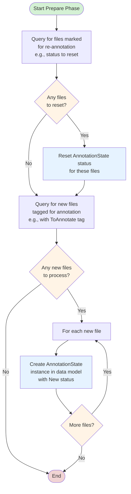
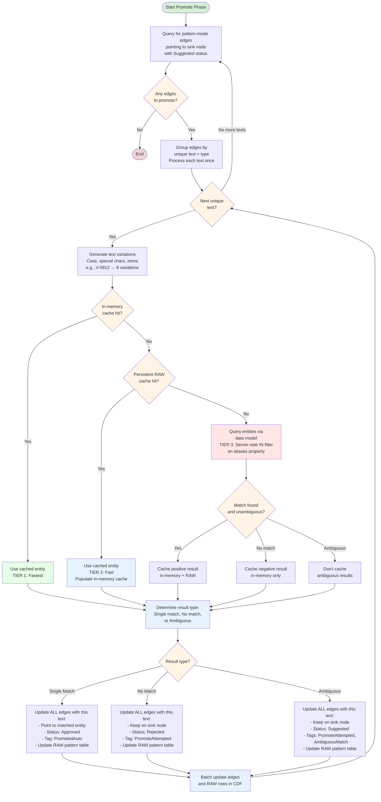
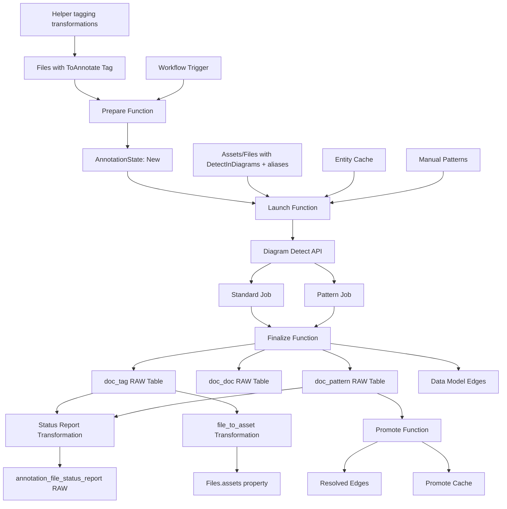

# CDF File Annotation Module

This module provides a comprehensive framework for automating the process of annotating files within Cognite Data Fusion (CDF), using a data model-centric approach to manage the annotation lifecycle from file selection to result processing and reporting.

## Why Use This Module?

**Automate Your Document Contextualization with Production-Ready Code**

Building a file annotation solution from scratch is complex and time-consuming. This module delivers **production-ready, battle-tested code** that handles the complete annotation lifecycle, from identifying files to processing results and generating reports.

**Key Benefits:**

- ⚡ **Configuration-Driven**: Entire workflow controlled by a single config file—adapt to different data models without code changes
- 🎯 **Dual Annotation Modes**: Simultaneously runs standard entity matching and pattern-based detection for comprehensive coverage
- 🤖 **Automatic Pattern Promotion**: Intelligent text matching with multi-tier caching automatically resolves pattern annotations
- 📄 **Large Document Support**: Handles files >50 pages by chunking, processing iteratively, and tracking progress
- 🔄 **Parallel Execution Ready**: Robust optimistic locking prevents race conditions in concurrent processing
- 📊 **Comprehensive Reporting**: Results stored in dedicated RAW tables plus extraction pipeline logs for full traceability
- 🛡️ **Enterprise Scale**: Designed for tens of thousands of complex files with optimized batch processing and caching
- 🔧 **Local Development**: All handlers run locally with VSCode debug support

**Time & Cost Savings:**

- **Development Time**: Save weeks of development by leveraging production-ready annotation logic
- **Manual Review Reduction**: Automatic pattern promotion dramatically reduces manual review burden
- **Scalability Built-In**: Optimized caching and batching avoid months of performance tuning
- **Maintenance**: Interface-based design enables customization without modifying core code

**Real-World Performance:**

- **Batch Processing**: Configurable batch sizes (1-50 files per diagram detect call)
- **Cache Efficiency**: Scope-based caching reuses entity context across files in same site/unit
- **Entity Search**: 50-500x better performance by querying smaller entity dataset vs. annotation edges
- **Self-Improving**: Persistent cache accumulates successful mappings over time

## 🎯 Overview

The CDF File Annotation module is designed to:
- **Automate file annotation** using Cognite's Diagram Detect API
- **Support dual annotation modes** for standard matching and pattern-based detection
- **Handle large documents** with automatic chunking and progress tracking
- **Enable parallel processing** with optimistic locking for concurrency safety
- **Provide automatic pattern promotion** to resolve annotations without manual review
- **Generate comprehensive reports** in RAW tables for analysis and auditing
- **Support workflow automation** through CDF Workflows integration

## 🏗️ Module Architecture

```
cdf_file_annotation/
├── 📁 functions/                           # CDF Functions
│   ├── 📁 fn_file_annotation/              # All four stages
│   │   ├── 📄 handler.py
│   │   ├── 📁 stages/                      # prepare, launch, finalize, promote
│   │   ├── 📁 services/
│   │   └── 📁 utils/
│   └── 📄 functions.Function.yaml          # Single Function resource
├── 📁 workflows/                           # One end-to-end workflow
│   └── 📄 wf_file_annotation.*
├── 📁 transformations/                     # SQL transformations
│   ├── 📄 tag_assets_detect_in_diagrams.Transformation.{yaml,sql}   # Helper: merge DetectInDiagrams on assets
│   ├── 📄 tag_files_detect_in_diagrams.Transformation.{yaml,sql}    # Helper: merge DetectInDiagrams on files
│   ├── 📄 tag_files_to_annotate.Transformation.{yaml,sql}         # Helper: merge ToAnnotate on files
│   ├── 📄 file_to_asset.Transformation.{yaml,sql}                 # Populate Files.assets from annotations
│   └── 📄 file_annotation_status_report.Transformation.{yaml,sql}   # Per-file matched/unmatched tag report
├── 📁 data_modeling/                       # Data model definitions
│   ├── 📁 containers/                             # Container definitions
│   ├── 📁 views/                                  # View definitions
│   ├── 📁 nodes/                                  # Node definitions
│   └── 📄 hdm.datamodel.yaml                      # Data model definition
├── 📁 raw/                                 # RAW table definitions
│   ├── 📄 rawTableDocDoc.Table.yaml               # Doc-to-doc link results
│   ├── 📄 rawTableDocTag.Table.yaml               # Doc-to-tag link results
│   ├── 📄 rawTableDocPattern.Table.yaml           # Pattern detection results
│   ├── 📄 rawTableCache.Table.yaml                # Entity sync state and pattern samples
│   ├── 📄 rawTablePromoteCache.Table.yaml         # Promote cache
│   ├── 📄 rawTableAnnotationStatusReport.Table.yaml  # Per-file status report output
│   └── 📄 rawManualPatternsCatalog.Table.yaml     # Manual pattern overrides
├── 📁 extraction_pipelines/                # Pipeline configurations
│   ├── 📄 ep_file_annotation.ExtractionPipeline.yaml
│   └── 📄 ep_file_annotation.config.yaml          # Main configuration file
├── 📁 data_sets/                           # Data set definitions
├── 📁 auth/                                # Authentication and permissions
├── 📁 streamlit/                           # Dashboard applications
│   ├── 📁 file_annotation_dashboard_annotation_quality/  # Annotation quality dashboard
│   └── 📁 file_annotation_dashboard_pipeline_health/     # Pipeline health dashboard
├── 📁 upload_data/                         # Sample data for patterns
├── 📁 local_setup/                         # Local dev environment (.env.tmpl, notebook, launch.json)
├── 📄 default.config.yaml                  # Module configuration
├── 📄 module.toml                          # Module metadata
├── 📄 DEPLOYMENT.md                        # Deployment guide
├── 📄 CONTRIBUTING.md                      # Contribution guide
└── 📁 detailed_guides/                     # Additional documentation
    ├── 📄 CONFIG.md                            # Configuration guide
    ├── 📄 CONFIG_PATTERNS.md                   # Operational recipes
    └── 📄 DEVELOPING.md                        # Developer extension guide
```

## 🚀 Core Functions

### 1. Prepare Function

**Purpose**: Identify files that need annotation and initialize their state

**Key Features**:
- 🔍 **File Discovery**: Queries for files tagged for annotation (e.g., "ToAnnotate")
- 🔄 **Reset Support**: Identifies and resets files marked for re-annotation
- 📊 **State Initialization**: Creates `AnnotationState` instances with "New" status

<details>
<summary>Click to view Prepare Phase flowchart</summary>



</details>

### 2. Launch Function

**Purpose**: Launch annotation jobs for files that are ready

**Key Features**:
- 📦 **Scope-Based Batching**: Groups files by site/unit for efficient processing
- 🎯 **Entity Selection**: Loads assets and files tagged `DetectInDiagrams` within scope (plus `ScopeWideDetect` across secondary scope)
- 🔁 **Incremental Entity Read**: Reads each entity view through the DMS sync endpoint and keeps the tagged instances in a CDF file (see [Reading the match entities](#reading-the-match-entities))
- 🔤 **Alias-Driven Matching**: Sends entity `aliases` to Diagram Detect as search candidates (falls back to `name` when aliases are absent)
- 🎯 **Pattern Generation**: Auto-generates regex patterns from entity aliases
- 📋 **Manual Override Support**: Merges manual patterns from RAW catalog
- 🔄 **Dual Job Submission**: Launches standard + pattern mode jobs

```mermaid
flowchart TD
    Start([Start Launch Phase]) --> QueryFiles[Query AnnotationState<br/>for New or Retry status]
    QueryFiles --> CheckFiles{Any files<br/>to process?}
    CheckFiles -->|No| End([End])
    CheckFiles -->|Yes| GroupFiles[Group files by<br/>primary scope<br/>e.g., site, unit]

    GroupFiles --> NextScope{Next scope<br/>group?}
    NextScope -->|Yes| SyncEntities[Sync entity views into<br/>the cached entity file<br/>once per space]

    SyncEntities --> FilterScope[Filter entities by tag<br/>and scope in memory]
    FilterScope --> GenPatterns[Auto-generate pattern samples<br/>from entity aliases<br/>e.g., FT-101A → &#91;FT&#93;-000&#91;A&#93;]
    GenPatterns --> GetManual[Retrieve manual pattern<br/>overrides from RAW catalog<br/>GLOBAL, site, or unit level]
    GetManual --> MergePatterns[Merge and deduplicate<br/>auto-generated and<br/>manual patterns]
    MergePatterns --> UseCache[Use entities and patterns]

    UseCache --> ProcessBatch[Process files in batches<br/>up to max batch size]
    ProcessBatch --> SubmitJobs[Submit Diagram Detect jobs:<br/>1 Standard annotation<br/>2 Pattern mode if enabled]
    SubmitJobs --> UpdateState[Update AnnotationState:<br/>- Set status to Processing<br/>- Store both job IDs]
    UpdateState --> NextScope
    NextScope -->|No more groups| QueryFiles

    style Start fill:#d4f1d4
    style End fill:#f1d4d4
    style CheckFiles fill:#fff4e6
    style NextScope fill:#fff4e6
    style UseCache fill:#e6f3ff
    style UpdateState fill:#e6f3ff
```

<details>
<summary>Click to view Launch Phase flowchart</summary>



</details>

### 3. Finalize Function

**Purpose**: Retrieve, process, and store annotation job results

**Key Features**:
- 🔒 **Optimistic Locking**: Claims jobs to prevent race conditions
- 🔀 **Result Merging**: Combines standard and pattern results with deduplication
- 📊 **Confidence Filtering**: Auto-approve vs. suggest based on thresholds, set separately for asset links and file links- 📁 **RAW Reporting**: Writes to `doc_tag`, `doc_doc`, and `doc_pattern` tables
- 📄 **Multi-Page Tracking**: Handles progress for large documents

```mermaid
flowchart TD
    Start([Start Finalize Phase]) --> QueryState[Query for ONE AnnotationState<br/>with Processing status<br/>Use optimistic locking to claim it]
    QueryState --> CheckState{Found annotation<br/>state instance?}
    CheckState -->|No| End([End])
    CheckState -->|Yes| GetJobId[Extract job ID and<br/>pattern mode job ID]

    GetJobId --> FindFiles[Find ALL files with<br/>the same job ID]
    FindFiles --> CheckJobs{Both standard<br/>and pattern jobs<br/>complete?}
    CheckJobs -->|No| ResetStatus[Update AnnotationStates<br/>back to Processing<br/>Wait 30 seconds]
    ResetStatus --> QueryState

    CheckJobs -->|Yes| RetrieveResults[Retrieve results from<br/>both completed jobs]
    RetrieveResults --> MergeResults[Merge regular and pattern<br/>results by file ID<br/>Creates unified result per file]
    MergeResults --> LoopFiles[For each file in merged results]

    LoopFiles --> ProcessResults[Process file results:<br/>- Filter standard by AssetLink / FileLink confidence thresholds<br/>- Capture regular annotations bounding box and page in a set<br/>- Skip pattern duplicates by checking if bounding box exist in set]

    ProcessResults --> CheckClean{First run for<br/>multi-page file?}
    CheckClean -->|Yes| CleanOld[Clean old annotations]
    CheckClean -->|No| CreateEdges
    CleanOld --> CreateEdges[Create edges in data model]

    CreateEdges --> StandardEdges[Standard annotations:<br/>Link file to entities<br/>Write to doc_tag and doc_doc RAW tables]
    StandardEdges --> PatternEdges[Pattern annotations:<br/>Link file to sink node<br/>Write to doc_pattern RAW table]

    PatternEdges --> UpdateTag[Update file tag:<br/>AnnotationInProcess → Annotated]
    UpdateTag --> PrepareUpdate[Prepare AnnotationState update:<br/>- Annotated if complete<br/>- Failed if error<br/>- New if more pages remain<br/>Track page progress]

    PrepareUpdate --> MoreFiles{More files in<br/>merged results?}
    MoreFiles -->|Yes| LoopFiles
    MoreFiles -->|No| BatchUpdate[Batch update ALL<br/>AnnotationState instances<br/>for this job]

    BatchUpdate --> QueryState

    style Start fill:#d4f1d4
    style End fill:#f1d4d4
    style CheckState fill:#fff4e6
    style CheckJobs fill:#fff4e6
    style CheckClean fill:#fff4e6
    style MoreFiles fill:#fff4e6
    style MergeResults fill:#e6f3ff
    style ProcessResults fill:#e6f3ff
    style CreateEdges fill:#e6f3ff
    style BatchUpdate fill:#e6f3ff
```

<details>
<summary>Click to view Finalize Phase flowchart</summary>



</details>

### 4. Promote Function

**Purpose**: Automatically resolve pattern-mode annotations by finding matching entities

**Key Features**:
- 🔍 **Text Normalization**: separate `entityNormalizationPatterns` / `fileNormalizationPatterns` extract tag forms (capture groups joined by `_`; longest match kept). Used for promote search and to filter aliases before auto pattern sample generation per source. Empty list disables filtering for that source.
- 🧠 **Multi-Tier Caching**: In-memory → RAW → Entity search strategy (queries **`aliases`** via server-side IN filter)
- ✅ **Automatic Resolution**: Single match → Approved, No match → Rejected, Multiple → Manual review
- 🏷️ **Tagging**: Adds `PromotedAuto`, `PromoteAttempted`, `AmbiguousMatch` tags
- 📈 **Self-Improving**: Cache grows over time with successful mappings

<details>
<summary>Click to view Promote Phase flowchart</summary>



</details>

## 📋 Data Preparation

Annotation does not populate `aliases` or pipeline tags for you. Before running the workflow, instances need the correct **tags** (pipeline membership) and **aliases** (text matched on diagrams).

### Tags vs aliases

| Property | Purpose | Examples |
|---|---|---|
| **`tags`** | Controls which instances the pipeline includes | `ToAnnotate`, `DetectInDiagrams`, `Annotated` |
| **`aliases`** | Strings Diagram Detect and promote search for on drawings | `23_KA_9101`, `23-KA-9101`, `VAL_23-KA-9101` |

**`tags` are not matched against diagram text.** They gate pipeline behaviour only:

| Tag | Applied to | Effect |
|---|---|---|
| `ToAnnotate` | Files | Prepare picks up the file for annotation |
| `DetectInDiagrams` | Assets and files | Launch includes the instance in the entity cache for diagram detect |
| `ScopeWideDetect` | Assets and files | Included across secondary scope (primary scope only) |

**`aliases`** are what launch and promote match against. Configure `targetEntitiesSearchProperty` / `fileSearchProperty` in the extraction pipeline (default: `aliases`).

### Helper tagging transformations

The module ships transformations under `transformations/` that **merge** tags without overwriting existing values (`array_union`):

| Transformation | Tag added | View |
|---|---|---|
| `tr_tag_assets_detect_in_diagrams` | `DetectInDiagrams` | Target entity view (`targetEntityExternalId`) |
| `tr_tag_files_detect_in_diagrams` | `DetectInDiagrams` | File view (`fileExternalId`) |
| `tr_tag_files_to_annotate` | `ToAnnotate` | File view (`fileExternalId`) |

Each reads from `cdf_nodes(instanceSpace, viewExternalId, version)` and upserts only the `tags` property (`ignoreNullFields: true`).

```bash
cdf transformations run tr_tag_assets_detect_in_diagrams
cdf transformations run tr_tag_files_detect_in_diagrams
cdf transformations run tr_tag_files_to_annotate
```

Configure view external IDs, versions, and instance spaces in `default.config.yaml`. You still need a separate pipeline (for example entity matching / alias update) to populate **`aliases`**.

**Re-annotation:** Helper tagging transformations only add tags. Prepare defaults to
files tagged `ToAnnotate` and excludes `AnnotationInProcess`, `Annotated`, and
`AnnotationFailed`. To reprocess already finished files, add those tags to
`filesToAnnotateTags` (they are then dropped from the exclude list automatically):

```yaml
filesToAnnotateTags:
  - ToAnnotate
  - Annotated
  - AnnotationFailed
```

## 📊 Reporting & RAW Tables

Finalize and promote write annotation results to RAW. Use these tables for auditing — not the helper `FileAnnotationState` view, which tracks job status per file rather than individual tag strings.

| RAW table | Contents |
|---|---|
| `annotation_documents_tags` | **Matched assets only** — regular diagram detect links (typically `status = Approved`) |
| `annotation_documents_docs` | File-to-file cross-references |
| `annotation_documents_patterns` | Pattern-mode detections and promote outcomes (`Suggested`, `Approved`, `Rejected`) |
| `annotation_file_status_report` | **Per-file summary** produced by the reporting transformation (see below) |

### Finding matched vs unmatched tags

| What you need | Where to look |
|---|---|
| Tags linked to assets (regular detect) | `annotation_documents_tags` |
| Tags found on a diagram but not in the asset hierarchy | `annotation_documents_patterns` where `status = 'Rejected'` (or `Suggested` before/at failed promote) |
| Per-file lists of matched and unmatched tag text | Run `tr_file_annotation_status_report` → `annotation_file_status_report` |
| Text that never matched any entity or regex pattern | **Not stored** — dropped in finalize when diagram detect returns no entities |

Pattern rows with `status = 'Rejected'` and tag `PromoteAttempted` remain in RAW after
promote deletes their sink-pointing DMS edges. Ambiguous `Suggested` edges remain in DMS
for review.

The **Annotation Quality** Streamlit dashboard reads the same RAW tables and maps `Rejected` → "No Match".

### Status report transformation

`tr_file_annotation_status_report` aggregates `annotation_documents_tags` and `annotation_documents_patterns` **per file** for a configured instance space (`fileInstanceSpace`):

| Output column | Description |
|---|---|
| `matchedTagsAndAssets` | Semicolon-separated `tagText -> assetExternalId` pairs (`status = Approved`) |
| `unmatchedTags` | Semicolon-separated tag text from pattern rows (`Rejected` or `Suggested`) |
| `matchedCount` / `unmatchedCount` | Distinct tag counts |

```bash
cdf transformations run tr_file_annotation_status_report
cdf raw rows list db_file_annotation annotation_file_status_report --limit 20
```

Run after finalize and promote so pattern rows have final status values.

## 🔧 Configuration

### Module Configuration (`default.config.yaml`)

```yaml
# Dataset
annotationDatasetExternalId: ds_file_annotation

# Annotation State Data Model
annotationStateExternalId: FileAnnotationState
annotationStateSchemaSpace: sp_hdm              # Helper data model space
annotationStateVersion: v1.0.0
patternModeInstanceSpace: sp_dat_pattern_mode_results
patternDetectSink: pattern_detection_sink_node

# File View Configuration (UPDATE REQUIRED)
fileSchemaSpace: <insert>
fileInstanceSpace: <insert>
fileExternalId: <insert>
fileVersion: <insert>
fileSearchProperty: aliases
fileResourceProperty: ""

# RAW Tables
rawDb: db_file_annotation
rawTableDocTag: annotation_documents_tags       # Doc-to-tag results (matched assets)
rawTableDocDoc: annotation_documents_docs       # Doc-to-doc results
rawTableDocPattern: annotation_documents_patterns
rawTableCache: annotation_entities_cache
rawManualPatternsCatalog: manual_patterns_catalog
rawTablePromoteCache: annotation_tags_cache
rawTableAnnotationStatusReport: annotation_file_status_report

# Extraction Pipeline
extractionPipelineExternalId: ep_file_annotation
patternMode: true
structuralAutoPatterns: true
cleanOldAnnotations: true
assetAutoApprovalThreshold: 1.0
assetAutoSuggestThreshold: 1.0
fileAutoApprovalThreshold: 1.0
fileAutoSuggestThreshold: 1.0
primaryScopeProperty: ""
secondaryScopeProperty: ""
entityNormalizationPatterns: '([0-9]{2})[-_.:]([A-Z]{2,3})[-_.:]([0-9]{4,5})'
fileNormalizationPatterns: []

# Target Entity View Configuration (UPDATE REQUIRED)
targetEntitySchemaSpace: <insert>
targetEntityInstanceSpace: <insert>
targetEntityExternalId: <insert>
targetEntityVersion: <insert>
targetEntitySearchProperty: aliases
targetEntityResourceProperty: ""

# Transformations
fileToAssetTransformationExternalId: tr_file_to_asset_from_annotations
fileAnnotationStatusReportTransformationExternalId: tr_file_annotation_status_report
tagAssetsDetectInDiagramsTransformationExternalId: tr_tag_assets_detect_in_diagrams
tagFilesDetectInDiagramsTransformationExternalId: tr_tag_files_detect_in_diagrams
tagFilesToAnnotateTransformationExternalId: tr_tag_files_to_annotate

# Authentication
functionClientId: ${IDP_CLIENT_ID}
functionClientSecret: ${IDP_CLIENT_SECRET}
functionSpace: <insert>                         # Space for function code files

# Function
functionExternalId: fn_file_annotation
functionVersion: v1.0.0

# Workflow Settings
workflowExternalId: wf_file_annotation
workflowSchedule: "0 0 29 2 *"

# Auth Group (UPDATE REQUIRED)
groupSourceId: ${GROUP_SOURCE_ID}
```

### Pipeline Configuration (`ep_file_annotation.config.yaml`)

The extraction pipeline follows the same concise `parameters` / `data` structure as the
entity-matching module. Operator knobs, view property names, RAW table names, and tag
filters are Toolkit variables in `default.config.yaml`. Fixed limits, queries,
cleanup behavior, and Diagram Detect matching defaults
(`DiagramDetectConfig` fields such as `minFuzzyScore`, connection flags, and
fuzziness) live in `functions/fn_file_annotation/fa_constants.py` — edit that file
and redeploy the function to change them; they are not Toolkit variables. See
[CONFIG.md](./detailed_guides/CONFIG.md#diagram-detect-matching-diagramdetectconfig)
for the constant table and SDK / API links.

```yaml
parameters:
  patternMode: true
  structuralAutoPatterns: true
  cleanOldAnnotations: true
  assetAutoApprovalThreshold: 1.0
  assetAutoSuggestThreshold: 1.0
  fileAutoApprovalThreshold: 1.0
  fileAutoSuggestThreshold: 1.0
  primaryScopeProperty:
  secondaryScopeProperty:
  # Pipeline tags: ToAnnotate, DetectInDiagrams, ScopeWideDetect, AnnotationInProcess,
  # Annotated, AnnotationFailed, PromoteAttempted, PromotedAuto, AmbiguousMatch.
  filesToAnnotateTags:
    - ToAnnotate
  filesToAnnotateExcludeTags:
    - AnnotationInProcess
    - Annotated
    - AnnotationFailed
  fileEntitiesTags:
    - DetectInDiagrams
  targetEntitiesTags:
    - DetectInDiagrams
  debugFileExternalId: "" # set to one file's externalId to process only that file
  rawDb: db_file_annotation
  rawTableDocTag: annotation_documents_tags
  rawTableDocDoc: annotation_documents_docs
  rawTableDocPattern: annotation_documents_patterns
  rawTableCache: annotation_entities_cache
  rawManualPatternsCatalog: manual_patterns_catalog
  rawTablePromoteCache: annotation_tags_cache
  patternPromote:
    textNormalization:
      entityNormalizationPatterns: '([0-9]{2})[-_.:]([A-Z]{2,3})[-_.:]([0-9]{4,5})'
      fileNormalizationPatterns: []
data:
  fileView:
    schemaSpace: cdf_cdm
    instanceSpace: sp_cdm_instances
    externalId: CogniteFile
    version: v1
    searchProperty: aliases
    resourceProperty:
  targetEntitiesView:
    # Same fields as fileView
  annotationStateView:
    # schemaSpace, instanceSpace, externalId, version
  sinkNode:
    space: sp_dat_pattern_mode_results
    externalId: pattern_detection_sink_node
```

### Scoping by site (`primaryScopeProperty` / `secondaryScopeProperty`)

By default (both empty) every file is matched against **all** `DetectInDiagrams` assets and
files in the instance space. On large projects this can exceed the Diagram Detect limit of
500,000 entities per call and fail with `entities: Length must be between 1 and 500000`.
Scoping splits the entity set per site (and optionally per unit).

**You configure the property name, not the value.** The value is read from each instance:

| What | Where it is set | Example |
|---|---|---|
| Property name | `primaryScopeProperty` / `secondaryScopeProperty` in `default.config.yaml` (or your `config.<env>.yaml`) | `site`, `unit` |
| Property value | On each file and asset instance in CDF (for example set by a transformation) | `"PlantA"`, `"U100"` |

Requirements:

- The property is a **text** property with the **same name** on both the file view
  (`fileExternalId`) and the target entity view (`targetEntityExternalId`). Core
  `CogniteFile` / `CogniteAsset` have no such property, so use views that extend them.
  Direct relations are not supported (the filter compares against a string).
- **Every file to annotate has a value.** Files without one are treated as unscoped and are
  matched against all entities again.
- Assets and files used as match entities need the value too, otherwise no scoped file sees them.

**Example.** With this config:

```yaml
# config.<env>.yaml -> variables -> modules -> ... -> cdf_file_annotation
primaryScopeProperty: site
secondaryScopeProperty: unit    # optional, "" to scope by site only
```

and these instances:

| Instance | `site` | `unit` | `tags` |
|---|---|---|---|
| File `PID-0001` | `PlantA` | `U100` | `ToAnnotate` |
| File `PID-0002` | `PlantB` | `U200` | `ToAnnotate` |
| Asset `23-KA-9101` | `PlantA` | `U100` | `DetectInDiagrams` |
| Asset `23-KA-9102` | `PlantA` | `U300` | `DetectInDiagrams` |
| Asset `PA-FLARE-01` | `PlantA` | `U300` | `DetectInDiagrams`, `ScopeWideDetect` |
| Asset `45-PB-2001` | `PlantB` | `U200` | `DetectInDiagrams` |

Launch creates one batch per `site` + `unit` combination:

- `PID-0001` (PlantA / U100) is matched against `23-KA-9101` and `PA-FLARE-01`.
  `ScopeWideDetect` makes an entity visible to every unit **within the same site**, never across sites.
- `PID-0002` (PlantB / U200) is matched against `45-PB-2001` only.

Each scope gets its own manual patterns lookup in `rawManualPatternsCatalog` (keys `GLOBAL`,
`PlantA`, `PlantA_U100`). The 500,000-entity limit then applies per scope, so if one site is still too
large, add `secondaryScopeProperty`. The entities of all scopes come from one read of the view
(see [Reading the match entities](#reading-the-match-entities)).

### Reading the match entities

Launch reads the target entity view and the file view once per instance space, with only a
space and `hasData` filter, and applies the tag and scope rules above in memory. A query that
filtered on tags and scope timed out on large views: the scope property and `tags` sit in
different containers, and the OR with `ScopeWideDetect` keeps DMS from paging it with an index.

- The views are read through the DMS sync endpoint, with only the properties Launch uses.
  A page that times out is read again 20% smaller, down to 100 instances.
- The instances carrying one of the configured tags or `ScopeWideDetect` are kept in the CDF
  file `fa_entity_cache_<key>.json` in the annotation data set. The sync cursor is stored in
  `rawTableCache` under `entity_sync_state_<key>`. The key changes with the view, space,
  selected properties and tags.
- A run with no changes downloads the file instead of reading the data model. Changes, a tag
  added or removed included, are merged into the file.
- The auto pattern samples of each scope are stored in `rawTableCache` under
  `pattern_samples:<scope>` and reused while the scope's entities and the normalization settings
  are unchanged.
- A long first read is stored every 5 minutes and Launch keeps reading until it is complete,
  then launches the files. A read still unfinished at the end of the function's 7-minute budget
  is continued by the next Launch call; the files waiting to be launched keep their claim until then.
- A query that times out (408) is retried by the stage after 15, 30 and 60 seconds. If it still
  times out, the stage fails with the error, and Launch releases the files it had claimed.

This needs `filesAcl: READ, WRITE` on the annotation data set, which the `gp_file_annotation`
group includes.

### Multiple instance spaces in one configuration

Use this when each site keeps its files and assets in **its own instance space**, for example
`inst_plant_a` and `inst_plant_b`. You don't need one deployment per space: leave the view
instance spaces empty and every file is matched only against entities in its own space.

The rule for `data.fileView.instanceSpace`, `data.targetEntitiesView.instanceSpace` and
`data.annotationStateView.instanceSpace` is:

| `instanceSpace` | Meaning |
|---|---|
| Set, for example `inst_location` | Only that space is used (the default behaviour) |
| Empty | The space of the file being annotated |

**Configuration** (`default.config.yaml` or your `config.<env>.yaml`):

```yaml
fileInstanceSpace: ""          # also used for annotationStateView.instanceSpace
targetEntityInstanceSpace: ""
```

**Example.** With these instances:

| Instance | Space | `tags` |
|---|---|---|
| File `PID-0001` | `inst_plant_a` | `ToAnnotate` |
| File `PID-0002` | `inst_plant_b` | `ToAnnotate` |
| Asset `23-KA-9101` | `inst_plant_a` | `DetectInDiagrams` |
| Asset `23-KA-9101` | `inst_plant_b` | `DetectInDiagrams` |
| Asset `45-PB-2001` | `inst_plant_b` | `DetectInDiagrams` |

each stage works per space:

- **Prepare** picks up `ToAnnotate` files from every space. It stores each file's
  `FileAnnotationState` node in the file's own space.
- **Launch** makes one batch per space: `PID-0001` is matched against the
  `inst_plant_a` assets only, and `PID-0002` against the two `inst_plant_b` assets. Each space has its
  own entity cache file and sync cursor (see [Reading the match entities](#reading-the-match-entities)).
- **Finalize** writes annotation edges in the file's space. This is the same as before.
- **Promote** looks up pattern-mode tags in the file's space. `23-KA-9101` on `PID-0001`
  resolves to the `inst_plant_a` asset and is never ambiguous with the `inst_plant_b` one.

**Mixing both.** You can set one space and leave the other empty. For example, if all
sites share one asset space, set `targetEntityInstanceSpace: inst_assets` and
`fileInstanceSpace: ""`. Files then come from every space, and all of them are matched against
`inst_assets`.

**Combining with site scoping.** `primaryScopeProperty` / `secondaryScopeProperty` still apply
inside each space, so batches are made per space and per site. The 500,000-entity limit applies to each batch.

**Limitations when a space is empty:**

- The helper transformations (`tr_tag_*`, `tr_file_to_asset_from_annotations`,
  `tr_file_annotation_status_report`) take their instance space from the same variables, so each one
  only works for a single space. Don't run them with an empty space. Create one copy per space, or tag
  instances with your own transformations.
- `debugFileExternalId` still requires `fileInstanceSpace` to be set.
- The function's access group needs read and write on every space you annotate.

**Behaviour change:** `targetEntityInstanceSpace: ""` used to make Launch read assets from **all**
spaces, while Promote skipped asset promotion entirely. An empty value now means the space of the
file being annotated. If your assets are in a different space from your files, set it explicitly.

### `searchProperty` vs `resourceProperty`

On both `fileView` and `targetEntitiesView`:

| Field | Role |
|-------|------|
| `searchProperty` | Property Diagram Detect (and promote) use to **match text** on drawings. Usually `aliases`. |
| `resourceProperty` | Optional property used only to **classify** entities (stored as `resource_type` in the entity/pattern cache, RAW rows, and dashboards). Examples: `equipmentType`, `documentType`. |

`resourceProperty` is **not** used for matching. If it is empty or omitted, the view external ID is used instead (e.g. `CogniteAsset` / `CogniteFile`).

Toolkit variables: `fileSearchProperty` / `fileResourceProperty` and `targetEntitySearchProperty` / `targetEntityResourceProperty`.

### Text normalization for promote (`entityNormalizationPatterns` / `fileNormalizationPatterns`)

Promote resolves pattern-mode annotations by searching entity **`aliases`**. The text
normalization block uses the **same capture-group model as**
`cdf_entity_matching` aliases_update (`aliasPattern`), with **separate lists** for assets
and files so unrelated shapes do not create false-positive structural samples:

- `entityNormalizationPatterns` — for targetEntitiesView aliases and `diagrams.AssetLink` promote
- `fileNormalizationPatterns` — for fileView aliases and `diagrams.FileLink` promote
- Each match yields its **capture groups joined by `_`**. When several patterns match,
  the **longest** form is always kept.
- An **empty list** disables filtering for that source only.
- When patterns are set, non-matching text is not searched / aliases are not used for
  auto pattern sample generation.
- Casing is preserved — DMS alias `IN` filters are case-sensitive exact matches.
- Built-in hygiene still expands candidates (strip non-alphanumeric characters, leading zeros).

Configure patterns to match the aliases written by aliases_update. Prefer character classes
(`[0-9]`) over `\d` — Toolkit substitutes variables as a regex replacement and rejects
backslash escapes.

**Single entity pattern (default tag shape)** — `VAL_23-KA-9101` → `23_KA_9101`:

```yaml
# default.config.yaml
entityNormalizationPatterns: '([0-9]{2})[-_.:]([A-Z]{2,3})[-_.:]([0-9]{4,5})'
fileNormalizationPatterns: []
```

```yaml
# ep_file_annotation.config.yaml → parameters.patternPromote.textNormalization
entityNormalizationPatterns: '([0-9]{2})[-_.:]([A-Z]{2,3})[-_.:]([0-9]{4,5})'
fileNormalizationPatterns: []
```

**Several entity patterns** — longest form wins:

```yaml
entityNormalizationPatterns:
  - '([0-9]{2})[-_.:]([A-Z]{2,3})[-_.:]([0-9]{4,5})'
  - '([A-Z]{3})[-_]?([0-9]{4})'
fileNormalizationPatterns: []
```

Given diagram text `VAL_23-KA-9101_PMP1234`, that config yields only `23_KA_9101` (the
longest of `23_KA_9101` and `PMP_1234`). Pattern order breaks ties when two forms are
equally long. `REPEATED` matches neither pattern and is rejected without search.

**Site prefix on drawings** — extract the tag after a two-letter plant code:

```yaml
entityNormalizationPatterns:
  - '^([A-Z]{2})-(.+)$'                          # AT-V-009_1 → AT_V-009_1
  - '([0-9]{2})[-_.:]([A-Z]{2,3})[-_.:]([0-9]{4,5})'
fileNormalizationPatterns: []
```

An invalid regular expression, or one with no capture group, fails at config load.

See [CONFIG.md](./detailed_guides/CONFIG.md) and
[CONFIG_PATTERNS.md](./detailed_guides/CONFIG_PATTERNS.md) for field reference and more
patterns.

### Environment Variables

Only used for local runs; deployed functions authenticate through the Functions runtime.

```bash
CDF_PROJECT=your-cdf-project
CDF_CLUSTER=your-cdf-cluster
IDP_TENANT_ID=your-tenant-id
IDP_CLIENT_ID=your-client-id
IDP_CLIENT_SECRET=your-client-secret
```

Log level is passed as a function argument (`logLevel`), not an environment variable.

## 🏃‍♂️ Getting Started

### 1. Prerequisites

- CDF project with appropriate permissions
- Data models deployed with file and entity views
- **`aliases`** populated on assets and files (from your own transformation or entity matching)
- Pipeline tags applied — use the helper transformations or equivalent (`ToAnnotate` on files, `DetectInDiagrams` on assets and files)
- Authentication credentials configured

### 2. Tag and Alias Instances

Run the helper tagging transformations (after `cdf deploy`), then populate aliases separately:

```bash
cdf transformations run tr_tag_assets_detect_in_diagrams
cdf transformations run tr_tag_files_detect_in_diagrams
cdf transformations run tr_tag_files_to_annotate
```

Set `fileInstanceSpace`, `targetEntityInstanceSpace`, and the file/target view external IDs and versions in your environment config so the SQL reads and writes the correct instances.

### 3. Configure the Module

Update your `config.<env>.yaml` under the module variables section:

```yaml
variables:
  modules:
    cdf_file_annotation:
      annotationDatasetExternalId: ds_file_annotation
      annotationStateExternalId: FileAnnotationState
      annotationStateSchemaSpace: sp_hdm
      annotationStateVersion: v1.0.0
      patternModeInstanceSpace: sp_dat_pattern_mode_results
      patternDetectSink: pattern_detection_sink_node
      fileSchemaSpace: your_schema_space        # UPDATE REQUIRED
      fileInstanceSpace: your_instances         # UPDATE REQUIRED
      fileExternalId: YourFile                  # UPDATE REQUIRED
      fileVersion: v1.0                         # UPDATE REQUIRED
      fileSearchProperty: aliases
      rawDb: db_file_annotation
      patternMode: true
      structuralAutoPatterns: true
      cleanOldAnnotations: true
      assetAutoApprovalThreshold: 1.0
      assetAutoSuggestThreshold: 1.0
      fileAutoApprovalThreshold: 1.0
      fileAutoSuggestThreshold: 1.0
      primaryScopeProperty: ""
      secondaryScopeProperty: ""
      entityNormalizationPatterns: '([0-9]{2})[-_.:]([A-Z]{2,3})[-_.:]([0-9]{4,5})'
fileNormalizationPatterns: []
      targetEntitySchemaSpace: your_schema_space
      targetEntityInstanceSpace: your_instances
      targetEntityExternalId: YourAsset
      targetEntityVersion: v1.0
      targetEntitySearchProperty: aliases
      functionClientId: ${IDP_CLIENT_ID}
      functionClientSecret: ${IDP_CLIENT_SECRET}
      functionSpace: your_functions_space       # UPDATE REQUIRED
      functionExternalId: fn_file_annotation
      functionVersion: v1.0.0
      workflowExternalId: wf_file_annotation
      workflowSchedule: "0 0 29 2 *"
      groupSourceId: your-azure-ad-group-source-id  # UPDATE REQUIRED
```

### 4. Deploy the Module

> **Migration:** This version replaces the four former Function resources with
> `fn_file_annotation`. A Toolkit clean removes the old prepare, launch, finalize, and
> promote functions. Update custom schedules/callers to pass `stage`, and migrate the
> extraction-pipeline config to `parameters` / `data` before deploying.

> **Note**: To upload sample pattern data, enable the data plugin in your `cdf.toml` file:
> ```toml
> [plugins]
> data = true
> ```

```bash
# Deploy module
cdf deploy --env your-environment

# Upload sample data to RAW
cdf data upload dir modules/contextualization/cdf_file_annotation/upload_data

# Or deploy individual components
cdf data-models deploy
cdf functions deploy
cdf workflows deploy
```

### 5. Configure Runtime Behavior

Update `ep_file_annotation.config.yaml` with:
1. Data model view references for your file and entity types
2. Scope properties for your organizational structure
3. Confidence thresholds based on your quality requirements
4. Pattern mode settings for comprehensive detection

### 6. Monitor Execution and Reporting

```bash
# Check function logs
cdf functions logs fn_file_annotation

# Monitor workflow execution
cdf workflows status wf_file_annotation

# View annotation results in RAW
cdf raw rows list <db> rawTableDocTag
cdf raw rows list <db> rawTableDocPattern

# Build per-file matched/unmatched report (after promote)
cdf transformations run tr_file_annotation_status_report
cdf raw rows list <db> annotation_file_status_report
```

## 📊 Data Flow



## 🎯 Use Cases

### P&ID and Document Annotation
- **Tag Detection**: Automatically identify equipment tags in P&IDs
- **Cross-Reference**: Link documents to referenced assets and equipment
- **Pattern Discovery**: Find all potential entity mentions for comprehensive tagging

### Large Document Processing
- **Multi-Page Files**: Handle >50 page documents with automatic chunking
- **Progress Tracking**: Resume processing after interruptions
- **Batch Optimization**: Process file chunks efficiently

### Quality and Compliance
- **Comprehensive Reporting**: Full audit trail in RAW tables plus per-file status report
- **Unmatched Tag Analysis**: Query `annotation_documents_patterns` or run `tr_file_annotation_status_report`
- **Confidence Thresholds**: Separate auto-approve from manual review
- **Pattern Validation**: Review pattern detections before promotion

### Operational Efficiency
- **Automatic Resolution**: Pattern promotion reduces manual review burden
- **Cache Reuse**: Scope-based caching minimizes API calls
- **Parallel Processing**: Multiple workers with safe concurrent execution

## 📈 Performance Metrics

### Batch Processing Optimization
- **Batch Size**: 1-50 files per diagram detect call
- **Scope Caching**: Reuse entity context across files in same site/unit
- **Page Chunking**: Process large documents in 50-page increments

### Entity Search Performance
- **Query Strategy**: 50-500x faster by querying entities vs. annotation edges
- **Multi-Tier Cache**: In-memory → RAW → Data model search hierarchy
- **Self-Improving**: Cache accumulates successful text→entity mappings

### Scalability
- **Optimistic Locking**: Safe parallel execution without deadlocks
- **Incremental Processing**: State management enables resume after failures
- **Memory Efficiency**: Streaming results for large result sets

## 🧪 Testing

### Local Development

Python deps for each function and Streamlit app are managed with [uv](https://docs.astral.sh/uv/) (`pyproject.toml` per folder for local dev; `requirements.txt` lists direct deploy dependencies for CDF). From the **repository root**:

```bash
uv sync --group dev
```

After changing local dependencies: `uv lock`. After changing CDF deploy dependencies: edit `deploy_dependencies` in `scripts/generate_uv_member_projects.py`, then `python scripts/export_deploy_requirements.py`.

Run handlers locally (set `CDF_*` / `IDP_*` in `.env` first):

```bash
cd functions/fn_file_annotation
uv run python handler.py

cd functions/fn_file_annotation
uv run python handler.py
```

### Integration Testing

```bash
# Test the end-to-end workflow
cdf workflows trigger wf_file_annotation

# Monitor test execution
cdf workflows logs wf_file_annotation

# Verify results
cdf raw rows list <db> rawTableDocTag --limit 10
```

## 🔧 Troubleshooting

### Common Issues

1. **Files Not Being Picked Up**
   - Verify files have the `ToAnnotate` tag (run `tr_tag_files_to_annotate` or check manually)
   - If the file was annotated before, check for `Annotated`, `AnnotationInProcess`, or `AnnotationFailed`; tagging alone does not clear prior state
   - Ensure `FileAnnotationState` view is deployed

2. **No Entities Sent to Diagram Detect**
   - Assets and reference files need the `DetectInDiagrams` tag (run `tr_tag_assets_detect_in_diagrams` / `tr_tag_files_detect_in_diagrams`)
   - Verify `aliases` are populated — launch searches aliases, not `name`, unless aliases are missing entirely
   - Check scope properties match your instance data (`primaryScopeProperty`, `secondaryScopeProperty`)

3. **Pattern Promotion Failures / Unmatched Tags**
   - Unmatched tag text is in `annotation_documents_patterns` (`status = Rejected`), not `annotation_documents_tags`
   - Ensure asset `aliases` include the formats found on drawings (including `-` vs `_` variants)
   - Tune `parameters.patternPromote.textNormalization` (`entityNormalizationPatterns` / `fileNormalizationPatterns`) to match aliases_update
   - Failed matches remain in RAW; rejected sink edges are intentionally removed from DMS

4. **Status Report Returns Zero Rows**
   - Confirm RAW tables contain data for your `fileInstanceSpace` (`startNodeSpace`)
   - Run the report after promote so pattern rows have final status
   - Rebuild with `cdf build` so `{{ fileInstanceSpace }}` substitutes correctly

5. **Annotation Jobs Failing**
   - Check Diagram Detect API quotas and limits
   - Verify entity data is available in configured views
   - Review `maxRetryAttempts` setting

6. **Pattern Promotion Configuration**
   - Verify `sinkNode` points to a valid node in `patternModeInstanceSpace`
   - Align `entityNormalizationPatterns` / `fileNormalizationPatterns` with aliases_update `aliasPattern` (longest match is always kept)
   - Confirm patterns have at least one capture group (config load fails otherwise)
   - Review `annotation_tags_cache` for previously cached positive mappings

7. **Parallel Execution Conflicts**
   - Optimistic locking should handle conflicts automatically
   - Check for version conflict errors in logs
   - Verify `AnnotationState` view supports versioning

### Debug Logging

Log level is set per function call, not in the extraction pipeline config. Change
`logLevel` on the relevant workflow task to get verbose output:

```yaml
data:
  {
    "stage": "promote",
    "ExtractionPipelineExtId": ep_file_annotation,
    "logLevel": "DEBUG"
  }
```

Each function call starts by logging the stage and the extraction pipeline the
configuration was read from, then tags every line of a processing loop with its run
number so repeated passes stay distinguishable:

```text
[2026-09-17 11:36:12.004] [INFO] ================================================
[2026-09-17 11:36:12.004] [INFO] FUNCTION: Launch
[2026-09-17 11:36:12.004] [INFO] CONFIG SOURCE: extraction pipeline 'ep_file_annotation'
[2026-09-17 11:36:20.412] [INFO] [run 1] Launched 12 files
[2026-09-17 11:36:30.031] [INFO] [run 2] No files found to launch
```

## 🏛️ Architecture & Design Philosophy

### Stateful Processing with Data Models

Instead of using RAW tables for state tracking, this module uses a dedicated `AnnotationState` Data Model:

- **Concurrency**: Built-in optimistic locking via `existing_version` field prevents race conditions
- **Query Performance**: Fast indexed queries vs. filtering millions of RAW rows
- **Schema Enforcement**: Strict schema ensures data consistency
- **Discoverability**: State exposed as first-class entity in CDF catalog

### Optimized Batch Processing & Caching

For projects with tens of thousands of files:

- **Scope-Based Grouping**: Files grouped by site/unit before processing
- **Entity Cache**: Query once per scope, reuse for all files in batch
- **Pattern Merging**: Auto-generated + manual patterns combined and deduplicated

### Efficient Entity Search for Pattern Promotion

The promote function's search strategy optimizes for scale:

- **Dataset Analysis**: Entities (thousands) vs. annotation edges (potentially millions)
- **Growth Patterns**: Edges grow O(Files × Entities), entities grow linearly
- **Design Choice**: Query entities directly via server-side IN filters

### Interface-Based Extensibility

The module is built around abstract interfaces for customization:

- **Contract vs. Implementation**: Interfaces define what services do, not how
- **Default Implementations**: `General...Service` classes driven by configuration
- **Custom Extensions**: Implement interfaces for specialized requirements

## 📚 Documentation

- [**detailed_guides/CONFIG.md**](./detailed_guides/CONFIG.md) - Comprehensive guide to configuration options
- [**detailed_guides/CONFIG_PATTERNS.md**](./detailed_guides/CONFIG_PATTERNS.md) - Recipes for common operational tasks
- [**detailed_guides/DEVELOPING.md**](./detailed_guides/DEVELOPING.md) - Guide for extending the template
- [**DEPLOYMENT.md**](./DEPLOYMENT.md) - Deployment guide
- [**CONTRIBUTING.md**](./CONTRIBUTING.md) - Contribution guide

## 🤝 Contributing

1. Follow the established module structure
2. Implement required interfaces for new functionality
3. Add comprehensive tests for new features
4. Update documentation for any changes
5. Test with realistic file volumes

## 📄 License

This module is part of the [Cognite library](https://github.com/cognitedata/library) repository and follows the same licensing terms.
