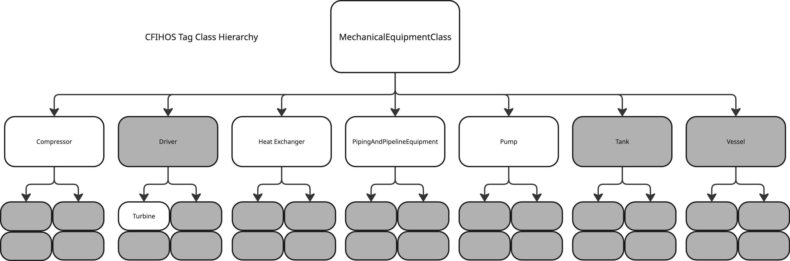
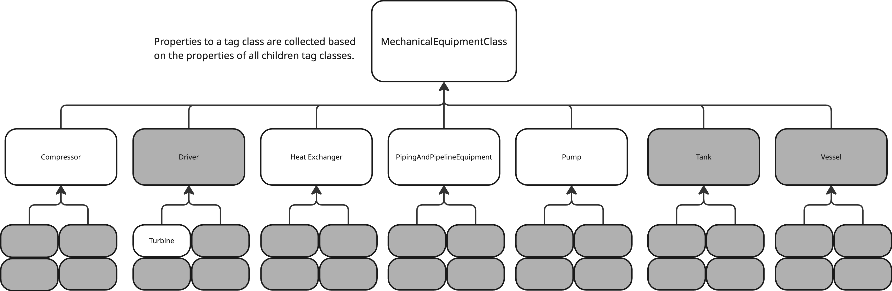
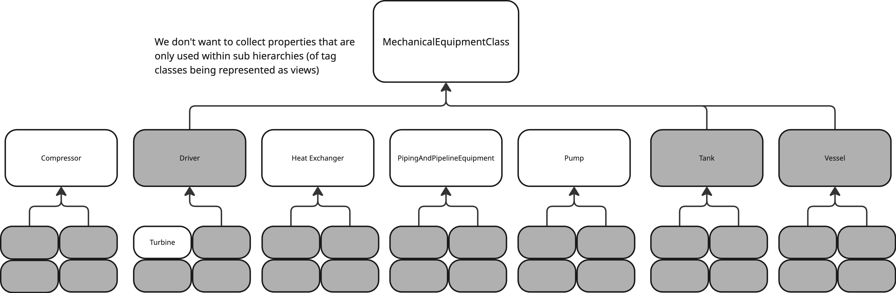

# CFIHOS CDM Extension

## 📝 Description

The CFIHOS CDM Extension is a Python tool that enables data engineers, data scientists and solution architects to convert the CFIHOS standard into views and containers that can be adopted into existing data models. It is configuration based and allows you to make a filter to setup exactly which CFIHOS tag classes to create views and containers for.

## ✨ Purpose

The purpose is to enable other members of Cognite to leverage the same design pattern as provided and used by example project for modeling CFIHOS within Data Modeling in CDF.

## 👤 Author and Project

Details of the original author or contributor of this artefact and information about the project where it was originally developed or first used.

* **Name:** Christoffer Holm-Kjøhl

* **Project Name:** Valhall CDM Upgrade Pilot / Oil And Gas CDM Upgrade

* **Date (Approx):** 2025-04

## 🚀 How to Use

Provide step-by-step instructions on how to use this artefact. Be clear and specific.

1. Clone or download the GSS Knowledge Base repository.

2. Navigate to the `[others]/[cfihos_oil_and_gas_extension]` directory.

3. Copy the contents of this folder into your project repository.

4. Setup the virtual environment with the defined dependencies in the pyproject.toml or defined below.
   - poetry lock    # build lock file and .venv folder
   - poetry install # build env

5. Run the `src/cfihos.ipynb` notebook to generate a JSON output that contains the parsed contents of the CFIHOS tag classes, either from CFIHOS 1.5.1 or CFIHOS 2.0.
   1. More information is also available in the notebook itself.

6. Update the configuration variables within the `src/config.yaml`. Make sure that the output JSON is referred to in the `cfihos.source_input`.

7. Run the `main.py` file. This should create a folder called `toolkit-output` where your view and container YAML definitions should end up.

8. Follow any additional setup or execution instructions specific to this artefact.

## 🧩 Dependencies

List any external dependencies required to use this artefact (e.g., specific libraries, software versions, Cognite SDK version).

* Python 3.11+
* Cognite SDK 7.0+
* pydantic 2.0+
* duckdb 1.4+
* polars 1.3+ (polars has two packages, so if `polars-lts-cpu` does not work, try `polars`)
* ipykernel 7.0+ (notebook)
* rich 14.0+  (notebook)
* pyarrow 22.0+
* fastexcel 0.16+
* pandas 2.3+
* pyyaml 6.0+

## 📍 Project Log

**If you are using this template for your project, please add your project name here:**

* **Project Name:** [Add your project name here]
* **Project Name:** [Add your project name here]
* **Project Name:** [Add your project name here]

## 📌 Notes

### Config related

One can choose to include CFIHOS parent tag classes into the data model by setting the `include` value to **true**. The `source_input` is used to refer to the input data needed to create the views and containers for the CFIHOS parent tag classes.

The source data is expected on a format adhering to the `CfihosClassList` class defined in *src/classes/cfihos.py*.

It is also possible to create a filter on the specific CFIHOS tag classes one would like to include. Follow the `FilterParser` class (*src/cfihos_utils/filter.py*) for more information on the filtering capabilities.

You can filter on the CFIHOS tag classes by utilizing the `filter` keyword in the `config.yaml`. The logical operators `and`, `or` and `not`, as well as the comparators `include` and `eq` are supported.

### Changing Whether to Use Friendly Names or CFIHOS codes

If desired, it is possible to change whether the containers, views or their properties should use friendly names (human understandable) or codes (CFIHOS-something).

The `CfihosClass` class has two properties, `clean_name` and `clean_id`. These are compliant with DMS naming conventions, so if you need to use either name or code as something external id, then use these. Otherwise it is fine to use the `name` or `id_`.

The default behaviour is that containers and views use friendly names. Container properties use CFIHOS codes and view properties use friendly names.

#### Modifying properties

In the *src/cfihos_utils/view.py*:

* on line 77 and 78, you can change whether to use the `prop`'s clean_id (CFIHOS code) or the clean_name.

In the *src/cfihos_utils/container.py*:

* on line 31, modify the key in the properties dict to what you prefer.

#### Modifying Container / View External ID or Name

In the *src/cfihos_utils/view.py*:

* on line 89, set the ViewApply's external_id according to your liking.
* Optionally, uncomment the `name` and set it according to your liking as well.

In the *src/cfihos_utils/container.py*:

* on line 43, set the ContainerApply's external_id according to your liking.
* Optionally, add the `name` according to your liking as well.

### Properties

Naturally, many tag classes in CFIHOS have a lot of properties, and not all of them may be relevant to your use case. In example project, we managed to trim the number of properties significantly by re-using information about a property's presence (importance) via example project's class library.

The functionality for that still exists in the code base, but one would need to update the code to adhere for it. The designed way is to add an additional section in the cfihos.ipynb notebook that would integrate with a customer's class library, so that the JSON output contains this information.

### Property Propagation

By default, when parsing the CFIHOS excel sheets, properties are not immediately propagated upwards to their tag class parents. This is however, done during runtime execution of the main.py file. The reason for this is to allow a much more dynamic way of only including unique properties within any sub-section of the CFIHOS hierarchy.

Here's a visual example:

### Equipment

Equipment information from CFIHOS is not accounted for in this package.
