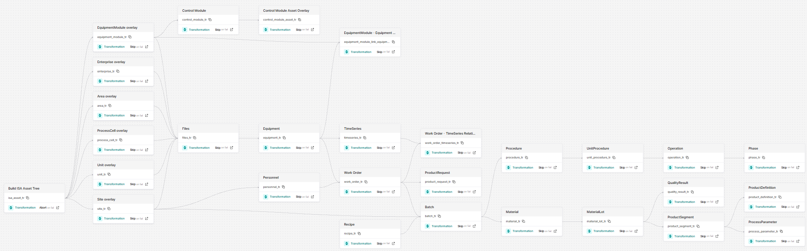

# ISA Manufacturing Extension (Enterprise)

## Overview

This module provides an **enterprise** ISA-95/ISA-88 based manufacturing domain model for Cognite Data Fusion (CDF). It defines spaces, containers, views, and a composed data model, along with optional RAW seed data, SQL transformations, and a workflow to orchestrate data loading. The model is not 100% complete for any customers, but contains place holders and structures where project can add properties add & remove views as required by customer.

> **Companion search solution module:** [`isa_manufacturing_extension_search`](../isa_manufacturing_extension_search/README.md) provides a search-optimized solution model that **maps to** the enterprise containers defined here without `implements:`-ing the enterprise views. The two modules version independently and live in separate spaces (`dm_dom_isa_manufacturing` vs. `dm_sol_isa_manufacturing_search`), so views can share externalIds (e.g. `ISAAsset`, `Equipment`, `WorkOrder`) without collision. See `.cursor/skills/cognite-data-modeling/references/cdf-enterprise-vs-solution.md` for the layering rationale.

This module follows Cognite's best practices for data modeling, focusing on practical, operational design rather than academic theory. It is optimized for industrial scale, high performance, and flexibility.

### Key Principles

- Leverages Cognite Data Modeling (Service + AI)
- Follows best practices for extending the Core Data Model (CDM)
- Supports both direct and reverse direct relationships
- Uses AI-friendly naming and descriptions to improve navigation and ensure accurate AI outputs
- Builds the data model around the Asset Hierarchy to simplify navigation and centralize relationship information
- Extends the Asset Hierarchy across multiple containers and views, reusing the same externalId to make navigation, search, and grouping easier

### Performance & Structure

- Uses purpose-specific (not generic) containers, allowing targeted indexing for faster queries
- Ensures smooth compatibility with CDF services such as Search and Canvas
- Clearly separates properties according to ISA-95 hierarchy levels

### User Experience

- Improved navigation in Search and Canvas through well-structured properties and hierarchy
- Optimized for common use cases, especially AI-driven ones, where "Asset" data is brought into Canvas. Organizing asset properties by parent asset levels improves clarity and user experience


### Data Model Architecture Diagram

The following diagram illustrates the relationships and hierarchies within the ISA-95/ISA-88 manufacturing data model:


The draw.io diagram is available on request where changes relevant for the project can be added   

The diagram shows:

- **ISA-95 Organizational Hierarchy** (vertical structure): Enterprise → Site → Area → ProcessCell → Unit → EquipmentModule
- **ISA-88 Procedural Hierarchy** (recipe execution): Recipe → Procedure → UnitProcedure → Operation → Phase
- **ISA-95 Level 3 Production Management**: ProductDefinition → ProductRequest → ProductSegment
- **Cross-hierarchy relationships**: How organizational, procedural, and production management entities connect
- **Process Data Integration**: How ProcessParameters and ISATimeSeries link to both ISA-88 and ISA-95 entities
- **Work Order Integration**: How WorkOrders bridge production planning and execution

### Standards Compliance

This data model is based on two key international standards for manufacturing:

- **ISA-95 (ANSI/ISA-95)**: Enterprise-Control System Integration standard that defines the hierarchical structure of manufacturing operations from enterprise level (Level 0) down to production units (Level 4). This model implements the ISA-95 organizational hierarchy including Enterprise, Site, Area, ProcessCell, Unit, and EquipmentModule entities.

- **ISA-88 (ANSI/ISA-88)**: Batch Control standard that defines procedural models for batch manufacturing. This model implements the ISA-88 procedural hierarchy including Recipe, Procedure, UnitProcedure, Operation, and Phase entities, along with Batch execution tracking.

The data model integrates both standards to provide a comprehensive manufacturing data structure that supports:
- **Organizational hierarchy** (ISA-95 Levels 0-4): Enterprise → Site → Area → ProcessCell → Unit → EquipmentModule
- **Production management** (ISA-95 Level 3): ProductDefinition → ProductRequest → ProductSegment
- **Procedural hierarchy** (ISA-88): Recipe → Procedure → UnitProcedure → Operation → Phase
- **Execution tracking**: Batch (ISA-88), WorkOrder (ISA-95 Level 3), linking production planning to execution
- **Process data integration**: ProcessParameter definitions with ISATimeSeries actual values, linking to both ISA-88 phases and ISA-95 product segments
- **Quality and process data**: QualityResult, ProcessParameter with time series integration
- **Cross-hierarchy relationships**: Seamless navigation between ISA-95 organizational structure, ISA-95 production management, and ISA-88 procedural execution

## Architecture

Use the Data Model Architecture Diagram above as orientation:

- `ISAAsset` is the central asset node and the single `CogniteAsset` implementer in the enterprise model.
- ISA-95 organizational, ISA-88 procedural, and production-management views connect through direct relations across the hierarchy.
- The enterprise `ISAAsset` view holds canonical CDM asset semantics and the `children` reverse relation (mirroring `CogniteAsset.parent`). All solution-shaped reverse relations (`activities`, `timeSeries`, `files`, `equipment`, …) live in the **search solution module** on its `ISAAsset` view, not here. This keeps the enterprise model decoupled from solution navigation patterns.

### Why the model is split into enterprise + search

The model is delivered as **two modules** that version independently:

| Module | Space | Role |
|--------|-------|------|
| `isa_manufacturing_extension` (this one) | `dm_dom_isa_manufacturing` | Owns containers, indexes, and the canonical CDM-implementing views. Treated as the durable contract. |
| `isa_manufacturing_extension_search` | `dm_sol_isa_manufacturing_search` | Maps to the enterprise containers via `container:` + `containerPropertyIdentifier:`. Hosts solution-shaped reverse relations. Free to bump versions independently. |

Reasons for the split (per `cdf-enterprise-vs-solution.md`):

1. **Containers are the durable contract.** Solution views map to enterprise *containers* rather than `implements:`-ing enterprise *views*, so the search model can re-shape and re-version without forcing enterprise consumers to migrate.
2. **Reverse relations live with their forward.** Forward direct relations on solution-shaped views (`WorkOrder.assets`, `WorkOrder.equipment`, `ISATimeSeries.assets`, …) belong to the search model, so the matching reverses (`ISAAsset.activities`, `Equipment.activities`, `ISAAsset.timeSeries`, …) live on the search-side views — not piled onto this enterprise model.
3. **Single `CogniteAsset` per data model.** Each data model that needs asset semantics defines its own single `CogniteAsset` implementer. This module's `ISAAsset` is the enterprise one; the search module exposes asset-hierarchy properties (`parent`, `root`, `path`, `children`) on its own `ISAAsset` view, self-referencing within the search space, without `implements: CogniteAsset` on the search side.
4. **Same externalIds in different spaces are intentional.** Both modules expose views named `ISAAsset`, `Equipment`, `WorkOrder`, etc. They live in different spaces, so there is no collision; this gives consumers consistent names whether they read the enterprise or search model.
5. **Independent lifecycles.** `enterprise_dm_version` (enterprise) and `search_dm_version` (search) bump separately so a search-side change never forces an enterprise version bump, and vice versa.

## Module structure

```
isa_manufacturing_extension/
├── default.config.yaml              # enterprise_space, instance_space, enterprise_dm_version, …
├── module.toml
├── data_modeling/
│   ├── containers/                  # 24 enterprise container definitions
│   │   ├── dm_dom_isa_manufacturing_Area.Container.yaml
│   │   ├── dm_dom_isa_manufacturing_Batch.Container.yaml
│   │   ├── ...
│   │   └── dm_dom_isa_manufacturing_WorkOrder.Container.yaml
│   ├── views/                       # 26 enterprise view definitions
│   │   ├── Area.view.yaml
│   │   ├── Batch.view.yaml
│   │   ├── ISAFile.view.yaml
│   │   ├── ISATimeSeries.view.yaml
│   │   ├── ...
│   │   └── WorkOrder.view.yaml
│   ├── dm_dom_isa_manufacturing.DataModel.yaml   # Enterprise (DOM) data model
│   ├── dm_dom_isa_manufacturing.Space.yaml       # Schema space ({{ enterprise_space }})
│   └── inst_isa_manufacturing.Space.yaml         # Instance space ({{ instance_space }})
├── data_sets/
│   └── isa_manufacturing.DataSet.yaml
├── locations/
│   └── loc_isa_manufacturing_edm.LocationFilter.yaml
├── raw/                             # RAW table definitions + optional seed CSVs
├── transformations/                 # tr_isa_* transformations (RAW → instance space)
│   ├── tr_isa_asset_all_to_area.Transformation.{sql,yaml}
│   ├── tr_isa_asset_all_to_enterprise.Transformation.{sql,yaml}
│   ├── ...
│   └── tr_isa_timeseries_all_to_isa_timeseries.Transformation.{sql,yaml}
├── workflows/
│   ├── wf_all_isa_raw_to_isa_manufacturing.Workflow.yaml
│   └── wf_all_isa_raw_to_isa_manufacturing.WorkflowVersion.yaml
└── files/                           # Sample PDFs for file-ingestion demos
```

The companion search module [`isa_manufacturing_extension_search`](../isa_manufacturing_extension_search/README.md) owns the solution-space views (`Search*`) and its own data model in `dm_sol_isa_manufacturing_search`. Deploy this enterprise module first.

### What each part does

- **data_modeling/containers**: Column-level schemas for each entity (Area, Batch, Equipment, …). Filenames are prefixed `dm_dom_isa_manufacturing_`; containers are deployed to `{{ enterprise_space }}`.
- **data_modeling/views**: Logical views over containers with relationships; many views `implement` standard `cdf_cdm` interfaces (e.g., `CogniteActivity`, `CogniteDescribable`). `ISAFile` and `ISATimeSeries` map to CDM file/time-series containers.
- **dm_dom_isa_manufacturing.DataModel.yaml**: The enterprise (DOM) data model aggregating all views from this module and referenced `cdf_cdm` interfaces.
- **Spaces**: `dm_dom_isa_manufacturing.Space.yaml` defines the schema space (`enterprise_space`); `inst_isa_manufacturing.Space.yaml` holds instances (`instance_space`).
- **data_sets**: CDF dataset used by transformations and for lineage.
- **raw**: Optional RAW tables and seed data to bootstrap asset trees and entity instances.
- **transformations**: SQL transformations (`tr_isa_*`) that materialize instances and relations into `{{ instance_space }}`.
- **workflows**: CDF Workflow orchestrating transformations in dependency order.

## Key entities (views)

### ISA-95 Organizational Hierarchy (Levels 0-4)
- **Level 0 (Enterprise)**: `Enterprise` - Top-level organizational entity
- **Level 4 (Site)**: `Site` - Physical location where manufacturing operations are performed
- **Level 4 (Area)**: `Area` - Logical or physical grouping of process cells within a site
- **Level 4 (ProcessCell)**: `ProcessCell` - Collection of units that perform a specific manufacturing function
- **Level 4 (Unit)**: `Unit` - Basic equipment entity that can carry out one or more processing activities
- **Level 4 (EquipmentModule)**: `EquipmentModule` - Functional grouping of equipment within a unit
- **Equipment**: `Equipment` - Physical equipment used in manufacturing processes
- **ISAAsset**: `ISAAsset` - Generic asset entity for flexible asset hierarchy representation

### ISA-88 Procedural Model
- **Recipe**: `Recipe` - Master recipe defining manufacturing process steps and parameters
- **Procedure**: `Procedure` - Top-level procedural element that coordinates unit procedures
- **UnitProcedure**: `UnitProcedure` - Procedural element that defines operations for a specific unit
- **Operation**: `Operation` - Procedural element that groups phases for specific processing tasks
- **Phase**: `Phase` - Lowest level procedural element that performs specific processing activities
- **ControlModule**: `ControlModule` - Control module for equipment control logic

### ISA-95 Level 3 Production Management
- **ProductDefinition**: `ProductDefinition` - Definition of the product process and resources (ISA-95 Level 3). Represents the master definition for how products are manufactured, including process requirements, resource allocation, and production specifications. Product definitions link to Units (ISA-95 Level 4) and contain ProductSegments that define specific production activities.
- **ProductRequest**: `ProductRequest` - Request to produce specific quantities of products (ISA-95 Level 3). Represents actual production orders or requests that reference ProductDefinitions. Product requests specify quantities, priorities, due dates, and link to WorkOrders for execution. They bridge the gap between production planning (ISA-95 Level 3) and execution (ISA-88 Batch Control).
- **ProductSegment**: `ProductSegment` - Segment of the product process and resources (ISA-95 Level 3). Represents discrete segments within a product definition that define specific production activities, resource requirements, and process parameters. Product segments contain requirements such as temperature, pressure, flow rate, pH, and time requirements. They link to ProcessParameters for control and monitoring, and connect to ISATimeSeries for process data acquisition.

### Execution and Production Management
- **Batch**: `Batch` - Specific instance of a production run executed according to a recipe (ISA-88). Batches represent actual production executions and link to Recipes (ISA-88 procedural model), WorkOrders (ISA-95 Level 3 work management), and Sites (ISA-95 Level 4 organizational hierarchy). Batches track execution lifecycle from initiation through completion.
- **WorkOrder**: `WorkOrder` - Work order for manufacturing execution (ISA-95 Level 3). Work orders represent specific work instructions that can be used for both production activities (linked to ProductRequests) and maintenance activities (linked to Equipment). They implement `CogniteActivity` and link to ISATimeSeries for process data, Equipment for equipment context, and Personnel for assignment tracking.

### Quality and Process Data
- **QualityResult**: `QualityResult` - Quality test results and inspection data. Links to Batches for batch-level quality tracking and supports quality assurance and regulatory compliance.
- **ProcessParameter**: `ProcessParameter` - Process parameter definitions (ISA-88). Defines parameters that need to be controlled or monitored during batch execution, including target values, min/max limits, and units of measure. ProcessParameters link to Phases (ISA-88 procedural elements) and ProductSegments (ISA-95 Level 3 production segments), enabling both procedural and production-level parameter tracking.

### Supporting Entities
- **Material**: `Material` - Master material definition used in manufacturing. Links to Recipes (ISA-88) and Batches (ISA-88) for material traceability and production planning.
- **MaterialLot**: `MaterialLot` - Specific lot or batch of material. Enables lot-level tracking and traceability for batch manufacturing and quality control.
- **Personnel**: `Personnel` - Person involved in manufacturing operations. Links to WorkOrders for work assignment and personnel performance tracking.
- **ISATimeSeries**: `ISATimeSeries` - Time series data linked to ISA entities. Implements `CogniteTimeSeries` and provides process data acquisition for ISA-95 assets, ISA-88 phases, ISA-95 product segments, and work orders. ISATimeSeries enables real-time and historical process data collection, supporting condition monitoring, performance analysis, and predictive maintenance.
- **ISAFile**: `ISAFile` - File attachments linked to ISA entities. Provides document management for ProductDefinitions, ProductRequests, ProductSegments, and other ISA entities, supporting comprehensive documentation and compliance requirements.

## How to extend

1. Add a new entity
   - Create a container in `data_modeling/containers/` (follow naming: `dm_dom_isa_manufacturing_<Entity>.Container.yaml`).
   - Create a view in `data_modeling/views/<Entity>.view.yaml` referencing the container and define relations.
   - If applicable, add `implements:` entries with relevant `cdf_cdm` views (e.g., `CogniteDescribable`, `CogniteActivity`).
   - Include the new view in `data_modeling/dm_dom_isa_manufacturing.DataModel.yaml` under `views:`.

2. Add relationships
   - Use `source` + `through` in the view to model direct and reverse relations.
   - Prefer multi‑reverse relations for lists; ensure identifiers match the related view’s property names.

3. Update transformations
   - Add a new `*.Transformation.sql` and corresponding `*.Transformation.yaml` in `transformations/` to populate/maintain instances for your entity and relations.
   - Reference the correct dataset and spaces; reuse existing variables where possible.

4. Extend the workflow
   - Modify `workflows/wf_all_isa_raw_to_isa_manufacturing.Workflow.yaml` to include new transformation tasks, dependencies, and failure handling.

5. Access control / locations
   - If you need to scope data by location, update or add a `locations/*LocationFilter.yaml` and ensure relevant groups/locations exist in your environment.
   - This module ships `loc_isa_manufacturing_edm.LocationFilter.yaml` for the enterprise (DOM) data model. The search module ships its own location filter for the solution model.

## Configuration

Variables are defined in `default.config.yaml` and overridden per environment in `config.<env>.yaml` at the project root.

```yaml
# Enterprise schema space (DOM tier) — views and containers
enterprise_space: dm_dom_isa_manufacturing

# Shared instance space — used by transformations and both enterprise/search modules
instance_space: inst_isa_manufacturing

# Enterprise view/data model version
enterprise_dm_version: v1

# Enterprise data model external ID
dataModelExternalId: ISA_Manufacturing_DOM

# Lineage and ingestion
datasetExternalId: ds_isa_manufacturing
rawDatabase: isa_all_manufacturing
workflowVersion: '1'
```

When deploying alongside the search module, align `enterprise_space`, `enterprise_dm_version`, and `instance_space` in both module configs. The search module adds `search_space`, `search_dm_version`, and `search_data_model_external_id` — see its `default.config.yaml`.

| Variable | Purpose |
|----------|---------|
| `enterprise_space` | Schema space for containers and enterprise views |
| `instance_space` | Instance space for all ISA manufacturing nodes |
| `enterprise_dm_version` | Version pin for enterprise views and data model |
| `dataModelExternalId` | External ID of the DOM data model |
| `datasetExternalId` | Dataset for transformation lineage |
| `rawDatabase` | RAW database name for source tables |
| `workflowVersion` | Workflow version tag |

## Deployment (Cognite Toolkit)

### Prerequisites
Before you start, ensure you have:

- A Cognite Toolkit project set up locally
- Your project contains the standard `cdf.toml` file
- Valid authentication to your target CDF environment
- Access to a CDF project and credentials
- `cognite-toolkit` >= 0.6.61


 **Enable Feature Flags** (Required for CDF):
   - Navigate to [Cognite Unleash Feature Flags - FDX_VIEW_SWITCHER](https://unleash-apps.cogniteapp.com/projects/default/features/FDX_VIEW_SWITCHER)
   - Enable the `FDX_VIEW_SWITCHER` feature flag for your CDF project
   - This feature flag enables the view switcher functionality in CDF Data Modeling, which is required for:
     - Proper view navigation in the CDF UI
     - Relationship visualization between views
     - Switching between different view versions
     - Enhanced data model exploration capabilities
   - **Note**: Feature flags are project-specific, so ensure you enable it for the correct CDF project
   - **Access**: You need appropriate permissions in your CDF project to enable feature flags. Contact your CDF administrator if you don't have access.


### Step 1: Enable External Libraries (Toolkit < 0.7.0 only)

Newer Toolkit versions ship `[library.cognite]` already pointing at this
repository, so no `cdf.toml` change is needed. On Toolkit < 0.7.0, enable the
alpha flag:

```toml
[alpha_flags]
external-libraries = true
```

### Step 2 (Optional but Recommended): Enable Usage Tracking

To help improve the Deployment Pack:

```bash
cdf collect opt-in
```

### Step 3: Add the Module

Run:

```bash
cdf modules init . --clean
```

> **⚠️ Disclaimer**: This command will overwrite existing modules. Commit changes before running, or use a fresh directory.

This opens the interactive module selection interface.

### Step 4: Select the ISA Data Models Package (NOTE: use Space bar to select module)

From the menu, select:

```
Data models: Data models that extend the core data model 
  └── ISA 88/95 Manufacturing Data Model template
```

### Step 5: Verify Folder Structure

After installation, your project should contain:

```
modules/
└── data_models/
    ├── isa_manufacturing_extension/          # Enterprise (DOM) — deploy first
    └── isa_manufacturing_extension_search/   # Search (SOL) — optional companion
```

Select both modules if you want the full enterprise + search stack. Continue module selection as prompted, then confirm creation to copy files into your project.

### Step 6: Deploy to CDF

Update `config.<env>.yaml` with your CDF `project` and module variables (`enterprise_space`, `instance_space`, `enterprise_dm_version`, and search-module equivalents if selected).

Build deployment structure:
```bash
cdf build
```

Optional dry run:
```bash  (optional)
cdf deploy --dry-run
```

Deploy module to your CDF project
```bash
cdf deploy
```

Deploy this enterprise module **before** the companion search module — the search module depends on the containers defined here.

---

- Note that the deployment uses a set of CDF capabilities, so you might need to add this to the CDF security group used by Toolkit to deploy
- This will create/update spaces, containers, views, the composed data model, dataset, RAW resources, transformations, and workflows defined by this module.


### Run the workflow / transformations
- After deployment, trigger `wf_all_isa_raw_to_isa_manufacturing` via the CDF Workflows UI or API to execute the transformations in order.
- The workflow reads from RAW tables (including optional seed data in CSV format) and populates the ISA-95/ISA-88 data model instances.
- Alternatively, run individual transformations from the CDF UI if you prefer ad‑hoc execution during development.


### Workflow Execution Flow




Some of the workflow executes transformations:

1. **Build ISA Asset Tree** (`tr_isa_asset_all_to_isa_asset`)
   - Creates the base `ISAAsset` hierarchy from RAW data
   - This is a critical first step that all other transformations depend on
   - Reads from `{{ rawDatabase }}.isa_asset` RAW table

2. **ISA-95 Organizational Hierarchy Overlays** (executed in parallel after asset tree)
   - **Enterprise** (`tr_isa_asset_all_to_enterprise`): Creates Enterprise entities (ISA-95 Level 0)
   - **Site** (`tr_isa_asset_all_to_site`): Creates Site entities with Enterprise relationships (ISA-95 Level 4)
   - **Area** (`tr_isa_asset_all_to_area`): Creates Area entities with Site relationships (ISA-95 Level 4)
   - **ProcessCell** (`tr_isa_asset_all_to_process_cell`): Creates ProcessCell entities with Area relationships (ISA-95 Level 4)
   - **Unit** (`tr_isa_asset_all_to_unit`): Creates Unit entities with ProcessCell relationships (ISA-95 Level 4)
   - **EquipmentModule** (`tr_isa_asset_all_to_equipment_module`): Creates EquipmentModule entities with Unit relationships (ISA-95 Level 4)

3. **Equipment and Relationships**
   - **Equipment** (`tr_isa_equipment_all_to_equipment`): Creates Equipment entities linked to assets and units
   - **EquipmentModule-Equipment Linking** (`tr_isa_equipment_all_to_equipment_module`): Establishes relationships between EquipmentModule and Equipment entities

4. **Work Orders and Time Series** (executed in parallel after equipment)
   - **WorkOrder** (`tr_isa_work_order_all_to_work_order`): Creates WorkOrder entities from RAW data
   - **ISATimeSeries** (`tr_isa_timeseries_all_to_isa_timeseries`): Creates TimeSeries entities linked to assets and equipment

5. **Final Relationships**
   - **WorkOrder-TimeSeries Linking** (`tr_isa_timeseries_all_to_work_order`): Links WorkOrders to their associated TimeSeries

### Test Data Loading

The workflow automatically loads test data from the included CSV files in the `raw/` directory:
- `isa_asset.Table.csv`: Sample ISA asset hierarchy data
- `isa_equipment.Table.csv`: Sample equipment data
- `isa_timeseries.Table.csv`: Sample time series data
- `isa_work_order.Table.csv`: Sample work order data

These CSV files are automatically uploaded to RAW tables during deployment and can be used to:
- Test the data model structure
- Validate transformations
- Demonstrate ISA-95/ISA-88 relationships
- Provide example data for development and training

### Workflow Features

- **Dependency Management**: Tasks execute only after their dependencies complete successfully
- **Error Handling**: 
  - Asset tree build failure aborts the workflow (critical path)
  - Overlay failures skip individual tasks but continue the workflow
- **Retry Logic**: Each task includes retry logic (3 retries) for transient failures
- **Timeout Protection**: Tasks have timeout limits (3600 seconds) to prevent hanging

### Running the Workflow

After deployment, you can trigger the workflow in several ways:

1. **CDF Workflows UI**: Navigate to Workflows in CDF and trigger `wf_all_isa_raw_to_isa_manufacturing`
2. **CDF API**: Use the Workflows API to trigger the workflow programmatically
3. **Cognite Toolkit**: Use `cdf workflows run` command (if supported)

The workflow will process all transformations and load test data automatically, creating a complete ISA-95/ISA-88 manufacturing data model instance ready for use.

## ISA-95/ISA-88 Modeling Conventions and Relationships

### ISA-95 Hierarchy Levels
The model follows the ISA-95 standard hierarchy:
- **Level 0**: Enterprise (business organization) - Top-level organizational entity
- **Level 1**: Site (physical location) - Physical location where manufacturing operations are performed
- **Level 2**: Area (logical grouping within site) - Logical or physical grouping of process cells
- **Level 3**: ProcessCell (collection of units) - Collection of units performing specific manufacturing functions
- **Level 4**: Unit, EquipmentModule, Equipment (production equipment) - Basic equipment entities that carry out processing activities

**ISA-95 Level 3 Production Management** (separate from organizational hierarchy):
- **ProductDefinition**: Master definition of product processes and resources
- **ProductRequest**: Production orders/requests for specific quantities
- **ProductSegment**: Discrete segments within product definitions defining production activities

### ISA-88 Procedural Model
The model follows the ISA-88 procedural hierarchy:
- **Recipe**: Master recipe containing procedures - defines manufacturing process steps and parameters
- **Procedure**: Top-level procedural element coordinating unit procedures
- **UnitProcedure**: Procedural element defining operations for specific units
- **Operation**: Procedural element grouping phases for specific processing tasks
- **Phase**: Lowest level procedural element performing specific processing activities
- **ControlModule**: Control module for equipment control logic

### Integration Between ISA-95 and ISA-88 Hierarchies

The data model integrates ISA-95 organizational hierarchy with ISA-88 procedural model through several key relationships:

#### 1. Organizational to Procedural Integration
- **Unit (ISA-95 Level 4) ↔ Recipe (ISA-88)**: Units are the physical equipment where recipes are executed. Recipes reference Units through ProductDefinitions, linking procedural control to physical equipment.
- **Equipment (ISA-88) ↔ Unit (ISA-95 Level 4)**: Equipment entities link to Units, connecting ISA-88 equipment model to ISA-95 organizational hierarchy.
- **Batch (ISA-88) ↔ Site (ISA-95 Level 4)**: Batches execute at specific Sites, providing organizational context for batch execution.

#### 2. Production Management Integration
- **ProductDefinition (ISA-95 Level 3) ↔ Unit (ISA-95 Level 4)**: Product definitions specify which Units are used for production, linking production planning to organizational hierarchy.
- **ProductRequest (ISA-95 Level 3) ↔ WorkOrder (ISA-95 Level 3)**: Product requests generate WorkOrders for execution, connecting production planning to work management.
- **ProductRequest (ISA-95 Level 3) ↔ Batch (ISA-88)**: Product requests can be executed as Batches, linking ISA-95 production planning to ISA-88 batch execution.
- **ProductSegment (ISA-95 Level 3) ↔ ProcessParameter (ISA-88)**: Product segments define process requirements that map to ProcessParameters, connecting production planning to procedural control.

#### 3. Process Data Integration
- **ProcessParameter (ISA-88) ↔ Phase (ISA-88)**: ProcessParameters are associated with Phases for procedural control during batch execution.
- **ProcessParameter (ISA-88) ↔ ProductSegment (ISA-95 Level 3)**: ProcessParameters also link to ProductSegments for production-level parameter tracking.
- **ISATimeSeries ↔ Multiple Entities**: Time series data links to:
  - **ISAAsset** (ISA-95): Asset-level process data
  - **Equipment** (ISA-88): Equipment-level sensor data
  - **Phase** (ISA-88): Phase-level execution data
  - **ProductSegment** (ISA-95 Level 3): Production segment-level data
  - **WorkOrder** (ISA-95 Level 3): Work execution data

### Time Series and Process Data Integration

#### CDF TimeSeries Integration
The `ISATimeSeries` entity implements `CogniteTimeSeries` from the CDF Common Data Model, providing seamless integration with CDF's time series infrastructure:

- **Process Data Acquisition**: ISATimeSeries enables real-time and historical process data collection from sensors, control systems, and equipment
- **Multi-Entity Linking**: Time series can be linked to multiple ISA entities simultaneously:
  - **ISA-95 Assets**: For asset-centric process monitoring and condition monitoring
  - **ISA-88 Phases**: For phase-level batch execution tracking
  - **ISA-95 ProductSegments**: For production segment-level process monitoring
  - **WorkOrders**: For work execution performance tracking
  - **Equipment**: For equipment-level sensor data and performance metrics

- **ProcessParameter Relationship**: ProcessParameters define what should be monitored (target values, limits, units), while ISATimeSeries provides the actual measured values. This separation enables:
  - Recipe-level parameter definitions (ProcessParameters)
  - Actual execution data collection (ISATimeSeries)
  - Comparison of actual vs. target values for quality control and process optimization

#### ProcessParameter and Time Series Workflow
1. **Definition Phase**: ProcessParameters are defined in Recipes or ProductDefinitions, specifying target values, min/max limits, and units
2. **Execution Phase**: During Batch execution or ProductSegment execution, ISATimeSeries collect actual process values
3. **Analysis Phase**: Actual values from ISATimeSeries can be compared against ProcessParameter targets for:
   - Quality control and compliance
   - Process optimization
   - Deviation analysis
   - Performance metrics

### Work Order Types and Relationships

WorkOrders serve multiple purposes in the manufacturing domain:

#### 1. Production Work Orders
- **ProductRequest → WorkOrder**: Product requests generate WorkOrders for production execution
- **WorkOrder → Batch**: Work orders can execute Batches, linking ISA-95 work management to ISA-88 batch execution
- **WorkOrder → Equipment**: Work orders specify which Equipment is used for production
- **WorkOrder → ISATimeSeries**: Work orders link to time series for execution performance tracking

#### 2. Maintenance Work Orders
- **WorkOrder → Equipment**: Maintenance work orders target specific Equipment for repair, inspection, or calibration
- **WorkOrder → ISAAsset**: Work orders link to ISA Assets for asset-centric maintenance tracking
- **WorkOrder → Personnel**: Work orders assign Personnel for work execution

#### 3. Work Order as Activity
WorkOrders implement `CogniteActivity`, enabling:
- Activity-based queries and reporting
- Integration with CDF's activity tracking infrastructure
- Time-based work execution analysis
- Resource utilization tracking

### Relationship Patterns
- **Direct relationships**: Use `source` property to reference parent entities (e.g., Unit → ProcessCell, Phase → Operation)
- **Reverse relationships**: Use `through` with `identifier` to create reverse navigation (e.g., Batch → Procedures, ProductRequest → ProductDefinitions)
- **Multi-reverse relationships**: Use `connectionType: multi_reverse_direct_relation` for collections (e.g., Recipe → Batches, ProductSegment → ProcessParameters)
- **Cross-hierarchy relationships**: Entities from different hierarchies can reference each other (e.g., ProductDefinition → Unit, Batch → Site, WorkOrder → Equipment)

## Data Flow and Relationship Examples

### Production Planning to Execution Flow

The following example illustrates how ISA-95 Level 3 production management integrates with ISA-88 batch execution:

1. **ProductDefinition** (ISA-95 Level 3) defines:
   - Product process requirements
   - Unit assignments (ISA-95 Level 4)
   - ProductSegments with process requirements (temperature, pressure, flow rate, etc.)

2. **ProductRequest** (ISA-95 Level 3) is created:
   - References ProductDefinition
   - Specifies quantity, priority, due date
   - Links to Unit for production location

3. **WorkOrder** (ISA-95 Level 3) is generated:
   - Created from ProductRequest
   - Links to Equipment for execution
   - Assigns Personnel for work execution

4. **Batch** (Records) (ISA-88) executes:
   - References Recipe (ISA-88 procedural model)
   - Executes Phases (ISA-88) with ProcessParameters
   - Links to WorkOrder for work management context
   - Links to Site (ISA-95 Level 4) for organizational context

5. **ISATimeSeries** collects:
   - Process data from Equipment during Phase execution
   - Links to Phase, ProductSegment, WorkOrder, and Equipment
   - Provides actual values for comparison with ProcessParameter targets

### Process Parameter and Time Series Example

**Scenario**: Monitoring temperature during a batch production phase

1. **ProcessParameter** defines:
   - Parameter name: "Reactor Temperature"
   - Target value: 75°C
   - Min value: 70°C
   - Max value: 80°C
   - Unit of measure: °C
   - Links to Phase (ISA-88) and ProductSegment (ISA-95 Level 3)

2. **ISATimeSeries** collects:
   - Actual temperature measurements from sensor
   - Links to Phase, ProductSegment, Equipment, and WorkOrder
   - Provides time-stamped temperature values

3. **Analysis**:
   - Compare ISATimeSeries actual values against ProcessParameter target
   - Detect deviations outside min/max limits
   - Generate quality reports and compliance documentation

### Work Order Types Example

**Production Work Order**:
- Created from ProductRequest
- Links to Equipment for production execution
- Generates Batch for ISA-88 execution
- Links to ISATimeSeries for performance tracking
- Assigns Personnel for work execution

**Maintenance Work Order**:
- Targets Equipment for repair or inspection
- Links to ISAAsset for asset context
- Links to ISATimeSeries for condition monitoring data
- Assigns Personnel for maintenance execution
- Tracks planned vs. actual start/end times

### Cross-Hierarchy Navigation Examples

**From ProductDefinition to Batch Execution**:
```
ProductDefinition → ProductRequest → WorkOrder → Batch → Phase → ProcessParameter
```

**From ISA-95 Organizational to ISA-88 Procedural**:
```
Site → Unit → Equipment → Phase → ProcessParameter → ISATimeSeries
```

**From Production Planning to Process Data**:
```
ProductSegment → ProcessParameter → Phase → ISATimeSeries
```

**From Work Management to Execution**:
```
WorkOrder → Equipment → Phase → Batch → Recipe
```

## Versioning policy

- `enterprise_dm_version` in `default.config.yaml` is the enterprise model version. Bump only on breaking enterprise view changes.
- Containers are **unversioned** and additive. Property removal or type/`list`/`usedFor` changes require a documented migration (export → recreate → re-ingest), not a version bump.
- The search solution model has its own `search_dm_version` and bumps independently.

## Consumers

Maintain this list. Update in the same PR that bumps `enterprise_dm_version`. Until CDF exposes per-consumer version usage, this list is the safety net for breaking changes. See `cdf-enterprise-vs-solution.md` §10.

| Consumer | Pinned version | Owner | Notes |
|----------|---------------|-------|-------|
| `isa_manufacturing_extension_search` | v1 | this repo | Maps to enterprise containers; reverse relations live there. |
| _(add other consumers)_ | — | — | Atlas AI, IndustryCanvas, custom apps, etc. |

When deprecating an enterprise view, mark it in the view `description` with `[DEPRECATED — replaced by …]` and keep it deployed for a minimum 90-day window.

## Conventions & tips
- Keep `implements:` minimal and purposeful; include only the `cdf_cdm` interfaces your view actually uses.
- Use consistent naming for properties and relation identifiers; prefer snake_case for container property identifiers and descriptive names in views.
- Follow ISA-95/ISA-88 naming conventions in descriptions and property names.
- Include standard references (e.g., `[ISA-88]`, `[ISA-95 Level 4]`) in property descriptions for clarity.
- Validate changes locally by running `cdf build` before deploying.
- Commit your changes alongside updates to transformations/workflows when introducing new entities.

## Standards References

- **ISA-95**: ANSI/ISA-95.00.01-2010 - Enterprise-Control System Integration Part 1: Models and Terminology
- **ISA-88**: ANSI/ISA-88.00.01-2010 - Batch Control Part 1: Models and Terminology

For more information about these standards, visit:
- [ISA-95 Standard](https://www.isa.org/standards-and-publications/isa-standards/isa-95)
- [ISA-88 Standard](https://www.isa.org/standards-and-publications/isa-standards/isa-88)

## Support
If you encounter issues with this module or deployment, consult Cognite documentation or contact your Cognite representative.


