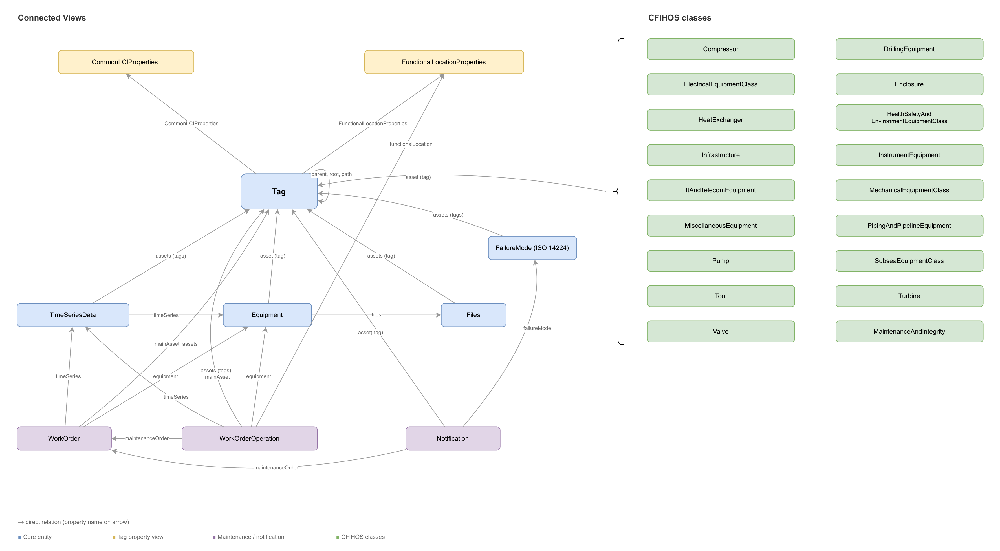
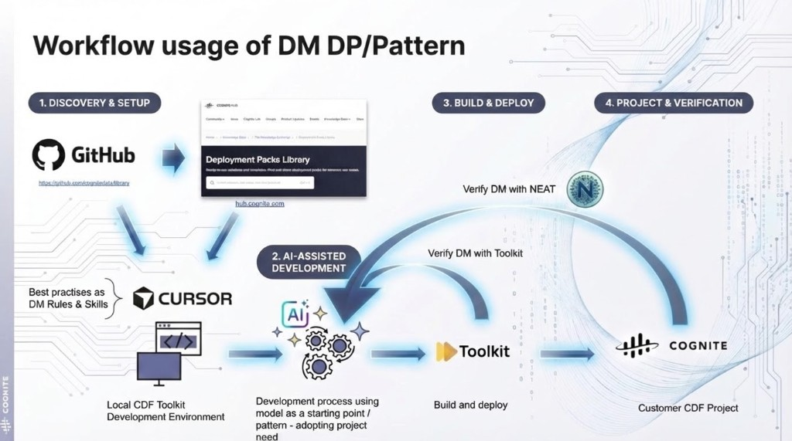

# Oil and Gas Domain Model — CFIHOS Extension (Enterprise)

A tag-centric **enterprise** data model for oil and gas operations that merges data from AVEVA, SAP, OPC UA, and PI into a single queryable structure. Built on the CFIHOS 2.0 standard and deployed as a Cognite Toolkit module extending the Cognite Data Model (CDM) and Industry Data Model (IDM).

> **Companion search solution module:** [`cfihos_oil_and_gas_extension_search`](../cfihos_oil_and_gas_extension_search/README.md) provides a search-optimized solution model that **maps to** the enterprise containers defined here without `implements:`-ing the enterprise views. The two modules version independently and live in separate spaces (`dm_dom_oil_and_gas` vs. `dm_sol_oil_and_gas_search`), so views can share externalIds (e.g. `Tag`, `Equipment`, `WorkOrder`) without collision. See `.cursor/skills/cognite-data-modeling/references/cdf-enterprise-vs-solution.md` for the layering rationale.

The model favors **simplicity and denormalization** over strict normalization. Rather than forcing users to join across many small tables, related properties are flattened into fewer, wider views. Time series data from PI and OPC UA is merged into a single `TimeSeriesData` view with prefixed properties (`pi_*`, `opcua_*`), and document data that would normally span document, revision, and file entities is flattened into a single `Files` view. This makes the data immediately accessible to AI tools, search engines, dashboards, and developers — a single query returns everything you need about an entity without complex joins.

## What this model provides

- A unified **Tag** as the single `CogniteAsset` implementation — the central hub connecting equipment, work orders, time series, files, and functional locations
- **17 CFIHOS equipment class views** (Compressor, Valve, Pump, HeatExchanger, etc.) linked to tags via polymorphic direct relations
- **Work management** views (WorkOrder, WorkOrderOperation, Notification) extending IDM types (`CogniteMaintenanceOrder`, `CogniteOperation`, `CogniteNotification`)
- **Denormalized time series** (`TimeSeriesData`) combining PI and OPC UA properties into one searchable view, with explicit `stateSet` and `equipment` relations
- **Document management** (`Files`) extending `CogniteFile` with document metadata
- **Functional locations** and **maintenance/integrity** data from SAP
- **Failure modes** linked to tags and notifications per ISO 14224
- **Connection transformations** that populate key direct relations (`Tag -> FunctionalLocationProperties`, `Tag -> CommonLCIProperties`, `Tag -> classSpecific`, `Notification -> FailureMode`)
- **Dependency-aware workflow orchestration** so relation updates run after source and target nodes exist
- **Unified JSON access on Tag**: CFIHOS class-specific properties and LCI context are available through `Tag.additionalProperties` for one-shot retrieval
- **Alarm records** stored using Records & Stream service (Container definition `usedFor: record`) containers for event-level data

## Architecture



Use the architecture figure as a quick orientation:
- `Tag` is the central asset node and the single `CogniteAsset` implementer in the enterprise model.
- Equipment-class, work-management, and context views connect to `Tag` through direct relations.
- The enterprise `Tag` view holds only the `children` reverse relation (mirroring `CogniteAsset.parent`). All solution-shaped reverse relations (`workOrders`, `notifications`, `timeSeries`, `files`, `equipment`, `failureModes`, `workOrderOperations`, etc.) live in the **search solution module** on its `Tag` view, not here. This keeps the enterprise model decoupled from solution navigation patterns.

### Why the model is split into enterprise + search

The model is delivered as **two modules** that version independently:

| Module | Space | Role |
|--------|-------|------|
| `cfihos_oil_and_gas_extension` (this one) | `dm_dom_oil_and_gas` | Owns containers, indexes, and the canonical CDM/IDM-implementing views. Treated as the durable contract. |
| `cfihos_oil_and_gas_extension_search` | `dm_sol_oil_and_gas_search` | Maps to the enterprise containers via `container:` + `containerPropertyIdentifier:`. Hosts solution-shaped reverse relations. Free to bump versions independently. |

Reasons for the split (per `cdf-enterprise-vs-solution.md`):

1. **Containers are the durable contract.** Solution views map to enterprise *containers* rather than `implements:`-ing enterprise *views*, so the search model can re-shape and re-version without forcing enterprise consumers to migrate.
2. **Reverse relations live with their forward.** Forward direct relations on solution-shaped views (`WorkOrder.assets`, `Notification.assets`, `TimeSeriesData.assets`, …) belong to the search model, so the matching reverses (`Tag.workOrders`, `Tag.notifications`, `Tag.timeSeries`, …) live on the search-side `Tag` view — not piled onto this enterprise `Tag` view.
3. **Single `CogniteAsset` per data model.** Each data model that needs asset semantics defines its own single `CogniteAsset` implementer. This module's `Tag` is the enterprise one; the search module exposes asset-hierarchy properties (`parent`, `root`, `path`, `children`) on its own `Tag` view, self-referencing within the search space, without `implements: CogniteAsset` on the search side.
4. **Same externalIds in different spaces are intentional.** Both modules expose views named `Tag`, `Equipment`, `WorkOrder`, etc. They live in different spaces, so there is no collision; this gives consumers consistent names whether they read the enterprise or search model.
5. **Independent lifecycles.** `dm_version` (enterprise) and `search_dm_version` (search) bump separately so a search-side change never forces an enterprise version bump, and vice versa.

### CDM extensions (cdf_cdm)

| View | Extends | Purpose |
|------|---------|---------|
| Tag | CogniteAsset | Central asset node — the single CogniteAsset implementation |
| Equipment | CogniteEquipment | Physical equipment with class, type, model, and standard references |
| Files | CogniteFile | Document metadata with revision tracking and workflow status |
| TimeSeriesData | CogniteTimeSeries | Denormalized PI + OPC UA time series properties |
| FailureMode | CogniteDescribable | ISO 14224 failure modes linked to equipment and notifications |
| CommonLCIProperties | CogniteDescribable | Common lifecycle information shared across tags |

### IDM extensions (cdf_idm)

| View | Extends | Purpose |
|------|---------|---------|
| WorkOrder | CogniteMaintenanceOrder | SAP work orders with scheduling, status, and planner group details |
| WorkOrderOperation | CogniteOperation | Individual operations within work orders |
| Notification | CogniteNotification | Maintenance notifications with failure analysis properties |

### Domain-specific views (no CDM/IDM base)

| View | Purpose |
|------|---------|
| FunctionalLocationProperties | SAP functional location hierarchy with criticality and discipline |
| MaintenanceAndIntegrity | Maintenance and integrity properties linked to tags |
| 17 CFIHOS equipment class views | Class-specific properties per CFIHOS 2.0 taxonomy |

### Record containers (no view needed)

| Container | Purpose |
|-----------|---------|
| AlarmRecord | OPC UA alarm events — queried directly against the container |

## Key design decisions

### Denormalization over joins

PI and OPC UA properties are merged into `TimeSeriesData` with `pi_` and `opcua_` prefixes rather than requiring joins through separate PI and OPCUA views. This means a single query on `TimeSeriesData` returns source tag, point type, data type, engineering units — everything needed to understand a time series without additional lookups.

### Single CogniteAsset

Only `Tag` implements `CogniteAsset`. This avoids UI navigation conflicts in CDF applications (IndustryCanvas, Asset Explorer) that expect one asset hierarchy. Equipment, functional locations, and other entities link to tags via direct relations.

> **Naming note — `labels` vs `tags`:** Because the CogniteAsset view is named `Tag` in this model, the inherited `tags` property from `CogniteDescribable` (text-based labels) creates a naming conflict. The view exposes this property as `labels` to avoid confusion. In transformations, queries, and API access, always use `labels` — never `tags` — when referring to the text-based label list. Using `tags` may be interpreted as a reference to the `Tag` view or its direct relations, leading to errors or unexpected results.

### Polymorphic equipment classes

The `classSpecificProperties` direct relation on Tag intentionally omits a `source` view — it can point to any of the 17 CFIHOS equipment class views (Pump, Valve, Compressor, etc.). This allows a single tag to reference its class-specific properties without hardcoding the target type.

The corresponding `Tag.classSpecific` relation is populated by a dedicated connection transformation that matches `Tag.externalId` to the class-specific node external IDs across the equipment class views.

### Flattened document model

The `Files` view combines what would traditionally be three separate entities — document, document revision, and revision file — into a single denormalized view. Instead of querying across Document -> DocumentRevision -> RevisionFile to find a document's status, discipline, issue date, and revision info, everything is accessible in one flat structure. This eliminates multi-hop joins for document search and makes the full document context available to AI in a single query.

### Merged Equipment and EquipmentType

The default IDM defines `CogniteEquipment` and `CogniteEquipmentType` as separate entities linked by a direct relation. In this model, the EquipmentType properties (`code`, `equipmentClass`, `standard`, `standardReference`) are denormalized directly into the `Equipment` container and view. This means equipment class, type, and standard information is available in a single query without joining through the EquipmentType relationship. The inherited `equipmentType` relation from `CogniteEquipment` still exists (it comes from the CDM) but is not actively used — all type information lives directly on the equipment node.

### AI readiness and NEAT compliance

All views and view properties carry human-readable `name` fields to satisfy NEAT-DMS-AI-READINESS checks. CDM-inherited properties (`name`, `description`, `tags`, `aliases`, and the CogniteSourceable/CogniteSchedulable families) are explicitly defined in each view rather than left as implicit inherits — this gives every property a display name and description that AI tools, search engines, and the CDF UI can surface.

Work-management connection logic is also resilient to sparse source data: `WorkOrderOperation.mainAsset/assets` are backfilled from `maintenanceOrder -> WorkOrder.mainAsset` when operation-level asset references are missing. This improves `Tag <-> WorkOrderOperation` reverse relation coverage.

### additionalProperties as overflow

Every container includes an `additionalProperties` (JSON) field for properties that exceed the 100-property container limit or are rarely queried. This keeps the core schema lean while preserving access to all source data.

## Working with the module



The workflow figure shows the recommended delivery loop end-to-end:
- start from the library/HUB baseline and local toolkit setup
- adapt with rules/skills in Cursor
- build and deploy with Toolkit
- verify with Toolkit in the target CDF project

The module follows a four-stage workflow from discovery through production verification:

### 1. Discovery & Setup

Find this module on [GitHub](https://github.com/cognitedata/library) or the [Cognite Hub Deployment Packs Library](https://hub.cognite.com). Download from HUB or Clone the repository from GitHub and set up a local Cognite Toolkit development environment with the required dependencies.

### 2. AI-Assisted Development

Use Cursor with the data modeling rules and skills (`.cursor/rules/cdf-*.mdc`, `.cursor/skills/`) to adapt the model to your project's needs. The AI assistant understands CDM/IDM conventions, index best practices, direct relation patterns, and CFIHOS structure — use it to add views, modify properties, or extend equipment classes. The included CFIHOS code generator (`cfihos_model_config/`) can scaffold new equipment class containers and views from the standard.

### 3. Build & Deploy

Build and deploy with Cognite Toolkit (`cdf build && cdf deploy`). Before deploying, validate the model locally with Toolkit's dry-run (`cdf deploy --dry-run`).

### 4. Project & Verification

After deployment to the CDF project, use Toolkit to verify resource state matches the YAML definitions. Iterate as needed — the workflow loops back through AI-assisted development for any fixes.

## Module structure

```
cfihos_oil_and_gas_extension/
├── default.config.yaml          # Module variables (space, version, dataset, auth)
├── module.toml                  # Toolkit module metadata
├── data_modeling/
│   ├── containers/              # Container definitions (properties, indexes, constraints)
│   ├── views/                   # View definitions (implements, properties, relations)
│   └── dm_dom_oil_and_gas.DataModel.yaml  # Enterprise data model
├── data_sets/                   # Dataset configuration
├── auth/                        # Security group definitions (owner, read)
├── locations/                   # Location filter configuration
└── cfihos_model_config/         # CFIHOS code generator (see below)
```

## Generating CFIHOS containers and views

The `cfihos_model_config/` directory contains a Python tool that generates container and view YAML files from the CFIHOS standard. Use this to create your own CFIHOS equipment class definitions.

### How it works

1. Parse CFIHOS tag class data from Excel into JSON using the `src/cfihos.ipynb` notebook (supports CFIHOS 1.5.1 and 2.0)
2. Configure which tag classes to include in `src/config.yaml` using name-based filters
3. Run `src/main.py` to generate Toolkit-compatible YAML files in a `toolkit-output/` folder
4. Copy the generated files into your module's `data_modeling/containers/` and `data_modeling/views/` directories

### Configuration

The `src/config.yaml` controls which CFIHOS classes are generated:

```yaml
cfihos:
  include: true
  source_input: "CFIHOS/cfihos_classes.json"
  implements:
    - space: cdf_cdm
      external_id: CogniteDescribable
      version: v1
  filter:
    include:
      name:
        - compressor
        - valve
        - pump
        # Add more class names as needed
```

### Customization options

- **Friendly names vs CFIHOS codes**: Container properties default to CFIHOS codes (e.g., `CFIHOS_40000479`), view properties use friendly names (e.g., `valveType`). Configurable in `view.py` and `container.py`.
- **Property trimming**: Many CFIHOS classes have hundreds of properties. The tool supports filtering by property presence/importance if a class library is integrated. The 100-property container limit applies — overflow goes to `additionalProperties`.
- **Property propagation**: Properties from child tag classes are propagated upward to parents during generation, excluding properties unique to sub-hierarchies that already have their own views.

### Data Upload commands

cdf.toml file, add :
```bash
[plugins]
purge = true
data = true
```

```bash
cdf data upload dir  C:\Cognite\context\modules\models\cfihos_oil_and_gas_extension\upload_data\raw
cdf data upload dir  C:\Cognite\context\modules\models\cfihos_oil_and_gas_extension\upload_data\Files
```

### Data Purge

```bash
cdf data purge space dm_dom_oil_and_gas
```

### Dependencies

- Python 3.11+, Cognite SDK 7.0+, pydantic 2.0+, duckdb 1.4+, polars 1.3+, pyyaml 6.0+

## Deployment

Deploy using Cognite Toolkit:

```bash
cdf build
cdf deploy --env dev
```

Configuration variables are defined in `default.config.yaml` and can be overridden per environment in `config.<env>.yaml` at the project root.

Deploy this enterprise module **before** the companion search module — the search module depends on the containers defined here.

## Versioning policy

- `dm_version` in `default.config.yaml` is the enterprise model version. Bump only on breaking enterprise view changes.
- Containers are **unversioned** and additive. Property removal or type/`list`/`usedFor` changes require a documented migration (export → recreate → re-ingest), not a version bump.
- The search solution model has its own `search_dm_version` and bumps independently.

## Consumers

Maintain this list. Update in the same PR that bumps `dm_version`. Until CDF exposes per-consumer version usage, this list is the safety net for breaking changes. See `cdf-enterprise-vs-solution.md` §10.

| Consumer | Pinned version | Owner | Notes |
|----------|---------------|-------|-------|
| `cfihos_oil_and_gas_extension_search` | v1 | this repo | Maps to enterprise containers; reverse relations live there. |
| _(add other consumers)_ | — | — | Atlas AI, IndustryCanvas, custom apps, etc. |

When deprecating an enterprise view, mark it in the view `description` with `[DEPRECATED — replaced by …]` and keep it deployed for a minimum 90-day window.
