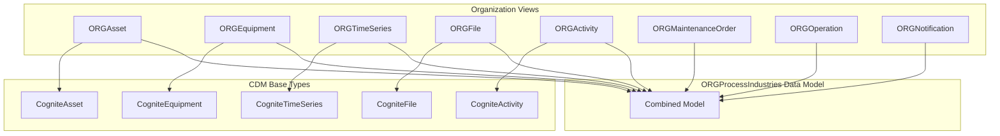

# CDF Process Industry Extension Module

This module provides a minimal extension of the Cognite Process Industry data model, adding organization-specific views and containers that extend the standard CDM (Cognite Data Model) for process industry use cases.

## Why Use This Module?

**Extend the Standard Data Model for Your Organization**

The Cognite CDM provides foundational types, but industrial deployments often need organization-specific extensions. This module delivers **production-ready data model extensions** that follow best practices while allowing customization.

**Key Benefits:**

- 🏗️ **CDM Compatible**: Extends standard Cognite Process Industry types
- 🎯 **Organization Prefixed**: Custom views with your organization prefix
- 📊 **Complete Entity Coverage**: Assets, Equipment, TimeSeries, Files, Activities, and more
- 🔧 **Easy Customization**: Add custom properties to containers
- 📈 **Enterprise Ready**: Includes Maintenance Orders, Operations, and Notifications

**Time & Cost Savings:**

- **Development Time**: Pre-built containers and views save weeks of data modeling
- **Best Practices**: Follows Cognite's recommended patterns for extensions
- **Consistency**: Standardized naming conventions across all entity types

## 🎯 Overview

The CDF Process Industry Extension module provides:
- **Organization-prefixed views** for all major entity types
- **Custom containers** with extension properties
- **Enterprise data model** combining all views
- **Schema space** for model organization

## 🏗️ Module Architecture

```
cdf_process_industry_extension/
├── 📁 data_modeling/                       # Data model definitions
│   ├── 📁 containers/                             # Container definitions
│   │   ├── 📄 Activity.Container.yaml
│   │   ├── 📄 Asset.Container.yaml
│   │   ├── 📄 Equipment.Container.yaml
│   │   ├── 📄 File.Container.yaml
│   │   ├── 📄 MaintenanceOrder.Container.yaml
│   │   ├── 📄 Notification.Container.yaml
│   │   ├── 📄 Operation.Container.yaml
│   │   ├── 📄 Reportable.Container.yaml
│   │   └── 📄 TimeSeries.Container.yaml
│   ├── 📁 views/                                  # View definitions
│   │   ├── 📄 Activity.view.yaml
│   │   ├── 📄 Asset.view.yaml
│   │   ├── 📄 Equipment.view.yaml
│   │   ├── 📄 File.view.yaml
│   │   ├── 📄 MaintenanceOrder.view.yaml
│   │   ├── 📄 Notification.view.yaml
│   │   ├── 📄 Operation.view.yaml
│   │   ├── 📄 Reportable.view.yaml
│   │   └── 📄 TimeSeries.view.yaml
│   ├── 📄 enterprise.datamodel.yaml               # Combined data model
│   └── 📄 schema.space.yaml                       # Schema space definition
├── 📄 default.config.yaml                  # Module configuration
└── 📄 module.toml                          # Module metadata
```

## 🚀 Core Components

### Entity Views

| View | Base CDM Type | Description |
|------|---------------|-------------|
| `{ORG}Asset` | CogniteAsset | Physical assets with custom properties |
| `{ORG}Equipment` | CogniteEquipment | Equipment items with extensions |
| `{ORG}TimeSeries` | CogniteTimeSeries | Time series data with custom metadata |
| `{ORG}File` | CogniteFile | Documents and files with extensions |
| `{ORG}Activity` | CogniteActivity | Activities and work items |
| `{ORG}MaintenanceOrder` | Custom | Maintenance work orders |
| `{ORG}Operation` | Custom | Work order operations |
| `{ORG}Notification` | Custom | Maintenance notifications |
| `{ORG}Reportable` | Custom | Reportable entities |

### Enterprise Data Model

The `{ORG}ProcessIndustries` data model combines all views into a single queryable model, including:
- All organization-specific views
- CDM reference types (CogniteSourceSystem, CogniteUnit, etc.)
- Asset/Equipment type classifications

## 🔧 Configuration

### Module Configuration (`default.config.yaml`)

```yaml
schemaSpace: sp_enterprise_process_industry  # Space for schema definitions
organization: ORG                            # Organization prefix for views
datamodelVersion: v1.0                       # Data model version
```

## 🏃‍♂️ Getting Started

### 1. Prerequisites

- CDF project with data modeling capabilities
- Admin permissions to create spaces and data models

### 2. Configure the Module

Update your `config.<env>.yaml` under the module variables section:

```yaml
variables:
  modules:
    cdf_process_industry_extension:
      schemaSpace: sp_enterprise_process_industry
      organization: YOUR_ORG               # Organization prefix for views (e.g., "ACME")
      datamodelVersion: v1.0               # Data model version
```

### 3. Deploy the Module

```bash
# Deploy using CDF Toolkit
cdf deploy --env your-environment

# Verify deployment
cdf data-models list
```

### 4. Customize Containers

Add custom properties to containers as needed:

```yaml
# Example: Adding custom property to Asset container
properties:
  customField:
    type:
      type: primitive
      primitive: string
    description: Organization-specific field
```

## 📊 Data Model Structure



## 🎯 Use Cases

### Enterprise Data Modeling
- **Standardization**: Consistent data model across all sites
- **Extensions**: Add organization-specific properties
- **Governance**: Centralized schema management

### Integration
- **Source Systems**: Map SAP, PI, and other sources to views
- **Applications**: Build apps against the enterprise model
- **Analytics**: Query unified data across entity types

## 📚 Dependencies

This module should be deployed **before** source system modules that populate data into these views.

## 📄 License

This module is part of the Cognite Templates repository and follows the same licensing terms.

