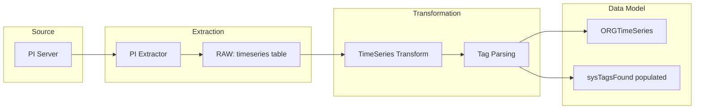

# CDF PI Module

This module provides ingestion of time series metadata from OSIsoft/AVEVA PI into Cognite Data Fusion, transforming PI tags into the process industry data model with support for contextualization.

## Why Use This Module?

**Ingest PI Time Series for Industrial Analytics**

Time series data from PI historians is critical for operational monitoring and analytics. This module delivers **production-ready PI metadata ingestion** that prepares timeseries for contextualization and analysis.

**Key Benefits:**

- 📈 **TimeSeries Metadata**: Ingest PI tag metadata as TimeSeries instances
- 🏷️ **Tag Extraction**: Parses asset tags from PI naming conventions
- 🔄 **RAW to Data Model**: SQL transformation with sysTagsFound population
- 📦 **Sample Data Included**: Example CSV data for testing
- 🏗️ **CDM Compatible**: Populates organization-prefixed TimeSeries view

**Time & Cost Savings:**

- **Quick Setup**: Pre-built transformation for PI data structures
- **Tag Parsing**: Automatic extraction of asset references from tag names
- **Contextualization Ready**: Prepares sysTagsFound for asset linking

## 🎯 Overview

The CDF PI Module is designed to:
- **Ingest PI tag metadata** from RAW tables
- **Transform to data model** using SQL transformations
- **Extract asset tags** from PI naming conventions
- **Prepare timeseries** for contextualization workflows

## 🏗️ Module Architecture

```
cdf_pi/
├── 📁 extraction_pipelines/                # Pipeline configurations
│   ├── 📄 extractor.ExtractionPipeline.yaml       # PI extractor pipeline
│   └── 📄 extractor.Config.yaml                   # Pipeline configuration
├── 📁 raw/                                 # RAW table definitions
│   └── 📄 timeseries.Table.yaml                   # PI timeseries metadata
├── 📁 transformations/                     # SQL Transformations
│   └── 📁 population/
│       ├── 📄 timeseries.Transformation.yaml      # Transformation config
│       └── 📄 timeseries.Transformation.sql       # SQL logic
├── 📁 upload_data/                         # Sample data for RAW
│   ├── 📄 timeseries.Manifest.yaml                # Upload manifest
│   └── 📄 timeseries.RawRows.csv                  # Sample PI metadata
├── 📄 default.config.yaml                  # Module configuration
└── 📄 module.toml                          # Module metadata
```

## 🚀 Core Components

### TimeSeries Population Transformation

**Purpose**: Transforms PI tag metadata into data model TimeSeries instances

**Key Features**:
- 📊 **Data Model Target**: Writes to `{ORG}ProcessIndustries` model, `{ORG}TimeSeries` type
- 🏷️ **Tag Extraction**: Populates `sysTagsFound` from PI naming patterns
- 🔄 **Upsert Mode**: Updates existing or creates new instances

### Extraction Pipeline

**Purpose**: Configuration for PI data extractors

## 🔧 Configuration

### Module Configuration (`default.config.yaml`)

```yaml
# Source System Identity
sourceName: Springfield AVEVA PI
sourceId: springfield_aveva_pi

# Data Model Settings
schemaSpace: sp_enterprise_process_industry
organization: ORG
datamodelVersion: v1.0

# Target Settings
dataset: ingestion
instanceSpace: springfield_instances
rawSourceDatabase: ingestion

# Transformation External ID
timeseriesTransformationExternalId: pi_timeseries_springfield_aveva_pi
```

## 🏃‍♂️ Getting Started

### 1. Prerequisites

- CDF project with data model deployed
- `cdf_process_industry_extension` module deployed
- PI data available in RAW tables (via extractor or manual upload)

### 2. Configure the Module

Update your `config.<env>.yaml` under the module variables section:

```yaml
variables:
  modules:
    cdf_pi:
      sourceName: Your Site AVEVA PI
      sourceId: your_site_aveva_pi
      schemaSpace: sp_enterprise_process_industry
      timeseriesTransformationExternalId: pi_timeseries_your_site
      dataset: ingestion
      organization: YOUR_ORG
      datamodelVersion: v1.0
      instanceSpace: your_instances
      rawSourceDatabase: ingestion
```

### 3. Deploy the Module

> **Note**: To upload sample data, enable the data plugin in your `cdf.toml` file:
> ```toml
> [plugins]
> data = true
> ```

```bash
# Deploy module
cdf deploy --env your-environment

# Upload sample data to RAW
cdf data upload dir modules/sourcesystem/cdf_pi/upload_data

# Run transformation
cdf transformations run pi_timeseries_<your_site>
```

### 4. Verify Deployment

```bash
# Check RAW data
cdf raw rows list ingestion timeseries

# Check timeseries instances
cdf data-models instances list --type ORGTimeSeries
```

## 📊 Data Flow



## 🎯 Use Cases

### Time Series Contextualization
- **Asset Linking**: Match PI tags to assets via sysTagsFound
- **Equipment Association**: Connect sensors to equipment
- **Process Monitoring**: Enable analytics with contextualized data

### Operational Analytics
- **Trend Analysis**: Historical data with proper context
- **Anomaly Detection**: Detect issues with asset-aware analysis
- **Performance Monitoring**: Track KPIs per asset/equipment

## 📚 Dependencies

- `cdf_process_industry_extension` - Data model with `{ORG}TimeSeries` view
- PI Extractor (optional) - For automated data extraction

## 📄 License

This module is part of the Cognite Templates repository and follows the same licensing terms.

