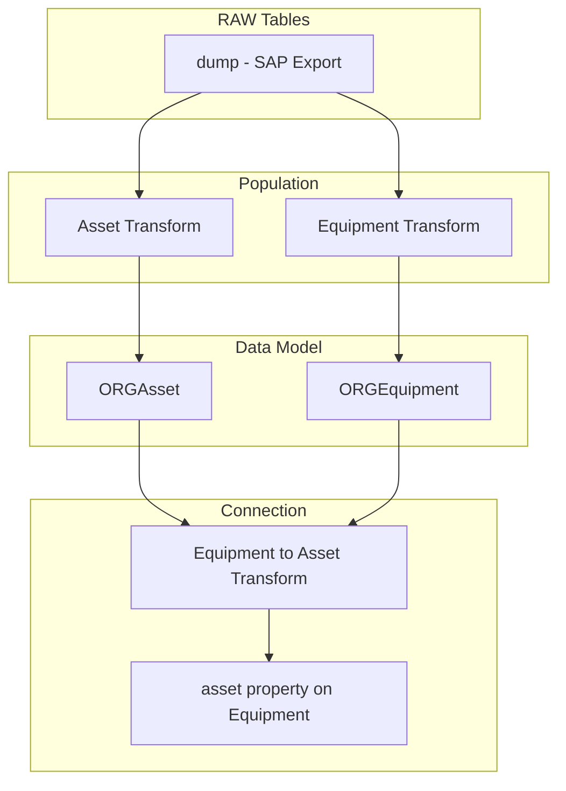

# CDF SAP Assets Module

This module provides ingestion of asset and equipment master data from SAP S/4HANA into Cognite Data Fusion, transforming technical objects into the process industry data model.

## Why Use This Module?

**Ingest SAP Master Data for Your Digital Twin**

Assets and equipment form the backbone of your industrial digital twin. This module delivers **production-ready SAP asset ingestion** that populates your data model with technical object hierarchies.

**Key Benefits:**

- 🏭 **Asset Hierarchy**: Ingest SAP functional locations as Asset instances
- ⚙️ **Equipment Data**: Transform SAP equipment into Equipment instances
- 🔗 **Relationship Mapping**: Connect equipment to parent assets
- 📦 **Sample Data Included**: Example CSV data for testing
- 🏗️ **CDM Compatible**: Populates organization-prefixed views

**Time & Cost Savings:**

- **Quick Setup**: Pre-built transformations for SAP data structures
- **Best Practices**: Follows recommended SAP integration patterns
- **Hierarchy Support**: Automatic equipment-to-asset linking

## 🎯 Overview

The CDF SAP Assets module is designed to:
- **Ingest assets** from SAP functional location data
- **Transform equipment** from SAP equipment master data
- **Create relationships** between equipment and assets
- **Prepare data** as contextualization targets

## 🏗️ Module Architecture

```
cdf_sap_assets/
├── 📁 raw/                                 # RAW table definitions
│   └── 📄 dump.Table.yaml                         # Combined SAP data dump
├── 📁 transformations/                     # SQL Transformations
│   ├── 📁 population/                             # Entity population
│   │   ├── 📄 asset.Transformation.yaml
│   │   ├── 📄 asset.Transformation.sql
│   │   ├── 📄 equipment.Transformation.yaml
│   │   └── 📄 equipment.Transformation.sql
│   └── 📁 connection/                             # Relationship creation
│       ├── 📄 equipment_to_asset.Transformation.yaml
│       └── 📄 equipment_to_asset.Transformation.sql
├── 📁 upload_data/                         # Sample data for RAW
│   ├── 📄 dump.Manifest.yaml
│   └── 📄 dump.RawRows.csv
├── 📄 default.config.yaml                  # Module configuration
└── 📄 module.toml                          # Module metadata
```

## 🚀 Core Components

### Population Transformations

| Transformation | Description |
|----------------|-------------|
| `asset` | Transforms functional locations to Asset view |
| `equipment` | Transforms equipment master to Equipment view |

### Connection Transformation

| Transformation | Description |
|----------------|-------------|
| `equipment_to_asset` | Links equipment to their parent assets |

## 🔧 Configuration

### Module Configuration (`default.config.yaml`)

```yaml
# Source System Identity
sourceName: SAP Springfield S/4HANA Assets
sourceId: sap_springfield_s4hana_assets

# Data Model Settings
schemaSpace: sp_enterprise_process_industry
organization: ORG
datamodelVersion: v1.0

# Target Settings
dataset: ingestion
instanceSpace: springfield_instances
rawSourceDatabase: ingestion

# Transformation External IDs
assetTransformationExternalId: sap_assets_springfield_s4hana
equipmentTransformationExternalId: sap_equipment_springfield_s4hana
equipmentToAssetTransformationExternalId: sap_equipment_to_asset_springfield_s4hana
```

## 🏃‍♂️ Getting Started

### 1. Prerequisites

- CDF project with data model deployed
- `cdf_process_industry_extension` module deployed
- SAP data available in RAW tables

### 2. Configure the Module

Update your `config.<env>.yaml` under the module variables section:

```yaml
variables:
  modules:
    cdf_sap_assets:
      sourceName: SAP Your Site S/4HANA Assets
      sourceId: sap_your_site_s4hana_assets
      schemaSpace: sp_enterprise_process_industry
      assetTransformationExternalId: sap_assets_your_site
      equipmentTransformationExternalId: sap_equipment_your_site
      equipmentToAssetTransformationExternalId: sap_equipment_to_asset_your_site
      dataset: ingestion
      organization: YOUR_ORG
      datamodelVersion: v1.0
      instanceSpace: your_instances
      rawSourceDatabase: ingestion
```

### 3. Deploy the Module

> **Note**: To upload sample data, enable the data plugin in your `cdf.toml` file:
> ```toml
> [plugins]
> data = true
> ```

```bash
# Deploy module
cdf deploy --env your-environment

# Upload sample data to RAW
cdf data upload dir modules/sourcesystem/cdf_sap_assets/upload_data

# Run transformations in order
cdf transformations run sap_assets_<your_site>
cdf transformations run sap_equipment_<your_site>
cdf transformations run sap_equipment_to_asset_<your_site>
```

## 📊 Data Flow



## 🎯 Use Cases

### Digital Twin Foundation
- **Asset Hierarchy**: Physical structure of your plant
- **Equipment Registry**: Maintainable items and their locations
- **Master Data**: Foundation for all contextualization

### Contextualization Targets
- **Timeseries Linking**: Assets/equipment as targets for PI tag matching
- **Document Association**: Link P&IDs to assets
- **Maintenance Correlation**: Connect work orders to equipment

## 📚 Dependencies

- `cdf_process_industry_extension` - Data model with Asset and Equipment views

## 📄 License

This module is part of the Cognite Templates repository and follows the same licensing terms.

