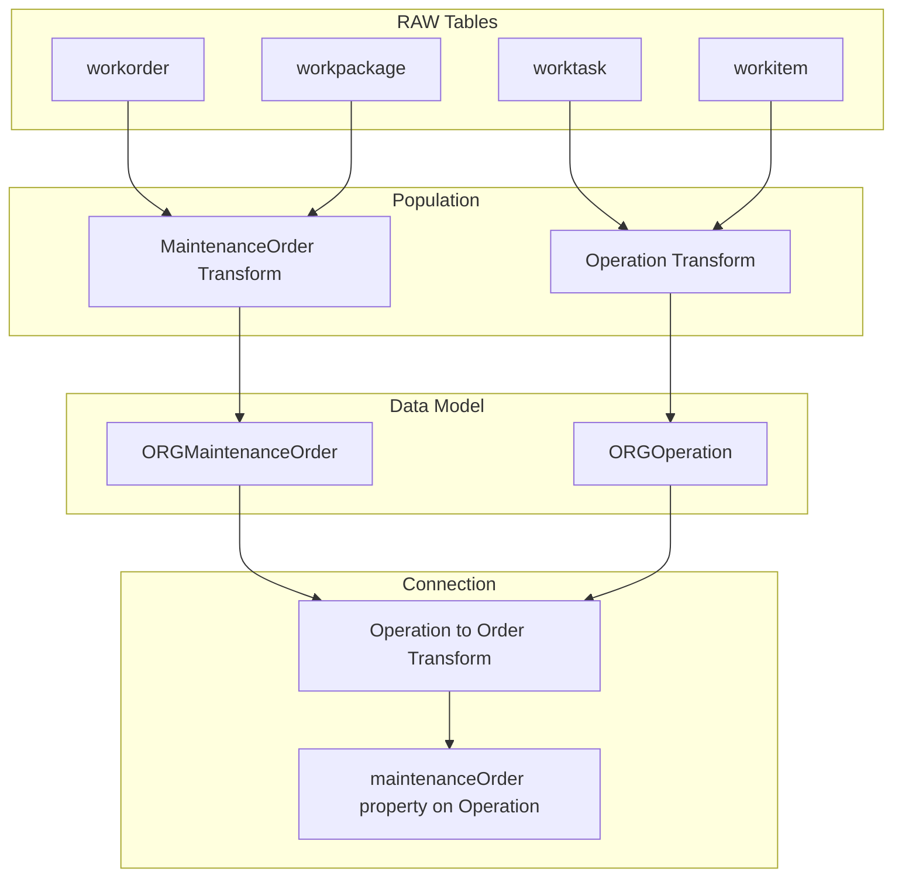

# CDF SAP Events Module

This module provides ingestion of maintenance events data from SAP S/4HANA into Cognite Data Fusion, transforming work orders and operations into the process industry data model.

## Why Use This Module?

**Ingest SAP Maintenance Data for Industrial Analytics**

Maintenance work orders and operations are essential for asset management and reliability analysis. This module delivers **production-ready SAP events ingestion** that populates your data model with maintenance activities.

**Key Benefits:**

- 🔧 **Maintenance Orders**: Ingest SAP work orders as MaintenanceOrder instances
- ⚙️ **Operations**: Transform work tasks into Operation instances
- 🔗 **Relationship Mapping**: Connect operations to their parent maintenance orders
- 📦 **Sample Data Included**: Example CSV data for testing
- 🏗️ **CDM Compatible**: Populates organization-prefixed views

**Time & Cost Savings:**

- **Quick Setup**: Pre-built transformations for SAP data structures
- **Best Practices**: Follows recommended SAP integration patterns
- **Relationship Handling**: Automatic operation-to-order linking

## 🎯 Overview

The CDF SAP Events module is designed to:
- **Ingest maintenance orders** from SAP work order tables
- **Transform operations** from work task/item data
- **Create relationships** between operations and orders
- **Prepare data** for contextualization workflows

## 🏗️ Module Architecture

```
cdf_sap_events/
├── 📁 raw/                                 # RAW table definitions
│   ├── 📄 workorder.Table.yaml                    # SAP work orders
│   ├── 📄 workpackage.Table.yaml                  # Work packages
│   ├── 📄 worktask.Table.yaml                     # Work tasks
│   └── 📄 workitem.Table.yaml                     # Work items
├── 📁 transformations/                     # SQL Transformations
│   ├── 📁 population/                             # Entity population
│   │   ├── 📄 maintenanceOrder.Transformation.yaml
│   │   ├── 📄 maintenanceOrder.Transformation.sql
│   │   ├── 📄 operation.Transformation.yaml
│   │   └── 📄 operation.Transformation.sql
│   └── 📁 connection/                             # Relationship creation
│       ├── 📄 operation_to_maintenance_order.Transformation.yaml
│       └── 📄 operation_to_maintenance_order.Transformation.sql
├── 📁 upload_data/                         # Sample data for RAW
│   ├── 📄 workorder.Manifest.yaml
│   ├── 📄 workorder.RawRows.csv
│   ├── 📄 workpackage.Manifest.yaml
│   ├── 📄 workpackage.RawRows.csv
│   ├── 📄 worktask.Manifest.yaml
│   ├── 📄 worktask.RawRows.csv
│   ├── 📄 workitem.Manifest.yaml
│   └── 📄 workitem.RawRows.csv
├── 📄 default.config.yaml                  # Module configuration
└── 📄 module.toml                          # Module metadata
```

## 🚀 Core Components

### Population Transformations

| Transformation | Description |
|----------------|-------------|
| `maintenanceOrder` | Transforms work orders to MaintenanceOrder view |
| `operation` | Transforms work tasks/items to Operation view |

### Connection Transformation

| Transformation | Description |
|----------------|-------------|
| `operation_to_maintenance_order` | Links operations to their parent maintenance orders |

## 🔧 Configuration

### Module Configuration (`default.config.yaml`)

```yaml
# Source System Identity
sourceName: SAP Springfield S/4HANA Activities
sourceId: sap_springfield_s4hana_activities

# Data Model Settings
schemaSpace: sp_enterprise_process_industry
organization: ORG
datamodelVersion: v1.0

# Target Settings
dataset: ingestion
instanceSpace: springfield_instances
rawSourceDatabase: ingestion

# Transformation External IDs
maintenanceOrderTransformationExternalId: sap_maintenance_orders_springfield_s4hana
operationTransformationExternalId: sap_operations_springfield_s4hana
operationToMaintenanceOrderTransformationExternalId: sap_operation_to_maintenance_order_springfield_s4hana
```

## 🏃‍♂️ Getting Started

### 1. Prerequisites

- CDF project with data model deployed
- `cdf_process_industry_extension` module deployed
- SAP data available in RAW tables

### 2. Configure the Module

Update your `config.<env>.yaml` under the module variables section:

```yaml
variables:
  modules:
    cdf_sap_events:
      sourceName: SAP Your Site S/4HANA Activities
      sourceId: sap_your_site_s4hana_activities
      schemaSpace: sp_enterprise_process_industry
      maintenanceOrderTransformationExternalId: sap_maintenance_orders_your_site
      operationTransformationExternalId: sap_operations_your_site
      operationToMaintenanceOrderTransformationExternalId: sap_operation_to_maintenance_order_your_site
      dataset: ingestion
      organization: YOUR_ORG
      datamodelVersion: v1.0
      instanceSpace: your_instances
      rawSourceDatabase: ingestion
```

### 3. Deploy the Module

> **Note**: To upload sample data, enable the data plugin in your `cdf.toml` file:
> ```toml
> [plugins]
> data = true
> ```

```bash
# Deploy module
cdf deploy --env your-environment

# Upload sample data to RAW
cdf data upload dir modules/sourcesystem/cdf_sap_events/upload_data

# Run transformations in order
cdf transformations run sap_maintenance_orders_<your_site>
cdf transformations run sap_operations_<your_site>
cdf transformations run sap_operation_to_maintenance_order_<your_site>
```

## 📊 Data Flow



## 🎯 Use Cases

### Asset Reliability
- **Maintenance History**: Track work orders per asset
- **Operation Analysis**: Understand maintenance activities
- **Failure Patterns**: Link operations to failure modes

### Contextualization
- **Asset Linking**: Connect maintenance orders to assets via sysTagsFound
- **Equipment Association**: Link operations to equipment
- **Work Order Analytics**: Analyze maintenance patterns

## 📚 Dependencies

- `cdf_process_industry_extension` - Data model with MaintenanceOrder and Operation views

## 📄 License

This module is part of the Cognite Templates repository and follows the same licensing terms.

