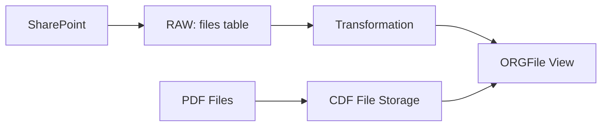

# CDF SharePoint Files Module

This module provides ingestion of document files from SharePoint or similar document management systems into Cognite Data Fusion, transforming file metadata into the process industry data model.

## Why Use This Module?

**Ingest Document Metadata for Contextualization**

Industrial documents like P&IDs, manuals, and specifications are critical for operations. This module delivers **production-ready file ingestion** that prepares documents for annotation and contextualization.

**Key Benefits:**

- 📄 **File Metadata Ingestion**: Transform file records into data model instances
- 🔄 **RAW to Data Model**: SQL transformation from RAW tables to views
- 📦 **Sample Data Included**: Example PDFs and CSV data for testing
- 🏗️ **CDM Compatible**: Populates organization-prefixed File view
- ⚡ **Easy Extension**: Add custom metadata properties as needed

**Time & Cost Savings:**

- **Quick Setup**: Pre-built transformation and sample data
- **Best Practices**: Follows recommended ingestion patterns
- **Reusable**: Template for other document sources

## 🎯 Overview

The CDF SharePoint Files module is designed to:
- **Ingest file metadata** from RAW tables
- **Transform to data model** using SQL transformations
- **Upload sample files** for testing
- **Prepare files** for annotation workflows

## 🏗️ Module Architecture

```
cdf_sharepoint/
├── 📁 files/                               # Sample PDF files
│   ├── 📄 PH-25578-P-4110006-001.pdf
│   ├── 📄 PH-25578-P-4110010-001.pdf
│   ├── 📄 ... (more PDFs)
│   └── 📄 upload.CogniteFile.yaml                 # File upload definition
├── 📁 raw/                                 # RAW table definitions
│   └── 📄 files.Table.yaml                        # Source data table
├── 📁 transformations/                     # SQL Transformations
│   └── 📁 population/
│       ├── 📄 files.Transformation.yaml           # Transformation config
│       └── 📄 files.Transformation.sql            # SQL logic
├── 📁 upload_data/                         # Sample data for RAW
│   ├── 📄 files.Manifest.yaml                     # Upload manifest
│   └── 📄 files.RawRows.csv                       # Sample file metadata
├── 📄 default.config.yaml                  # Module configuration
└── 📄 module.toml                          # Module metadata
```

## 🚀 Core Components

### File Population Transformation

**Purpose**: Transforms file metadata from RAW to data model instances

**Key Features**:
- 📄 **View Target**: Writes to `{ORG}File` view
- 🔄 **Upsert Mode**: Updates existing or creates new instances
- 📊 **Metadata Mapping**: Maps RAW columns to view properties

### Sample Files

Includes P&ID and engineering document PDFs for testing annotation workflows.

## 🔧 Configuration

### Module Configuration (`default.config.yaml`)

```yaml
# Source System Identity
sourceName: Springfield Sharepoint
sourceId: springfield_sharepoint

# Data Model Settings
schemaSpace: sp_enterprise_process_industry
organization: ORG
datamodelVersion: v1.0

# Target Settings
dataset: ingestion
instanceSpace: springfield_instances
rawSourceDatabase: ingestion

# Transformation External ID
fileTransformationExternalId: files_metadata_springfield
```

## 🏃‍♂️ Getting Started

### 1. Prerequisites

- CDF project with data model deployed
- `cdf_process_industry_extension` module deployed
- File storage configured in CDF

### 2. Configure the Module

Update your `config.<env>.yaml` under the module variables section:

```yaml
variables:
  modules:
    cdf_sharepoint:
      sourceName: Your Sharepoint Source
      sourceId: your_sharepoint
      schemaSpace: sp_enterprise_process_industry
      fileTransformationExternalId: files_metadata_your_site
      dataset: ingestion
      organization: YOUR_ORG
      datamodelVersion: v1.0
      instanceSpace: your_instances
      rawSourceDatabase: ingestion
```

### 3. Deploy the Module

> **Note**: To upload sample data, enable the data plugin in your `cdf.toml` file:
> ```toml
> [plugins]
> data = true
> ```

```bash
# Deploy module
cdf deploy --env your-environment

# Upload sample data to RAW
cdf data upload dir modules/sourcesystem/cdf_sharepoint/upload_data

# Run transformation
cdf transformations run files_metadata_<your_site>
```

### 4. Verify Deployment

```bash
# Check RAW data
cdf raw rows list ingestion files

# Check file instances in data model
cdf data-models instances list
```

## 📊 Data Flow



## 🎯 Use Cases

### Document Management Integration
- **P&ID Ingestion**: Import engineering drawings for annotation
- **Manual Upload**: Process manually uploaded documents
- **Batch Import**: Bulk file metadata loading

### Annotation Preparation
- **Tag for Annotation**: Files ready for file annotation workflow
- **Metadata Enrichment**: Add custom properties during transformation

## 📚 Dependencies

- `cdf_process_industry_extension` - Data model with `{ORG}File` view

## 📄 License

This module is part of the Cognite Templates repository and follows the same licensing terms.

